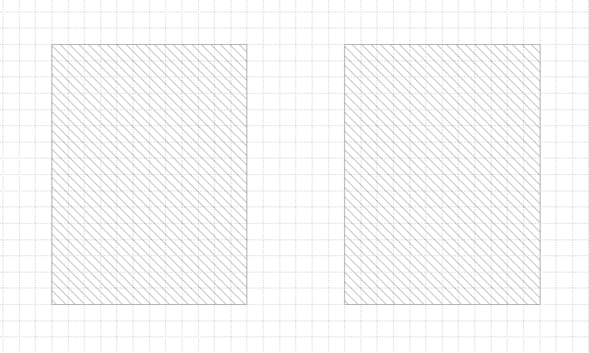
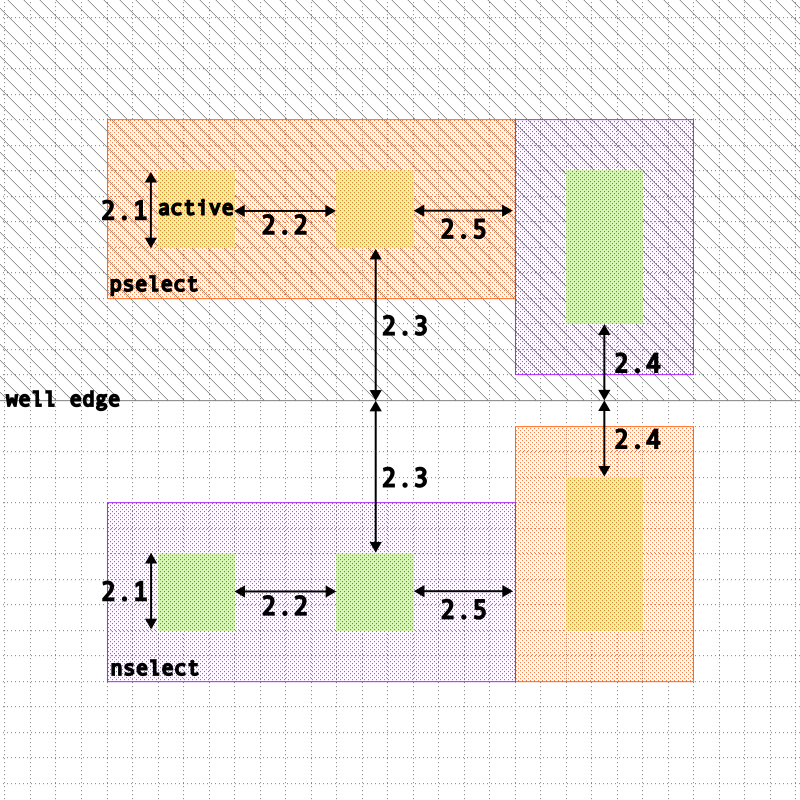
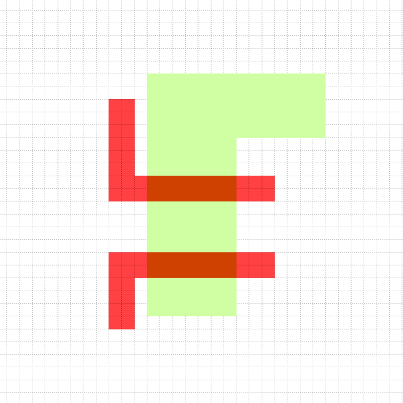
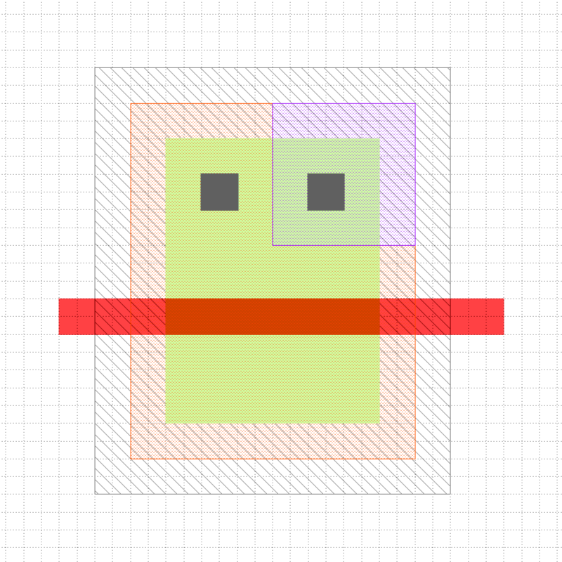
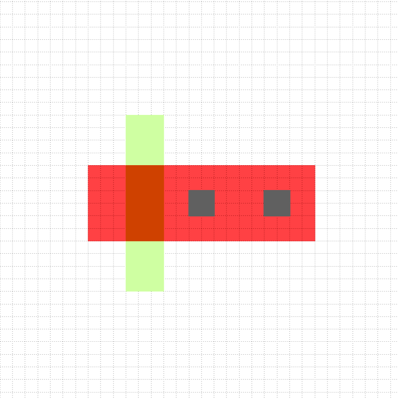
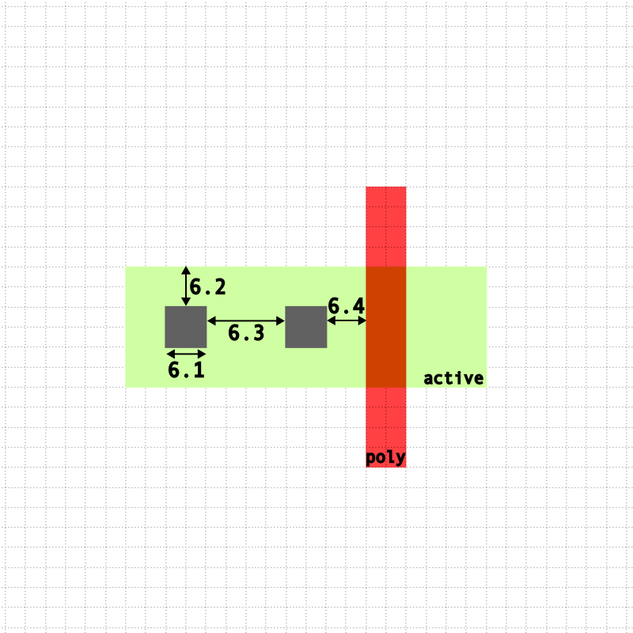
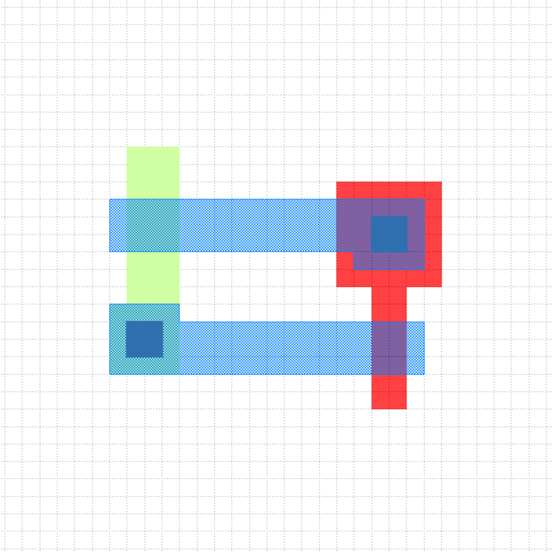
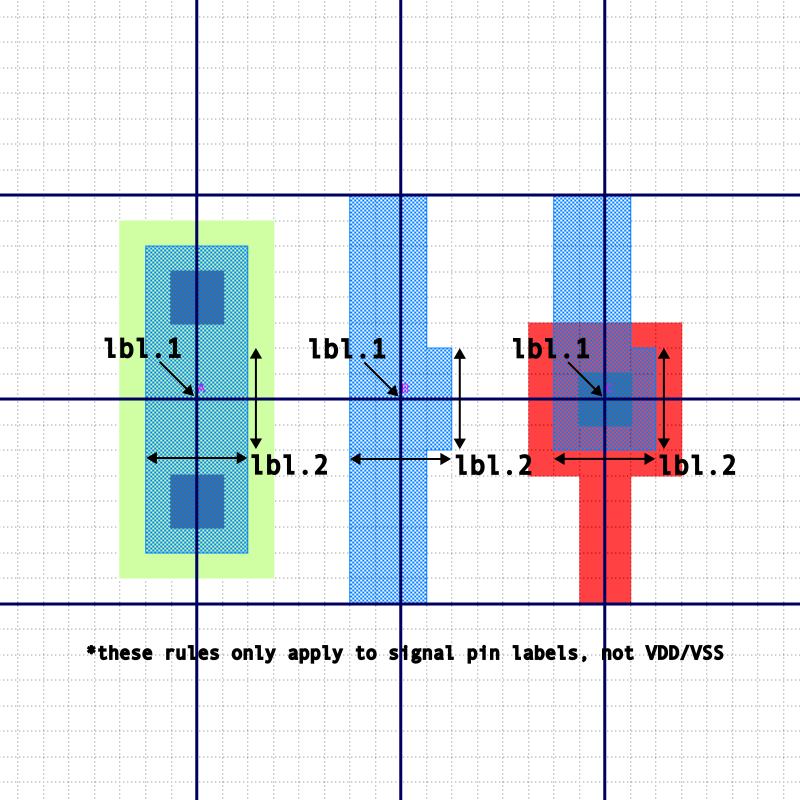

TinyFlow Design Rule Manual (v0.1)
==========================================================================

Adapted from  MOSIS Scalable CMOS (SCMOS) Revision 8.0 (Technology: SCN6M DEEP) (https://www.southampton.ac.uk/~bim/notes/ice/DesignRules/scmos-main.html#tech-codes)

nwell
--------------------------------------------------------------------------

| Rule     | Description                                                                | $\lambda$ |
|----------|----------------------------------------------------------------------------|-----------|
| 1.1      | Minimum width                                                              | 12        |
| 1.3      | Minimum spacing between wells at same potential                            | 6         |

active
--------------------------------------------------------------------------

| Rule     | Description                                                                | $\lambda$ |
|----------|----------------------------------------------------------------------------|-----------|
| 2.1      | Minimum width                                                              | 3         |
| 2.2      | Minimum spacing                                                            | 3         |
| 2.3      | Source/drain active to well edge                                           | 6         |
| 2.4      | Substrate/well contact active to well edge                                 | 3         |
| 2.5      | Minimum spacing between non-abutting active of different implant           | 4         |

poly
--------------------------------------------------------------------------

| Rule     | Description                                                                | $\lambda$ |
|----------|----------------------------------------------------------------------------|-----------|
| 3.1      | Minimum width                                                              | 2         |
| 3.2      | Minimum spacing over field                                                 | 3         |
| 3.2a     | Minimum spacing over active                                                | 4         |
| 3.3      | Minimum gate extension of active                                           | 3         |
| 3.4      | Minimum active extension of poly                                           | 4         |
| 3.5      | Minimum field poly to active                                               | 1         |

pselect and nselect
--------------------------------------------------------------------------

| Rule     | Description                                                                       | $\lambda$ |
|----------|-----------------------------------------------------------------------------------|-----------|
| 4.1  | Minimum select spacing to channel of transistor to ensure adequate source/drain width | 3         |
| 4.2  | Minimum select overlap of active                                                      | 2         |
| 4.3  | Minimum select overlap of contact                                                     | 2         |
| 4.4  | Minimum select width and spacing (P and N-select may coincident, but must not overlap)| 4         |

contact to poly
--------------------------------------------------------------------------

| Rule     | Description                                                                | $\lambda$ |
|----------|----------------------------------------------------------------------------|-----------|
| 5.1      | Exact contact size                                                         | 2×2       |
| 5.2      | Minimum poly overlap                                                       | 2         |
| 5.3      | Minimum contact spacing                                                    | 4         |
| 5.4      | Minimum spacing to gate of transistor                                      | 2         |

contact to active
--------------------------------------------------------------------------

| Rule     | Description                                                                | $\lambda$ |
|----------|----------------------------------------------------------------------------|-----------|
| 6.1      | Exact contact size                                                         | 2×2       |
| 6.2      | Minimum active overlap                                                     | 2         |
| 6.3      | Minimum contact spacing                                                    | 4         |
| 6.4      | Minimum spacing to gate of transistor                                      | 2         |

metal1
--------------------------------------------------------------------------

| Rule     | Description                                                                | $\lambda$               |
|----------|----------------------------------------------------------------------------|-------------------------|
| 7.1      | Minimum width                                                              | 3                       |
| 7.2      | Minimum spacing                                                            | 3                       |
| 7.3      | Minimum overlap of contact or via                                          | 1                       |
| 7.4      | Minimum spacing when either metal line is wider than 10 lambda             | 6                       |
| 7.5      | Minimum area                                                               | 25 $\lambda$2|

metal1 label
--------------------------------------------------------------------------

| Rule     | Description                                                                | $\lambda$               |
|----------|----------------------------------------------------------------------------|-------------------------|
| label.1  | Track alignment                                                            | -                       |
| label.2  | Minimum metal1 overlap                                                  | 4 $\times$ 4                        |

via12 & above
--------------------------------------------------------------------------
coming in v1
