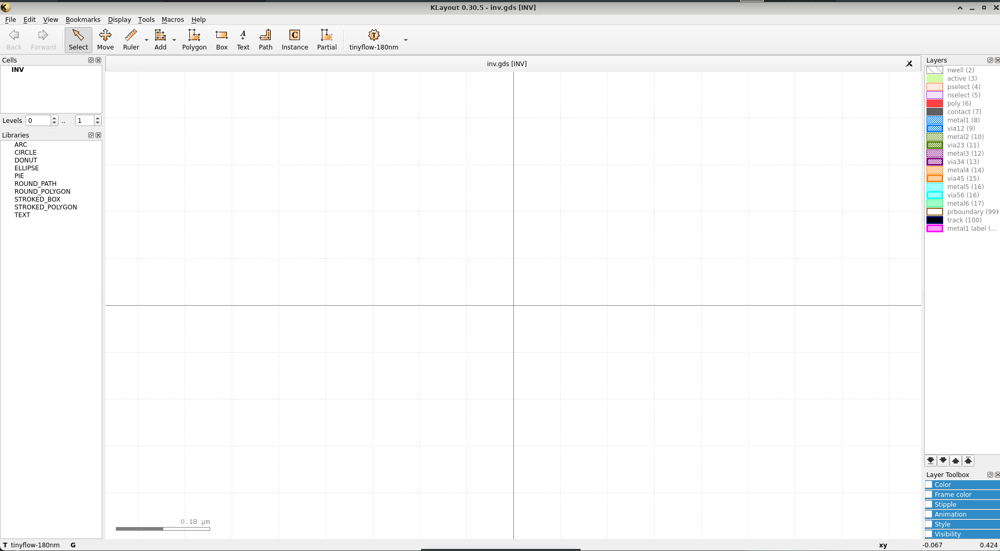
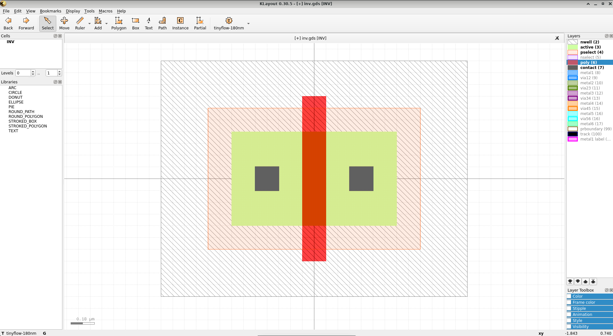
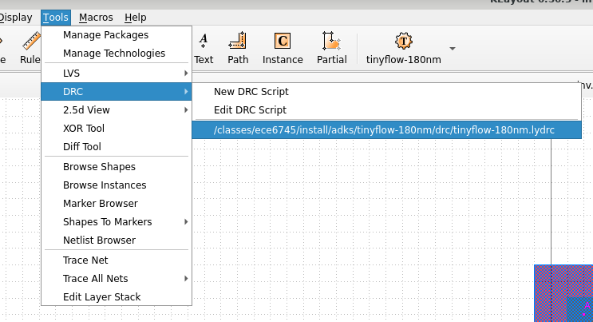
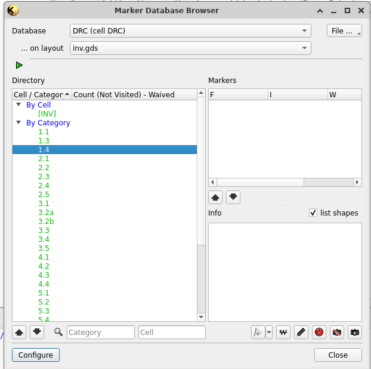
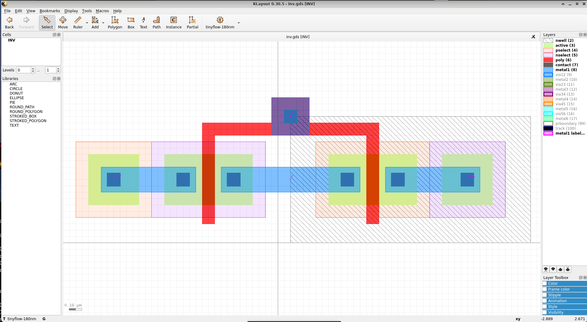
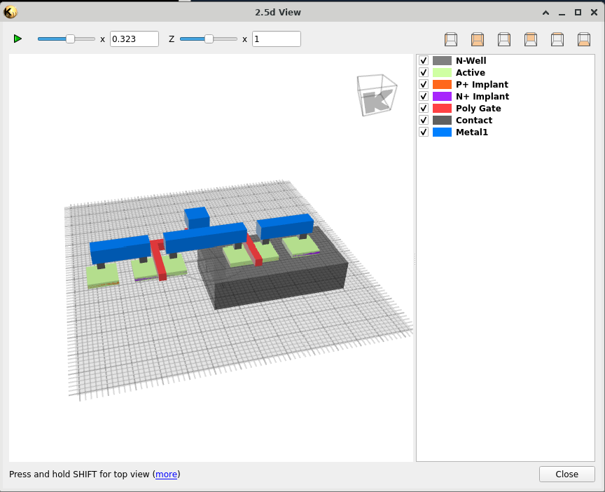
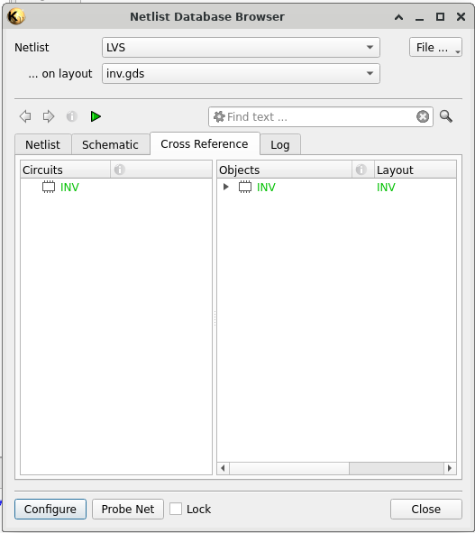

ECE 6745 Lab 1: Full-Custom Inverter Design
==========================================================================

In this lab, we will be designing a basic CMOS inverter from scratch using the
KLayout design editor, performing a design-rules check (DRC), performaing a
layout vs. schematic check (LVS), and characterizing the inverter's delay as a
function of the load capacitance (load-delay curve).

0. BEFORE YOU BEGIN
--------------------------------------------------------------------------

**Be sure to fully read through tut0, tut1, and tut2 before beginning this
lab.**

On the ECELinux, source the course setup scripts and clone the repo. Be sure to
open your remote desktop GUI as well.

```bash
% source setup-ece6745.sh
% source setup-gui.sh
% mkdir -p $HOME/ece6745
% cd $HOME/ece6745
% git clone https://github.com/cornell-ece6745/ece6745-lab1 lab01
% cd lab01
% TOPDIR=$PWD
```

Take a minute to look through the included files:

```
.
└── lab01/
    ├── buf/
    │   ├── buf-characterize.sp (buffer characterization script template - TODO FOR YOU)
    │   ├── buf.gds (blank buffer layout file - TODO FOR YOU)
    │   └── buf.sp (reference buffer spice file template - TODO FOR YOU)
    ├── inv/
    │   ├── inv-characterize.sp (inverter characterization script template - TODO FOR YOU)
    │   ├── inv.gds (blank inverter layout file - TODO FOR YOU)
    │   └── inv.sp (reference inverter spice file template - TODO FOR YOU)
    └── pdk/
        ├── klayoutrc (setup file for KLayout with all necessary settings - sourced automatically by setup script)
        ├── tiny180.lyd25 (script for viewing your layout in a more 3-dimensional way)
        ├── tiny180.lydrc (DRC script for ensuring all design rules are followed for your layout)
        ├── tiny180.lylvs (LVS script for ensuring your layout matches the reference spice schematic)
        └── tiny180.lyp (layer information for the tiny180 process)
```

1. KLayout Introduction
--------------------------------------------------------------------------

[KLayout](https://www.klayout.de/) is an powerful, open-source layout tool that
allows users to both view and edit layout files. Additionally, it can perform
design-rules checking, layout vs. schematic checking, and RC extraction among
other features. In this lab, we will be using all of these features so that you
can become familiar with making your own custom circuits!

First, open KLayout in edit mode (`-e`) with the provided layer properties file
(`-l pdk/tiny180.lyp`) and the blank canvas for the inverter your are going to
draw (`inv/inv.gds`)

```bash
% cd $TOPDIR
% klayout -e -l pdk/tiny180.lyp inv/inv.gds
```

A new GUI window should open in your remote desktop window:



Take a minute to become familiar with the user interface (some items are omitted
as they are not used for our class):
- Toolbar (upper) - includes back/forward (undo/redo) buttons, as well as
  buttons for selecting various tools such as selecting a feature, moving a
  feature, drawing a feature, measuring a feature (ruler), etc.
- Cells window (upper left) - displays names of all the cells in the current
  layout file that is open. In this case, we only have one cell in our layout
  file, but we will have more cells in future labs/projects which constitute an
  entire *library* of cells! Right click -> Show As New Top to select the cell
  to view in the main window
- Layers window (middle right) - displays all available layers which elements
  can be placed on, take a minute to correlate these names with what you have
  seen in lecture. You can right click on a layer to set visibility options for
  it and other layers - **this is very useful accurately and quickly editing
  layouts!**

If the `klayoutrc` file is properly sourced by the setup script, you should be
able to scroll in on the main layout window and see a grid of lines (as in the
image above), this represents the **lambda grid**, where the side length of each
such box is 1 lambda (0.09um in our case). This represents the minimum unit on
which you can draw a feature. If you scroll out, the lines should disappear and
a grid of dots should be present instead. **When drawing a feature with a
specific dimension of lambda, be sure that you are counting on the boxes
contained within the lines, not the dots!** If this is not the case for you,
copy the `pdk/klayoutrc` file to `~/.klayout/klayoutrc`, making the directory if
it does not already exist, and reopening KLayout.

2. Laying Out and Performing DRC on an PMOS
--------------------------------------------------------------------------

Now that we are familiar with the basics of how to use KLayout, let's go ahead
and start laying out our PMOS for the inverter!

**For this inverter, we are defining the width to be 8-lambda wide**, this is a
design requirement we are providing to you, but custom-circuit designers will
test their design for a wide variety of parameters, including modifying this
width to achieve their design goals of power, performance, or area.

Take some time now to draw the following inverter **as shown exactly** in your
`inv.gds` file. To draw a new feature, select the layer from the Layers window,
and then click the Box tool from the upper toolbar, click to set one corner, and
then click again to set the opposite corner. **Notice how the width of the
transistor is 8-lambda (boxes) as we mentioned above, and the gate width is
2-lambda. Lambda rules define the gate-width as 2-lambda, so this matches our
expectations!**



Compare the relative spacing and widths of the various features to what is shown
in the design rules manual (DRM) (TODO: add link). We can see how all such
spacings and widths are at least the minimum requirement for the associated rule
in the DRM. Let's go ahead and run DRC to ensure these requirements are met, go
to Tools -> DRC -> Edit DRC Script.



Click the white import icon in the window the pops up
 in the top-left corner, and then select
the `pdk/tiny180.lydrc` in the file browser. Take a minute to browse the DRC
file and see how the code (written in Ruby) matches up to the rules in the DRM.
When you are ready to run it, click the green play button with the exclamation
mark through it  in the top toolbar. If it
asks you about saving a macro, click Yes. A new window should open with the DRC
results, the left side shows all the performed DRC checks, with the numbers
corresponding to the associated rules in the DRM. If your design is DRC-clean,
then all the numbers should be green. If you see any red ones, cross-reference
the rule number with the DRM, and edit your layout to fix the DRC *violation*.



3. Laying Out the Full Inverter
--------------------------------------------------------------------------

Let's go ahead and do the layout for the full inverter according to the below
image.



Feel free to delete your PMOS from the previous step, or add onto it.
Overlapping boxes on the same layer does not matter in the end, as it is all
part of one coherent polygon in the final layout! **Be sure to follow the
dimensions exactly! Otherwise you may fail DRC!**

Once your layout is finished, add the pin labels on the `metal1 label` layer by
selecting the layer and then selecting the Text tool from the toolbar. Once the
label is placed on appropriate metal1 net, double-click it to edit the name. The
pin names should be as follows:
- A (input connecting to the gates of both transistors)
- Y (output from the drains of both transistors)
- VDD (positive voltage power rail)
- VSS (negative voltage power rail)

After the pin labels are added, run DRC as before to ensure your design passes
all design rule checks. **Ensure your design is DRC-clean before moving onto the
next step! Be sure to save the layout as well by going to File -> Save, DO NOT
DO CTRL+S AS IT BREAKS THE VIEW!**

You can also view your inverter in a semi-three-dimensional view called 2.5D. To
do this, go to Tools -> 2.5d View -> Edit 2.5d Script (similarly to DRC). Import
the `pdk/tiny180.lyd25` into KLayout using the white button again,
double-clicking the new file in the left-side file window to ensure the script
is open in the editor. Click the green play button with exclamation mark to run
the script. A new window should pop up with a 2.5D viewer which you can use the
mouse to scroll around and view the inverter from different angles!



4. Performing LVS on the Full Inverter
--------------------------------------------------------------------------

Layout vs. schematic checks compare the layout you just created with a reference
circuit "schematic" to ensure that the layout drawing matches the intended
high-level functionality. To do this, we first need to write our reference
schematic, which is written in a language called Spice. Spice is a language used
to define how various hardware elements are connected, along with any parameters
such as RC parasitics for devices. It can then be used as part of a *Spice deck*
which simulates the circuit under certain input stimuli (we will be doing this
for characterization). The LVS tool in KLayout will then *extract* a Spice
schematic from the drawn layout, along with RC parasitics, and compare this
extracted Spice schematic with the reference one.

Open up the blank reference spice file for your inverter (`inv/inv.sp`). Add a
line for each device (transistor) in your inverter circuit inside the
sub-circuit using the following format:
- PMOS: `M_P <D> <G> <S> <B> L=<length>U W=<width>U`
- NMOS: `M_N <D> <G> <S> <B> L=<length>U W=<width>U` 

where D, G, S, and B represent the drain, gate, source, and base connections for
the transistor, respectively. You should replace these with the correct pin name
(A, Y, VDD, VSS) for those connections as per your knowledge of how CMOS
transistors are connected. You should also fill in numerical values for the
length and width of the transistor (remember how we defined the gate length as a
function of lambda above, and the requirement we gave for transistor width).
Convert the lambda measurement of these values to micrometers using our
conversion factor of 1 lambda = 0.09um (the U suffix on the end of the values
denotes that the numerical value should be interpreted in micro-units). Save the
file.

Make sure your desired cell to check via LVS is active in the viewer (important
if multiple such cells are in the same layout file as will happen in later
projects and labs). Open the LVS tool in your KLayout window similarly to DRC,
but now selecting LVS from the Tools menu instead of DRC. Select the white
import button again and then load in the `pdk/tiny180.lylvs` file. Double-click
the imported lylvs file so it is visible in the viewer. Take a minute to browse
the contents of the file and see how we first extract the schematic (to
`inv/inv-rcx.sp`) and then perform the actual comparison. Press the green play
button with the exclamation mark through it to run the LVS script.

After running the script, and if LVS passes, you should see all green in the
window that pops up:



If you see any red stop signs, this means LVS failed. You can view the
violations by clicking the drop-down arrows under Objects in the Cross Reference
window to see what is failing the check. Edit your layout and/or reference Spice
file to fix the violations.

Once all violations are resolved, take a minute to view the extracted Spice
output from the LVS tool in `inv/inv-rcx.sp`. This file looks similar to the
reference Spice file, except that it includes additional information for RC
parasitics in the parameters AS, AD, PS, and PD.

5. Characterizing the Inverter with Ngspice
--------------------------------------------------------------------------

Congratulations! You now have a fully DRC and LVS-clean inverter cell! At this
point, we know that the cell matches our high-level functionality expectations,
but we do not know how well it *performs*. In circuit design, we often measure
"goodness" of a design in terms of power, performance, and area (PPA for short -
use this acronym in your job interviews to show how well you know ASIC design!).
In this section, we wish to characterize the performance of the cell by
measuring the **propagation delay** through it. We have a series of measurements
we wish to perform on the cell:
- **falling propagation delay (tpdf)** - measures the time it takes from a
  rising input to produce a falling output (as per expected behavior of the
  inverter) by triggering when the input reaches 50% of the VDD rail and
  targeting when the output reaches 50% of the VDD rail
- **rising propagation delay (tpdr)** - same as tpdf, but measures a rising A to
  a falling Y
- **rise time (t_rise)** - measures how long it takes for the output to be able
  to complete a 20% to 80% VDD rail transition - this is a measure of how well
  the circuit can "drive" a subsequent stage
- **fall time (t_fall)** - same as t_rise but for a falling output instead of a
  rising output

The above measurements are made for a specific value of `Cload`, or the amount
of capacitance present on the output. When we characterize a cell, we wish to
find the *load-delay-curve*, which defines delay as a function of the output
capacitance. Ideally, we obtain a linear fit for this data, which is then used
in subsequent stages of ASIC design to ensure our design can meet timing
requirements for a given clock period.

To perform the above measurements, we provide a *Spice deck*, or testbench for
our extracted Spice circuit, which will measure such values. We run the
simulation using an open-source tool called
[Ngspice](https://ngspice.sourceforge.io/). Go ahead and paste in your extracted
Spice circuit into the `inv/inv-characterize.sp` file where it says to. Take a
minute to browse the testbench as well and understand how the above measurements
are being made.

**Additionally, we need to make the following changes to the pasted Spice
circuit to ensure it is compatible with the transistor models we will be
using:**
- Replace the `PMOS` identifier with `sky130_fd_pr__pfet_01v8`
- Replace the `NMOS` identifier with `sky130_fd_pr__nfet_01v8`
- Replace the `M$1` identifier with `XM$1`, and the `M$2` identifier with `XM$2`

To allow the simulation to work, we need to provide pre-characterized device
models for the transistors, and we use the open-source
[Sky130](https://skywater-pdk.readthedocs.io/en/main/) models. The above changes
modify the Spice to work with these models. 

We are now ready to run our simulation. Execute the following in your terminal
(it should take a few seconds to run):

```bash
% cd $TOPDIR
% ngspice inv/inv-characterize.sp
```

You should get a printed output showing the above four measurements (use the
values before the "targ=" identifier).

To find your load-delay curve, sweep the value of `Cload` in the testbench by
modifying the 50f value in the line `Cl Y 0 50f`. For each `Cload` value, take
the worst of the t_pdf and t_pdr values to use for the data point. Create a plot
with the delay on the Y-axis and the `Cload` value on the X-axis, and find the
equation for a linear fit for this data. This is your load-delay curve! The
y-intercept represents the *parasitic delay*, or the delay through the unloaded
inverter. The slope represents the *load-delay factor*, which helps characterize
the performance of the cell.

5. (Optional Extension) Laying Out and Characterizing a CMOS Buffer
--------------------------------------------------------------------------

Many students wonder why we can't just make a buffer by "flipping" the NMOS and
PMOS in the inverter. Let's go ahead and do just that! Do everything that you
did for the inverter but for a buffer (in the `buf` directory) by laying it out,
performing DRC and LVS, and then running the characterization script. 

**When laying out the buffer, keep the base of the NMOS tied to VSS and the base
of the PMOS tied to VDD.**

The characterization script will actually open a plot in your remote desktop
window instead of printing an output on the console (don't worry about a warning
for missing charsets), what do you see happening in that plot? Why is it doing
this?
