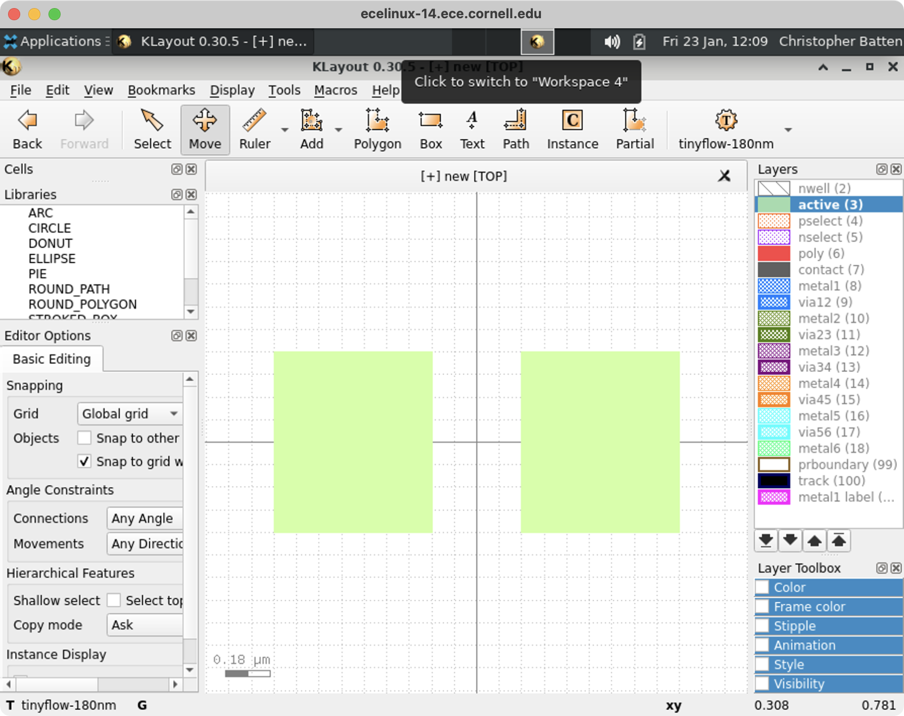
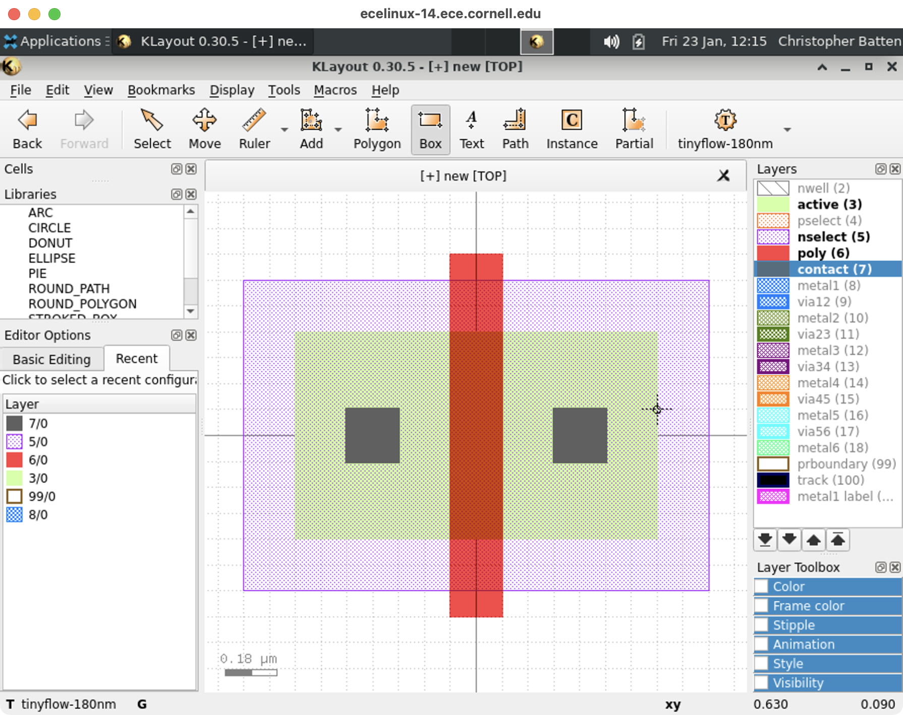
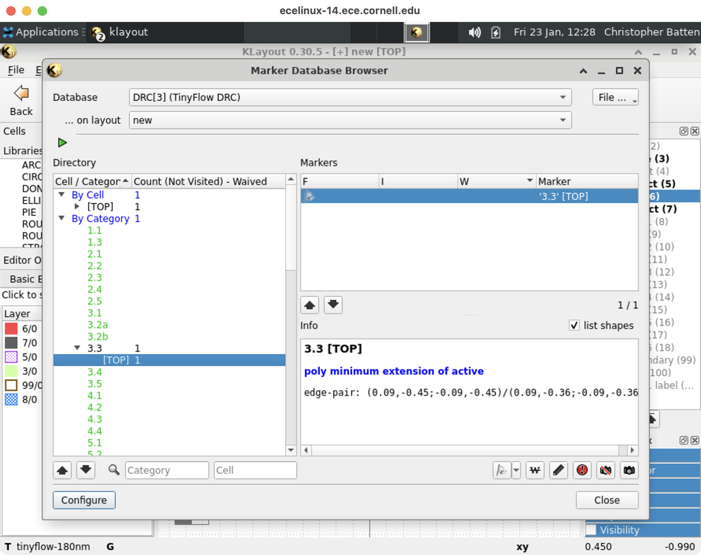

ECE 6745 Lab 1: Full-Custom Inverter
==========================================================================

In this lab, we will first make sure we can access the Linux development
environment on the `ecelinux` servers. We will be using the `ecelinux`
servers for all of the labs and projects. The `ecelinux` servers all run
the Red Hat Enterprise Linux 8 operating system, and they all use an
identical setup. We will then design the basic CMOS inverter we saw in
lecture using the following TinyFlow full-custom design flow.


We will write a transistor-level schematic, simulate the this schematic
using Ngspice to verify its functionality, use the KLayout design editor
to create the layout, perform a design-rules check (DRC), perform a
layout vs. schematic check (LVS), and generate an extracted
transistor-level schematic. Finally, we will re-simulate the extracted
transistor-level schematic to characterize the timing. We will also be
implementing a CMOS buffer to verify our intuition that NMOS transistors
should only be used in the pull-down network and PMOS transistors should
only be used in the pull-up network.

To get started, find a free workstation and log into the workstation
using your NetID and standard NetID password.

1. Linux Development Environment
--------------------------------------------------------------------------

It is important to keep in mind that we will use ecelinux as shorthand
for the entire cluster of 20 servers. These servers are named as follows:

 - ecelinux-01.ece.cornell.edu
 - ecelinux-02.ece.cornell.edu
 - ecelinux-03.ece.cornell.edu
 - ...
 - ecelinux-18.ece.cornell.edu
 - ecelinux-19.ece.cornell.edu
 - ecelinux-20.ece.cornell.edu

We need to try and balance the load across all the servers. So we have
distributed handout which has specifies which server each student should
use for today's lab. We will start by making sure we can access the
`ecelinux` servers using PowerShell, then we will use VS Code, and
finally we will setup MS Remote Desktop for running GUI Applications on
`ecelinux`. We will also make sure our GitHub account is setup correctly.

### 1.1. Remote Access via PowerShell

To start PowerShell click the Start menu then search for Windows
PowerShell. After starting PowerShell, type in the following command at
the prompt to log into an `ecelinux` server using SSH.

```bash
% ssh netid@ecelinux-XX.ece.cornell.edu
```

Replace netid with your Cornell NetID in the command above and replace XX
with the assign ecelinux server. You should not enter the % character. We
use the `%` character to indicate what commands we should enter on the
command line. Executing the command will prompt you to enter your Cornell
NetID password, and then you should be connected to your selected
ecelinux server.

The very first time you log into an `ecelinux` server you may see a
warning like this:

```
 The authenticity of host ’ecelinux-XX.ece.cornell.edu (128.253.51.206)’
 can’t be established. ECDSA key fingerprint is
 SHA256:smwMnf9dyhs5zW5I279C5oJBrTFc5FLghIJMfBR1cxI.
 Are you sure you want to continue connecting (yes/no)?
```

The very first time you log into an `ecelinux` server it is okay to enter
yes, but from then on if you continue to receive this warning please
contact the course staff.

The very first thing you need to do after opening a terminal is source
the course setup script. This will ensure your environment is setup with
everything you need for working on the lab assignments. Enter the
following command on the command line:

```
% source setup-ece6745.sh
```

Note that you do not need to enter `%` character. In a tutorial like
this, the `%` simply indicates what you should type at the command line.
You should now see a blue `ECE 6745` in your prompt which means your
environment is setup for the course. **If for any reason you do not see a
blue `ECE 6745` in your prompt, stop and raise your hand for help from an
instructor!**

It can be tedious to always remember to source the course setup script.
You can also use auto setup which will automatically source the course
setup for you when you log in. Note that if the environment for ECE 6745
conflicts with the environment required by a different course then you
will need to manually source the setup script when you are working on
this course. Enter the following command on the command line to use auto
setup:

```
% source setup-ece6745.sh --enable-auto-setup
```

If at anytime you need to disable auto setup you can use the following command:

```
% source setup-ece6745.sh --disable-auto-setup
```

### 1.2. Remote Access via VS Code

PowerShell is primarily just used as a backup if we have trouble
accessing `ecelinux` using VS Code. Students primarily should use VS Code
to log into the `ecelinux` servers.

To start VS Code click the _Start_ menu then search for _Visual Studio
Code_. The key to VS Code is installing the correct extensions. We want
to start by installing a special extension which will enable remotely
accessing the `ecelinux` servers using SSH. Choose _View > Extensions_
from the menubar. Enter the name of the extension in the "Search
Extensions in Marketplace" and then click the blue Install button. Here
is the name of the extension to install:

 - Remote - SSH (use the one from Microsoft)


Now we need to log into your assign `ecelinux` server. Choose _View >
Command Palette_ from the menubar. This will cause a little "command
palette" to drop down where you can enter commands to control VS Code.
Enter the following command in the command palette:

```
Remote-SSH: Connect Current Window to Host...
```

As you start typing matching commands will be displayed and you can just
click the command when you see it. VS Code will then ask you to Enter SSH
Connection Command, and you should enter the following:

```
netid@ecelinux-XX.ece.cornell.edu
```

Replace `netid` with your Cornell NetID and XX with the number of your
assign ecelinux server in the command above.

You may see a pop-up which stays that the _Windows Defender Firewall_ as
blocked some features of this app. This is not a problem. Simply click
_Cancel_. You might also see a drop down which asks you to choose the
operating system of the remote server with options like _Linux_ and
_Windows_. Choose _Linux_. Finally, the very first time you log into an
`ecelinux` server you may see a warning like this:

```
"ecelinux-XX.ece.cornell.edu" has fingerprint
"SHA256:YCh2FiadeTXEzuSkC0AOdglBgPciwc8WvcCPncvr2Fs"
Are you sure you want to continue?
Continue
Cancel
```

Also the very first time you log into an `ecelinux` server you will see a
pop up dialog box in the lower right-hand corner which says _Setting up
SSH host ecelinux-XX.ece.cornell.edu (details) Initializing...._ It might
take up to a minute for everything to be setup; please be patient! Once
the pop up dialog box goes away and you see _SSH:
ecelinux-XX.ece.cornell.edu_ in the lower left-hand corner of VS Code
then you know you are connected to your selected `ecelinux` server.

VS Code includes an integrated file explorer which makes it very
productive to browse and open files. Choose _View > Explorer_ from the
menubar, and then click on _Open Folder_. VS Code will then ask you to
_Open File Or Folder_ with a default of `/home/netid`. Click _OK_.

You might see a pop-up which asks you _Do you trust the authors of the
files in this folder?_ Since you will only be browsing your own files on
the ecelinux servers, it is fine to choose _Yes, I trust the authors._

This will reload VS Code, and you should now you will see a file explore
in the left sidebar. You can easily browse your directory hierarchy, open
files by clicking on them, create new files, and delete files.

VS Code includes an integrated terminal which will give you access to the
Linux command line on the `ecelinux` servers. Choose _Terminal > New
Terminal_ from the menubar. You should see the same kind of Linux command
line prompt that you saw when using PowerShell.

Remember, the very first thing you need to do after logging into the
ecelinux servers is source the course setup script. If you used
`--enable-auto-setup` in the last section, then the setup script is
already sourced for you automatically when you log into the ecelinux
servers. If not, you will need to enter the following command on the
command line:

```
% source setup-ece6745.sh
```

You should now see a blue `ECE 6745` in your prompt which means your
environment is setup for the course. **If for any reason you do not see a
blue `ECE 6745` in your prompt, stop and raise your hand for help from an
instructor!**

We highly recommend turning on auto save so you don't forget to save your
work. You can do this by choosing _File > Auto Save_ from the menubar.

### 1.3. Remote Access via MS Remote Desktop

We cannot use VS Code to run Linux GUI applications on `ecelinux`. We
will instead need to use MS Remote Desktop. Use the _Start Menu_ to
search for _Microsoft Remote Desktop_. **For the _Computer_ you must
choose the same `ecelinux` server you selected earlier in this lab.**
Then click on _Connect_. You may see a message like this:

```
The remote computer could not be authenticated due to problems with its
security certificate. It may be unsafe to proceed.
```

If you see this message then take the following steps:

 - Click _Don't ask me again for connections to this computer_
 - Click _Yes_

This should launch a "virtual desktop" on `ecelinux`. You will need to
enter your NetID and password in the xrdp login.

Now go back to your terminal in VS Code and use the following setup
script.

```
% source setup-gui.sh
% xclock &
```

If everything works you should see an analog clock on the virtual
desktop. Close the clock.


### 1.4. GitHub Account Setup

We will be using GitHub for centralized repository hosting. You can check
to see if you have a GitHub account using this link:
<https://github.com/githubid> where `githubid` is your GitHub username on
GitHub. If the above link does not work, then you do not have an GitHub
account. **NOTE: We are using the commercial version of GitHub not the
Cornell hosted GitHub!** You will need to create one here:

 - <https://github.com/join>

Your NetID makes a great GitHub username. If you are creating a new
GitHub account, then be sure to use your Cornell email address. If you
have an existing account it is fine for it to use a non-Cornell email
address.

Once your account is setup, please make sure you set your full name so we
can know who you are on GitHub. Go to the following page and enter your
first and last name in the Name field.

 - <https://github.com/settings/profile>

Before you can begin using GitHub, you need to create an SSH key pair on
an ecelinux server and upload the corresponding SSH public key to GitHub.
GitHub uses these keys for authentication. The course setup script takes
care of creating an SSH key pair which you can use. View the contents of
your public key using the following command:

```
% cat ~/.ssh/ece6745-github.pub
```

Use the following page to upload the public key to GitHub:

 - <https://github.com/settings/ssh>

Click on _New SSH Key_, and then cut-and-paste the public key you
displayed using cat into the key textbox. Give the key the title
`ece6745-github`. Then click _Add SSH key_. To test things out try the
following command on `ecelinux`.

```
% ssh -T git@github.com
```

You may see a warning about the authenticity of the host. Don’t worry,
this is supposed to happen the first time you access GitHub using your
new key. Just enter `yes`. The GitHub server should output some text
including your GitHub username. Verify that the GitHub username is
correct, and then you should be all set.

### 1.5. Clone Lab Repo

Now use the following commands to clone the repo we will be using for
today's lab.

```bash
% mkdir -p $HOME/ece6745
% cd $HOME/ece6745
% git clone git@github.com:cornell-ece6745/ece6745-lab1.git lab01
% cd lab01
% tree
```

Your repo contains the following files for modeling and simulating both
the inverter and buffer.

```
.
├── buf/
│   ├── buf-rcx-sim.sp
│   ├── buf-sim.sp
│   ├── buf.gds
│   └── buf.sp
└── inv/
    ├── inv-rcx-sim.sp
    ├── inv-sim.sp
    ├── inv.gds
    └── inv.sp
```

2. KLayout Tutorial
--------------------------------------------------------------------------

[KLayout](https://www.klayout.de) is a powerful, open-source layout tool
that allows users to both view and edit layout files in GDS format.
Additionally, it can perform design-rule checking, layout vs. schematic
checking, and RC extraction among other features. In this lab, we will be
using all of these features so that you can become familiar with making
your own custom layout! We will start by designing a single NMOS
transistor before working on the complete inverter in the next section.

To open on the ECELinux server, first open KLayout in edit mode (`-e`).

```bash
% cd ${HOME}/ece6745/lab01
% klayout -e &
```

Do not worry about libGL errors when starting KLayout. There will be a
pop-up the first time you open KLayout asking about whether to use
full-hierarchy mode. Select _Don't show this window again_ and then click
_Yes_.

Choose _File > New Layout_ from the menubar and click _OK_. The KLayout
window should look as follows.


Take a minute to become familiar with the user interface (some items are
omitted as they are not used for our class):

 - **Toolbar:** Includes back/forward (undo/redo) buttons, as well as
   buttons for selecting a feature, moving a feature, drawing a feature,
   measuring a feature (ruler), etc.

 - **Technology:** Notice the technology is automatically selected to
   _tinyflow-180nm_.

 - **Cells Panel:** Displays names of all the cells in the current layout
   file. In this case, we only have one cell in our layout file named
   _TOP_, but we will have more cells in future labs/projects which
   constitute an entire _library_ of cells! You can right click on a cell
   and choose _Show As New Top_ to select which cell to view in the main
   window.

 - **Layers Panel:** Displays all available layers which elements can be
   placed on, take a minute to correlate these names with what you have
   seen in lecture. You can right click on a layer to set visibility
   options for it and other layers.

- **Main Drawing Area:** The grid is also automatically set to 1x1
   lambda. Recall that lambda is 90nm for the TinyFlow 180nm PDK. One
   lambda is the minimum unit on which you can draw a feature.

Try zooming out by using the mouse scroll wheel. Eventually, the lines
should disappear and a grid of interspersed dots only on the intersection
of these boxes should be present instead. **When drawing a feature with a
specific dimension of lambda, be sure that you are not zoomed out so far
that you cannot see the lambda grid anymore. The intersection of the two
solid lines represents the origin.

!!! warning "Do not use Ctrl+S to save layouts!"

    When saving your layout use _File > Save_ from the menubar. **DO NOT
    DO CTRL+S AS IT BREAKS THE VIEW!** If you do use Ctrl+S then try
    clicking the back arrow many times and you might be able to get your
    layout back.

Let's now go ahead and draw an NMOS transistor step-by-step. First, draw
two boxes on the _active_ layer. Each box should be 8 lambda tall and 7
lambda wide. To draw a box:

 - Choose the desired layer in the _layer panel_
 - Choose the _Box_ tool from the _toolbar_
 - Click in the _main drawing area_ where you want the upper-left corner
 - Click in the _main drawing area_ where you want the lower-right corner



Once you have drawn a box try deleting it.

 - Choose the _Select_ tool from the _toolbar_
 - Hover over the box until it is highlighted
 - Click on the box, it will stay highlighted
 - Choose _Edit > Delete_ from the menubar

Redraw the box. Now let's use move the two boxes so they are adjacent. To
move a box:

 - Click on the _Move_ tool from the _toolbar_
 - Hover over the box until it is highlighted
 - Click on the box, it will stay highlighted
 - Move the mouse to drag the box to the new location
 - Click the box to place the box at the new location


We now two boxes that are adjacent to each other. Let's merge them into a
single box. To merge boxes:

 - Click on the _Select_ tool from the _toolbar_
 - Hover over the left box until it is highlighted
 - Click on the box, it will stay highlighted
 - Hover over the right box until it is highlighted
 - Shift click on the box, both boxes will stay highlighted
 - Choose _Edit > Selection > Merge Shapes_


Now use what you have learned to draw a complete NMOS with the _active_,
_nselect_, _poly_, and _contact_ layers. Note that in lecture we had
separate layers for n-diffusion and p-diffusion. However, our TinyFlow
180nm PDK represents n-diffusion and p-diffusion differently. The
_active_ layer indicates where we want either n-diffusion or p-diffusion,
and the _pselect_ and _nselect_ layers are used to _select_ whether that
diffusion is n-type or p-type. So to create n-diffusion we need a box of
on the _active_ layer overlapped with a box on the _nselect_ layer. Since
we are implementing a NMOS transistor, we draw an _nselect_ layer around
the active we have already drawn.



You can hide and show layers by double-clicking on the layer name in the
_Layer Panel_. This can be useful to understand how different layers
overlap.

Once you have finish drawing your NMOS transistor let's make sure it
follows all of the rules in the _TinyFlow 180nm Design-Rule Manual_
(DRM):

 - <https://cornell-ece6745.github.io/ece6745-mkdocs/ece6745-design-rule-manual>

Go ahead and look through the DRM and find DRC Rule 3.3. This rule
requires the poly box to extend at least 3 lambda beyond the active box.
Verify that our NMOS transistor does indeed follow this rule. Obviously
checking all of these rules would be tedious and error prone, so we will
instead use KLayout to automatically check all DRC rules. Choose _Tools >
DRC > tinyflow-180nm.lydrc_ from the menubar.

A new window should open with the DRC results, the left side shows all
the performed DRC checks, with the numbers corresponding to the
associated rules in the DRM. If your design is DRC-clean, then all the
numbers should be green and the topcell name under _By Cell_ should be
green.


If the topcell name is black, scroll down to find the rule number(s) that
is also black and cross-reference it with the DRM. If you click on the
violated rule, details will also be populated in the Info window in the
bottom right.

Let's go ahead and create a violation by erasing some of the poly box. To
erase part of a box:

 - Choose the desired layer in the _layer panel_
 - Click the down arrow next to the _Add_ tool in _toolbar_
 - Click _Erase_ to change the tool to the _Erase_ tool
 - Draw a box in the _main drawing area_ around what part of the poly
   layer you want to erase


Once you have finish using the _Erase_ tool don't forget to set it back
to the _Add_ tool otherwise you won't be able to draw new boxes in the
future.

Now rerun DRC. You should now have a DRC violation for DRC Rule 3.3. If
you click on the violation in the DRC browser KLayout will highlight
where the violation is on the layout. Edit your layout to fix the DRC
violation and rerun DRC.



Once you are done go ahead and close KLayout. You can save your layout if
you want but it is not required.

3. Full-Custom Inverter
--------------------------------------------------------------------------

We are now ready to experiment with implementing a full-custom inverter.
Revisit the TinyFlow full-custom design flow shows at the top of this lab
handout.

### 3.1. Transistor-Level Schematics

The first step is to implement the transistor-level schematic for our
inverter.

{ width=30% }

We will do this by writing a Spice file which is just a plain text file
which specifies how to instantiate and connect transistors. Use VS Code
to open the blank Spice file for our inverter:

```
% cd ${HOME}/lab01
% code inv/inv.sp
```

Add a line for each device (transistor) in your inverter circuit inside
the sub-circuit using the following format:

 - For the PMOS: `M_P <D> <G> <S> <B> PMOS L=<length>U W=<width>U`
 - For the NMOS: `M_N <D> <G> <S> <B> NMOS L=<length>U W=<width>U`

where D, G, S, and B represent the drain, gate, source, and body
connections for the transistor, respectively. You should replace these
with the correct pin name (A, Y, VDD, VSS) for those connections as
discussed in lecture. You should also fill in numerical values for the
length and width of the transistor. **For this inverter, we are defining
the width to be 8-lambda wide**. This is a design requirement we are
providing to you, but custom-circuit designers will test their design for
a wide variety of parameters, including modifying this width to achieve
their design goals of power, performance, or area. **Additionally, the
definition of lambda states that the gate-width (transistor length) for a
given process is equal to 2-lambda.** Convert the lambda measurement of
these values to micron using our conversion factor of 1 lambda = 0.09um
(the U suffix on the end of the values denotes that the numerical value
should be interpreted in micron).

### 3.2. Schematic Simulation with Ngspice

Now that we have written our reference Spice schematic, we need to test
it to make sure it is functionally correct. To check this functionality,
we provide a Spice deck, or testbench, for our Spice circuit, which
will simulate the circuit given specific input stimuli. Open this Spice
deck using VS Code.

```
% cd ${HOME}/lab01
% code inv/inv-sim.sp
```

Take a minute to browse the testbench as well and understand how it works
at a high level. Copy-and-paste your Spice circuit from `inv/inv.sp` into
the `inv/inv-sim.sp` file where it says to. You need to copy the entire
subcircuit definition (i.e., you must include the `.SUBCKT` and `.ENDS`
lines).

**Additionally, we need to make the following changes to the pasted Spice
circuit to ensure it is compatible with the transistor models we will be
using:**

 - Replace the `PMOS` identifier with `sky130_fd_pr__pfet_01v8`
 - Replace the `NMOS` identifier with `sky130_fd_pr__nfet_01v8`
 - Replace the `M_P` identifier with `XM_P`, and the `M_N` identifier with
   `XM_N`

To allow the simulation to work, we need to provide pre-characterized
device models for the transistors, and we use the open-source
[Sky130](https://skywater-pdk.readthedocs.io/en/main/) models. The above
changes modify the Spice to work with these models.

We run the simulation using an open-source tool called
[Ngspice](https://ngspice.sourceforge.io). Execute the following in your
terminal to run the simulation:

```bash
% cd ${HOME}/lab01
% ngspice inv/inv-sim.sp
```

Please be patient as it can take 30-45 seconds to finish the simulation.
The simulation will open a new plot window in the virtual desktop,
plotting both the input voltage (at A) vs. time as well as the output
voltage (at Y) vs. time.

!!! warning "Be sure to change both `inv.sp` and `inv-sim.sp`!"

    If you make any fixes to your transistor-level schematic
    `inv-sim.sp`, be sure to make the same changes in `inv.sp` otherwise
    later steps will not work.

!!! warning "Do not use Ctrl-C to exit Ngspice!"

    To exit Ngspice type `exit` at the Ngspice prompt. If you try to use
    Ctr-C to exit Ngspice it will break your terminal. You might be able
    to fix your terminal by typing `clear` and then press enter, then
    typing `reset` and then press enter. You might not be able to see the
    letters when you type `clear` and `reset` but it still might work.
    You might need to use `source setup-gui.sh` again. Worst case you
    will need to close the terminal and open a new terminal.

!!! question "Critical Thinking Questions"

    Does the behavior of the inverter look correct? Think about the
    desired high-level functionality.

### 3.3. Drawing Layout with KLayout

We are now ready to draw the layout for the inverter. You can open the
provided template in KLayout like this:

```bash
% cd ${HOME}/lab01
% klayout -e inv/inv.gds &
```

Here is the complete layout from lecture that you should use as a guide.


**Be sure to follow the dimensions exactly! Otherwise you may fail DRC!**

Once your layout is finished, add the labels for these pins:

 - A (input connecting to the gates of both transistors)
 - Y (output from the drains of both transistors)
 - VDD (positive voltage power rail)
 - VSS (negative voltage power rail)

Each pin should be positioned in the center of the corresponding _metal1_
box. To add a label:

 - Choose the _metal1 label_ layer in the _layer panel_
 - Choose the _Text_ tool from the _toolbar_
 - Click in the _main drawing area_ where you want the label

Once the label is placed correctly, use the _Select_ tool to select the
label. Then choose _Edit > Properties_ from the menubar. Change the
_Text_ field to change the name of the pin. The pins need to be exactly
labeled A, Y, VDD, and VSS.

You can view your inverter in a semi-three-dimensional view called 2.5D.
**First, make sure your layout is fully-visible in the layout viewer.**
Then, choose _Tools > 2.5d View > tinyflow-180nm.lyd25_ from the menubar.
A new window should pop up with a 2.5D viewer which you can use the mouse
to scroll around and view the inverter from different angles!


### 3.4. DRC with KLayout

Once you have finished your layout, you should run DRC as before to
ensure your design passes all design rule checks. **Ensure your design is
DRC-clean before moving onto the next step! Be sure to save the layout as
well.**

### 3.5. LVS with KLayout

Layout vs. schematic checks compare the layout you just created with the
transistor-level schematic you wrote earlier to ensure that the layout
drawing matches the intended high-level functionality. The LVS tool in
KLayout will *extract* a Spice schematic from the drawn layout and
compare this to the reference one.

Make sure your desired cell to check via LVS is active in the viewer
(important if multiple such cells are in the same layout file as will
happen in later projects and labs). Choose _Tools > LVS >
tinyflow-180nm.lylvs_ from the menubar.

After running the script, and if LVS passes, you should see all green in
the window that pops up. You can click through the dropdowns under _Cross
Reference > Objects_ to see the comparison between the layout and
reference schematic for pins, nets, and devices (transistors).


If you see any red stop signs, this means LVS failed. You can view the
violations by clicking the drop-down arrows under _Cross Reference >
Objects_ to see what is failing the check. If you have mismatched or
missing pins, these errors will show up in the _Log_ tab. Edit your
layout and/or reference Spice file to fix the violations. Here are some
examples of what might cause LVS violations.

  - The width of the transistors in the reference schematic do not match
    the layout.

  - The pins are not on the _metal1 label_ layer (pins must be on _metal1
    label_ not _metal1_).

  - Make sure you are using `PMOS` and `NMOS` in your `inv.sp` file not
    `sky130_fd_pr__pfet_01v8` and `sky130_fd_pr__nfet_01v8`. The
    `sky130_fd_pr__pfet_01v8` and `sky130_fd_pr__nfet_01v8` versions are
    only for simulation, so they should only be in the `inv-sim.sp`.

  - Make sure your transistors in the layout are really transistors
    (i.e., make sure you are really using the _nselect_ and _pselect_
    layers correctly).

Let's go ahead and force an LVS violation. Close the LVS dialog box and
swap the names of the A and Y pins. Then rerun LVS and you should be able
to see the LVS violations in the _Log_ tab.


Now go back and fix the LVS violations and rerun LVS to verify your
design is LVS clean.

### 3.6. RCX with KLayout

KLayout generates an extracted transistor-level schematic as a
side-effect of running LVS. Go ahead and take a look at this extracted
transistor-level schematic.

```
% cd ${HOME}/lab01
% code inv/inv-rcx.sp
```

This file looks similar to the reference Spice file, except that it
includes additional information for RC parasitics of the transistor using
the parameters AS, AD, PS, and PD.

### 3.7. Extracted Simulation with Ngspice

Our final step is to characterize the timing of our full-custom layout
using the extracted transistor-level schematic. Open the following Spice
deck using VS Code.

```
% cd ${HOME}/lab01
% code inv/inv-rcx-sim.sp
```

Copy-and-paste the extracted Spice circuit from `inv/inv-rcx.sp` into the
`inv/inv-rcx-sim.sp` file where it says to. **Additionally, we need to
make the following changes to the pasted Spice circuit to ensure it is
compatible with the transistor models we will be using:**

 - Replace the `PMOS` identifier with `sky130_fd_pr__pfet_01v8`
 - Replace the `NMOS` identifier with `sky130_fd_pr__nfet_01v8`
 - Replace the `M$1` identifier with `XM$1`, and the `M$2` identifier with
   `XM$2`

We are now ready to run our simulation. Execute the following in your
terminal to run the simulation (it should take a few seconds to run):

```bash
% cd ${HOME}/lab01
% ngspice inv/inv-rcx-sim.sp
```

The simulation will open a new plot window in the virtual desktop,
plotting both the input voltage (at A) vs. time as well as the output
voltage (at Y) vs. time.

!!! question "Critical Thinking Questions"

    Qualitatively, how does the rise time of the output compare to the
    fall time (compare this to your lecture notes)? Can you explain why
    one is faster than the other?

4. Full-Custom Buffer
--------------------------------------------------------------------------

Assume we want to implement a _buffer_ in which the output is the same as
the input. We might want this regenerate a signal for example. Many
students wonder why we can't just make a buffer by "flipping" the NMOS
and PMOS in the inverter.

{ width=30% }

If the input is one then the NMOS is on and the PMOS is off and the
output would be one. If the input is zero then the NMOS is off and the
PMOS is on and the output would be zero.

Use everything you have learned to implement and test this kind of buffer.
Go through all seven steps of the TinyFlow full-custom design flow:

 - Step 1: Use VS Code to write a transistor-level schematic
 - Step 2: Use Ngspice to functionally verify this schematic
 - Step 3: Use KLayout to draw the layout for the buffer
 - Step 4: Use KLayout to make sure the layout is DRC clean
 - Step 5: Use KLayout to make sure the layout is LVS clean
 - Step 6: Use KLayout to for RC extraction
 - Step 7: Use Ngspice to characterize the timing of the buffer

You should use these files which are provided for you.

 - `buf/buf.sp`
 - `buf/buf-sim.sp`
 - `buf/buf.gds`
 - `buf/buf-rcx-sim.sp`

Here is a sketch of how to implement the layout for the buffer.


Start with the layout from your inverter as follows.

```bash
% cd ${HOME}/lab01
% cp inv/inv.gds buf/buf.gds
```

Then open this layout using KLayout in edit mode.

```bash
% cd ${HOME}/lab01
% klayout -e buf/buf.gds
```

**You must now change the topcell name from _INV_ to _BUF_!**

 - Right click on _INV_ in the _Cells Panel_
 - Choose _Rename Cell_
 - Enter _BUF_
 - Click _OK_

!!! question "Critical Thinking Questions"

    Consider the plot showing both Vin and Vout over time from simulating
    the extracted transistor-level schematic (not from just simulating
    the reference transistor-level schematic). Will this approach work in
    practice? Why or why not?

