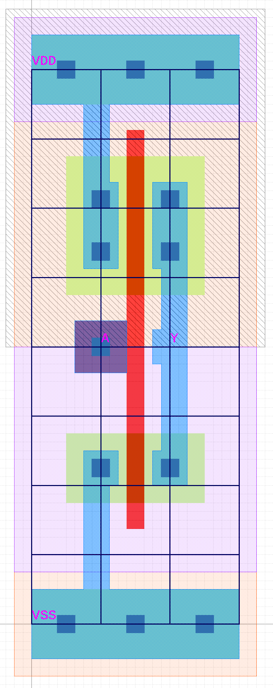
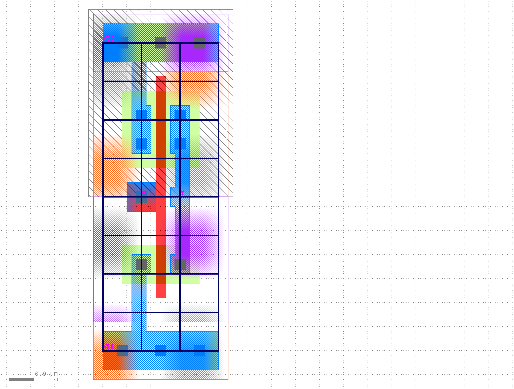
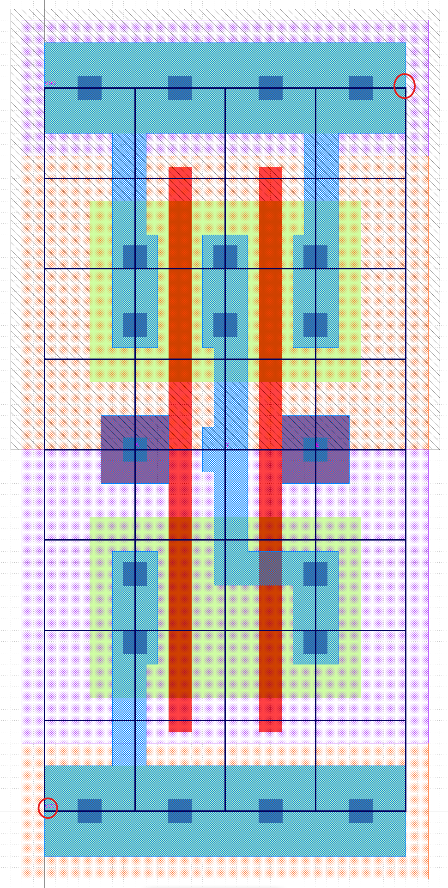
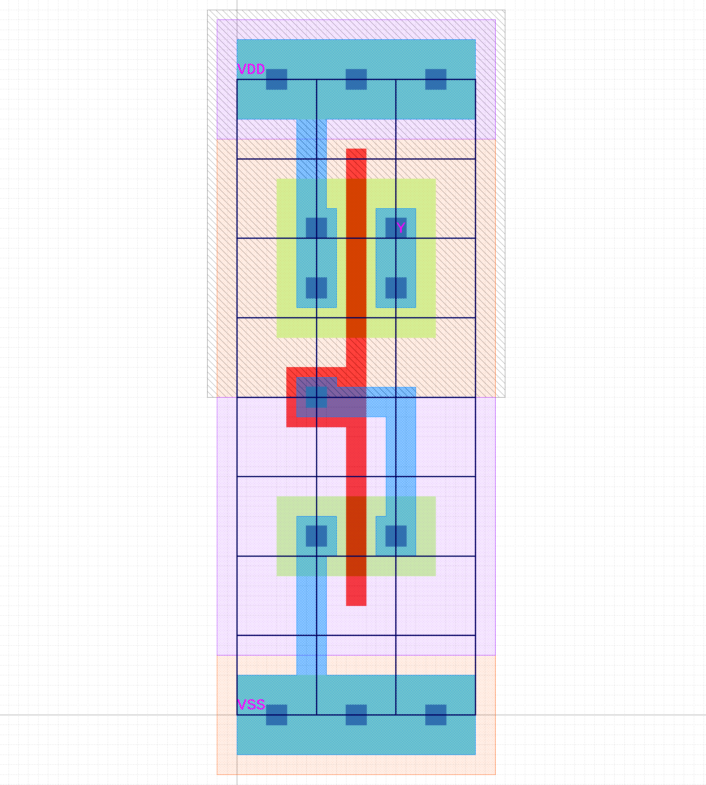
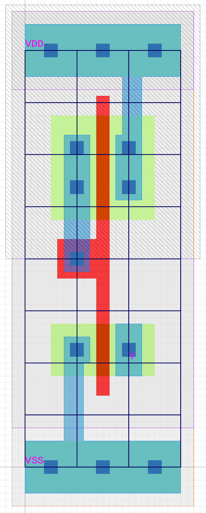
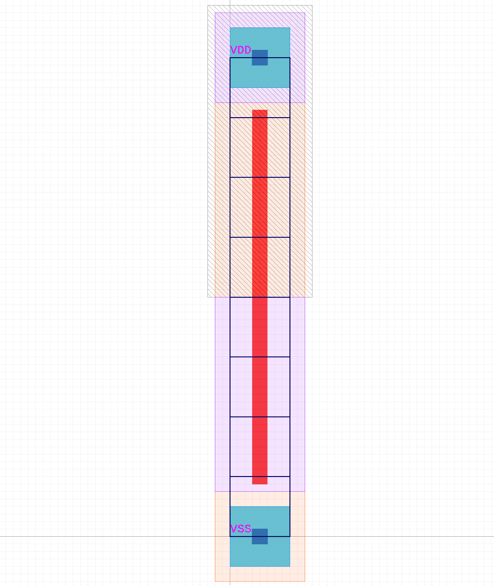

ECE 6745 Lab 2: Standard-Cell Inverter
==========================================================================

In this lab, we will implement a standard-cell inverter including the
corresponding behavioral, schematic, layout, extracted schematic,
front-end, and back-end views.

 - **Behavioral View:** Logical function of the standard cell, used for
     gate-level simulation

 - **Schematic View:** Transistor-level representation of standard cell,
     used for functional verification and layout-vs-schematic

 - **Layout View:** Layout of standard cell, used for design-rule
     checking (DRC), layout-vs-schematic (LVS), resistance/capacitance
     extraction (RCX), and fabrication

 - **Extracted Schematic View:** Transistor-level representation with
     extracted resistance and capacitances, used for layout-vs-schematic
     (LVS) and timing characterization

 - **Front-End View:** High-level information about standard cell
     including area, input capacitance, logical function, and delay
     model; used in synthesis

 - **Back-End View:** Low-level information about standard cell including
     height, width, and pin locations; used in placement and routing

We will be using the following TinyFlow standard-cell design flow.


We will by begin by writing the behavioral view in Verilog and verifying
its functionality using a Verilog test bench and Icarus Verilog. We will
then write the schematic view in SPICE and verify its functionality using
a SPICE test bench and Ngspice. We will then use the KLayout design
editor to create the layout, perform a design-rules check (DRC), perform
a layout vs. schematic check (LVS), and generate an extracted schematic.
We will re-simulate the extracted transistor-level schematic using
Ngspice to characterize the propagation delay for different load
capacitances in order to create a linear delay model. Finally, we will
write the front-end and back-end views for our standard-cell inverter in
two YAML files. We will also implement three _auxillary standard cells_
(i.e., TIEHI, TIELO, FILL).

1. Logging Into `ecelinux` with VS Code
--------------------------------------------------------------------------

Follow the same process as previous labs Find a free workstation Find a
free workstation and log into the workstation using your NetID and
standard NetID password. Then complete the following steps (described in
more detail in the first lab):

 - Start VS Code
 - Install the Remote-SSH extension
 - Use View > Command Palette to execute Remote-SSH: Connect Current Window to Host...
 - Enter netid@ecelinux-XX.ece.cornell.edu where XX is an ecelinux server number
 - Use View > Explorer to open your home directory on ecelinux
 - Use View > Terminal to open a terminal on ecelinux

Now use the following commands to clone the repo we will be using for
today's lab.

```bash
% source setup-ece6745.sh
% mkdir -p ${HOME}/ece6745
% cd ${HOME}/ece6745
% git clone git@github.com:cornell-ece6745/ece6745-lab02-stdcell-inv lab02
% cd lab02
% tree
```

Your repo contains the following files for the views and simulation scripts for
each standard cell:

```
.
└── stdcells/
    ├── verilog-sim/
    │   ├── AOI21X1-sim.v
    │   ├── INVX1-sim.v
    │   ├── NAND2X1-sim.v
    │   ├── NOR2X1-sim.v
    │   ├── TIEHI-sim.v
    │   └── TIELO-sim.v
    ├── stdcells-be.yml
    ├── stdcells-fe.yml
    ├── stdcells-rcx.yml
    ├── stdcells.gds
    ├── stdcells.sp
    └── stdcells.v
```

To make it easier to cut-and-paste commands from this handout onto the
command line, you can tell Bash to ignore the `%` character using the
following command:

```bash
% alias %=""
```

Now you can cut-and-paste a sequence of commands from this tutorial
document and Bash will not get confused by the `%` character which begins
each line.

2. Standard-Cell Inverter
--------------------------------------------------------------------------

In this part, we will be implementing the six views for the standard-cell
inverter. Remember that in addition to being DRC and LVS clean, your
inverter must also follow all of the rules which make standard cells
"standard":

  - _Standard_ transistor positions and orientation (PMOS at top, NMOS at
     bottom, vertical gates)
  - _Standard_ n-well size and location (n-well at top)
  - _Standard_ VDD and ground metal layer and locations (on metal 1,
     VDD rail 8 lambda tall at top, ground rail 8 lambda tall at
     bottom)
  - _Standard_ n-well and substrate contacts
  - _Standard_ boundry and extension of n-well, VDD, and ground rails
     beyond boundry (origin is in lower left)
  - _Standard_ metal 2+ routing grid (8 lambda track spacing)
  - _Standard_ cell height (64 lambda$)
  - _Standard_ cell width (aligned to routing grid, i.e., 8 lambda$,
     16 lambda$, 24 lambda$, etc)
  - _Standard_ pin layer and locations (on "metal1 label" layer and **on routing
    grid**)
  - _Standard_ set of available drive strengths with equal rise and
     fall times

### 2.1. Behavioral View

We will begin by defining our inverter standard cell in a *behavioral way*, in
other words, what is its *logical* functionality? To do this, we use Verilog by
writing a module definition for our cell (in `stdcells/stdcells.v`) and testing
the standard cell module with a Verilog testbench (in
`stdcells/verilog-sim/INVX1-sim.v`).

First, modify the `stdcells/stdcells.v` file by changing the code in the
`LAB/PROJECT TASK` block for the inverter to match its proper Verilog
specification. Use Verilog bitwise operations to assign the output Y with a
logic function of the inputs.

Next, we will test the inverter. Navigate to the `stdcells/verilog-sim`
directory and create a new build directory:

```bash
cd stdcells/verilog-sim/
mkdir -p build
cd build
```
Open the `INVX1-sim.v` file. Modify the stimulus definition inside the
`LAB/PROJECT TASK` block by adding more 0's and 1's to the array definition
list. This will provide a sequence of inputs to send to your standard cell to
verify its functionality. **Be sure to also change the length of the array to
match the number of values in it.**

Run the following commands to test the INVX1 cell:

```bash
iverilog -g2005-sv ../INVX1-sim.v -o INVX1-sim
./INVX1-sim
```

Below is an example output to the console after configuring the input stimuli
for the INVX1 test with some transitions. You will notice the timestep, the
value of each input pin, and the value of the output pin are printed:

```
Time: 0 ns (A: 0) -> Y: 1
Time: 2 ns (A: 1) -> Y: 0
Time: 4 ns (A: 0) -> Y: 1
```

You can also view these graphically by using the VSCode extension Surfer.
Install it by searching "Surfer" in the VSCode extensions window and clicking
"Install":


You can then run the following command to view the waveforms for the simulation:

```bash
code INVX1-sim.vcd
```

You can then click the dropdown arrow next to the "INVX1TB" name in the top-left
corner in the window that opens, then click "DUT", and then click the + button
midway down the left side of the window to add all inputs and outputs to the
waveform viewer:


Verify the output for your inverter matches your expectations for its logical
functionality before moving on. Consider the truth table for the inverter and
ensure you are testing all possible input combinations.

### 2.2. Schematic View

Now that your Verilog behavioral/logical view for your inverter is ready and
fully tested, we also need to define its Spice schematic view, just as we did in
lab 1.

Open the `stdcells.sp` file. Modify the contents inside the `LAB/PROJECT TASK`
block for the inverter to implement it at the transistor-level. Reference your
lab1 pre-extracted Spice schematic to ensure the correct spice format is used,
but remember that **you are now implementing a balanced 2:1 inverter instead of
a 1:1 inverter - make sure you size the width of the transistors correctly!**
The format from lab1 is as follows:

 - PMOS: `M_P <D> <G> <S> <B> PMOS L=<length>U W=<width>U`
 - NMOS: `M_N <D> <G> <S> <B> NMOS L=<length>U W=<width>U`

Once you have a complete Spice schematic, you will now simulate it with Ngspice
just as you did in lab1. For this lab and all subsequent labs/projects, we have
developed a new wrapper script to make using Ngspice easier! It is important you
read the content below to understand how to use it.

Create a new build directory inside `stdcells/`:

```bash
cd stdcells/
mkdir -p build
cd build
```

The following shows the syntax of how to use the `tinyflow-ngspice` tool:

```bash
tinyflow-ngspice --cell=<CELLNAME> --cload=<CLOAD> --spice=<SPICE_FILE> --inputs=<INPUTS_SPEC>
```

Let's break down each input (all four are required):

 - `--cell=<CELLNAME>`: replace `<CELLNAME>` with the name of your cell to test,
   in this case, we are testing INVX1
 - `--cload=<CLOAD>`: replace `<CLOAD>` with the capacitance to put on the
   output pin of your cell, you can use regular integers followed by a unit
   suffix (e.g. `10f` for 10 femtofarads)
 - `--spice=<SPICE_FILE>`: replace `<SPICE_FILE>` with the path to `stdcells.sp`
   where you have defined your Spice schematic, this should be `../stdcells.sp`
 - `--inputs=<INPUTS_SPEC>`: replace `<INPUTS_SPEC>` with a string surrounded by
   quotes of the following form -
   `<PIN1>:<VAL0>-<VAL1>...<VALN>;<PIN2>:<VAL0>-<VAL1>...<VALN>`, where `<PINN>`
   specifies one of the input pins for your cell (e.g. A, B, etc.), and `<VALN>`
   specifies a 0 or 1 to assert on that input pin. Each of these values are
   separated by a dash (-), such that each input value will be set for one
   timestep (2ns) before the next value is set. All input pins and their
   corresponding values are separated by a semicolon (;), and input pin names
   are separated from their values list by a colon (:). All input pins as
   specified by your standard cell must be present, and they must all have the
   same number of transitions.

Below is an example for running the `tinyflow-ngspice` command for the INVX1
cell with a 50f load, and an input going from 0 to 1 to 0:

```bash
tinyflow-ngspice --cell=INVX1 --cload=50f --spice=../stdcells.sp --inputs="A:0-1-0"
```

The command will take care of all of the manual steps you had to do in lab1 for
you: converting your Spice schematic to a Sky130-compatible version, setting up
the Spice testbench, and running the testbench. When the command has completed,
you will see an output to the console specifying the transitions of both the
input and output pins of your standard cell throughout the simulation. It will
also print rising and falling delays if captured from each input pin to the
output - this will be discussed later when characterizing the cell.
Additionally, your build directory will contain a new subdirectory
`ngspice-results/` with more subdirectories within it named with a concatenation
of the inputs you specified. Each of these subdirectories will contain the
following:

 - `-tb.sp`: the Spice testbench used to simulate your schematic
 - `.csv`: CSV data generated by Ngspice for each pin of your standard cell
 - `.png`: an image plotting the voltage of each pin of your standard cell over
   time
 - `.txt`: a text file containing the same output as what was printed to the
   console

Run `tinyflow-ngspice` and view its outputs to verify functionality of your
Spice schematic. Verify the output for your inverter matches your expectations
for its transistor-level functionality before moving on. Consider the truth
table for the inverter and ensure you are testing all possible input
combinations.

### 2.3. Layout View

We can now draw our layout since we know our standard cell is functionally
correct, both in Verilog and Spice. Run the following commands to open the
standard cells gds file:

```bash
cd stdcells/
klayout -e stdcells.gds
```

Make sure the inverter is your top cell view by clicking on INVX1 from the
Cells window and selecting "Show As New Top":


You should see a blank standard-cell layout as shown below:


Because we want all our standard cells to follow out *standard* parameters as
discussed above, we have provided you with this template for every cell to get
started. Notice how the height of the cell (from center of contact on bottom
VSS rail to center of contact on top VDD rail) is 64 lambda (8 vertical
tracks, each of 8 lambda tall). The width of this standard cell is also 64
lambda (8 horizontal tracks, each of 8 lambda wide). You will also see some
familiar layers here, particularly the nwell under the top half of the
standard cell. You will also notice that we have already inserted pselect and
nselect regions accordingly.

To implement the inverter, you will follow the schematic and layout reference
below (notice how the pins must be on the intersecting black track lines in
the layout):




Notice how this inverter is only 24 lambda wide (3 horizontal tracks), but the
standard cell we have given you is 64 lambda wide (8 horizontal tracks). When
drawing your layout, implement the above inverter all the way on the left side
of your provided template. You will then need to "trim" the template from the
right side by performing the following actions to achieve a minimum-width:

First, erase extra htrack and vtrack shapes, then erase the prboundary so that it is aligned with the new right most track.


Next, erase the nwell so that it extends beyond the prboundary by 3 lambda (symmetrical with the left edge of the cell)


Next, erase the nselect and pselect so that it extends beyond the prboundary by 2 lambda (symmetrical with the left edge of the cell).


Finally, erase the well-tap structure (active + metal1 + contacts) so that it is aligned with the prboundary.



As in lab 1, be sure to run DRC and LVS to ensure your design adheres to all
design rules and matches your Spice schematic, and also 2.5D! Also be sure to
reference the _TinyFlow 180nm Design-Rule Manual_ (DRM) when drawing your
layout:

 - <https://cornell-ece6745.github.io/ece6745-mkdocs/ece6745-design-rule-manual>

### 2.4. Extracted Schematic View

Now that we have a DRC and LVS-clean layout, we can perform functional
verification as well as characterization on our extracted Spice netlist,
similar to lab 1.

LVS dumps out your extracted Spice netlist for you automatically, you should
see the file in `stdcells/invx1-rcx.sp`. Copy the contents of this file and
paste it into `stdcells/stdcells-rcx.sp` where it defines the lab/project task
for you. When making your other cells, you will paste the extracted schematics
under your inverter schematic to create a Spice library for all of your cells,
similar to how it is set up in `stdcells/stdcells.sp`. Feel free to delete
`stdcells/invx1-rcx.sp` since it is no longer needed.

We will now run the same functional simulation as we did on the pre-extracted
Spice netlist to ensure the extracted netlist is still functionally-correct
(notice how the only difference for this command is the different Spice file
we are pointing it to):

```bash
tinyflow-ngspice --cell=INVX1 --cload=50f --spice=../stdcells-rcx.sp --inputs="A:0-1-0"
```

Compare the output waveforms from the console/txt file and png file to your
expectations for what the functionality of the inverter should be. Only move
on once your expectations are met (go back to fix your layout if the waveforms
do not look correct).

We will now perform *characterization* on the inverter. This means we are
going to find its *linear-delay model*, which represents the propagation delay
through the inverter (either rising input to falling output or falling output
to rising input) as a function of its load capacitance (cload). To do this,
you will choose three values of `cload` between 0f and 100f to plug into the
above command, and you will then observe the values in the `Measured delays:`
section of the `tinyflow-ngspice` output to find the worst-case rising or
falling delay for that value of `cload`. `t_pdf` represents the falling
propagation delay, while `t_pdr` represents the rising propagation delay.
Choose the worst of the two for the delay for this value of `cload`. Ideally,
these values should be close as we have designed the inverter to have balanced
rise and fall time via its 2:1 sizing. Note down the worst case delay **and
convert the value to ps** for each `cload` **convert this value to fF**.

Once you have obtained a worst case delay for at least three `cload* values,
and you have converted the delay to ps and the load value to fF, generate a
linear regression of the data with delay on the y-axis and load value on the
x-axis using your favorite data analyzer (Google Sheets, TI calculator, etc.).
Note down the y-intercept and slope. As discussed in lecture, the y-intercept
represents the *parasitic delay*, or the delay when the cell is unloaded,
while the slope represents the *load-delay factor*, a measure of how much the
delay increases for increasing load capacitance. These values are necessary
for static-timing analysis which will be performed in later labs. Only
continue once you have obtained both of these values for your inverter.

!!! question "Critical Thinking Questions"

    Go back and compare the rising and falling propagation delays of your 
    pre-extracted Spice schematic to your extracted Spice netlist. Are the 
    delays larger or smaller for the extracted netlist compared to the pre-
    extracted netlist? Why is this the case?

### 2.5. Front-End View

We are now ready to generate our YAML file for the front-end ASIC flow that we
will do in the next lab! This YAML file will use much of the information we
have obtained in previous steps, and combine it together for the front-end
tools to use. This view primarily contains timing, logical, and basic area
information for each cell. Open the `stdcells/stdcells-fe.yml` file.

In this file, you will see many comments with a "Lab/project task" identifier,
indicating you need to fill in that value. You will see that each cell is an
item in a list under the toplevel "cells" key. Each cell will contain data
including its name, area cost, and pin information. 

Fill in the `area_cost` value as the area of the standard cell in
lambda-squared, starting from the bottom-left corner of the intersecting black
lines indicating the horizontal and vertical tracks, and ending at the
top-right corner at the intersection of the black lines for the horizontal and
vertical tracks (see the red circles in the below image):



Each cell also has pin information under the "pin" key. The pin information
itself will be a list of data for each input and output pin, where each pin
has a name and type (input or output). For the inverter, we have already
provided you with the name and type of the two pins, but you will need to
provide the pin information for the other cells.

For input pins, you will need to specify a value for `cgate` in fF, or the
gate capacitance associated with that pin. The calculation for gate
capacitance is as follows:

```
Cgate = 1.067 * (total gate width in lambda) * 0.09
```

The value of 1.067 fF/um is an experimentally-determined value for the
TSMC180nm process that defines the gate capacitance as a function of total
gate width. Thus, we need to convert it to just units of fF by multiplying by
the total gate width associated with the given input pin. You will need to
find this total gate width in units of lambda by looking at your layout and
comparing against your Spice schematic. The multiplication by 0.09 is to
convert lambda to microns.

For output pins, you will need to specify the function which determines the
logical functionality of this pin as a function of the input pins. You can
specify it using the notation `GATE(INPUT_LIST)` where `GATE` is one of `NAND,
AND, OR, NOR, XOR, XNOR, NOT`. `INPUT_LIST` is a comma-separated list of input
pins which represent inputs to the `GATE` chosen. You can nest these gates,
for example, `NAND(INV(A), B)`. You will need to do this for more complicated
gates you will create in Project 1A. We have already provided this to you for
the inverter.

You will then need to fill in your values for `load_delay_factor` and
`parasitic_delay` as calculated in the previous step. **Note that
`load_delay_factor` MUST be in units of ps/fF, and `parasitic_delay` MUST be
in units of ps - go back and double check you performed the conversions if
necessary.**

Finally, you will need to specify a list of patterns **using only INV() and
NAND() gates** that matches the functionality of your gate for all of its
inputs. The reason for doing this will become clear as we discuss synthesis
algorithms in lecture, as is needed when mapping your high-level Verilog code
to these standard-cells. We have already provided the patterns for the
inverter to you, but you will need to specify them for the other cells you
create in Project 1A.

Ensure all Lab/project task comments have been filled in for the inverter
before moving on.

### 2.6. Back-End View

We will now create a YAML file for the back-end flow that is performed after
the front-end flow. Again, this file contains much of the information that we
have previously found, and bundles it for use by the flow tools used later in
the course. This file primarily contains physical data for each cell including
width, height, and pin locations. Open the `stdcells/stdcells-be.yml` file.

You will first see a dictionary whose toplevel key is "layers". **DO NOT
MODIFY ANYTHING IN THIS DICTIONARY!** It contains all the relevant information
needed by the flow tools to properly route your design - feel free to look
through it to understand what information it contains.

After the layer information, you will see a dictionary whose toplevel key is
"sites". **DO NOT MODIFY ANYTHING IN THIS DICTIONARY!** It contains
information for *sites*, where one site is defined as a 1-track wide "slice"
of the rows where standard-cells are placed. For instance, the filler cell you
will create only occupies one site, while the minimum-sized inverter above
occupies three sites. This unit standardizes the available widths for standard
cells so that placement algorithms have an easier time placing the cells.

Finally, we have the "cells" dictionary, where you will add in the information
for your cells. Each cell is a list item as in the front-end with its name.

Each cell also has a "size" sub-dictionary, with keys for width and height.
Fill these values in using the same lower-left and upper-right track
intersection points used for calculating area in the front-end YAML. These
width and height values should therefore be in units of lambda.

Next is the pin list, similar again to the front-end view. In this file, each
pin once again has a name, but also an X and Y location. Look at your layout,
and get the X and Y location of the pin marker for each pin relative to the
lower-left track intersection. These values should once again be in units of
lambda.

Ensure all Lab/project task comments have been filled in for the inverter
before moving on.

3. Standard-Cell TIEHI
--------------------------------------------------------------------------

To implement the TIEHI cell, you will follow the schematic and layout
reference below (notice how the pins must be on the intersecting black track
lines in the layout):




Perform all of the same steps you did for the inverter, with some exceptions:

 - Behavioral view: your Verilog and simulation will be very simple, but still perform this nonetheless
 - Schematic view + Ngspice simulation (again, this will be simple)
 - Layout + DRC/LVS/2.5D
 - Ngspice post-extraction simulation (no characterization necessary here)
 - Front-end view
 - Back-end view

4. Standard-Cell TIELO
--------------------------------------------------------------------------

To implement the TIELO cell, you will follow the schematic and layout
reference below (notice how the pins must be on the intersecting black track
lines in the layout):




Perform all of the same steps you did for the inverter, with some exceptions:

 - Behavioral view: your Verilog and simulation will be very simple, but still perform this nonetheless
 - Schematic view + Ngspice simulation (again, this will be simple)
 - Layout + DRC/LVS/2.5D
 - Ngspice post-extraction simulation (no characterization necessary here)
 - Front-end view
 - Back-end view

5. Standard-Cell FILL
--------------------------------------------------------------------------

To implement the FILL cell, you will follow the layout reference below
(notice how there are no pins other than VDD and VSS which are on the template
already):



Perform the following steps:

 - Layout + DRC/2.5D **(NO LVS - we have no transistors!)**
 - Ngspice post-extraction simulation (no characterization necessary here)
 - Front-end view (only need area_cost)
 - Back-end view (only need width and height for size)

6. Batch-DRC and LVS
--------------------------------------------------------------------------

Performing DRC and LVS manually on each and every cell is tedious. To help you
ensure all your cells are passing DRC/LVS, we have created batch scripts that
will perform DRC and LVS on every cell for you. To run them, run the following
commands after completing your standard cells:

```bash
cd stdcells/
mkdir -p build
cd build
tinyflow-batch-drc
tinyflow-batch-lvs
```

These two scripts will alert you if there are any DRC/LVS errors in any of your
cells, all without needing to open the KLayout GUI! Output files from these
scripts will be generated to `drc_results`, `lvs_results`, and `rcx-results`
subdirectories within the `build` directory.
