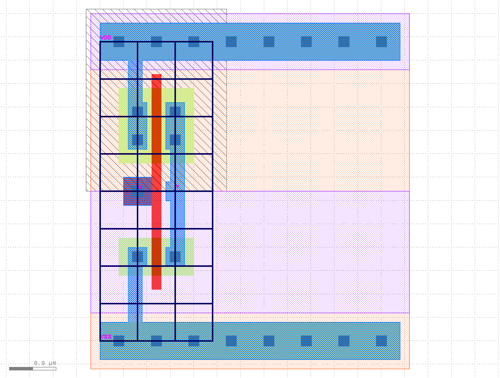

ECE 6745 Lab 2: Standard-Cell Inverter
==========================================================================

In this lab, we will implement a standard-cell inverter including the
corresponding behavioral, schematic, layout, extracted schematic,
front-end, and back-end views.

 - **Behavioral View:** Logical function of the standard cell, used for
     gate-level simulation

 - **Schematic View:** Transistor-level representation of standard cell,
     used for functional verification and layout-vs-schematic

 - **Layout View:** Layout of standard cell, used for design-rule
     checking (DRC), layout-vs-schematic (LVS), resistance/capacitance
     extraction (RCX), and fabrication

 - **Extracted Schematic View:** Transistor-level representation with
     extracted resistance and capacitances, used for layout-vs-schematic
     (LVS) and timing characterization

 - **Front-End View:** High-level information about standard cell
     including area, input capacitance, logical function, and delay
     model; used in synthesis

 - **Back-End View:** Low-level information about standard cell including
     height, width, and pin locations; used in placement and routing

We will be using the following TinyFlow standard-cell design flow.


We will by begin by writing the behavioral view in Verilog and verifying
its functionality using a Verilog test bench and Icarus Verilog. We will
then write the schematic view in SPICE and verify its functionality using
a SPICE test bench and TinyFlow-Ngspice. Instead of using Ngspice
directly as in Lab 1, we will now be using our TinyFlow-Ngspice wrapper
script which makes it much easier to run SPICE simulatoins. We will then
use the KLayout design editor to create the layout, perform a
design-rules check (DRC), perform a layout vs. schematic check (LVS), and
generate an extracted schematic. We will re-simulate the extracted
transistor-level schematic using TinyFlow-Ngspice to characterize the
propagation delay for different load capacitances in order to create a
linear delay model. Finally, we will write the front-end and back-end
views for our standard-cell inverter in two YAML files. We will also
implement three _auxillary standard cells_ (i.e., TIEHI, TIELO, FILL).

1. Logging Into `ecelinux`
--------------------------------------------------------------------------

Follow the same process as previous labs Find a free workstation Find a
free workstation and log into the workstation using your NetID and
standard NetID password. Then complete the following steps. These are the
same stes as in the first lab with one exception. We are now installing
the VS Code Surfer extension to be able to view waveforms.

 - Start VS Code
 - Install the Remote-SSH extension and the Surfer extension
 - Use View > Command Palette to execute Remote-SSH: Connect Current Window to Host...
 - Enter netid@ecelinux-XX.ece.cornell.edu where XX is an ecelinux server number
 - Use View > Explorer to open your home directory on ecelinux
 - Use View > Terminal to open a terminal on ecelinux
 - Start MS Remote Desktop


Now use the following commands to clone the repo we will be using for
today's lab.

```bash
% source setup-ece6745.sh
% source setup-gui.sh
% xclock &
% mkdir -p ${HOME}/ece6745
% cd ${HOME}/ece6745
% git clone git@github.com:cornell-ece6745/ece6745-lab2 lab2
% cd lab2
% tree
```

Your repo contains the following files for the views and simulation scripts for
each standard cell:

```
.
└── stdcells/
    ├── verilog-test/
    │   ├── AOI21X1-test.v
    │   ├── INVX1-test.v
    │   ├── NAND2X1-test.v
    │   ├── NOR2X1-test.v
    │   ├── TIEHI-test.v
    │   └── TIELO-test.v
    ├── stdcells-be.yml
    ├── stdcells-fe.yml
    ├── stdcells-rcx.yml
    ├── stdcells.gds
    ├── stdcells.sp
    └── stdcells.v
```

To make it easier to cut-and-paste commands from this handout onto the
command line, you can tell Bash to ignore the `%` character using the
following command:

```bash
% alias %=""
```

Now you can cut-and-paste a sequence of commands from this tutorial
document and Bash will not get confused by the `%` character which begins
each line.

2. Standard-Cell Inverter
--------------------------------------------------------------------------

In this part, we will be implementing the six views for the standard-cell
inverter. Remember that in addition to being DRC and LVS clean, your
inverter must also follow all of the rules which make standard cells
"standard":

  - _Standard_ transistor positions and orientation (PMOS at top, NMOS at
     bottom, vertical gates)
  - _Standard_ n-well size and location (n-well at top)
  - _Standard_ VDD and ground metal layer and locations (on metal 1,
     VDD rail 8 lambda tall at top, ground rail 8 lambda tall at
     bottom)
  - _Standard_ n-well and substrate contacts
  - _Standard_ boundry and extension of n-well, VDD, and ground rails
     beyond boundry (origin is in lower left)
  - _Standard_ metal 2+ routing grid (8 lambda track spacing)
  - _Standard_ cell height (64 lambda)
  - _Standard_ cell width (aligned to routing grid, i.e., 8 lambda,
     16 lambda, 24 lambda, etc)
  - _Standard_ routing (all routing must be on polysilicon or metal 1)
  - _Standard_ pin layer and locations (on "metal1 label" layer and **on
    routing grid**)
  - _Standard_ set of available drive strengths with equal rise and
     fall times

To get started, create a build directory which will use for all of our
simulations.

```bash
% mkdir -p ${HOME}/ece6745/lab2/stdcells/build
% cd ${HOME}/ece6745/lab2/stdcells/build
```

### 2.1. Behavioral View

We will begin by defining our inverter standard cell in a behavioral way,
in other words, what is its _*logical_ functionality? To do this, we use
Verilog by writing a module definition for our cell in `stdcells.v` and
testing the standard cell module with a Verilog testbench (provided in
`stdcells/verilog-test/INVX1-test.v`). Use VS Code to implement the
behavioral view for our INVX1 standard cell.

```bash
% cd ${HOME}/ece6745/lab2/stdcells/build
% code ../stdcells.v
```

Use standard Verilog bitwise operations to assign the output Y as a
function of the inputs. Next, we will test the inverter using the
provided test bench.

```bash
% cd ${HOME}/ece6745/lab2/stdcells/build
% iverilog -Wall -g2012 -I .. -o INVX1-test ../verilog-test/INVX1-test.v
% ./INVX1-test
```

The test bench will display a single check for A=0. Open the test bench
and add additional checks like this:

```
    //     A     Y
    check( 1'b0, 1'b1 );
    check( 1'b1, 1'b0 );
    check( 1'b0, 1'b1 );
    check( 1'b1, 1'b0 );
    check( 1'b0, 1'b1 );
    check( 1'b1, 1'b0 );
```

Now rerun the Verilog test bench to verify the functionality of your
standard cell behavioral view for all possible inputs.

```bash
% cd ${HOME}/ece6745/lab2/stdcells/build
% iverilog -Wall -g2012 -I .. -o INVX1-test ../verilog-test/INVX1-test.v
% ./INVX1-test
```

The output should look like this:

```
  1: 0 > 1
  2: 1 > 0
  3: 0 > 1
  4: 1 > 0
  5: 0 > 1
  6: 1 > 0
```

You can also view the waveforms from this simulation by using Surfer.

```bash
% cd ${HOME}/ece6745/lab2/stdcells/build
% code INVX1-test.vcd
```

You can then click the dropdown arrow next to _TOP_ in the top-left
_Scopes_ panel. Then click on A and B in the _Variables_ panel to display
the corresponding waveforms. Verify the output for your inverter matches
your expectations for its logical functionality before moving on.


### 2.2. Schematic View

Now that your Verilog behavioral/logical view for your inverter is ready
and fully tested, we also need to define its schematic view as a SPICE
file in `stdcells.sp`. This is the schematic for an INVX1 standard cell
with equal rise and fall times:

{ width=35% }

Use VS Code to implement the schematic view for our INVX1 standard cell.

```bash
% cd ${HOME}/ece6745/lab2/stdcells/build
% code ../stdcells.sp
```

Recall from from lab 1 the SPICE syntax is as follows:

 - PMOS: `M_P <D> <G> <S> <B> PMOS L=<length>U W=<width>U`
 - NMOS: `M_N <D> <G> <S> <B> NMOS L=<length>U W=<width>U`

**Remember that you are now implementing a 2:1 inverter for equal rise
and fall times instead of a 1:1 inverter. Make sure you size the width of
the transistors correctly!**

Once you have a completed the schematic view, you will now simulate it
with TinyFlow-Ngspice. The following shows the syntax of how to use the
new `tinyflow-ngspice` wrapper script.

```bash
tinyflow-ngspice --spice=<SPICE_FILE> --cell=<CELLNAME> --cload=<CLOAD> \
  --inputs=<INPUTS_SPEC>
```

Let's break down each input (all four are required):

 - `--spice=<SPICE_FILE>`: replace `<SPICE_FILE>` with the path to
   `stdcells.sp` where you have defined your SPICE schematic (e.g.,
   `../stdcells.sp`)

 - `--cell=<CELLNAME>`: replace `<CELLNAME>` with the name of your cell
   to test (e.g., `INVX1`)

 - `--cload=<CLOAD>`: replace `<CLOAD>` with the capacitance to put on
   the output pin of your cell, you can use regular integers followed by
   a unit suffix (e.g., `10f` for 10 femtofarads)

 - `--inputs=<INPUTS_SPEC>`: replace `<INPUTS_SPEC>` with a string
   surrounded by quotes of the following form:
   `<PIN1>:<VAL0>-<VAL1>...<VALN>;<PIN2>:<VAL0>-<VAL1>...<VALN>` where
   `<PINN>` specifies one of the input pins for your cell (e.g. A, B,
   etc.), and `<VALN>` specifies a 0 or 1 to assert on that input pin.
   Each of these values are separated by a dash (-), such that each input
   value will be set for one timestep (2ns) before the next value is set.
   All input pins and their corresponding values are separated by a
   semicolon (;), and input pin names are separated from their values
   list by a colon (:). All input pins as specified by your standard cell
   must be present, and they must all have the same number of
   transitions.

Use TinyFlow-Ngspice to simulate the INVX1 standard cell with a 50fF load
and an input going from 0 to 1 to 0:

```bash
% cd ${HOME}/ece6745/lab2/stdcells/build
% tinyflow-ngspice --spice=../stdcells.sp --cell=INVX1 --cload=50f \
    --inputs="A:0-1-0"
```

The command will take care of all of the manual steps you had to do in
lab 1 for you:

 - converting your Spice schematic to a Sky130-compatible version,
 - setting up the Spice testbench,
 - running the testbench,
 - generating a waveform plot, and
 - analyzing the propagation delays.

When the command has completed, you will see an output to the console
specifying the transitions of both the input and output pins of your
standard cell throughout the simulation. It will also print rising and
falling delays if captured from each input pin to the output; this will
be discussed later when characterizing the cell. Additionally, your build
directory will contain a new subdirectory `ngspice-results/` with more
subdirectories within it named with a concatenation of the inputs you
specified. Each of these subdirectories will contain the following:

 - `-tb.sp`: the Spice testbench used to simulate your schematic
 - `.csv`: CSV data generated by Ngspice for each pin of your standard cell
 - `.png`: an image plotting the voltage of each pin of your standard cell over
   time
 - `.txt`: a text file containing the same output as what was printed to the
   console

Look at the results and verify functionality of the schematic view for
your INVX1 standard cell. Look at the text output and the waveform plot.

```bash
% cd ${HOME}/ece6745/lab2/stdcells/build
% code ngspice-results/INVX1-50f-stdcells-A_0_1_0/INVX1-50f-stdcells-A_0_1_0.png
```

### 2.3. Layout View

We can now move on to drawing the layout view for our INVX1 standard
 cell. Use Klayout to open the `stdcells.gds` file:

```bash
% cd ${HOME}/ece6745/lab2/stdcells/build
% klayout -e ../stdcells.gds
```

Make sure the inverter is your top cell view by clicking on INVX1 in the
Cells panel and selecting "Show As New Top":


You should see a template for a standard-cell layout as shown below:


Because we want all our standard cells to follow out *standard*
parameters as discussed in lecture, we have provided you with this
template for every standard cell to get started. Notice how the height of
the cell (from center of contact on bottom VSS rail to center of contact
on top VDD rail) is 64 lambda (8 vertical routing tracks, each track is 8
lambda tall). The width of this standard cell is also 64 lambda (8
horizontal tracks, each of 8 lambda wide). You will also see some
familiar layers here, particularly the nwell under the top half of the
standard cell. You will also notice that we have already inserted pselect
and nselect regions accordingly.

To implement the inverter, you will follow the reference layout below
(notice how the pins must be on the intersecting black track lines in the
layout):


Be sure to reference the _TinyFlow 180nm Design-Rule Manual_ (DRM) when
drawing your layout:

 - <https://cornell-ece6745.github.io/ece6745-mkdocs/ece6745-design-rule-manual>

Notice how this inverter only needs to be 24 lambda wide (3 horizontal
tracks), but the standard cell we have given you is 64 lambda wide (8
horizontal tracks). When drawing your layout, implement the above
inverter all the way on the left side of your provided template. You will
then need to "trim" the template from the right side by performing the
following actions to achieve a minimum-width.

Use the _Erase_ tool to erase extra htrack and vtrack shapes, then use
the _Erase_ or _Partial_ tool to move the right-hand edge of the
prboundary so that it is aligned with the new right most track.


Use the _Erase_ or _Partial_ tool to move the right-hand edge of the
nwell so that it extends beyond the prboundary by 3 lambda (symmetrical
with the left edge of the cell)



Use the _Erase_ or _Partial_ tool to move the nselect and pselect boxes
so that they extend beyond the prboundary by 2 lambda (symmetrical with
the left edge of the cell).


Finally, use the _Erase_ or _Partial_ tool to adjust the well-tap
structures (active + metal1 + contacts) at the top and bottom of the cell
so that it is aligned with the prboundary.


As in lab 1, be sure to run DRC and LVS to ensure your design adheres to
all design rules and matches your SPICE schematic. Use the 2.5D tool to
visualize your standard cell in 3D!

### 2.4. Extracted Schematic View

Now that we have a DRC and LVS-clean layout, we can perform functional
verification as well as characterization on our extracted schematic view.

LVS dumps out your extracted schematic view in SPICE format for you
automatically. You should see the file in `stdcells/invx1-rcx.sp`. Copy
the contents of this file and paste it into `stdcells/stdcells-rcx.sp`.
Delete `stdcells/invx1-rcx.sp` since it is no longer needed.

We will now run functional simulation on the extracted schematic view.
Notice the only difference for this command from functionally verifying
the schematic view is the different Spice file.

```bash
% cd ${HOME}/ece6745/lab2/stdcells/build
% tinyflow-ngspice --spice=../stdcells-rcx.sp --cell=INVX1 --cload=50f \
    --inputs="A:0-1-0"
```

Compare the output waveforms from the console/txt file and png file to
your expectations for what the functionality of the inverter should be.
Only move on once your expectations are met (go back to fix your layout
if the waveforms do not look correct).

We will now perform _timing characterization_ on the inverter. This means
we are going to run multiple SPICE simulations to create a _linear-delay
model_ which we can then use in the standard cell front-end view. Our
linear-delay model should represent the worst case propagation delay
through the inverter (either rising input to falling output or falling
output to rising input) as a function of its load capacitance (cload). To
do this, you will choose three values of `cload` between 0f and 100f to
plug into the above command, and you will then observe the values in the
`Measured delays:` section of the TinyFlow-Ngspice output to find the
worst-case rising or falling delay for that value of `cload`. `t_pdf`
represents the falling propagation delay, while `t_pdr` represents the
rising propagation delay. Choose the worst of the two for the delay for
this value of `cload`. Ideally, these values should be close as we have
designed the inverter to have balanced rise and fall time via its 2:1
sizing. Note down the worst case delay **and convert the value to ps**
for each `cload` **convert this value to fF**.

Once you have obtained a worst case delay for at least three `cload*
values, and you have converted the delay to ps and the load value to fF,
generate a linear regression of the data with delay on the y-axis and
load value on the x-axis using your favorite data analyzer (Google
Sheets, TI calculator, etc.). Note down the y-intercept and slope. As
discussed in lecture, the y-intercept represents the _parasitic delay_,
or the delay when the cell is unloaded, while the slope represents the
_load-delay factor_, a measure of how much the delay increases for
increasing load capacitance. These values are necessary for static-timing
analysis which will be performed in later labs. Only continue once you
have obtained both of these values for your inverter.

!!! question "Critical Thinking Questions"

    Go back and compare the rising and falling propagation delays of your
    pre-extracted SPICE schematic to your extracted SPICE schematic. Are
    the delays larger or smaller for the extracted schematic compared to
    the pre-extracted schematic? Why is this the case?

### 2.5. Front-End View

We are now ready to create a YAML file for the front-end ASIC flow that
we will be working on in later labs. This YAML file will use much of the
information we have obtained in previous steps, and combine it together
for the front-end tools to use. This view primarily contains timing,
logical, and basic area information for each cell. Use VS Code to open
the `stdcells-fe.yml` file.

```bash
% cd ${HOME}/ece6745/lab2/stdcells/build
% code ../stdcells-fe.yml
```

We give you the following template for the front-end view for your INVX1
standard cell.

```
 - name: INVX1
   area_cost: 0 # lambda^2

   pins:

     - name: A
       type: input
       cgate: 0 # fF

     - name: Y
       type: output
       function: # tree of generic gates

   parasitic_delay:   0 # ps
   load_delay_factor: 0 # ps/fF

   patterns:
     - # list of equivalent trees of generic NAND and INV gates
```

Fill in the `area_cost` value as the area of the standard cell in
lambda-squared, starting from the bottom-left corner of the intersecting
black lines indicating the horizontal and vertical tracks, and ending at
the top-right corner at the intersection of the black lines for the
horizontal and vertical tracks (see the red circles in the below image):


Each cell also has pin information under the "pin" key. The pin
information itself will be a list of data for each input and output pin,
where each pin has a name and type (input or output).

For input pins, you will need to specify a value for the gate capacitance
(`cgate`) in fF associated with that pin. The calculation for gate
capacitance is as follows:

```
Cgate = 1.60 * (total gate width in lambda) * 0.09
```

The value of 1.60 fF/um is a reasonable value for a generic 180nm
process. You need to convert it to just units of fF by multiplying by the
total gate width in um associated with the given input pin. You will need
to find this total gate width in units of lambda by looking at your
layout and comparing against your SPICE schematic. The multiplication by
0.09 is to convert lambda to microns.

For output pins, you will need to specify the function which determines
the logical functionality of this pin as a function of the input pins.
You can specify it using a tree of _generic gates_. Here is a list of the
valid generic gates:

 - `BUF`, `NOT`, `INV`
 - `AND2`, `OR2`, `XOR2`
 - `NAND2`, `NOR2`, `XNOR2`

So for example, here is an example tree for a more complicated
three-input standard cell: `NAND2( INV(A), OR2(INV(B),C) )`.

You will need to fill in your values for `load_delay_factor` and
`parasitic_delay` as calculated in the previous step. **Note that
`load_delay_factor` MUST be in units of ps/fF, and `parasitic_delay` MUST
be in units of ps. Go back and double check you performed the conversions
if necessary.**

Finally, you will need to specify a list of patterns **using only INV()
and NAND2() logical gates** that matches the functionality of your gate
for all of its inputs. The reason for doing this will become clear as we
discuss synthesis algorithms in lecture, as is needed when mapping your
high-level Verilog code to these standard-cells.

### 2.6. Back-End View

We are now ready to create a YAML file for the back-end ASIC flow that we
will be working on in later labs. Again, this file contains much of the
information that we have previously found, and bundles it for use by the
ASIC flow. This file primarily contains physical data for each cell
including width, height, and pin locations. Use VS Code to open
the `stdcells-fe.yml` file.

```bash
% cd ${HOME}/ece6745/lab2/stdcells/build
% code ../stdcells-be.yml
```

You will first see a dictionary whose toplevel key is "layers". **DO NOT
MODIFY ANYTHING IN THIS DICTIONARY!** It contains all the relevant
information needed by the flow tools to properly route your design. Feel
free to look through it to understand what information it contains.

After the layer information, you will see a dictionary whose toplevel key
is "sites". **DO NOT MODIFY ANYTHING IN THIS DICTIONARY!** It contains
information for the standard-cell placement on a grid of _sites_. One
site is defined as a 1-track wide "slice" of a standard-cell row. For
instance, the FILL standard cell you will create only occupies one site,
while the INVX1 standard cell occupies three sites. This unit
standardizes the available widths for standard cells so that placement
algorithms have an easier time placing the cells.

Finally, we have the "cells" dictionary, where you will add in the
physical information for each standard cell. Each cell is a list item as
in the front-end with its name.

We give you the following template for the back-end view for your INVX1
standard cell.

```
  - name: INVX1
    size:
      width:  0 # lambda
      height: 0 # lambda
    pins:
      - name: A
        loc:  (0,0) # (x,y) lambda
      - name: Y
        loc:  (0,0) # (x,y) lambda
```

Each cell has a "size" sub-dictionary, with keys for width and height.
Fill these values in using the same lower-left and upper-right track
intersection points used for calculating area in the front-end YAML.
These width and height values should therefore be in units of lambda.
Next is the pin list, similar again to the front-end view. In this file,
each pin once again has a name, but also an X and Y location. Look at
your layout, and get the X and Y location of the pin marker for each pin
relative to the lower-left track intersection. These values should once
again be in units of lambda.

3. Standard-Cell TIEHI
--------------------------------------------------------------------------

To implement the TIEHI cell, you will follow the schematic and layout
reference below (notice how the pins must be on the intersecting black
track lines in the layout):

{ width=35% }


Create the required standard cell views:

 - Behavioral View (this will be very simple, run Verilog simulation)
 - Schematic View (run TinyFlow-Ngspice simulation)
 - Layout View
 - Extracted Schematic View (run TinyFlow-Ngspice simulation for
     functional verification)
 - Front-end view
 - Back-end view

Note that your schematic view might need a temporary internal wire/net.
To create a temporary internal wire/net simply use a new name like
`net1`; SPICE will assume this implicitly refers to a new temporary
internal wire/net.

4. Standard-Cell TIELO
--------------------------------------------------------------------------

To implement the TIELO cell, you will follow the schematic and layout
reference below (notice how the pins must be on the intersecting black
track lines in the layout):

{ width=35% }


Create the required standard cell views:

 - Behavioral View (this will be very simple, run Verilog simulation)
 - Schematic View (run TinyFlow-Ngspice simulation)
 - Layout View
 - Extracted Schematic View (run TinyFlow-Ngspice simulation for
     functional verification)
 - Front-end view
 - Back-end view

Note that your schematic view might need a temporary internal wire/net.
To create a temporary internal wire/net simply use a new name like
`net1`; SPICE will assume this implicitly refers to a new temporary
internal wire/net.

5. Standard-Cell FILL
--------------------------------------------------------------------------

To implement the FILL cell, you will follow the layout reference below
(notice how there are no pins other than VDD and VSS which are on the
template already):


Create the required standard cell views:

 - Behavioral View (this will be very simple, no simulation)
 - _No Schematic View_
 - Layout View
 - _No Extracted Schematic View_
 - Front-end view (only need area cost)
 - Back-end view (only need width and heigh)

6. Batch-DRC and LVS
--------------------------------------------------------------------------

Performing DRC and LVS manually on each and every cell is tedious. To
help you ensure all your cells are passing DRC/LVS, we have created batch
scripts that will perform DRC and LVS on every cell for you. To run them,
run the following commands after completing your standard cells:

```bash
% cd ${HOME}/ece6745/lab2/stdcells/build
% tinyflow-batch-drc
% tinyflow-batch-lvs
```

These two scripts will alert you if there are any DRC/LVS errors in any
of your cells, all without needing to open the KLayout GUI. Output files
from these scripts will be generated to `drc_results`, `lvs_results`, and
`rcx-results` subdirectories within the `build` directory.

