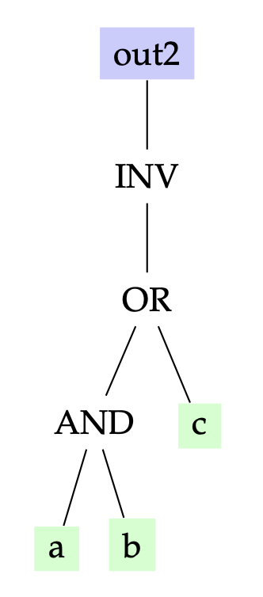

ECE 6745 Lab 3: TinyFlow Front End
==========================================================================

In this lab, we will explore the TinyFlow front-end which takes as input
a Verilog RTL design and produces a gate-level netlist of standard cells.
The complete TinyFlow standard-cell and ASIC design flow is shown below
with the front end highlighted in red.


The front end includes two-state RTL simulation, four-state RTL
simulation, synthesis, and fast-functional gate-level simulation. In
lecture, we discussed an approach to synthesis based on technology
mapping with dynamic programming to optimize the area of the final
gate-level netlist. In this lab, we will be instead implementing a very
simple unoptimized synthesis tool. The three key algorithms in the
unoptimized synthesis tool are shown below.

{ width=50% }

We will be begin by exploring the key data structure used in the
synthesis tool: a forest of trees where the nodes are generic gates,
standard cells, or signals. We will then explore the verilog reader,
implement an unoptimized technology mapping algorithm, use the provided
gate-level netlist writer to generate the final Verilog gate-level
netlist, and then put these algorithms together into a synthesis tool.
Finally, we will go through the entire end-to-end front end flow for a
full adder.

1. Logging Into `ecelinux`
--------------------------------------------------------------------------

Follow the same process as previous labs. Find a free workstation and log
into the workstation using your NetID and standard NetID password. Then
complete the following steps. These are the same steps as in the previous
lab with one exception. We are now installing the Verilog extension both
on the workstation and on the remote server.

 - Start VS Code
 - Install the Remote-SSH extension, Surfer, and Verilog extensions
 - Use View > Command Palette to execute Remote-SSH: Connect Current Window to Host...
 - Enter netid@ecelinux-XX.ece.cornell.edu where XX is an ecelinux server number
 - Find the Verilog extension again and install on the remote server
 - Use View > Explorer to open your home directory on ecelinux
 - Use View > Terminal to open a terminal on ecelinux
 - Start MS Remote Desktop


Now use the following commands to clone the repo we will be using for
today's lab.

```bash
% source setup-ece6745.sh
% source setup-gui.sh
% mkdir -p ${HOME}/ece6745
% cd ${HOME}/ece6745
% git clone git@github.com:cornell-ece6745/ece6745-lab3 lab3
% cd lab3
% tree
```

Your repo contains the following files.

```
.
├── README.md
├── asic
│   └── build-fa
│       ├── 01-verilator-rtlsim
│       ├── 02-iverilog-rtlsim
│       ├── 03-tinyflow-synth
│       │   └── run.py
│       └── 04-tinyflow-ffglsim
├── rtl
│   ├── FullAdder.v
│   └── test
│       └── FullAdder-test.v
├── stdcells
└── tinyflow
    ├── synth
    │   ├── StdCellFrontEndView.py
    │   ├── TinyFrontEndDB.py
    │   ├── TinyFrontEndGUI.py
    │   ├── print.py
    │   ├── substitute.py
    │   ├── techmap_unopt.py
    │   ├── tinyv.lark
    │   └── verilog_parser.py
    └── tinyflow-synth
```

Our front-end flow use the behavioral and front-end views you developed
in Project 1, Part A. Copy these views into the lab3 directory.

```bash
% cd ${HOME}/ece6745/lab3/stdcells
% cp project1-groupXX/stdcells/stdcells.v .
% cp project1-groupXX/stdcells/stdcells-fe.yml .
```

where `XX` is your group number.

To make it easier to cut-and-paste commands from this handout onto the
command line, you can tell Bash to ignore the `%` character using the
following command:

```bash
% alias %=""
```

Now you can cut-and-paste a sequence of commands from this tutorial
document and Bash will not get confused by the `%` character which begins
each line.

2. Data Structure: Forest of Trees
--------------------------------------------------------------------------

As discussed in lecture, the synthesis data structure used in our basic
front-end is a forest of trees where nodes can be generic gates, standard
cells, or signals. The synthesis algorithms create, transform, and
analyze this forest of trees. The forest of trees is stored in a
front-end database which includes methods for reading files into the
databse and writing files from the database. We provide students the
database, and students are responsible for writing the algorithms.

To get started, create a build directory and start the TinyFlow synthesis
REPL.

```bash
% mkdir -p ${HOME}/ece6745/lab3/tinyflow/build
% cd ${HOME}/ece6745/lab3/tinyflow/build
% ../tinyflow-synth
```

You should see the following:

```
TinyFlow Synth REPL v0.1

Type 'help()' for available commands.
Type 'clear()' to clear the screen.
Type 'exit()' or Ctrl-D to quit.

tinyflow-synth>
```

`tinyflow-synth>` is the TinyFlow synthesis REPL prompt which will enable
you to intereactively experiment with different synthesis data structures
and algorithms. The TinyFlow synthesis REPL is basically the Python REPL
with a few extra features so most standard Python command should work as
well. You can use `help()` to see the available commands.

### 2.1. Trees

The nodes in a tree can either be generic gates, standard cells, or
signals. The base class for all nodes is `Node`.

 - Generic-gate nodes represent generic logic operations. There is no area
   nor delay associated with a generic logic operation. Generic-gate
   nodes are named without an X1 suffix (e.g., BUF, NOT, INV, AND2, OR2,
   XOR, NAND2, NOR2, XNOR2).

 - Standard-cell nodes represent standard cells from our library. The
   front-end view provides the list of valid standard-cell nodes and the
   associated area and delay. Standard-cell nodes are named with an X1
   suffix (e.g., INVX1, NAND2X1, NOR2X1, AOI21X1).

 - Signal nodes represent input ports and wires. Every leaf of all every
   tree must be a signal node.

There are also special `Wildcard` nodes that we will explain later. Let's
start by creating three signals and a simple tree with a total of five
nodes: two generic-gate nodes and three signal nodes.

```python
tinyflow-synth> a = Signal("a")
tinyflow-synth> b = Signal("b")
tinyflow-synth> c = Signal("c")
tinyflow-synth> tree1 = AND2( OR2(a, b), c )
tinyflow-synth> print(tree1)
```

Note that the TinyFlow REPL will automatically ignore the leading
`tinyflow-synth> ` so you should be able to copy-and-paste the above
commands directly into the REPL.

Every node has a `type` field and a list of its children. Let's print the
type of every node in the tree.

```python
tinyflow-synth> print(tree1.type)
tinyflow-synth> print(tree1.children[0].type)
tinyflow-synth> print(tree1.children[0].children[0].type)
tinyflow-synth> print(tree1.children[0].children[1].type)
tinyflow-synth> print(tree1.children[1].type)
```

Each node also has the following helper methods

 - `is_generic_gate()`
 - `is_standard_cell()`
 - `is_signal()`
 - `is_wildcard()`

Go ahead and check to see which of the five nodes are generic-gate nodes.

```python
tinyflow-synth> tree1.is_generic_gate()
tinyflow-synth> tree1.children[0].is_generic_gate()
tinyflow-synth> tree1.children[0].children[0].is_generic_gate()
tinyflow-synth> tree1.children[0].children[1].is_generic_gate()
tinyflow-synth> tree1.children[1].is_generic_gate()
```

The `==`/`!=` operators compare nodes by type. You can also evaluate a
tree using the `eval` method. So the following will evaluate our tree
when the input ports are set to the given values.

```
tinyflow-synth> print(tree1.eval(a=0, b=0, c=0))
```

Go ahead and evaluate all input combinations using `tree.eval()` and
derive the truth table for `AND2(OR2(a, b), c)`. Does it match your
expectations?

Use the TinyFlow REPL to create the following tree.

{ width=25% }

Evaluate all possible inputs to confirm that it implements the following
truth table.

| a | b | c | y |
|---|---|---|---|
| 0 | 0 | 0 | 1 |
| 0 | 0 | 1 | 0 |
| 0 | 1 | 0 | 1 |
| 0 | 1 | 1 | 0 |
| 1 | 0 | 0 | 1 |
| 1 | 0 | 1 | 0 |
| 1 | 1 | 0 | 0 |
| 1 | 1 | 1 | 0 |

### 2.2. Front-End Database

The front-end database stores a forest of trees. To create a database
using `TinyFrontEndDB`, we first need to have our front-end view ready.
`StdCellFrontEndView` loads the front-end view YAML file. It provides
access to cell information (area, timing parameters), patterns for
technology mapping, and standard cell gate classes (INVX1, NAND2X1,
etc.).

Let's create the view and database:

```python
tinyflow-synth> view = StdCellFrontEndView.parse_lib("../../stdcells/stdcells-fe.yml")
tinyflow-synth> db = TinyFrontEndDB(view)
```

The database supports visualizing its contents through a GUI. Enable the
GUI with:

```python
tinyflow-synth> db.enable_gui()
```
The GUI window will open.


Now add inputs, outputs, and set a tree:

```python
tinyflow-synth> a, b, c = Signal("a"), Signal("b"), Signal("c")
tinyflow-synth> db.add_inports(["a", "b", "c"])
tinyflow-synth> db.add_outports(["out"])
tinyflow-synth> db.set_tree("out", AND2(OR2(a, b), c))
tinyflow-synth> db.get_tree("out")
```

Watch the GUI update to show your tree when you call `db.set_tree(...)`.


In the visualization above, you will only see primary inputs, primary
outputs, and generic gates. The GUI uses the following visual
conventions:

 - **Green ovals:** Primary inputs
 - **Orange ovals:** Wire signals
 - **Blue ovals:** Primary outputs
 - **Grey rectangles:** Generic gates
 - **Red rectangles:** Standard cell gates


Add the following tree to the front-end database and verify you can see
both the old and new tree in the GUI.

{ width=25% }

Once you are done with the GUI, you can exit the REPL by calling `exit()`
or pressing Ctrl-D.

### 2.2. Printing Trees and Forests

Let's write some functions to print trees and forests. Open the
`print.py` file in VS Code.

```bash
% cd ${HOME}/ece6745/lab3/tinyflow/build
% code ../synth/print.py
```

Find the `print_tree` and `print_tree_h` functions.

```python
def print_tree_h( node, indent ):
  ...

def print_tree( db, name ):
  ...
```

The `print_tree` function takes as input the front-end database and the
name of the tree to print (i.e., the name of the output port at the root
of the tree) and should print each node in the tree using indentation to
indicate the depth of the node. So printing the `AND2(OR2(a, b), c))`
tree should output

```
AND2
  OR2
    a
    b
  c
```

The `print_tree` function should get the correct tree from the database
and then call the recursive `print_tree_h` helper function. The recursive
helper function should use a preorder tree traversal to print the tree:

 - _Step 1:_ Print leading spaces based on `indent`
 - _Step 2:_ Print the type for a generic-gate node or the name for a signal node
 - _Step 3:_ Recusively call helper function for all children with `indent+1`

Once you have finished writing your `print_tree` function try it out
using the TinyFlow REPL.

```python
tinyflow-synth> view = StdCellFrontEndView.parse_lib("../../stdcells/stdcells-fe.yml")
tinyflow-synth> db = TinyFrontEndDB(view)
tinyflow-synth> a, b, c = Signal("a"), Signal("b"), Signal("c")
tinyflow-synth> db.add_inports(["a", "b", "c"])
tinyflow-synth> db.add_outports(["out"])
tinyflow-synth> db.set_tree("out", AND2(OR2(a, b), c))
tinyflow-synth> print_tree( db, "out" )
```

Now find the `print_forest` function.

```python
def print_forest( db ):
  ...
```

This function should iterate across all trees in the forest and print
each one using `print_tree`. Trees are stored as a dictionary in the
database. The dictionary maps the name of the tree (i.e, the name of the
output port or wire) to the actual tree. So you can iterate over the
trees in a front-end database like this.

```python
  for name,tree in db.trees.items():
    ... do something with the name and/or tree ...
```

Once you have finished writing your `print_forest` function try it out
using the TinyFlow REPL.

```python
tinyflow-synth> view = StdCellFrontEndView.parse_lib("../../stdcells/stdcells-fe.yml")
tinyflow-synth> db = TinyFrontEndDB(view)

tinyflow-synth> a, b, c = Signal("a"), Signal("b"), Signal("c")
tinyflow-synth> db.add_inports(["a", "b", "c"])
tinyflow-synth> db.add_outports(["out1"])
tinyflow-synth> db.set_tree("out1", AND2(OR2(a, b), c))

tinyflow-synth> d, e, f = Signal("d"), Signal("e"), Signal("f")
tinyflow-synth> db.add_inports(["d", "e", "f"])
tinyflow-synth> db.add_outports(["out2"])
tinyflow-synth> db.set_tree("out2", INV(OR2(AND2(a, b), c)))

tinyflow-synth> print_forest(db)
```

3. Algorithm: Verilog Reader
--------------------------------------------------------------------------

The first step of our synthesis flow is reading the Verilog RTL design
to create the forest of trees data structure. This has three steps:
lexing, parsing, and foresting.

In this part, we will be discussing the limitations of verilog we can
write for the TinyFlow. This limitation is mainly pedagogical to simplify
the flow as well as limitations due to our parser. First let's look at
the full adder we will be using as the motivation example in his lab.

```bash
% cd ${HOME}/ece6745/lab3/tinyflow/build
% code ../../rtl/FullAdder.v
```

The full adder adheres to the following rules.

1. Only combinational Verilog
2. Only single-bit signals of type `wire`
4. Only single-bit bitwise operators (`&`, `|`, `^`, `~`)
5. No hierarchy

Take a look at the Lark grammar which captures these rules.

```bash
% cd ${HOME}/ece6745/lab3/tinyflow/build
% code ../synth/tinyv-lab3.lark
```

The grammer is shown below.

```
start: module

//------------------------------------------------------------------------
// Module
//------------------------------------------------------------------------

module: "module" MNAME port_decl_list? ";" stmt* "endmodule"

port_decl_list: "(" port_decl ("," port_decl)* ")"
port_decl: DIR ("wire" | "logic")? SIGNAL
DIR: "input" | "output"

stmt: decl_wire | assignment

//------------------------------------------------------------------------
// Statements
//------------------------------------------------------------------------

decl_wire:  "wire" SIGNAL ("," SIGNAL)* ";"
assignment: "assign" SIGNAL "=" expr ";"

//------------------------------------------------------------------------
// Expressions
//------------------------------------------------------------------------

?expr:
  | expr "|" expr -> or
  | expr "^" expr -> xor
  | expr "&" expr -> and
  | expr "+" expr -> sum
  | "~" expr      -> not
  | "(" expr ")"
  | SIGNAL

//------------------------------------------------------------------------
// Terminals
//------------------------------------------------------------------------

SIGNAL:  /[a-zA-Z_][a-zA-Z0-9_]*/
MNAME:   /[a-zA-Z_][a-zA-Z0-9_]*/
```

The front-end database includes a `parse_verilog` method which will
perform lexing and parsing for a Verilog RTL design before displaying the
AST.

```python
tinyflow-synth> view = StdCellFrontEndView.parse_lib("../../stdcells/stdcells-fe.yml")
tinyflow-synth> db = TinyFrontEndDB(view)
tinyflow-synth> db.parse_verilog("../../rtl/FullAdder.v")
```

Try to see how the AST corresponds to the Verilog RTL design. Now let's
use the `read_verilog` method to do all three steps: lexing, parsing, and
foresting. Watch the GUI update to show the parsed trees.

```python
tinyflow-synth> db.enable_gui()
tinyflow-synth> db.read_verilog("../../rtl/FullAdder.v")
```

4. Algorithm: Unoptimized Technology Mapping
--------------------------------------------------------------------------

Our unoptimized technology mapping algorithm will be very simple. It will
replace every generic gate with a logically equivalent subtree of
standard cells. We will not be trying to optimize area. We are simply
trying to develop the most basic possible technology mapping algorithm.

We will develop a subtree substitution framework which we can then use to
implement the unoptimized technology mapping algorithm. You can also use
this subtree substitution framework to implement canoncalization and
optimized technology mapping in the project. The subtree substitution
framework will enable us to create a substitute like this:

```python
Substitute( find=AND2(_0, _1), replace=INV(NAND2(_0, _1) ))
```

Once we have created a substitute we can _apply_ to a tree. So applying
the above subsittute would find every AND2 generig cate and replace it
with a new INV/NAND2 subtree. Substitutes make use of wildcard nodes
which are denoted using `_0`, `_1`, `_2`, and `_3`. A wildcard node will
matches any subtree.

So let's say we start with the tree on the left and we want to apply the
above substitute to create the tree on the right.

{ width=60% }

Our goal is to be able to do this as follows.

```python
tinyflow-synth> a, b, c = Signal("a"), Signal("b"), Signal("c")
tinyflow-synth> sub = Substitute(find=AND2(_0, _1), replace=INV(NAND2(_0, _1)))
tinyflow-synth> result = sub.apply(AND2(OR2(a, b), c))
tinyflow-synth> print(result)
```

This is pretty complicated to implement, so we will take an incremental
approach. We will start by implementing an exact match algorithm before
implementing a partial match algorithm. Then we will work on capturing
the wildcard subtrees from a partial match. We will implement the actual
replacement before finalyl creating a substitution. Then we can use this
to implement the unoptimized technology mapping.

### 4.1. Exactly Matching Trees

Our first step is to implement an exact match algorithm. Our earlier work
on printing trees only traversed a single tree. Here we will need to
recurse two trees in parallel to see if they match exactly.

Open the `substitute.py` file in VS Code.

```bash
% cd ${HOME}/ece6745/lab3/tinyflow/build
% code ../synth/substitute.py
```

Find the `match_exact` function in `substitute.py`.

```python
def match_exact( node, p_node ):
  ...
```

This recursive function takes as input two nodes in two trees and
compares the corresponding subtrees starting from these two nodes using
the following steps.

 - _Base Case:_ If the nodes are not equal return false

 - _Recursive Case:_ Recursively call function for all children, keep track
   if any children return false and if so then this function should
   return false, otherwise return true

You can use the Python `zip` function to easily iterate over the children
of both nodes together like this:

```
  for p_child, n_child in zip( p_node.children, node.children ):
    ... do something with p_child and n_child ...
```

Once you have implemented your exact match algorithm, try it out using
the TinyFlow REPL.

```python
tinyflow-synth> a, b, c = Signal("a"), Signal("b"), Signal("c")
tinyflow-synth> match_exact( AND2(OR2(a,b), c), AND2(OR2(a,b), c) )
tinyflow-synth> match_exact( AND2(OR2(a,b), c), OR2(AND2(a,b), c) )
tinyflow-synth> match_exact( AND2(OR2(a,b), c), AND2(a,b) )
```

### 4.2. Partially Matching Trees

Now that we know how to recursively traverse two trees in parallel, let's
implement a partial match algorithm. Here is where we will start to take
advantage of wildcards. A wildcard matches any subtree. The REPL provides
predefined wildcards `_0`, `_1`, `_2`, `_3` for convenience. For example,
if we have the tree below on the left, we want to be able to determine
that the pattern on the right matches since there is an AND2 gate at the
root of the tree on the left.

{ width=50% }

{ width=50% }

{ width=50% }

Find the `match` function in `substitute.py`.

```python
def match( node, p_node ):
  ...
```

This recursive function takes as input two nodes in two trees. The
`p_node` tree is the _pattern_ tree (i.e., the tree with wildcards) while
the `node` tree is the tree want want to search over. The function
compares the corresponding subtrees starting from these two nodes using
the following steps.

 - _Base Case 1_: If the current `p_node` is a wildcard (i.e.,
   `is_wildcard()` returns true) then it always matches the corresponding
   `node` so return true.

 - _Base Case 2_: If the current `p_node` does not equal the current
   `node` (i.e., use `!=` which compares the types of the two nodes) then
   there is no match so return false.

 - _Recursive Case_: Recursively call function for all children, keep
   track if any children return false and if so then this function should
   return false, otherwise return true

Test your implementation in the REPL:

```python
tinyflow-synth> a, b, c = Signal("a"), Signal("b"), Signal("c")
tinyflow-synth> match( AND2(OR2(a,b), c), AND2(OR2(_0,_1), _2) )
tinyflow-synth> match( AND2(OR2(a,b), c), OR2(AND2(_0,_1), _2) )
tinyflow-synth> match( AND2(OR2(a,b), c), AND2(_0,_1) )
tinyflow-synth> match( INV(OR2(AND2(a,b), c)), INV(OR2(_0,_1)) )
tinyflow-synth> match( INV(OR2(AND2(a,b), c)), INV(_0) )
```

Notice how the final three matches should return true since the pattern
partially matches the given tree.

### 4.3. Capturing Wildcard Subtrees

Now that we can recursively compare two trees, we want to also _capture_
whatever the wildcards in the pattern tree match to. So in the following
example, wildcard `_0` captures the `OR(a,b)` subtree and wildcard `_1`
captures the `c` signal node.

{ width=50% }

The captures should be a dictionary mapping the wildcard name to the
subtree it matched. For example, matching `AND2(OR2(a, b), c)` against
pattern `AND2(_0, _1)` produces `{"_0": OR2(a, b), "_1": c}`.

Find the `capture` function in `substitute.py`.

```python
def capture( node, p_node ):
  ...
```

This recursive function takes as input two nodes in two trees. The
`p_node` tree is the _pattern_ tree (i.e., the tree with wildcards) while
the `node` tree is the tree want want to search over. The `capture`
algorithm can assume we have already used the `match` algorithm to
confirm there is indeed a partial match. The function compares the
corresponding subtrees starting from these two nodes using the following
steps.

 - Base Case: If the current `p_node` is a wildcard (i.e.,
   `is_wildcard()` returns true) then we want to capture the
   corresponding subtree starting at `node`. Return a new dictionary that
   maps the wild card name (i.e., `p_node.name`) to `node`.

 - Recursive Case: Recursively call function for all children, keep a
   running dictionary and merge in the dictionary returned from each
   recursive function call. You can use the `|=` operator to merge a new
   dictionary into an existing dictionary.

Test your implementation in the REPL:

```python
tinyflow-synth> a, b, c = Signal("a"), Signal("b"), Signal("c")
tinyflow-synth> capture( AND2(OR2(a,b), c), AND2(_0,_1) )
tinyflow-synth> capture( INV(OR2(AND2(a,b), c)), INV(OR2(_0,_1)) )
tinyflow-synth> capture( INV(OR2(AND2(a,b), c)), INV(_0) )
```

### 4.4. Replacing Trees

Now that we can match and capture subtrees, we want to build a new tree
using the captured subtrees. Find the `replace` function in
`substitute.py`.

```python
def replace( t_node, captures ):
  ...
```

This recursive function takes as input a node in the _template_ tree and
the captures. The tempalte tree is the tree that we want to insert the
captured subtrees. The function should use the following steps.

 - Base Case: If the current `t_node` is a wildcard (i.e.,
   `is_wildcard()` returns true) then we want to insert the corresponding
   captured subtree at this point. So all we need to do is look up the
   wildcard in the captures dictionary (i.e., `captures[t_node.name]`)
   and return the result.

 - Recursive Case: Recursively call function for all children and append
   the subtree returned from each recursive function call to running list
   of new children. Once you have finished iterating over all of the
   children create a copy of the current `t_node` using the list of
   children (e.g., `type(t_node)(*children)`). Return this new node.

Test your implementation in the REPL:

```python
tinyflow-synth> a, b, c = Signal("a"), Signal("b"), Signal("c")
tinyflow-synth> n = AND2(OR2(a, b), c)
tinyflow-synth> p = AND2(_a, _b)
tinyflow-synth> t = INV(NAND2(_a, _b))
tinyflow-synth> captures = capture(n, p)
tinyflow-synth> replace(t, captures)
```

### 4.5. Substitutions

Now that we have implemented `match` (to check if a tree matches a
pattern), `capture` (to extract the subtrees that wildcards match), and
`replace` (to build a new tree using captured subtrees), we have the core
implementation for the substitution framework.

The `Substitute` class is a container that holds a find pattern and a
replace template. Find the `Substitute` class in `substitute.py`. Go
ahead and implement the `apply` method which combines `match`, `capture`,
and `replace`:

```python
def apply(self, node):
  ...
```

The basic approach is:

 - use the match function to see if there is match between the given node
   and the stored find pattern
 - if there is a match, then use the capture function to capture the
   wildcard subtrees, and the replace these captures

Test your implementation in the REPL:

```python
tinyflow-synth> a, b, c = Signal("a"), Signal("b"), Signal("c")
tinyflow-synth> sub = Substitute(find=AND2(_a, _b), replace=INV(NAND2(_a, _b)))
tinyflow-synth> result = sub.apply(AND2(OR2(a, b), c))
tinyflow-synth> print(result)
```

### 4.6. Unoptimized Technology Mapping

Now we can use our substitution framework to implement unoptimized
technology mapping where we replace each generic gate with a
corresponding standard cell. For example, to map AND2 to NAND2X1 + INVX1:

```python
Substitute(find=AND2(_a, _b), replace=view.INVX1(view.NAND2X1(_a, _b)))
```

Note that you can access standard cell classes directly from the view
using `view.INVX1`, `view.NAND2X1`, etc.

Implement `techmap_unopt` in `synth/techmap_unopt.py`. The function takes
the database and view as arguments:

```python
def techmap_unopt(db, view):
  ...
```

First, we will need to define substitution rules for each generic gate
type. Just focus on the gates we need for the full adder: AND2, OR2, NOT.

```python
rules = [
  Substitute(find=AND2(_0, _1), replace=view.INVX1(view.NAND2X1(_0, _1))),
  Substitute(find=OR2(_0, _1),  replace=...),
  Substitute(find=NOT(_0, _1),  replace=...).
]
```

Next, implement an `apply_rules` helper function that recursively applies
rules bottom-up. The key insight is that we must transform children first
before transforming the current node. This ensures that when we match a
pattern at a node, its children have already been mapped to standard
cells. The function should: (1) return immediately for Signal nodes (base
case), (2) recursively apply rules to all children first, (3) iterate
through all rules and try each one on the current node -- return the
result as soon as a rule matches (first match wins), (4) return the node
unchanged if no rules match.

Finally, iterate through all trees in the database and apply the rules:

```python
for name in list(db.trees.keys()):
  tree = db.get_tree(name)
  new_tree = apply_rules(tree)
  db.set_tree(name, new_tree)
```

Test your implementation with the REPL and GUI. After running techmap,
the grey generic gates should become red standard cell gates:

```python
tinyflow-synth> view = StdCellFrontEndView.parse_lib("../../stdcells/stdcells-fe.yml")
tinyflow-synth> db = TinyFrontEndDB(view)
tinyflow-synth> db.enable_gui()
tinyflow-synth> db.read_verilog("../../rtl/FullAdder.v")
tinyflow-synth> techmap_unopt(db, view)
```

5. Algorithm: Gate-Level Netlist Writer
--------------------------------------------------------------------------

We provide you a gate-level netlist writer which will write a forest of
trees of standard-cell nodes to a Verilog file. You can try it out like
this.

```python
tinyflow-synth> view = StdCellFrontEndView.parse_lib("../../stdcells/stdcells-fe.yml")
tinyflow-synth> db = TinyFrontEndDB(view)
tinyflow-synth> a, b, c = Signal("a"), Signal("b"), Signal("c")
tinyflow-synth> db.add_inports(["a", "b", "c"])
tinyflow-synth> db.add_outports(["out1"])
tinyflow-synth> db.set_tree("out1", view.NAND2X1(view.NOR2X1(a, b), c))
tinyflow-synth> db.write_verilog("test.v")
tinyflow-synth> exit()
```

Now take a look at the generated Verilog gate-level netlist.

```bash
% cd ${HOME}/ece6745/lab3/tinyflow/build
% cat test.v
```

6. TinyFlow Front End
--------------------------------------------------------------------------

As discussed in lecture, the front end is more than just synthesis. The
front-end flow consists of four stages: two-state simulation, four-state
simulation, synthesis, and fast-functional gate-level simulation. As
paranoid ASIC engineers, we verify our design at each step. We simulate
the RTL before synthesis to catch design bugs early, then simulate the
gate-level netlist after synthesis to ensure the transformation preserved
functionality.

### 4.1 Two-State RTL Simulation

To ensure functionality, the first step is to verify our design quickly
using two-state simulation. Two-state simulation tests only logic values
1 and 0 to ensure basic logic correctness. In this part we will use
Verilator to perform two-state simulation.

In this lab we will verify a Full Adder design. We provide the Verilog
RTL in `rtl/FullAdder.v` and a basic testbench in
`rtl/test/FullAdder-test.v`. Take a look at both files to understand the
design and test structure.

Now run the two-state simulation with Verilator:

```bash
% cd $HOME/ece6745/lab3/asic/build-fa/01-verilator-rtlsim
% verilator --top Top --timing --binary -o FullAdder-test \
    ../../../rtl/FullAdder.v \
    ../../../rtl/test/FullAdder-test.v
% ./obj_dir/FullAdder-test
```

As discussed in lecture, two-state simulation has a limitation:
unassigned signals default to 0. This can hide bugs in your design. For
example, if you forget to assign an output, two-state simulation will
silently use 0 instead of flagging an error.

Try this experiment: comment out the `assign g = a & b;` line in your
Full Adder and re-run the simulation. Notice that `g` silently takes the
value 0 instead of producing an error. This is why we need four-state
simulation in the next step. Change the code back before continuing.

### 4.2 Four-State RTL Simulation

Four-state simulation uses four logic values: 0, 1, X (unknown), and Z
(high impedance). You get X when a signal is uninitialized, when multiple
drivers are fighting (contention), or through propagation of uncertainty
(X propagates through logic). You get Z when a wire is floating (nothing
is driving it) or from a tri-stated output.

We use four-state simulation to capture these bugs. It is slower than
two-state simulation, but it narrows down our issue search space. If your
design passes two-state but fails four-state, the problem is usually
related to X propagation or uninitialized signals.

Go ahead and run the four-state simulation with Icarus Verilog:

```bash
% cd $HOME/ece6745/lab3/asic/build-fa/02-iverilog-rtlsim
% iverilog -g2012 -o FullAdder-test \
    ../../../rtl/FullAdder.v \
    ../../../rtl/test/FullAdder-test.v
% ./FullAdder-test
```

Now try the same experiment: comment out the `assign g = a & b;` line and
re-run the simulation. This time you should see the simulation catch the
error because `g` becomes X instead of silently defaulting to 0. Change
the code back before continuing.

### 4.3 Synthesis

Now that we have rigorously tested our Verilog design, we are ready to
synthesize it into a gate-level netlist. For this step, we will use the
batch processing mode of `tinyflow-synth` instead of the REPL mode we
have previous used. The batch mode takes a run script that describes the
synthesis steps.

Go ahead and edit the run script:

```bash
% cd $HOME/ece6745/lab3/asic/build-fa/03-tinyflow-synth
% code run.py
```

Populate the script with the commands to perform technology mapping:

```python
view = StdCellFrontEndView.parse_lib("../../../stdcells/stdcells-fe.yml")
db = TinyFrontEndDB(view)
db.read_verilog("../../../rtl/FullAdder.v")
techmap_unopt(db, view)
db.write_verilog("post-synth.v")
```

Now run the synthesis:

```bash
% cd $HOME/ece6745/lab3/asic/build-fa/03-tinyflow-synth
% ../../../tinyflow/tinyflow-synth -f run.py
```

This outputs the `post-synth.v` file. Open it and have a look. You should
see that all gates are now standard cells from your library, and the
module still has the same inputs and outputs as the original RTL.

### 4.4 Fast-Functional Gate-Level Simulation

Now that we have our synthesized design, as paranoid ASIC engineers we
want to double check that the synthesized design still does what we
intended. Synthesis tools may not always be correct! To verify this, we
perform fast-functional gate-level simulation (FFGL), which is four-state
simulation using the same testbench but with the synthesized design and
the behavioral view of the standard cells.

```bash
% cd $HOME/ece6745/lab3/asic/build-fa/04-iverilog-ffglsim
% iverilog -g2012 -o FullAdder-test \
    ../../../stdcells/stdcells.v ../03-tinyflow-synth/post-synth.v \
    ../../../rtl/test/FullAdder-test.v
% ./FullAdder-test
```

If the simulation passes, your synthesized design is functionally
correct.

