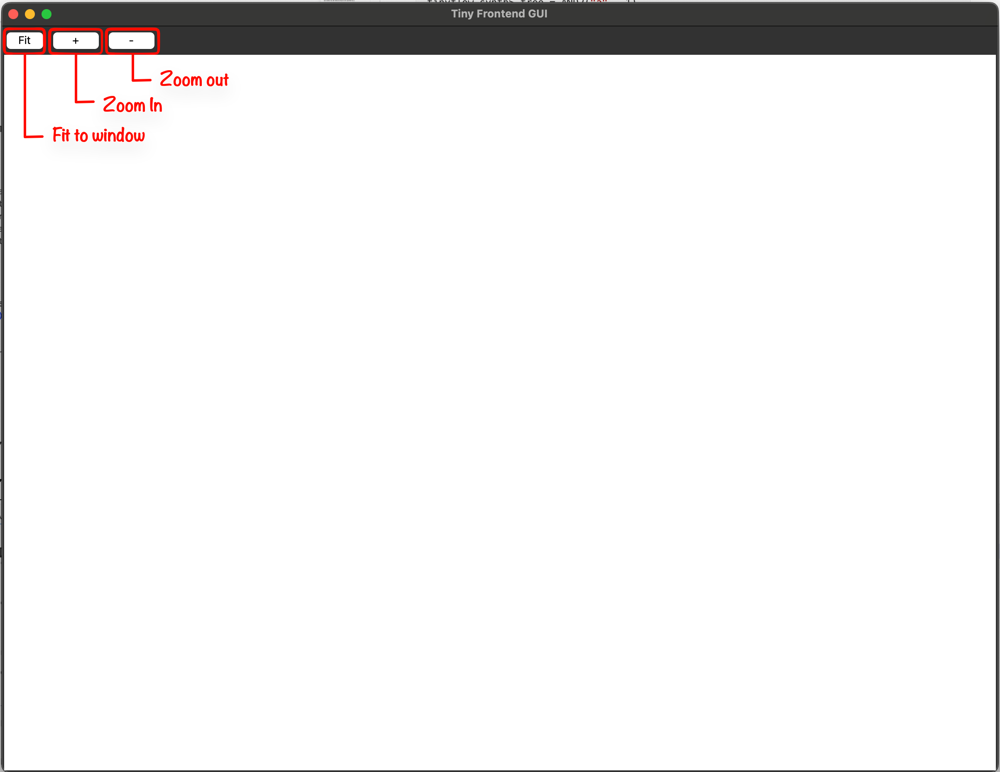

ECE 6745 Lab 3: TinyFlow Frontend
==========================================================================

In this lab, we will explore the TinyFlow frontend, implement a basic
synthesis flow that transforms Verilog RTL into a gate-level netlist, and
walk through the complete frontend verification flow for an RTL design.

 - **Verilog Parser:** Reads Verilog RTL and converts it into an internal
     tree representation of generic gates

 - **Substitution:** Pattern matching and replacement operation that
     transforms trees by matching a find pattern and producing a new tree
     from a replace template

 - **Naive Technology Mapping:** Maps generic gates to standard cells from
     your library using simple pattern substitution

 - **Gate-Level Netlist Writer:** Outputs the mapped design as a Verilog
     gate-level netlist using your standard cells

We will be using the following TinyFlow frontend synthesis flow.


We will begin by exploring the TinyFlow data structures using the REPL and
GUI. We will then implement a Verilog parser, tree printing, substitution,
and naive technology mapping. Finally, we will walk through the four-step
frontend flow (2-state simulation, 4-state simulation, synthesis,
fast-functional gate-level simulation) to verify a Full Adder design.

1. Logging Into `ecelinux`
--------------------------------------------------------------------------

Follow the same process as previous labs. Find a free workstation and log
into the workstation using your NetID and standard NetID password. Then
complete the following steps. These are the same steps as in the first lab
with one exception. We are now installing
the VS Code Surfer extension to be able to view waveforms.

 - Start VS Code
 - Install the Remote-SSH extension and the Surfer extension
 - Use View > Command Palette to execute Remote-SSH: Connect Current Window to Host...
 - Enter netid@ecelinux-XX.ece.cornell.edu where XX is an ecelinux server number
 - Use View > Explorer to open your home directory on ecelinux
 - Use View > Terminal to open a terminal on ecelinux
 - Start MS Remote Desktop


Now use the following commands to clone the repo we will be using for
today's lab.

```bash
% source setup-ece6745.sh
% source setup-gui.sh
% mkdir -p ${HOME}/ece6745
% cd ${HOME}/ece6745
% git clone git@github.com:cornell-ece6745/ece6745-lab3 lab3
% cd lab3
% tree
```

Your repo contains the following directories:

```
.
├── README.md
├── asic
│   └── build-fa
│       ├── 01-verilator-rtlsim
│       ├── 02-iverilog-rtlsim
│       ├── 03-tinyflow-synth
│       │   └── run.py
│       └── 04-tinyflow-ffglsim
├── rtl
│   ├── FullAdder.v
│   └── test
│       └── FullAdder-test.v
├── stdcells
└── tinyflow
    ├── conftest.py
    ├── pytest.ini
    ├── synth
    │   ├── StdCellFrontEndView.py
    │   ├── TinyFrontEndDB.py
    │   ├── TinyFrontEndGUI.py
    │   ├── print_tree.py
    │   ├── substitute.py
    │   ├── techmap_unopt.py
    │   ├── tinyv.lark
    │   └── verilog_parser.py
    └── tinyflow-synth
```

To make it easier to cut-and-paste commands from this handout onto the
command line, you can tell Bash to ignore the `%` character using the
following command:

```bash
% alias %=""
```

Now you can cut-and-paste a sequence of commands from this tutorial
document and Bash will not get confused by the `%` character which begins
each line.

Our frontend tools use the front-end view you developed in Project 1 Part A.
Copy your front-end view file into the lab3 folder:

```bash
% cd ${HOME}/ece6745
% cp project1-groupXX/stdcells/stdcells-fe.yml lab3/stdcells
```

2. Data Structures
--------------------------------------------------------------------------

As discussed in lecture, TinyFlow represents logic designs as trees of
gates. Our synthesis tool will form these trees from Verilog and manipulate
them through various transformations. The trees are stored in a data
container called `TinyFrontEndDB`.

To get started, create a build directory and start the TinyFlow REPL:

```bash
% mkdir -p ${HOME}/ece6745/lab3/tinyflow/build
% cd ${HOME}/ece6745/lab3/tinyflow/build
% ../tinyflow-synth

TinyFlow Synth REPL v0.1

Type 'help()' for available commands.
Type 'clear()' to clear the screen.
Type 'exit()' or Ctrl-D to quit.

tinyflow-synth>
```

The `tinyflow-synth` tool is where we will implement our synthesis
algorithms. It provides a REPL for interactive exploration.

### 2.1. Nodes and Trees

The base class for all gates is `Node`. Generic gates (AND2, OR2, NAND2,
NOR2, XOR2, NOT, INV, BUF) are Nodes that represent logic operations.
Standard cell gates (INVX1, NAND2X1, NOR2X1, etc.) are Nodes read in from
your front-end view. `Signal` nodes represent inputs and wires. There are
also special `Wildcard` nodes that we will explain later. Let's create a
simple tree and explore it:

```python
tinyflow-synth> a, b, c = Signal("a"), Signal("b"), Signal("c")
tinyflow-synth> tree = AND2(OR2(a, b), c)
tinyflow-synth> print(tree)
tinyflow-synth> print(tree.type)
tinyflow-synth> print(tree.generic)
tinyflow-synth> print(tree.children)
tinyflow-synth> print(tree.children[0].type)
tinyflow-synth> print(tree.children[1])
tinyflow-synth> print(tree.eval(a=1, b=0, c=1))
```

Each node has a `type` (the gate name), `children` (its inputs), and
`generic` (True for generic gates, False for standard cell gates). Signal
nodes are leaf nodes with no children. Nodes also provide helper methods:
`is_signal()` returns `True` for Signal nodes, `is_wildcard()` returns
`True` for Wildcard nodes, and `==`/`!=` compare nodes by type.

```python
tinyflow-synth> a.is_signal()
True
tinyflow-synth> tree.is_signal()
False
tinyflow-synth> _a.is_wildcard()
True
tinyflow-synth> a == Signal("a")
True
tinyflow-synth> a == AND2(a, b)
False
tinyflow-synth> AND2(a, b) == AND2(c, c)
True
tinyflow-synth> AND2(a, b) == OR2(a, b)
False
```

Go ahead and evaluate all input combinations using `tree.eval()` and derive
the truth table for `AND2(OR2(a, b), c)`.

### 2.3. Frontend Database and GUI

Now let's use the frontend database to manage a design. To create a
database using `TinyFrontEndDB`, we first need to have our frontend view ready. `StdCellFrontEndView`
loads the front-end view YAML file you created in Project 1 Part A. It
provides access to cell information (area, timing parameters), patterns for
technology mapping, and standard cell gate classes (INVX1, NAND2X1, etc.).

Let's create the view and database:

```python
tinyflow-synth> view = StdCellFrontEndView.parse_lib("../../stdcells/stdcells-fe.yml")
tinyflow-synth> db = TinyFrontEndDB(view)
```

The database supports visualizing its contents through a GUI. Enable the
GUI with:

```python
tinyflow-synth> db.enable_gui()
```
The GUI window will open. 



Now add inputs, outputs, and set a tree:

```python
tinyflow-synth> a, b, c = Signal("a"), Signal("b"), Signal("c")
tinyflow-synth> db.add_inports(["a", "b", "c"])
tinyflow-synth> db.add_outports(["out"])
tinyflow-synth> db.set_tree("out", AND2(OR2(a, b), c))
```

Watch the GUI update to show your tree when you call `db.set_tree(...)`.


In the visualization above, you will only see primary inputs, primary outputs, and generic gates. The GUI uses the following visual conventions:

 - **Green ovals:** Primary inputs
 - **Orange ovals:** Wire signals
 - **Blue ovals:** Primary outputs
 - **Grey rectangles:** Generic gates
 - **Red rectangles:** Standard cell gates


Once you are done with the GUI, you can exit the REPL by calling `exit()` or pressing Ctrl-D.

3. Synthesis Algorithms
--------------------------------------------------------------------------

In this section we will implement a couple of algorithms that will warm
you up for writing recursive functions and will be useful for Project 1
Part B. By the end of this lab, you will have a working naive technology
mapping implementation that does the job but may not guarantee minimal area cost.

### 3.1. Verilog Parser

The first step of our synthesis flow is parsing. The parser lexes the
simple Verilog syntax, forms an Abstract Syntax Tree (AST), and performs
"forresting" to translate the AST into the forests of logic trees used in
TinyFlow.

In this part, we will be discussing the limitations of verilog we can write
for the TinyFlow. This limitation is mainly pedagogical to simplify the flow as well as limitations due to our parser (this does not mean our parser is not good).

**Rules:**

1. Only Combinational Verilog
2. Only Use `wire` keyword instead of `logic`
3. Only Gate level modeling. However NOT using the gate primitives like `and(), or(), not()` instead we will be using `assign` statements with operators: `&, |, ~, ^`.
4. No hierarchy, every module is flat.
5. No multibit wires. So you cannot declare something like `wire[7:0] foo` you need something like
    ```verilog
    wire foo0;
    wire foo1;
    ...
    wire foo7;
    ```
6.  Limitations on ports. Note this is a limitation for the physical tapeout
and we will communicate with you the number of input and output pins your
module will get.

If you are ever confused take a look at the Lark grammar that we use to see what our parser should parse.

The database includes a method to read in Verilog by passing the path to
the Verilog file:

```python
tinyflow-synth> view = StdCellFrontEndView.parse_lib("../../stdcells/stdcells-fe.yml")
tinyflow-synth> db = TinyFrontEndDB(view)
tinyflow-synth> db.enable_gui()
tinyflow-synth> db.read_verilog("../../rtl/FullAdder.v")
```

Watch the GUI update to show the parsed trees.

### 3.2. Printing Trees

Before we implement more complex algorithms, let's warm up with a simple
recursive function. Implement `print_tree(node, indent=0)` in
`synth/print_tree.py` that prints a tree structure to the terminal. The
function should recursively visit a node and its children, passing along
the indentation level. At each node, print the indent amount of spaces
first, then the node type (accessible via `node.type`). `Signal` nodes are
leaf nodes and should print their name. For example, given
`AND2(OR2(Signal("a"), Signal("b")), Signal("c"))`, it should print:

```
AND2
 OR2
  a
  b
 c
```

Open the `synth/print_tree.py` file:

```bash
% cd ${HOME}/ece6745/lab3/tinyflow
% code synth/print_tree.py
```

Here are some hints: The function takes a `node` and an `indent` level. First, print the
indentation (one space per indent level). Then check if the node is a
Signal (with `.is_signal()`): if so, print its name; otherwise, print the node's type and
recursively call `print_tree` on each child with `indent + 1`.

Once you are done with your implementation, test your function in the REPL:

```python
tinyflow-synth> a, b, c, d = Signal("a"), Signal("b"), Signal("c"), Signal("d")
tinyflow-synth> tree = AND2(OR2(a, b), c)
tinyflow-synth> print_tree(tree)
tinyflow-synth> tree = XOR2(AND2(a, b), OR2(c, d))
tinyflow-synth> print_tree(tree)
```

### 3.3. Matching Trees

Building on the spirt of recursively travering trees, we now implement `match(n_node, p_node)` which compares two trees and returns `True` if they match, `False` otherwise.
This function takes a node tree `n_node` and a pattern tree `p_node`.

Here we introduce a new type of node called `Wildcard`. A wildcard matches
any subtree. For example, the pattern `AND2(_a, _b)` matches `AND2(x, y)`,
`AND2(OR2(a, b), c)`, or any other AND2 tree regardless of its children.
The REPL provides predefined wildcards `_a`, `_b`, `_c`, `_d` for
convenience. In this `match` function, you can assume only the pattern tree
`p_node` can contain wildcards.

Open `synth/substitute.py`:

```bash
% cd ${HOME}/ece6745/lab3/tinyflow
% code synth/substitute.py
```

Here are some hints: The function traverses both trees together. First,
check if `p_node` is a wildcard (using `.is_wildcard()`): if so, return
`True` because wildcards match anything. Then compare `p_node` and `n_node`:
if they are different (using `!=`), return `False`. These are the base
cases. For the recursive case, maintain a match state (to track whether all
children match) and iterate through both nodes' children together (using
`zip`). Recursively compare each pair of children and accumulate the
results for whether children match. Return the final match result.

Test your implementation in the REPL:

```python
tinyflow-synth> a, b, c = Signal("a"), Signal("b"), Signal("c")
tinyflow-synth> match(AND2(a, b), AND2(_a, _b))
True
tinyflow-synth> match(AND2(a, b), OR2(_a, _b))
False
tinyflow-synth> match(AND2(OR2(a, b), c), AND2(_a, _b))
True
```

### 3.4. Capturing Subtrees

Now that we can recursively compare two trees, we want to also capture
whatever the wildcards in the pattern tree match to. The captures should be
a dictionary mapping the wildcard name to the subtree it matched. For
example, matching `AND2(OR2(a, b), c)` against pattern `AND2(_a, _b)`
produces `{"a": OR2(a, b), "b": c}`.

Implement `capture(n_node, p_node)` which is similar to `match` but returns
a dictionary instead of `True`/`False`. Here we can assume that `n_node`
and `p_node` already match (you should call `match` first before calling
`capture`).

Open `synth/substitute.py`:

```bash
% cd ${HOME}/ece6745/lab3/tinyflow
% code synth/substitute.py
```

Here are some hints: Similar to `match`, first check if `p_node` is a
wildcard. If so, return a dictionary with just the wildcard's name mapped
to `n_node`. Otherwise, recursively call `capture` on both nodes' children
(using `zip`) and merge the results. You can use `|=` to merge dictionaries.

Test your implementation in the REPL:

```python
tinyflow-synth> a, b, c = Signal("a"), Signal("b"), Signal("c")
tinyflow-synth> n = AND2(OR2(a, b), c)
tinyflow-synth> p = AND2(_a, _b)
tinyflow-synth> if match(n, p):
              >     captures = capture(n, p)
              >     print(captures)
{'a': OR2(a, b), 'b': c}
```

### 3.5. Replacing Trees

Now that we can match and capture subtrees, we want to build a new tree
using the captured values. Implement `replace(t_node, captures)` which
takes a template tree `t_node` (containing wildcards) and the captures
dictionary, and returns a new tree with wildcards replaced by their
corresponding captured subtrees.

Open `synth/substitute.py`:

```bash
% cd ${HOME}/ece6745/lab3/tinyflow
% code synth/substitute.py
```

Here are some hints: The goal is to return a node, and the parent call
updates its children with what each recursive call returns. In each call we check if
`t_node` is a wildcard: if so, return the corresponding captured subtree
instead of the wildcard. Otherwise, recursively call `replace` on each
child, collect the results into a new children list, update
`t_node.children`, and return `t_node`.

Test your implementation in the REPL:

```python
tinyflow-synth> a, b, c = Signal("a"), Signal("b"), Signal("c")
tinyflow-synth> n = AND2(OR2(a, b), c)
tinyflow-synth> p = AND2(_a, _b)
tinyflow-synth> t = INV(NAND2(_a, _b))
tinyflow-synth> if match(n, p):
              >     captures = capture(n, p)
              >     result = replace(t, captures)
              >     print(result)
INV(NAND2(OR2(a, b), c))
```

### 3.6. Substitution

Now that we have implemented `match` (to check if a tree matches a
pattern), `capture` (to extract the subtrees that wildcards match), and
`replace` (to build a new tree using captured subtrees), we have the core
implementation for substitution in TinyFlow's frontend.

Substitution is one of the core functionalities that enables the synthesis
flow. In the standard cell frontend view, each standard cell defines
patterns that describe how generic gates map to that cell. The view
captures these patterns as `Substitute` objects that can be applied to
trees in the database.

The `Substitute` class is a container that holds a find pattern and a
replace template. Go ahead and implement the `apply` method which combines
`match`, `capture`, and `replace`:

```python
def apply(self, node):
  # if match, capture and replace; otherwise return None
```

Test your implementation in the REPL:

```python
tinyflow-synth> a, b, c = Signal("a"), Signal("b"), Signal("c")
tinyflow-synth> sub = Substitute(find=AND2(_a, _b), replace=INV(NAND2(_a, _b)))
tinyflow-synth> result = sub.apply(AND2(OR2(a, b), c))
tinyflow-synth> print(result)
INV(NAND2(OR2(a, b), c))
```

### 3.7. Naive Technology Mapping

In Project 1 Part B you will implement an optimized version of technology
mapping. For this lab, we will implement a naive version that simply
replaces each generic gate with a corresponding standard cell.

The idea is to use your substitution implementation to define a pattern for
each generic gate. For example, to map AND2 to NAND2X1 + INVX1:

```python
Substitute(find=AND2(_a, _b), replace=view.INVX1(view.NAND2X1(_a, _b)))
```

Note that you can access standard cell classes directly from the view using
`view.INVX1`, `view.NAND2X1`, etc.

Implement `techmap_unopt` in `synth/techmap_unopt.py`. The function takes
the database and view as arguments:

```python
def techmap_unopt(db, view):
```

First, we will need to define substitution rules for each generic gate type
(AND2, OR2, NOT, INV, BUF):

```python
rules = [
  Substitute(find=AND2(_a, _b), replace=view.INVX1(view.NAND2X1(_a, _b))),
  Substitute(find=..., replace=...)
  # ... add rules for XOR2, NOT, INV, BUF
]
```

Next, implement an `apply_rules` helper function that recursively applies
rules bottom-up. The key insight is that we must transform children first
before transforming the current node. This ensures that when we match a
pattern at a node, its children have already been mapped to standard cells.
The function should: (1) return immediately for Signal nodes (base case),
(2) recursively apply rules to all children first, (3) iterate through all
rules and try each one on the current node - return the result as soon as
a rule matches (first match wins), (4) return the node unchanged if no
rules match.

Finally, iterate through all trees in the database and apply the rules:

```python
for name in list(db.trees.keys()):
  tree = db.get_tree(name)
  if tree is not None:
    new_tree = apply_rules(tree)
    db.set_tree(name, new_tree)
```

Test your implementation with the REPL and GUI. After running techmap, the
grey generic gates should become red standard cell gates:

```python
tinyflow-synth> view = StdCellFrontEndView.parse_lib("../../stdcells/stdcells-fe.yml")
tinyflow-synth> db = TinyFrontEndDB(view)
tinyflow-synth> db.enable_gui()
tinyflow-synth> db.read_verilog("../../rtl/FullAdder.v")
tinyflow-synth> techmap_unopt(db, view)
```

4. The Frontend Flow
--------------------------------------------------------------------------

As discussed in lecture, the frontend is more than just synthesis. The
frontend flow consists of four stages: two-state simulation, four-state
simulation, synthesis, and fast-functional gate-level simulation. As
paranoid ASIC engineers, we verify our design at each step. We simulate
the RTL before synthesis to catch design bugs early, then simulate the
gate-level netlist after synthesis to ensure the transformation preserved
functionality.

### 4.1 Two-State RTL Simulation

To ensure functionality, the first step is to verify our design quickly
using two-state simulation. Two-state simulation tests only logic values
1 and 0 to ensure basic logic correctness. In this part we will use
Verilator to perform two-state simulation.

In this lab we will verify a Full Adder design. We provide the Verilog RTL
in `rtl/FullAdder.v` and a basic testbench in `rtl/test/FullAdder-test.v`.
Take a look at both files to understand the design and test structure.

Now run the two-state simulation with Verilator:

```bash
% cd $HOME/ece6745/lab3/asic/build-fa/01-verilator-rtlsim
% verilator --top Top --timing --binary -o FullAdder-test \
    ../../../rtl/FullAdder.v \
    ../../../rtl/test/FullAdder-test.v
% ./obj_dir/FullAdder_test
```

As discussed in lecture, two-state simulation has a limitation: unassigned
signals default to 0. This can hide bugs in your design. For example, if
you forget to assign an output, two-state simulation will silently use 0
instead of flagging an error.

Try this experiment: comment out the `assign g = a & b;` line in your Full
Adder and re-run the simulation. Notice that `g` silently takes the value
0 instead of producing an error. This is why we need four-state simulation
in the next step. Change the code back before continuing.

### 4.2 Four-State RTL Simulation

Four-state simulation uses four logic values: 0, 1, X (unknown), and Z
(high impedance). You get X when a signal is uninitialized, when multiple
drivers are fighting (contention), or through propagation of uncertainty
(X propagates through logic). You get Z when a wire is floating (nothing
is driving it) or from a tri-stated output.

We use four-state simulation to capture these bugs. It is slower than
two-state simulation, but it narrows down our issue search space. If your
design passes two-state but fails four-state, the problem is usually
related to X propagation or uninitialized signals.

Go ahead and run the four-state simulation with Icarus Verilog:

```bash
% cd $HOME/ece6745/lab3/asic/build-fa/02-iverilog-rtlsim
% iverilog -g2012 -I ../../../rtl -o FullAdder-test \
    ../../../rtl/test/FullAdder-test.v
% ./FullAdder-test
```

Now try the same experiment: comment out the `assign g = a & b;` line and
re-run the simulation. This time you should see the simulation catch the
error because `g` becomes X instead of silently defaulting to 0. Change
the code back before continuing.

### 4.3 Synthesis

Now that we have rigorously tested our Verilog design, we are ready to
synthesize it into a gate-level netlist. For this step, we will use the
batch processing mode of `tinyflow-synth` instead of the REPL mode we have
previous used. The batch mode takes a run script that describes the synthesis
steps.

Go ahead and edit the run script:

```bash
% cd $HOME/ece6745/lab3/asic/build-fa/03-tinyflow-synth
% code run.py
```

Populate the script with the commands to perform technology mapping:

```python
view = StdCellFrontEndView.parse_lib("../../../stdcells/stdcells-fe.yml")
db = TinyFrontEndDB(view)
db.read_verilog("../../../rtl/FullAdder.v")
techmap_unopt(db, view)
db.write_verilog("post-synth.v")
```

Now run the synthesis:

```bash
% ../../../tinyflow/tinyflow-synth -f run.py
```

This outputs the `post-synth.v` file. Open it and have a look. You should
see that all gates are now standard cells from your library, and the
module still has the same inputs and outputs as the original RTL.

### 4.4 Fast-Functional Gate-Level Simulation

Now that we have our synthesized design, as paranoid ASIC engineers we
want to double check that the synthesized design still does what we
intended. Synthesis tools may not always be correct! To verify this, we
perform fast-functional gate-level simulation (FFGL), which is four-state
simulation using the same testbench but with the synthesized design and
the behavioral view of the standard cells.

First, copy over your `stdcells.v` from your project directory to the lab3
stdcells directory:

```bash
% cp $HOME/ece6745/project1-groupXX/stdcells/stdcells.v $HOME/ece6745/lab3/stdcells/
```

Now run the fast-functional gate-level simulation:

```bash
% cd $HOME/ece6745/lab3/asic/build-fa/04-iverilog-ffglsim
% iverilog -g2012 -o FullAdder-test \
    ../../../stdcells/stdcells.v ../03-tinyflow-synth/post-synth.v \
    ../../../rtl/test/FullAdder-test.v
% ./FullAdder-test
```

If the simulation passes, your synthesized design is functionally correct.

### 4.5 Exercise: Design a Decoder

You have now walked through the frontend flow with the Full Adder. For the
final part of this lab, design your own module from scratch. Implement a
simple 2-to-4 decoder and push it through the complete four-step flow. 

First, create the build directory structure:

```bash
% mkdir -p $HOME/ece6745/lab3/asic/build-decoder
% cd $HOME/ece6745/lab3/asic/build-decoder
% mkdir 01-verilator-rtlsim 02-iverilog-rtlsim 03-tinyflow-synth 04-iverilog-ffglsim
```

Next, write the Verilog RTL for your decoder:

```bash
% cd $HOME/ece6745/lab3/rtl
% code Decoder.v
```

Then write a testbench for your decoder:

```bash
% cd $HOME/ece6745/lab3/rtl/test
% code Decoder-test.v
```

Now run through the four-step frontend flow, referring back to sections
4.1-4.4 for the commands. Remember to update the file paths to use your
decoder files instead of the Full Adder files.
