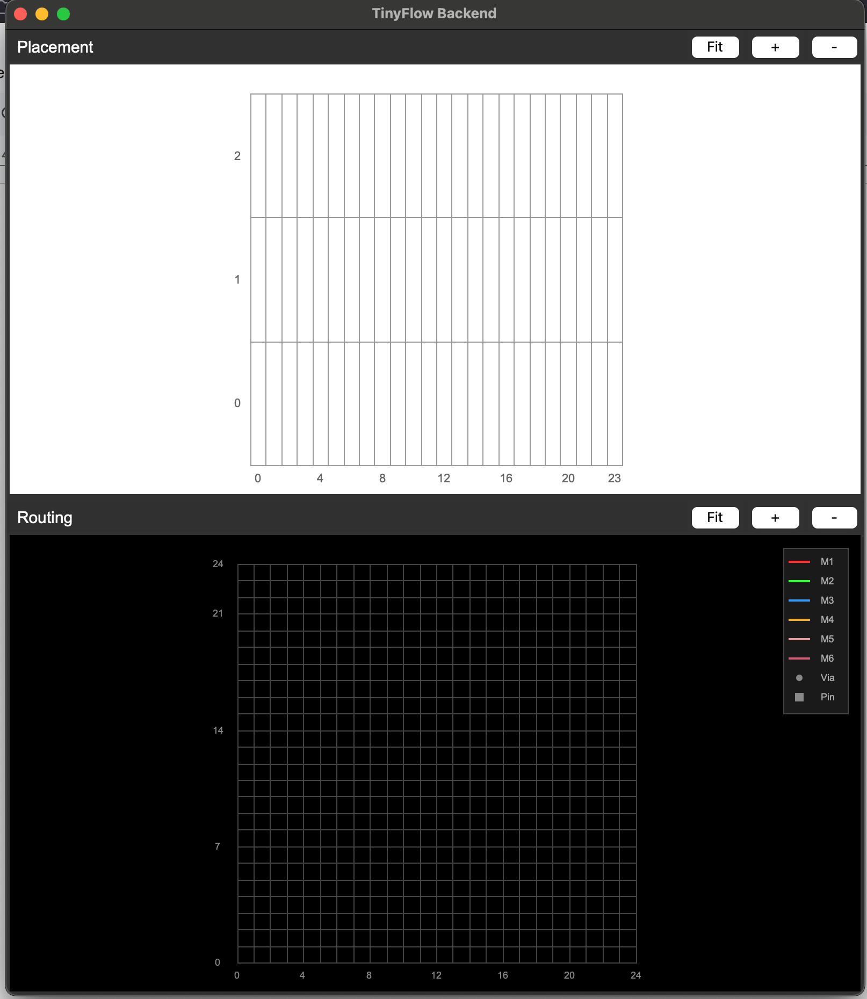

ECE 6745 Lab 4: TinyFlow Back End
==========================================================================

In this lab, we will explore the TinyFlow back end which takes as input
a gate-level netlist of standard cells and produces a placed and routed
layout. The complete TinyFlow standard-cell and ASIC design flow is shown
below with the back end highlighted in red.


The back end includes floorplanning, placement, routing, and filler cell
insertion. In this lab, we will be implementing unoptimized versions of
placement and routing. The key algorithms in the unoptimized back-end
flow are shown below.

{ width=50% }

1. Logging Into `ecelinux`
--------------------------------------------------------------------------

Follow the same process as previous labs. Find a free workstation and log
into the workstation using your NetID and standard NetID password. Then
complete the following steps.

 - Start VS Code
 - Install the Remote-SSH extension, Surfer, and Verilog extensions
 - Use View > Command Palette to execute Remote-SSH: Connect Current Window to Host...
 - Enter netid@ecelinux-XX.ece.cornell.edu where XX is an ecelinux server number
 - Use View > Explorer to open your home directory on ecelinux
 - Use View > Terminal to open a terminal on ecelinux
 - Start MS Remote Desktop

Now use the following commands to clone the repo we will be using for
today's lab.

```bash
% source setup-ece6745.sh
% source setup-gui.sh
% mkdir -p ${HOME}/ece6745
% cd ${HOME}/ece6745
% git clone git@github.com:cornell-ece6745/ece6745-lab4 lab4
% cd lab4
% tree
```

Your repo contains the following files.

```
.
├── README.md
├── asic
│   └── build-fa
│       ├── 00-verilator-rtlsim
│       ├── 01-iverilog-rtlsim
│       ├── 02-tinyflow-synth
│       ├── 03-iverilog-ffglsim
│       ├── 04-tinyflow-pnr
│       ├── 05-klayout-drc
│       └── 06-klayout-lvs
├── rtl
│   ├── FullAdder_cout.v
│   └── FullAdder_cout-post-synth.v
├── stdcells
└── tinyflow
    ├── pnr
    │   ├── StdCellBackEndView.py
    │   ├── TinyBackEndDB.py
    │   ├── TinyBackEndGUI.py
    │   ├── add_filler.py
    │   ├── floorplan.py
    │   ├── multi_route_unopt.py
    │   ├── place_unopt.py
    │   └── single_route_unopt.py
    ├── tinyflow-synth
    └── tinyflow-pnr
```

Our back-end flow uses the back-end view and GDS library you developed
in Project 1, Part A. You will also need your synthesis tool for the
end-to-end flow. Copy these files into the lab4 directory.

```bash
% cd ${HOME}/ece6745/lab4
% cp ../../project1-groupXX/stdcells/stdcells-be.yml stdcells/
% cp ../../project1-groupXX/stdcells/stdcells.gds stdcells/
% cp -r ../../project1-groupXX/tinyflow/synth tinyflow/synth
```

where `XX` is your group number. We provide `FullAdder_cout.v` (the
RTL) and `FullAdder_cout-post-synth.v` (a pre-synthesized gate-level
netlist) in the `rtl/` directory so you can test the back-end flow
directly.

To make it easier to cut-and-paste commands from this handout onto the
command line, you can tell Bash to ignore the `%` character using the
following command:

```bash
% alias %=""
```

Now you can cut-and-paste a sequence of commands from this tutorial
document and Bash will not get confused by the `%` character which begins
each line.

2. Data Structure: Back-End Database
--------------------------------------------------------------------------

As discussed in lecture, the back end takes a gate-level netlist and
produces a physical layout. The key data structure is the back-end
database which manages cells (standard cell instances), nets (connections
between pins), a 2D site grid of sites, and a 3D routing grid of
nodes. The PnR algorithms -- floorplanning, placement, and routing --
read and modify this database. We provide students the database, and
students are responsible for writing the algorithms. Similar to the
frontend, we have a REPL for interactive exploration of the back-end
database and algorithms.

In this section, we will manually build a small design from scratch in
the REPL to understand how these data structures work together. We will
add cells, create nets, set up a floorplan, place cells, and route nets
by hand before moving on to automated algorithms.

To get started, create a build directory and start the TinyFlow PnR
REPL.

```bash
% mkdir -p ${HOME}/ece6745/lab4/tinyflow/build
% cd ${HOME}/ece6745/lab4/tinyflow/build
% ../tinyflow-pnr
```

### 2.1. Database, Floorplan, and the Grid

Before we can place cells or route wires, we need to set up the chip's
physical foundation: the **site grid** and the **routing grid**. The
site grid is a 2D array of sites where cells can be placed. The
routing grid is a 3D array of nodes where wires can be routed across
multiple metal layers. Both are created when we call `floorplan` on the
database.

Let's create a back-end library view, an empty database, and a small
floorplan with 3 rows and 21 sites per row.

```python
tinyflow-pnr> view = StdCellBackEndView.parse_lef('../../stdcells/stdcells-be.yml')
tinyflow-pnr> db = TinyBackEndDB(view)
tinyflow-pnr> db.enable_gui()
tinyflow-pnr> db.floorplan(3, 24)
```

`StdCellBackEndView` is the back-end counterpart to the front-end view
from Lab 3. It provides the physical information needed for place and
route: site dimensions, cell layouts (pin locations, cell widths), and
metal layer definitions.

`TinyBackEndDB` is the central database for the back end. It stores all
cells, nets, pins, IO ports, and manages both the site grid and
routing grid. All PnR algorithms read and modify this database.

`db.floorplan(num_rows, num_sites_per_row)` initializes the chip's
physical grid. It creates a 2D array of sites (rows x columns)
where standard cells will be placed, and a 3D routing grid of nodes
across all metal layers where wires will be routed. Nothing can be placed
or routed until this is called. You should see the GUI show two panels:
the top panel is the site pane showing the grid in sites, and the
bottom panel is the routing pane showing a top-down view of the 3D
routing grid.

{ width=50% }

Let's explore what `db.floorplan` created. First, check the dimensions
of the site grid and the routing grid.

```python
tinyflow-pnr> db.get_num_rows()
tinyflow-pnr> db.get_num_cols()
tinyflow-pnr> db.get_grid_size_i()
tinyflow-pnr> db.get_grid_size_j()
```

??? info "Expected output"

    ```
    tinyflow-pnr> db.get_num_rows()
    3
    tinyflow-pnr> db.get_num_cols()
    21
    tinyflow-pnr> db.get_grid_size_i()
    25
    tinyflow-pnr> db.get_grid_size_j()
    22
    ```

The site grid has `num_rows` rows and `num_cols` sites per row --
these are the coordinates you use when placing cells. The routing grid is
finer-grained: `grid_size_i` tracks in the vertical direction and
`grid_size_j` tracks in the horizontal direction, across multiple metal
layers.

Each placement site is represented by a **Site** object. A site is the
smallest unit of space where a cell can be placed, the same size as a
filler cell. Each rectangular box in the placement panel GUI corresponds
to one site. Let's inspect a site to see what information it tracks:

```python
tinyflow-pnr> db.get_site_at(0, 0)
tinyflow-pnr> db.get_site_at(0, 0).occupied_by == None
```

??? info "Expected output"

    ```
    tinyflow-pnr> db.get_site_at(0, 0)
    <Site(x=0, y=0, occupied=False)>
    tinyflow-pnr> db.get_site_at(0, 0).occupied_by == None
    True
    ```

The site at (0, 0) shows its coordinates and whether it is occupied.
Since we haven't placed any cells yet, `occupied_by` is `None`. Once we
place cells in Section 2.3, we will see this change.

Each routing grid point is represented by a **Node** object, addressed
by `(i, j, k)` where `i` is the row track, `j` is the column track, and
`k` is the metal layer (1=M1, 2=M2, etc.). In the routing panel of the
GUI, nodes are the intersections of the grid lines. Each node tracks what
occupies it: a net's wire, a cell pin, or an IO port. Let's inspect a
node to see what information it tracks:

```python
tinyflow-pnr> db.get_node_at(0, 0, 1)
tinyflow-pnr> db.get_occupancy(0, 0, 1) == None
```

??? info "Expected output"

    ```
    tinyflow-pnr> db.get_node_at(0, 0, 1)
    <Node(x=0, y=0, layer=1, occupied=None)>
    tinyflow-pnr> db.get_occupancy(0, 0, 1) == None
    True
    ```

The node at (0, 0, 1) is on M1 at row track 0, column track 0. Since
we haven't routed any wires yet, the occupancy is `None`. Once we route
nets in Section 2.3, we will see this change. `get_occupancy` will be
very useful later when implementing the routing algorithms to check
whether a node is available before routing through it.

### 2.2. Cells, IO Ports, and Nets

Now that we have a floorplan, let's add cells, register IO ports, and
create nets to connect them. We will build a simple two-inverter chain:
input `a` drives `inv1`, whose output connects to `inv2`, whose output
drives output `y`.

A **Cell** represents an instance of a standard cell from the library
(e.g., INVX1, NAND2X1). When we add a cell to the database, it
automatically creates **Pin** objects based on the cell's layout
definition. Let's add two inverters:

```python
tinyflow-pnr> db.add_cell('inv1', 'INVX1')
tinyflow-pnr> db.add_cell('inv2', 'INVX1')
tinyflow-pnr> db.get_cells()
```

??? info "Expected output"

    ```
    tinyflow-pnr> db.add_cell('inv1', 'INVX1')
    tinyflow-pnr> db.add_cell('inv2', 'INVX1')
    tinyflow-pnr> db.get_cells()
    (<Cell inv1, INVX1, placed=False>, <Cell inv2, INVX1, placed=False>)
    ```

Each cell has pins that we can inspect. Pins are not yet placed on the
grid since we haven't placed the cells yet. Note that the GUI only shows
placed cells, so you won't see them in the GUI here:

```python
tinyflow-pnr> inv1 = db.get_cell('inv1')
tinyflow-pnr> inv1.get_pins()
tinyflow-pnr> inv1.get_pin('A')
tinyflow-pnr> inv1.get_pin('A').get_node()
```

??? info "Expected output"

    ```
    tinyflow-pnr> inv1 = db.get_cell('inv1')
    tinyflow-pnr> inv1.get_pins()
    [<Pin A (unplaced)>, <Pin Y (unplaced)>]
    tinyflow-pnr> inv1.get_pin('A')
    <Pin A (unplaced)>
    tinyflow-pnr> inv1.get_pin('A').get_node()
    (None, None, None)
    ```

An **IO Port** represents an external signal at the chip boundary. IO
ports are registered with `add_ioport` -- at this point, they are
unplaced, we just declare that they exist. They will be placed on the
chip boundary later. Let's register that our design has an input `a`
and an output `y`:

```python
tinyflow-pnr> db.add_ioport('a', 'input')
tinyflow-pnr> db.add_ioport('y', 'output')
tinyflow-pnr> db.get_ioports()
```

??? info "Expected output"

    ```
    tinyflow-pnr> db.add_ioport('a', 'input')
    tinyflow-pnr> db.add_ioport('y', 'output')
    tinyflow-pnr> db.get_ioports()
    (<Pin a (unplaced)>, <Pin y (unplaced)>)
    ```

`add_ioport` creates an IO port. It takes a direction to indicate
whether it is an input or output.

Now let's connect everything with **Nets**. A net represents a logical
connection between pins. For our inverter chain, we need three nets: `a`
connects the input IO port to `inv1`, `w` connects `inv1`'s output to
`inv2`'s input, and `y` connects `inv2`'s output to the output IO port.
Since IO ports are pins, we include them directly in the pin list.

```python
tinyflow-pnr> inv2 = db.get_cell('inv2')
tinyflow-pnr> db.add_net('a', [db.get_ioport('a'), inv1.get_pin('A')])
tinyflow-pnr> db.add_net('w', [inv1.get_pin('Y'), inv2.get_pin('A')])
tinyflow-pnr> db.add_net('y', [inv2.get_pin('Y'), db.get_ioport('y')])
tinyflow-pnr> db.get_nets()
```

??? info "Expected output"

    ```
    tinyflow-pnr> inv2 = db.get_cell('inv2')
    tinyflow-pnr> db.add_net('a', [db.get_ioport('a'), inv1.get_pin('A')])
    tinyflow-pnr> db.add_net('w', [inv1.get_pin('Y'), inv2.get_pin('A')])
    tinyflow-pnr> db.add_net('y', [inv2.get_pin('Y'), db.get_ioport('y')])
    tinyflow-pnr> db.get_nets()
    (<Net a, 2 pins>, <Net w, 2 pins>, <Net y, 2 pins>)
    ```

Nets `a` and `y` each have two pins: a cell pin and an IO port. Net `w`
is an internal wire between the two inverters with no IO port. Let's
verify:

```python
tinyflow-pnr> db.get_net('a').pins
tinyflow-pnr> db.get_net('w').pins
tinyflow-pnr> db.get_net('y').pins
```

??? info "Expected output"

    ```
    tinyflow-pnr> db.get_net('a').pins
    [<Pin a (unplaced)>, <Pin A (unplaced)>]
    tinyflow-pnr> db.get_net('w').pins
    [<Pin Y (unplaced)>, <Pin A (unplaced)>]
    tinyflow-pnr> db.get_net('y').pins
    [<Pin Y (unplaced)>, <Pin y (unplaced)>]
    ```

Note that the IO ports are registered but not yet placed. We will place
them on the chip boundary later in Section 2.3.

With cells, IO ports, and nets defined, we have fully described the
gate-level netlist -- what components exist and how they should be
connected. The next step is to physically place and route them on the
chip.

### 2.3. Manually Placing and Routing

With cells, IO ports, and nets created, let's physically place the cells
and IO ports on the grid and manually route a net.

Let's start with placing a cell. `cell.set_place(row, col)` places a cell with its origin at site
`(row, col)`. The cell occupies one or more sites to the right depending
on its width. If any of those sites are already occupied by another cell,
the database raises an error. Cells in even rows are oriented normally; cells in odd rows are flipped
vertically so that adjacent rows share VDD and VSS power rails. Go
ahead and place `inv1` at (0, 2) and `inv2` at (2, 5):

```python
tinyflow-pnr> inv1.set_place(0, 2)
tinyflow-pnr> inv2.set_place(2, 5)
```

You should see something like this:

{ width=50% }

The cells should now appear in the placement panel as green boxes labeled with
the cell name. In the routing panel, each placed cell shows as a teal dotted shadow
box with its pin locations marked as yellow squares. When a cell is
placed, its pins get assigned grid coordinates on metal layer 1 (M1):

```python
tinyflow-pnr> inv1.is_placed()
tinyflow-pnr> inv1.get_pin('Y').get_node()
tinyflow-pnr> inv2.get_pin('A').get_node()
```

??? info "Expected output"

    ```
    tinyflow-pnr> inv1.is_placed()
    True
    tinyflow-pnr> inv1.get_pin('Y').get_node()
    (4, 4, 1)
    tinyflow-pnr> inv2.get_pin('A').get_node()
    (20, 6, 1)
    ```

Let's then place the IO ports on the chip boundary. Recall that we
registered them earlier but they were unplaced. We use `ioport.place(i,
j)` to assign them to a grid location on the boundary. IO ports are
placed on M2:

```python
tinyflow-pnr> db.get_ioport('a').place(3, 0)
tinyflow-pnr> db.get_ioport('y').place(24, 20)
```

You should see the Routing panel include the IO ports as light blue square boxes.

{ width=50% }

Let's run `db.check_design()` to verify our placement:

```python
tinyflow-pnr> db.check_design()
```

??? info "Expected output"

    ```
    tinyflow-pnr> db.check_design()
    INFO: Placement check passed
    WARNING: UNROUTED: Net 'a' pins not fully connected
    WARNING: UNROUTED: Net 'w' pins not fully connected
    WARNING: UNROUTED: Net 'y' pins not fully connected
    ```

Placement passes, but all three nets are unrouted. Now that our cells and IO ports are placed, we want to connect their pins with wires.
A wire is represented as a **Line**, a straight segment between two 3D
grid points `(i, j, k)`. Exactly one coordinate changes: `i` or `j` for
a wire on the same metal layer, or `k` for a via between layers.

Cell pins live on M1 (k=1), but routing happens on M2 and above. In this
example we will route on M2. To connect two cell pins, we need to:

1. Go up from M1 to M2 at the source pin (via)
2. Route on M2 to reach the destination (wire segments)
3. Come back down from M2 to M1 at the destination pin (via)

Since our two inverters are at different rows, the M2 route requires two
segments forming an L-shape. Let's route net `w` which connects `inv1.Y`
to `inv2.A`. We will add each line segment one at a time so you can see
the route build up in the GUI:

```python
tinyflow-pnr> src_i, src_j, _ = inv1.get_pin('Y').get_node()
tinyflow-pnr> dst_i, dst_j, _ = inv2.get_pin('A').get_node()
tinyflow-pnr> net_w = db.get_net('w')
tinyflow-pnr> net_w.add_route_segments([Line((src_i, src_j, 1), (src_i, src_j, 2))])
tinyflow-pnr> net_w.add_route_segments([Line((src_i, src_j, 2), (src_i, dst_j, 2))])
tinyflow-pnr> net_w.add_route_segments([Line((src_i, dst_j, 2), (dst_i, dst_j, 2))])
tinyflow-pnr> net_w.add_route_segments([Line((dst_i, dst_j, 2), (dst_i, dst_j, 1))])
```

{ width=50% }

The route should now appear in the routing panel of the GUI. You can
verify the node occupancy along the route:

```python
tinyflow-pnr> db.get_occupancy(src[0], src[1], 2)
tinyflow-pnr> net_w.get_route()
```

??? info "Expected output"

    ```
    tinyflow-pnr> db.get_occupancy(src[0], src[1], 2)
    <Net w, 2 pins>
    tinyflow-pnr> net_w.get_route()
    [Line((4, 4, 1) -> (4, 4, 2)), Line((4, 4, 2) -> (4, 6, 2)), Line((4, 6, 2) -> (20, 6, 2)), Line((20, 6, 2) -> (20, 6, 1))]
    ```

At this point, we have only routed net `w`. Let's run `db.check_design()`
to see if there are any issues:

```python
tinyflow-pnr> db.check_design()
```

??? info "Expected output"

    ```
    tinyflow-pnr> db.check_design()
    INFO: Placement check passed
    WARNING: UNROUTED: Net 'a' pins not fully connected
    WARNING: UNROUTED: Net 'y' pins not fully connected
    ```

The checker reports that nets `a` and `y` are not yet routed.
Now let's route the IO ports to their cells. Recall that IO ports are
on M2 while cell pins are on M1. For net `a`, the IO port is already on
M2, so we route on M2 to reach `inv1.A` and via down. For net `y`, we
via up from `inv2.Y` to M2, route on M2 to reach the IO port:

```python
tinyflow-pnr> io_a = db.get_ioport('a').get_node()
tinyflow-pnr> pin_a = inv1.get_pin('A').get_node()
tinyflow-pnr> net_a = db.get_net('a')
tinyflow-pnr> net_a.add_route_segments([Line((io_a[0], io_a[1], 2), (io_a[0], pin_a[1], 2))])
tinyflow-pnr> net_a.add_route_segments([Line((io_a[0], pin_a[1], 2), (pin_a[0], pin_a[1], 2))])
tinyflow-pnr> net_a.add_route_segments([Line((pin_a[0], pin_a[1], 2), (pin_a[0], pin_a[1], 1))])

tinyflow-pnr> io_y = db.get_ioport('y').get_node()
tinyflow-pnr> pin_y = inv2.get_pin('Y').get_node()
tinyflow-pnr> net_y = db.get_net('y')
tinyflow-pnr> net_y.add_route_segments([Line((pin_y[0], pin_y[1], 1), (pin_y[0], pin_y[1], 2))])
tinyflow-pnr> net_y.add_route_segments([Line((pin_y[0], pin_y[1], 2), (pin_y[0], io_y[1], 2))])
tinyflow-pnr> net_y.add_route_segments([Line((pin_y[0], io_y[1], 2), (io_y[0], io_y[1], 2))])
```

{ width=50% }

Now run `db.check_design()` again, your design should pass both placement and routing check now.

### 2.4. Reading Verilog

In practice, we don't manually add cells, IO ports, and nets. The front
end generates a gate-level Verilog netlist, and `db.read_verilog` reads
it to create all cells, IO ports, and nets automatically. We have
provided a synthesized `FullAdder_cout` design from lecture. Let's load
it and verify what was created:

```python
tinyflow-pnr> view = StdCellBackEndView.parse_lef('../../stdcells/stdcells-be.yml')
tinyflow-pnr> db = TinyBackEndDB(view)
tinyflow-pnr> db.read_verilog('FA-cout-post-synth.v')
tinyflow-pnr> db.get_cells()
tinyflow-pnr> db.get_ioports()
tinyflow-pnr> db.get_nets()
```

3. Algorithm: Floorplan
--------------------------------------------------------------------------

In Section 2, we called `db.floorplan` directly with the number of rows
and sites per row. In practice, the floorplan algorithm computes the grid
dimensions and places IO ports on the chip boundary.

There are two approaches. `floorplan_fixed` takes explicit chip width and
height in micrometers along with IO port locations, and converts those
physical dimensions into grid coordinates. `floorplan_auto` computes the
chip dimensions automatically from the total cell area and a target
utilization. In this lab, we will implement `floorplan_fixed`.

### 3.1. Fixed Floorplan

`floorplan_fixed` takes the chip width and height in micrometers, along
with a dictionary of IO port locations also in micrometers. It converts
all physical dimensions into grid coordinates using the back-end library
view.

The algorithm works as follows:

1. Get the technology's lambda value in micrometers from
   `view.get_lambda_um()` and the site dimensions in lambda from
   `view.get_site()`
2. Convert the chip width and height from micrometers to lambda by
   dividing by lambda_um
3. Compute the number of rows and columns by dividing the lambda
   dimensions by the site height and site width
4. Call `db.floorplan(num_rows, num_cols)` to initialize the placement
   and routing grids
5. For each IO port, convert its (x_um, y_um) location from micrometers
   to routing grid coordinates (i, j). You will need the metal1 track
   pitch, which you can get with
   `view.get_layer('metal1').get_track_pitch()`. Divide the lambda
   coordinate by the track pitch to get the grid index. Then call
   `ioport.place(i, j)` to place each port on the grid

!!! note "Function: `floorplan_fixed(db, view, width_um, height_um, io_locs)`"

    **Args:**

    - `db` -- TinyBackEndDB with cells and nets loaded
    - `view` -- StdCellBackEndView with site dimensions and lambda
    - `width_um` -- Chip width in micrometers
    - `height_um` -- Chip height in micrometers
    - `io_locs` -- Dict mapping port names to (x_um, y_um) locations

    **Returns:** None (modifies db in place)

Go ahead and implement `floorplan_fixed` in `floorplan.py`. Use
`logging.info` to print useful information such as the computed number of
rows and columns. Once you are done, you can test your implementation
using the `FullAdder_cout` design from lecture:

```python
tinyflow-pnr> view = StdCellBackEndView.parse_lef('../../stdcells/stdcells-be.yml')
tinyflow-pnr> db = TinyBackEndDB(view)
tinyflow-pnr> db.enable_gui()
tinyflow-pnr> db.read_verilog('FA-cout-post-synth.v')
tinyflow-pnr> io_locs = { 'a': (0.0, 7.2), 'b': (0.0, 14.4), 'cin': (0.0, 21.6), 'cout': (28.8, 14.4) }
tinyflow-pnr> floorplan_fixed(db, view, 28.8, 28.8, io_locs)
tinyflow-pnr> db.get_num_rows()
tinyflow-pnr> db.get_num_cols()
tinyflow-pnr> db.get_ioports()
```

??? info "Expected output"

    ```
    tinyflow-pnr> db.get_num_rows()
    5
    tinyflow-pnr> db.get_num_cols()
    40
    tinyflow-pnr> db.get_ioports()
    (<Pin a @(10,0,2)>, <Pin b @(20,0,2)>, <Pin cin @(30,0,2)>, <Pin cout @(20,40,2)>)
    ```

4. Algorithm: Unoptimized Placement
--------------------------------------------------------------------------

Placement assigns each cell to a location on the site grid. The
goal is to find positions for all cells such that no two cells overlap.
In an optimized flow, placement also minimizes wire length and improves
timing. In this lab, we will implement `place_unopt`, which randomly
assigns cells to grid positions without any optimization. In the
project, we will build on this random placement using simulated annealing
to iteratively improve cell positions for wire length.

### 4.1. Random placement

The random placement we implement in this lab is a naive version that
simply places cells at random positions without any optimization. If we
recall the standard cells we drew in Part A, cells can have different
widths. A site is the minimum cell width, and the site grid is the
fine-grained grid of all site positions. To ensure no overlap, we use a
coarser grid which we will refer to as the _placement grid_. We divide
the columns into slots that are each as wide as the widest cell. Since
every slot is at least as wide as any cell, placing one cell per slot in the placement grid
guarantees no overlap.

The algorithm works as follows:

1. Find the maximum cell width across all cells
2. Compute the number of placement columns by dividing the total columns
   by the max cell width
3. Randomly assign each cell to a unique placement grid position, placing
   it at (row, placement_col * max_width)

!!! note "Function: `place_unopt(db, view, seed=0)`"

    **Args:**

    - `db` -- TinyBackEndDB with floorplan initialized
    - `view` -- StdCellBackEndView (unused, for consistency)
    - `seed` -- Random seed

    **Returns:** None (modifies db in place)

Go ahead and implement `place_unopt` in `place_unopt.py`. You can use
`logging.info` to print useful information such as the number of cells
placed or cell's placed location. You can pass in a different seed to
try a different random placement.

Once you are done, test your implementation in the REPL:

```python
tinyflow-pnr> view = StdCellBackEndView.parse_lef('../../stdcells/stdcells-be.yml')
tinyflow-pnr> db = TinyBackEndDB(view)
tinyflow-pnr> db.enable_gui()
tinyflow-pnr> db.read_verilog('FA-cout-post-synth.v')
tinyflow-pnr> io_locs = { 'a': (0.0, 7.2), 'b': (0.0, 14.4), 'cin': (0.0, 21.6), 'cout': (28.8, 14.4) }
tinyflow-pnr> floorplan_fixed(db, view, 28.8, 28.8, io_locs)
tinyflow-pnr> place_unopt(db, view, seed=42)
tinyflow-pnr> db.get_cells()[0].is_placed()
tinyflow-pnr> db.get_cells()[0].get_place()
```

You should see all cells placed on the grid in the GUI. Each cell
appears as a labeled box in the placement panel, with pin locations
shown as yellow squares in the routing panel.

5. Algorithm: Unoptimized Routing
--------------------------------------------------------------------------

Routing draws the metal wiring and vias that connect the pins of each
net. In Section 2, we manually routed a net by creating Line segments
for vias and wires. In this section, we will automate that process. In
this lab, we will implement a naive router that connects pins using
manhattan L-shaped routes. Similar to Lab 3, we will start by
implementing small modular functions and build up towards a working
multi-net router. In the project, we will replace this with an optimized
router.

### 5.1. Check Lines

Before we can route a net, we need a way to check whether a proposed
route is valid. When routing a net, we construct a **route** for that
net. A route is a list of **Lines**, where each Line is a straight
segment between two grid points with exactly one coordinate changing
(a wire in the x or y direction on one layer, or a via in the z
direction between layers). Together, the Lines in a route form the
complete wiring for one net.

Each Line passes through a sequence of grid points. If any of those
points is already occupied by another net's wire, we cannot use that
route. For example, if two nets try to use the same node on M2, that
would be a short circuit.

A Line provides `get_points()` which returns all grid points along the
segment. We can check each point using `db.get_occupancy(i, j, k)`,
which returns the net occupying that node or `None` if it is available.
A point is a collision only if it is occupied by a different net. Points
occupied by the current net are allowed since a net can cross its own
wires.

The algorithm works as follows:

1. For each Line in the list, get all grid points using
   `line.get_points()`
2. For each point, check occupancy using `db.get_occupancy(i, j, k)`
3. If occupied by a different net, return `False`
4. If all points are clear (or occupied by the same net), return `True`

!!! note "Function: `check_lines(db, net, lines)`"
    **Args:**

    - `db` -- TinyBackEndDB for occupancy checks
    - `net` -- Current net (allowed to use its own nodes)
    - `lines` -- List of Line segments to check

    **Returns:** True if all lines are clear, False if any collision

Go ahead and implement `check_lines` in `single_route_unopt.py`.

To test, set up the design, then manually add a route to one net and
check if the same lines collide with a different net:

```python
tinyflow-pnr> view = StdCellBackEndView.parse_lef('../../stdcells/stdcells-be.yml')
tinyflow-pnr> db = TinyBackEndDB(view)
tinyflow-pnr> db.enable_gui()
tinyflow-pnr> db.read_verilog('FA-cout-post-synth.v')
tinyflow-pnr> io_locs = { 'a': (0.0, 7.2), 'b': (0.0, 14.4), 'cin': (0.0, 21.6), 'cout': (28.8, 14.4) }
tinyflow-pnr> floorplan_fixed(db, view, 28.8, 28.8, io_locs)
tinyflow-pnr> place_unopt(db, view, seed=42)
tinyflow-pnr> net_a = db.get_net('a')
tinyflow-pnr> net_b = db.get_net('b')
tinyflow-pnr> lines = [Line((10, 0, 2), (10, 5, 2))]
tinyflow-pnr> net_a.add_route_segments(lines)
tinyflow-pnr> check_lines(db, net_b, lines)
tinyflow-pnr> check_lines(db, net_a, lines)
```

The first check should return `False` since the nodes are occupied by
`net_a`. The second check should return `True` since a net is allowed
to cross its own wires.


### 5.2. Manhattan Route on M2

Now we implement a simple routing function that only routes on the M2
layer. Given two pin locations on M1, `manhattan_route_m2` connects them
with an L-shaped route on M2. Recall from Section 2 that a route is
made up of Line segments. To go from one pin to another, we need four
Lines: a via up from M1 to M2 at the source, a horizontal wire on M2,
a vertical wire on M2, and a via down from M2 to M1 at the destination.
The two wire segments form an L-shape (manhattan route) that meets at a
right angle.

The algorithm first tries one L-shape ordering, then the other:

1. Try x-then-y: construct Lines for via up (M1 to M2), x-direction
   wire, y-direction wire, via down (M2 to M1). Use `check_lines` to
   test for collisions. If clear, commit with
   `net.add_route_segments(lines)` and return `True`.
2. Try y-then-x: construct Lines for via up, y-direction wire,
   x-direction wire, via down. Check and commit if clear.
3. If both orderings collide, return `False`.

!!! note "Function: `manhattan_route_m2(db, net, start, end)`"
    **Args:**

    - `db` -- TinyBackEndDB for occupancy checks
    - `net` -- Net to add route to
    - `start` -- Starting (i, j, k) tuple on M1
    - `end` -- Ending (i, j, k) tuple on M1

    **Returns:** True if route found and committed, False if both orderings blocked

Go ahead and implement `manhattan_route_m2` in `single_route_unopt.py`.
To test, pick a net and route between its first two pins:

```python
tinyflow-pnr> view = StdCellBackEndView.parse_lef('../../stdcells/stdcells-be.yml')
tinyflow-pnr> db = TinyBackEndDB(view)
tinyflow-pnr> db.enable_gui()
tinyflow-pnr> db.read_verilog('FA-cout-post-synth.v')
tinyflow-pnr> io_locs = { 'a': (0.0, 7.2), 'b': (0.0, 14.4), 'cin': (0.0, 21.6), 'cout': (28.8, 14.4) }
tinyflow-pnr> floorplan_fixed(db, view, 28.8, 28.8, io_locs)
tinyflow-pnr> place_unopt(db, view, seed=42)

# Try routing g's first two pins
tinyflow-pnr> net_g = db.get_net('g')
tinyflow-pnr> start = net_g.pins[0].get_node()
tinyflow-pnr> end = net_g.pins[1].get_node()
tinyflow-pnr> manhattan_route_m2(db, net_g, start, end)
tinyflow-pnr> net_g.get_route()

# Try routing _net_10's first two pins
tinyflow-pnr> net_n10 = db.get_net('_net_10')
tinyflow-pnr> start = net_n10.pins[0].get_node()
tinyflow-pnr> end = net_n10.pins[1].get_node()
tinyflow-pnr> manhattan_route_m2(db, net_n10, start, end)
```

The first route (`g`) should return `True`. In the GUI, the start and
end pins should now show a filled circle (the via) where there was
previously an empty square, and you should see the L-shaped wire
segments connecting them. The second route (`_net_10`) should return
`False` because its path crosses `g`'s route on M2.

{ width=50% }

### 5.3. Manhattan Route (Multi-Layer)

Now we generalize `manhattan_route_m2` to try multiple metal layers.
Instead of only routing on M2, `manhattan_route` tries each routing
layer from M6 down to M2. We try higher layers first with the hope
that routing on upper layers leaves the lower layers free for later
nets, reducing the chance of congestion.

The algorithm works as follows:

1. For each layer from M6 down to M2:
2. Try x-then-y: construct 4 Lines (via up, x-wire, y-wire, via down).
   Use `check_lines` to test. If clear, commit and return `True`.
3. Try y-then-x: construct 4 Lines. Check and commit if clear.
4. If all layers and orderings fail, return `False`.

!!! note "Function: `manhattan_route(db, net, start, end)`"
    **Args:**

    - `db` -- TinyBackEndDB for occupancy checks
    - `net` -- Net to add route to
    - `start` -- Starting (i, j, k) tuple
    - `end` -- Ending (i, j, k) tuple

    **Returns:** True if route found and committed, False if all options blocked

Go ahead and implement `manhattan_route` in `single_route_unopt.py`.
To test, try the same two nets from Section 5.2 but using
`manhattan_route` instead. Both should succeed since the multi-layer
version can route on different layers:

```python
tinyflow-pnr> view = StdCellBackEndView.parse_lef('../../stdcells/stdcells-be.yml')
tinyflow-pnr> db = TinyBackEndDB(view)
tinyflow-pnr> db.enable_gui()
tinyflow-pnr> db.read_verilog('FA-cout-post-synth.v')
tinyflow-pnr> io_locs = { 'a': (0.0, 7.2), 'b': (0.0, 14.4), 'cin': (0.0, 21.6), 'cout': (28.8, 14.4) }
tinyflow-pnr> floorplan_fixed(db, view, 28.8, 28.8, io_locs)
tinyflow-pnr> place_unopt(db, view, seed=42)

# Try routing g's first two pins
tinyflow-pnr> net_g = db.get_net('g')
tinyflow-pnr> start = net_g.pins[0].get_node()
tinyflow-pnr> end = net_g.pins[1].get_node()
tinyflow-pnr> manhattan_route(db, net_g, start, end)

# Try routing _net_10's first two pins
tinyflow-pnr> net_n10 = db.get_net('_net_10')
tinyflow-pnr> start = net_n10.pins[0].get_node()
tinyflow-pnr> end = net_n10.pins[1].get_node()
tinyflow-pnr> manhattan_route(db, net_n10, start, end)
```

Both should return `True`. The first net routes on the highest
available layer (M6), and the second net finds a different free layer
since they no longer compete for M2.

### 5.4. Single-Net Routing (`single_route_unopt`)

Now we put the pieces together to route a single net. A net can have
more than two pins (e.g., a fan-out net). `single_route_unopt` connects
all pins sequentially using `manhattan_route`. Note that if a pair
fails partway through, the previously routed segments are still
committed -- the net's route will be incomplete but the partial
segments remain on the grid.

The algorithm works as follows:

1. Get the net by name and collect all pin locations
2. For each consecutive pair of pins (pin 0→1, pin 1→2, etc.), call
   `manhattan_route` to connect them
3. If any pair fails, return `False`
4. If all pairs succeed, mark the net as routed and return `True`

!!! note "Function: `single_route_unopt(db, net_name)`"
    **Args:**

    - `db` -- TinyBackEndDB with placed design
    - `net_name` -- Name of the net to route

    **Returns:** True if routing succeeded, False otherwise

Go ahead and implement `single_route_unopt` in `single_route_unopt.py`.
To test, route a single net by name:

```python
tinyflow-pnr> view = StdCellBackEndView.parse_lef('../../stdcells/stdcells-be.yml')
tinyflow-pnr> db = TinyBackEndDB(view)
tinyflow-pnr> db.enable_gui()
tinyflow-pnr> db.read_verilog('FA-cout-post-synth.v')
tinyflow-pnr> io_locs = { 'a': (0.0, 7.2), 'b': (0.0, 14.4), 'cin': (0.0, 21.6), 'cout': (28.8, 14.4) }
tinyflow-pnr> floorplan_fixed(db, view, 28.8, 28.8, io_locs)
tinyflow-pnr> place_unopt(db, view, seed=42)
tinyflow-pnr> single_route_unopt(db, 'a')
tinyflow-pnr> db.get_net('a').get_route()
```

### 5.5. Multi-Net Routing (`multi_route_unopt`)

Finally, we route all nets in the design.

The algorithm works as follows:

1. Get all nets from the database
2. For each net with two or more pins, call `single_route_unopt`
3. Track which nets failed to route
4. Return `True` if all nets routed, `False` otherwise

!!! note "Function: `multi_route_unopt(db, view)`"
    **Args:**

    - `db` -- TinyBackEndDB with placed design
    - `view` -- StdCellBackEndView (unused, for consistency)

    **Returns:** True if all nets routed, False otherwise

Go ahead and implement `multi_route_unopt` in `multi_route_unopt.py`.
To test, route all nets in the design:

```python
tinyflow-pnr> view = StdCellBackEndView.parse_lef('../../stdcells/stdcells-be.yml')
tinyflow-pnr> db = TinyBackEndDB(view)
tinyflow-pnr> db.enable_gui()
tinyflow-pnr> db.read_verilog('FA-cout-post-synth.v')
tinyflow-pnr> io_locs = { 'a': (0.0, 7.2), 'b': (0.0, 14.4), 'cin': (0.0, 21.6), 'cout': (28.8, 14.4) }
tinyflow-pnr> floorplan_fixed(db, view, 28.8, 28.8, io_locs)
tinyflow-pnr> place_unopt(db, view, seed=42)
tinyflow-pnr> multi_route_unopt(db, view)
```

With your implementation, ***it is possible that not all nets route
successfully***. This is expected -- with a random unoptimized placement,
some nets may fail to route due to congestion. Try a different seed to
see how placement affects routability.

6. Algorithm: Add Filler
--------------------------------------------------------------------------

After placement and routing, some sites on the grid may still be empty.
In a real chip, every site must be filled to satisfy manufacturing
design rules and maintain continuous power rails. `add_filler` walks
through every site in the site grid and marks any unoccupied site
as a filler cell.

The algorithm works as follows:

1. Get the site grid using `db.get_core()`, which returns a 2D array
   of sites
2. Iterate through every site in the grid
3. For each site, check if it is unoccupied using `site._get_occupancy()`
4. If unoccupied, mark it as filler using `site.add_filler()`

!!! note "Function: `add_filler(db, view)`"
    **Args:**

    - `db` -- TinyBackEndDB with placed and routed design
    - `view` -- StdCellBackEndView (unused, for consistency)

    **Returns:** None (modifies db in place)

Go ahead and implement `add_filler` in `add_filler.py`. To test:

```python
tinyflow-pnr> view = StdCellBackEndView.parse_lef('../../stdcells/stdcells-be.yml')
tinyflow-pnr> db = TinyBackEndDB(view)
tinyflow-pnr> db.enable_gui()
tinyflow-pnr> db.read_verilog('FA-cout-post-synth.v')
tinyflow-pnr> io_locs = { 'a': (0.0, 7.2), 'b': (0.0, 14.4), 'cin': (0.0, 21.6), 'cout': (28.8, 14.4) }
tinyflow-pnr> floorplan_fixed(db, view, 28.8, 28.8, io_locs)
tinyflow-pnr> place_unopt(db, view, seed=42)
tinyflow-pnr> multi_route_unopt(db, view)
tinyflow-pnr> add_filler(db, view)
```

You should see the empty sites in the GUI filled in after running
`add_filler`.

7. Layout Writer
--------------------------------------------------------------------------

The final step is to write out the layout as a GDS file. This is
provided for you -- simply call `db.stream_out` with the path to the
standard cell GDS library and the desired output filename:

```python
tinyflow-pnr> view = StdCellBackEndView.parse_lef('../../stdcells/stdcells-be.yml')
tinyflow-pnr> db = TinyBackEndDB(view)
tinyflow-pnr> db.read_verilog('FA-cout-post-synth.v')
tinyflow-pnr> io_locs = { 'a': (0.0, 7.2), 'b': (0.0, 14.4), 'cin': (0.0, 21.6), 'cout': (28.8, 14.4) }
tinyflow-pnr> floorplan_fixed(db, view, 28.8, 28.8, io_locs)
tinyflow-pnr> place_unopt(db, view, seed=42)
tinyflow-pnr> multi_route_unopt(db, view)
tinyflow-pnr> add_filler(db, view)
tinyflow-pnr> db.check_design()
tinyflow-pnr> db.report_summary()
tinyflow-pnr> db.stream_out('../../stdcells/stdcells.gds', 'FA_cout.gds')
```

This merges your placed and routed design with the standard cell
layouts and writes the combined result to a GDS file. Open
`FA_cout.gds` in KLayout to inspect the final physical layout.

8. TinyFlow Back End
--------------------------------------------------------------------------

TODO: End-to-end batch flow. Write run.py script.

```bash
% cd $HOME/ece6745/lab4/asic/build-fa/XX-tinyflow-pnr
% code run.py
```

```python
view = StdCellBackEndView.parse_lef('../../stdcells/stdcells-be.yml')
db = TinyBackEndDB(view)
db.read_verilog('../XX-tinyflow-synth/post-synth.v')
db.enable_gui()

floorplan_fixed(db, view, 30.0, 30.0, io_locs)
place_unopt(db, view)
multi_route_unopt(db, view)
add_filler(db, view)

db.check_design()
db.report_summary()
db.stream_out('../../stdcells/stdcells.gds', 'out.gds')
```

TODO: Run batch script, view GDS output in KLayout.

TODO: DRC, LVS

TODO: Screenshots of final layout.
