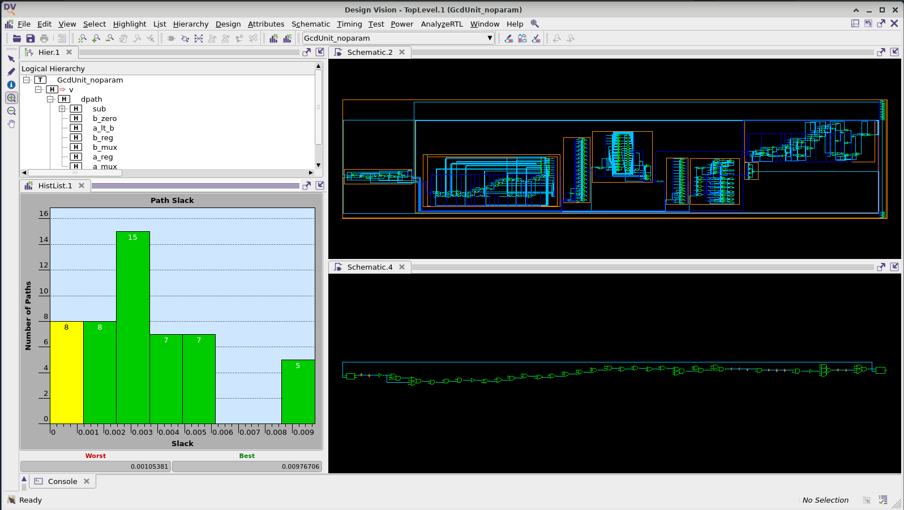

ECE 6745 Tutorial 6: ASIC Front-End Flow
==========================================================================

In this lab, we will be discussing the key tools used for ASIC front-end flow
which includes RTL simulation, synthesis, and fast-functional gate-level
simulation. This tutorial requires entering commands manually for each of the
tools to enable students to gain a better understanding of the detailed steps
involved in this process. A later lab will illustrate how this process can be
automated to facilitate rapid design-space exploration.

The following diagram illustrates the five primary tools we will be using
in ECE 6745 along with a few smaller secondary tools. The tools that
make-up the ASIC front-end flow are highlighted in red. Notice that the
ASIC tools all require various views from the standard-cell library.
Before starting this tutorial, you must complete the ASIC standard-cell
tutorial so you can understand all of these views.


 1. We write our RTL models in Verilog, and we use the PyMTL framework to
    test, verify, and evaluate the execution time (in cycles) of our
    design. This part of the flow is very similar to the flow used in
    ECE 4750. Once we are sure our design is working correctly, we can
    then start to push the design through the flow.

 2. We use **Synopsys VCS** to compile and run both 4-state RTL and gate-level
    simulations. These simulations help us to build confidence in our design as
    we push our designs through different stages of the flow. From these
    simulations, we also generate waveforms in `.vcd` (Verilog Change Dump)
    format, and per-net average activity factors stored in `.saif` format. These
    activity factors will be used for power analysis when we perform the
    back-end flow. Gate-level simulation is a valuable tool for ensuring the
    tools did not optimize something away which impacts the correctness of the
    design, and also provides an avenue for obtaining a more accurate power
    analysis than RTL simulation. While static timing analysis (STA) analyzes
    all paths, GL simulation can also serve as a backup to check for hold and
    setup time violations (chip designers must be paranoid!)

 3. We use **Synopsys Design Compiler (DC)** to synthesize our design,
    which means to transform the Verilog RTL model into a Verilog
    gate-level netlist where all of the gates are selected from the
    standard-cell library. We need to provide Synopsys DC with abstract
    logical and timing views of the standard-cell library in `.db`
    format. In addition to the Verilog gate-level netlist, Synopsys DC
    can also generate a `.ddc` file which contains information about the
    gate-level netlist and timing, and this `.ddc` file can be inspected
    using Synopsys Design Vision (DV). We will also use Synopsys DC to
    generate a `.sdc` which captures timing constraints which can then be
    used as input to the place-and-route tool.

 4. We use **Cadence Innovus** to place-and-route our design, which means
    to place all of the gates in the gate-level netlist into rows on the
    chip and then to generate the metal wires that connect all of the
    gates together. We need to provide Cadence Innovus with the same
    abstract logical and timing views used in Synopsys DC, but we also
    need to provide Cadence Innovus with technology information in
    `.lef`, and `.captable` format and abstract physical views of the
    standard-cell library also in `.lef` format. Cadence Innovus will
    generate an updated Verilog gate-level netlist, a `.spef` file which
    contains parasitic resistance/capacitance information about all nets
    in the design, and a `.gds` file which contains the final layout. The
    `.gds` file can be inspected using the open-source Klayout GDS
    viewer. Cadence Innovus also generates reports which can be used to
    accurately characterize area and timing.

 5. We use **Synopsys PrimeTime (PT)** to perform static timing and power
    analysis of our design. We need to provide Synopsys PT with the same
    abstract logical, timing, and power views used in Synopsys DC and Cadence
    Innovus, but in addition we need to provide switching activity information
    for every net in the design (which comes from the `.saif` file), and
    capacitance information for every net in the design (which comes from the
    `.spef` file). Synopsys PT puts the switching activity, capacitance, clock
    frequency, and voltage together to estimate the timing requirements and
    power consumption of every net and thus every module in the design, and
    these estimates are captured in various reports.

Extensive documentation is provided by Synopsys and Cadence for these
ASIC tools. We have organized this documentation and made it available to
you on the public course webpage:

 - <https://www.csl.cornell.edu/courses/ece6745/asicdocs>

The first step is to access `ecelinux`. Use VS Code to log into a
specific `ecelinux` server and then use Microsoft Remote Desktop to log
into the same server. Once you are at the `ecelinux` prompt, source the
setup script, source the GUI setup script, clone this repository from
GitHub, and define an environment variable to keep track of the top
directory for the project.

```bash
% source setup-ece6745.sh
% source setup-gui.sh
% mkdir -p ${HOME}/ece6745
% cd ${HOME}/ece6745
% git clone git@github.com:cornell-ece6745/ece6745-lab6 lab6
% cd lab6
% export TOPDIR=$PWD
% tree
```

To make it easier to cut-and-paste commands from this handout onto the
command line, you can tell Bash to ignore the `%` character using the
following command:

```bash
% alias %=""
```

1. PyMTL3-Based Testing, Simulation, Translation
--------------------------------------------------------------------------

Our goal in this tutorial is to generate a gate-level netlist for the GCD unit
from the previous lab using the ASIC tools. As a reminder, the GCD unit takes in
two 16-bit integers and returns the greatest common denominator for them as a
16-bit integer. We utilize a control-datapath split to cleanly separate the
control logic from the data flow as seen below.


### 1.1. Test and Translate a GCD Unit

Let's start by running the tests for the GCD unit. They should all pass since
the implementation is now filled in for you similarly to what you did in the
previous lab. The below command tests the functional-level unit, the RTL
implementation, as well as the interactive simulator.

```bash
% cd $TOPDIR/asic/build-gcd/01-pymtl-rtlsim
% pytest ../../../sim/tut3_verilog/gcd/
```

Note how the `sim/` folder also includes the `lab5_xcel` version of the GCD
unit. This directory contains the GCD unit encapsulated in the accelerator
wrapper required for communicating with our RISCV processor for performance
evaluations. For this lab, however, we will only be performing the block-level
flow of the GCD unit without this wrapper, hence we use the unwrapped version in
`tut3_verilog/`.

Once you have your design working rerun the tests with the `--test-verilog` and
`--dump-vtb` command line options. Note that some of the tests will be skipped,
specifically those testing the functional-level implementation since this will
not be translated to RTL.

```bash
% cd $TOPDIR/asic/build-gcd/01-pymtl-rtlsim
% pytest ../../../sim/tut3_verilog/gcd/ --test-verilog --dump-vtb
```

The `--test-verilog` and `--dump-vtb` command line options tells the
PyMTL3 framework to dump a Verilog testbench. While PyMTL3 enables
combining Python testbenches with Verilator Verilog simulation, we need
to translate our testbenches to Verilog so that we can use Synopsys VCS
to do 4-state and gate-level simulation. Let's look at a testbench cases
file generated from using the `--dump-vtb` flag.

```bash
% cd $TOPDIR/asic/build-gcd/01-pymtl-rtlsim
% cat GcdUnit_test_gcd_rtl_basic_0x0_tb.v.cases | head -n 10

`T('h00000000,'h1,'h0,'h0000,'h1,'h0);
`T('h00090075,'h1,'h1,'h0000,'h1,'h0);
`T('h00f00c30,'h0,'h1,'h0000,'h1,'h0);
`T('h00f00c30,'h0,'h1,'h0000,'h1,'h0);
`T('h00f00c30,'h0,'h1,'h0000,'h1,'h0);
`T('h00f00c30,'h0,'h1,'h0000,'h1,'h0);
`T('h00f00c30,'h0,'h1,'h0000,'h1,'h0);
`T('h00f00c30,'h0,'h1,'h0000,'h1,'h0);
`T('h00f00c30,'h0,'h1,'h0000,'h1,'h0);
`T('h00f00c30,'h0,'h1,'h0000,'h1,'h0);
```

This file is generated by logging the inputs and outputs of the Verilator
RTL simulation each cycle. It will be passed into a Verilog testbench
runner that will use these values to set the inputs each cycle and to
verify the outputs each cycle. So note that when we utilize these
testbenches later on, we are running a simulation that is simply
confirming that we achieve the same behavior as the Verilator RTL
simulation we ran using PyMTL3, and it is not actually using any
assertions you wrote in your Python tests for your design. Therefore, it
is important that your RTL simulations pass using PyMTL3 and Verilator
before you move on to other simulations. Also take a look at the
testbench itself to get a sense for how it works. It essentially
instantiates your top module as `DUT`, sets the inputs, and performs a
check every cycle on the outputs.

```bash
% cd $TOPDIR/asic/build-gcd/01-pymtl-rtlsim
% less GcdUnit_test_gcd_rtl_basic_0x0_tb.v
```

Press 'q' to exit `less`

### 1.2. Interactive Simulator for GCD Unit

After running the tests we use the interactive simulator for the sort
unit to do the final evaluation.

```bash
% cd $TOPDIR/asic/build-gcd/01-pymtl-rtlsim
% ../../../sim/tut3_verilog/gcd/gcd-sim --short-mname --impl rtl \
                                        --stats --translate --dump-vtb
num_cycles          = 8685
num_cycles_per_sort = 86.85
```

Take a moment to open up the translated Verilog which should be in a file named
`GcdUnit__pickled.v`. The Verilog module name includes a suffix to make
it unique for a specific set of parameters.

To simplify rerunning a simulation, we can put the above command lines in
a shell script. We have created such a run script for you. Let's take a
look to confirm these scripts match the manual commands we used above.

```bash
% cd $TOPDIR/asic/build-gcd/
% cat ./01-pymtl-rtlsim/run
```

You can rerun PyMTL simulation as follows.

```bash
% cd $TOPDIR/asic/build-gcd/
% ./01-pymtl-rtlsim/run
```

2. Synopsys VCS for 4-state RTL simulation
-------------------------------------------------------------------------

Using the PyMTL simulation framework can give us a good foundation in
verifying a design. However, the Verilator RTL simulator is only a
2-state simulation, meaning a signal can only be `0` or `1`. An
alternative form of RTL simulation is a 4-state simulation, in which
signals can be `0`, `1`, `x`, or `z`.

It is important to note a key difference between 2-state and 4-state
simulation. In 2-state simulation, each variable is initialized to a
predetermined value. This initial condition assumption may or may not be
what happens in actual silicon! As a result, a different initial
condition could introduce a bug that was not caught by our 2-state
Verilator RTL simulation. In 4-state simulations no such assumptions are
made. Instead, every signal begins as `x`, and only resolves to a `0` or
`1` after it is driven or resolved using x-propagation. Consider the
following pseudocode:

```verilog
always @(*)
begin
  if ( control_signal )
    // set signal "signal_a", but bug causes chip to fail
  else
    // set signal "signal_a" such that everything works fine
end
```

If `control_signal` is not reset, then in 2-state simulation if you
initialize all state to zero it will look like the chip works fine, but
this is not a safe assumption! The real chip does not guarantee that all
state is initialized to zero, so we can model that in four state
simulation as an `x`. Since the control signal could initialize to 1,
this could non-deterministically cause the chip to fail! What you would
see in simulation is that `signal_a` would become an `x`, because we do
not know the value of `control_signal` on reset. This `x` is propagated
through the design, and some simulators are more optimistic/pessimistic
about x's than others. For example, a pessimistic simulator may just
assume that any piece of logic that has an x on the input, outputs an x.
This is pessimistic because it is *possible* that you can still resolve
the output (imagine a mux where two inputs are the same but the select
bit is an `x`). Optimism is the opposite, resolving signals to `0` or `1`
that should remain an `x`.

If your design is passing every 2-state simulation, but failing every
4-state simulation, it may be because invalid fields are being set to
`x`'s. Our test harnesses require all outputs to always be `0` or `1`
even if a field is invalid. So you may need to force invalid fields to
zero and ensure that during a correct execution the outputs of your
module are never `x`'s.

We run Synopsys VCS to compile a simulation, and `./simv` to run the
simulation. Let's run a 4-state simulation for `test_basic` using the
design `GcdUnit__pickled.v`.

```bash
% cd $TOPDIR/asic/build-gcd/02-synopsys-vcs-rtlsim/
% vcs -sverilog -xprop=tmerge -override_timescale=1ns/1ps -top Top \
    +vcs+dumpvars+waves.vcd \
    +incdir+${TOPDIR}/asic/build-gcd/01-pymtl-rtlsim \
    ${TOPDIR}/asic/build-gcd/01-pymtl-rtlsim/GcdUnit_noparam_test_gcd_rtl_basic_0x0_tb.v \
    ${TOPDIR}/asic/build-gcd/01-pymtl-rtlsim/GcdUnit_noparam__pickled.v
% ./simv
```

Here some of the key command line options for Synopsys VCS:

```
-sverilog                     indicates we are using SystemVerilog
-xprop=tmerge                 use more advanced X propagation
-override_timescale=1ns/1ps   changes the timescale. Units/precision
-top Top                      name of the top module (located within the VTB)
+vcs+dumpvars+filename.vcd    dump VCD in current dir with the name filename.vcd
+incdir+$TOPDIR/asic/build_X  specifies directories to search for `include
```

Synopsys VCS is a sophisticated tool with many command line options. If
you want to learn more on your own about other options that are available
to you with Synopsys VCS, you can look at the user guides on the course
webpage:

 - <https://www.csl.cornell.edu/courses/ece6745/asicdocs>

Open up the resulting VCD files and notice how all of the input ports
start as X values and then eventually become non-X values after reset.
Notice how the pipeline registers are not reset so it takes a few cycles
for them to be output non-X values.


Let's run another 4-state simulation, this time using the testbench from
the sort-rtl simulator run that we ran earlier. Note that while we can
use this VCD for power analysis, for the purposes of this tutorial we
will only be doing power analysis using the gate-level netlist.

```bash
% cd $TOPDIR/asic/build-gcd/02-synopsys-vcs-rtlsim/
% vcs -sverilog -xprop=tmerge -override_timescale=1ns/1ps -top Top \
    +vcs+dumpvars+waves.vcd \
    +incdir+${TOPDIR}/asic/build-gcd/01-pymtl-rtlsim \
    ${TOPDIR}/asic/build-gcd/01-pymtl-rtlsim/GcdUnit_random_tb.v \
    ${TOPDIR}/asic/build-gcd/01-pymtl-rtlsim/GcdUnit__pickled.v
% ./simv
```

To simplify rerunning a simulation, we can put the above command lines in
a shell script. We have created such a run script for you. Let's take a
look to confirm these scripts match the manual commands we used above.

```bash
% cd $TOPDIR/asic/build-gcd/
% cat ./02-synopsys-vcs-rtlsim/run
```

You can rerun four-state RTL simulation as follows.

```bash
% cd $TOPDIR/asic/build-gcd/
% ./02-synopsys-vcs-rtlsim/run
```

3. Synopsys Design Compiler for Synthesis
--------------------------------------------------------------------------

We use Synopsys Design Compiler (DC) to synthesize Verilog RTL models
into a gate-level netlist where all of the gates are from the standard
cell library. So Synopsys DC will synthesize the Verilog `+` operator
into a specific arithmetic block at the gate-level. Based on various
constraints it may synthesize a ripple-carry adder, a carry-look-ahead
adder, or even more advanced parallel-prefix adders.

We start by creating a subdirectory for our work, and then launching
Synopsys DC.

```bash
% cd $TOPDIR/asic/build-gcd/03-synopsys-dc-synth/
% dc_shell-xg-t
```

To make it easier to copy-and-paste commands from this document, we tell
Synopsys DC to ignore the prefix `dc_shell>` using the following:

```
dc_shell> alias "dc_shell>" ""
```

### 3.1. Initial Setup

There are two important variables we need to set before starting to work
in Synopsys DC. The `target_library` variable specifies the standard
cells that Synopsys DC should use when synthesizing the RTL. The
`link_library` variable should search the standard cells, but can also
search other cells (e.g., SRAMs) when trying to resolve references in our
design. These other cells are not meant to be available for Synopsys DC
to use during synthesis, but should be used when resolving references.
Including `*` in the `link_library` variable indicates that Synopsys DC
should also search all cells inside the design itself when resolving
references.

```
dc_shell> set_app_var target_library "$env(TSMC_180NM)/stdcells.db"
dc_shell> set_app_var link_library   "* $env(TSMC_180NM)/stdcells.db"
```

Note that we can use `$env(TSMC_180NM)` to get access to the
`$TSMC_180NM` environment variable which specifies the directory
containing the standard cells, and that we are referencing the abstract
logical and timing views in the `.db` format.

### 3.2. Inputs

As an aside, if you want to learn more about any command in any Synopsys
tool, you can simply type `man toolname` at the shell prompt. We are now
ready to read in the Verilog file which contains the top-level design and
all referenced modules. We do this with two commands. The `analyze`
command reads the Verilog RTL into an intermediate internal
representation. The `elaborate` command recursively resolves all of the
module references starting from the top-level module, and also infers
various registers and/or advanced data-path components.

```
dc_shell> analyze -format sverilog ../01-pymtl-rtlsim/GcdUnit__pickled.v
dc_shell> elaborate GcdUnit
```

### 3.3. Timing Constraints

We need to create a clock constraint to tell Synopsys DC what our target
cycle time is. Synopsys DC will not synthesize a design to run "as fast
as possible". Instead, the designer gives Synopsys DC a target cycle time
and the tool will try to meet this constraint while minimizing area and
power. The `create_clock` command takes the name of the clock signal in
the Verilog (which in this course will always be `clk`), the label to
give this clock (i.e., `ideal_clock1`), and the target clock period in
nanoseconds. So in this example, we are asking Synopsys DC to see if it
can synthesize the design to run at 333 MHz (i.e., a cycle time of 3.0ns).

```
dc_shell> create_clock clk -name ideal_clock1 -period 3.0
```

In addition to the clock constraint we also need to constrain the max
transition time to ensure no net takes a very long time to transition.
Here we constrain the max transition to be 250ps.

```
dc_shell> set_max_transition 0.250 GcdUnit
```

We need to constrain what kind of cells are expected to drive the input pins and
what kind of load is expected at the output pin so Synopsys DC can properly
synthesize the design. Here we constrain the input cells to be inverters with 2x
drive strength and the output load to be the input gate capacitance of the 2x
drive strength inverter.

```
dc_shell> set_driving_cell -no_design_rule -lib_cell INVD2BWP7T [all_inputs]
dc_shell> set_load [load_of [get_lib_pin "*/INVD2BWP7T/I"]] [all_outputs]
```

In an ideal world, all inputs would change immediately with the clock
edge. In reality, this is not the case since there will be some logic
before this block on the chip as shown in the following figure.


We need to include reasonable propagation and contamination delays for the input
ports so Synopsys DC can factor these into its timing analysis. Here, we choose
the max input delay constraint to be 50ps (i.e., the block needs to meet the
setup time constraints even if the inputs change 50ps after the rising edge of
the clock), and we choose the min input delay constraint to be 0ps (i.e., the
block needs to meet the hold time constraints even if the inputs change right on
the rising edge clock). We also set the input slew rate (how long it takes
inputs to change from 0 to 1 or 1 to 0) to 0 for simplicity. In reality, the
calculation of this input slew rate would be determined beforehand based on
heuristic data.

```
dc_shell> set_input_transition 0 [all_inputs]
dc_shell> set_input_delay -clock ideal_clock1 -max 0.050 [all_inputs -exclude_clock_ports]
dc_shell> set_input_delay -clock ideal_clock1 -min 0.000 [all_inputs -exclude_clock_ports]
```

We also need to constrain the output ports since there will be some logic
after this block on the chip as shown in the following figure.


We need to include reasonable setup and hold time constraints for the
output ports so Synopsys DC can factor these into its timing
analysis. Here we choose a setup time constraint of 50ps meaning the
output data must be stable 50ps before the rising edge of the clock, and
we choose a hold time constraint of 0ps meaning the outputs can change
right on the rising edge of the clock.

```
dc_shell> set_output_delay -clock ideal_clock1 -max 0.050 [all_outputs]
dc_shell> set_output_delay -clock ideal_clock1 -min 0.000 [all_outputs]
```

Finally we also need to constrain any combinational paths which go
directly from the input ports to the output ports. Here we constrain such
paths to be no longer than one cycle.

```
dc_shell> set_max_delay 3.0 -from [all_inputs -exclude_clock_ports] -to [all_outputs]
```

Once we have finished setting all of the constraints we can use
`check_timing` to make sure there are no unconstrained paths or other
issues.

```
dc_shell> check_timing
```

Ensure this command does not produce any warnings or errors. If there are any,
check with a TA before moving on (the last line of the output should be a "1"
indicating success).

### 3.4. Synthesis

We can use the `check_design` command to make sure there are no obvious
errors in our Verilog RTL.

```
dc_shell> check_design
```

It is _critical_ that you carefully review all warnings and errors when
you analyze and elaborate a design with Synopsys DC. There may be many
warnings, but you should still skim through them. Often times there will
be something very wrong in your Verilog RTL which means any results from
using the ASIC tools is completely bogus. Synopsys DC will output a
warning, but Synopsys DC will usually just keep going, potentially
producing a completely incorrect gate-level model!

Finally, the `compile` command will do the synthesis.

```
dc_shell> compile
```

During synthesis, Synopsys DC will display information about its
optimization process. It will report on its attempts to map the RTL into
standard-cells, optimize the resulting gate-level netlist to improve the
delay, and then optimize the final design to save area.

The `compile` command does not _flatten_ your design. Flatten means to
remove module hierarchy boundaries; so instead of having module A and
module B within module C, Synopsys DC will take all of the logic in
module A and module B and put it directly in module C. You can enable
flattening with the `-ungroup_all` option. Without extra hierarchy
boundaries, Synopsys DC is able to perform more optimizations and
potentially achieve better area, energy, and timing. However, an
unflattened design is much easier to analyze, since if there is a module
A in your RTL design that same module will always be in the synthesized
gate-level netlist.

The `compile` command does not perform many optimizations. Synopsys DC
also includes `compile_ultra` which does many more optimizations and will
likely produce higher quality of results. Keep in mind that the `compile`
command _will not_ flatten your design by default, while the
`compile_ultra` command _will_ flatten your design by default. You can
turn off flattening by using the `-no_autoungroup` option with the
`compile_ultra` command. `compile_ultra` also has the option
`-gate_clock` which automatically performs clock gating on your design,
which can save quite a bit of power. Once you finish this tutorial, feel
free to go back and experiment with this command.

```
dc_shell> compile_ultra -no_autoungroup -gate_clock
```

### 3.4. Outputs

Now that we have synthesized the design, we output the resulting gate-level
netlist in two different file formats: `.ddc` (which we will use with Synopsys
DesignVision) and Verilog. We also output an `.sdc` file which contains the
constraint information we gave Synopsys DC. We will pass this same constraint
information to Cadence Innovus during the place and route portion of the flow.

```
dc_shell> write -format ddc     -hierarchy -output post-synth.ddc
dc_shell> write -format verilog -hierarchy -output post-synth.v
dc_shell> write_sdc post-synth.sdc
```

We can use various commands to generate reports about timing and area.
The `report_timing` command will show the critical path through the
design.

```
dc_shell> report_timing -nets
```

Part of the report is displayed below.

```
  Point                                       Fanout      Incr       Path
  --------------------------------------------------------------------------
  clock ideal_clock1 (rise edge)                          0.00       0.00
  clock network delay (ideal)                             0.00       0.00
  v/dpath/a_reg/q_reg[1]/CP (DFD1BWP7T)                   0.00       0.00 r
  v/dpath/a_reg/q_reg[1]/Q (DFD1BWP7T)                    0.24       0.24 f
  v/dpath/a_reg/q[1] (net)                      2         0.00       0.24 f
  v/dpath/a_reg/q[1] (vc_EnResetReg_p_nbits16_0)          0.00       0.24 f
  v/dpath/a_reg_out[1] (net)                              0.00       0.24 f
  v/dpath/a_lt_b/in0[1] (vc_LtComparator_p_nbits16)       0.00       0.24 f
  v/dpath/a_lt_b/in0[1] (net)                             0.00       0.24 f
  v/dpath/a_lt_b/U61/ZN (CKND0BWP7T)                      0.05       0.29 r
  v/dpath/a_lt_b/n38 (net)                      2         0.00       0.29 r
  v/dpath/a_lt_b/U4/ZN (OAI21D0BWP7T)                     0.04       0.33 f
  v/dpath/a_lt_b/n42 (net)                      1         0.00       0.33 f
  v/dpath/a_lt_b/U2/ZN (MOAI22D0BWP7T)                    0.11       0.44 r
  v/dpath/a_lt_b/n44 (net)                      1         0.00       0.44 r
  v/dpath/a_lt_b/U1/ZN (ND2D1BWP7T)                       0.04       0.49 f
  v/dpath/a_lt_b/n23 (net)                      1         0.00       0.49 f
  v/dpath/a_lt_b/U16/Z (CKAN2D1BWP7T)                     0.11       0.59 f
  v/dpath/a_lt_b/n6 (net)                       1         0.00       0.59 f
  v/dpath/a_lt_b/U6/ZN (ND2D1BWP7T)                       0.06       0.65 r
  v/dpath/a_lt_b/n21 (net)                      1         0.00       0.65 r
  v/dpath/a_lt_b/U5/ZN (INVD1BWP7T)                       0.03       0.68 f
  v/dpath/a_lt_b/n46 (net)                      1         0.00       0.68 f
  v/dpath/a_lt_b/U15/Z (OR2D1BWP7T)                       0.10       0.77 f
  v/dpath/a_lt_b/n5 (net)                       1         0.00       0.77 f
  v/dpath/a_lt_b/U11/Z (OR2D1BWP7T)                       0.11       0.88 f
  v/dpath/a_lt_b/n1 (net)                       1         0.00       0.88 f
  v/dpath/a_lt_b/U39/Z (AN3D1BWP7T)                       0.12       1.00 f
  v/dpath/a_lt_b/n48 (net)                      1         0.00       1.00 f
  v/dpath/a_lt_b/U7/ZN (NR3D0BWP7T)                       0.12       1.12 r
  v/dpath/a_lt_b/n51 (net)                      1         0.00       1.12 r
  v/dpath/a_lt_b/U14/Z (OR2D1BWP7T)                       0.10       1.23 r
  v/dpath/a_lt_b/n4 (net)                       1         0.00       1.23 r
  v/dpath/a_lt_b/U19/ZN (NR2D1BWP7T)                      0.03       1.26 f
  v/dpath/a_lt_b/n53 (net)                      1         0.00       1.26 f
  v/dpath/a_lt_b/U8/ZN (NR3D0BWP7T)                       0.13       1.38 r
  v/dpath/a_lt_b/n55 (net)                      1         0.00       1.38 r
  v/dpath/a_lt_b/U41/ZN (NR3D0BWP7T)                      0.07       1.46 f
  v/dpath/a_lt_b/n58 (net)                      1         0.00       1.46 f
  v/dpath/a_lt_b/U48/ZN (NR3D0BWP7T)                      0.13       1.59 r
  v/dpath/a_lt_b/n61 (net)                      1         0.00       1.59 r
  v/dpath/a_lt_b/U40/ZN (INR3D0BWP7T)                     0.05       1.64 f
  v/dpath/a_lt_b/n63 (net)                      1         0.00       1.64 f
  v/dpath/a_lt_b/U13/Z (OR2D0BWP7T)                       0.14       1.78 f
  v/dpath/a_lt_b/n3 (net)                       1         0.00       1.78 f
  v/dpath/a_lt_b/U30/ZN (NR2XD0BWP7T)                     0.07       1.85 r
  v/dpath/a_lt_b/n65 (net)                      1         0.00       1.85 r
  v/dpath/a_lt_b/U12/Z (OR2D1BWP7T)                       0.09       1.94 r
  v/dpath/a_lt_b/n2 (net)                       1         0.00       1.94 r
  v/dpath/a_lt_b/U22/ZN (NR2D1BWP7T)                      0.04       1.98 f
  v/dpath/a_lt_b/n70 (net)                      1         0.00       1.98 f
  v/dpath/a_lt_b/U21/ZN (OAI22D2BWP7T)                    0.08       2.06 r
  v/dpath/a_lt_b/n71 (net)                      1         0.00       2.06 r
  v/dpath/a_lt_b/U20/ZN (OAI21D2BWP7T)                    0.07       2.13 f
  v/dpath/a_lt_b/n73 (net)                      1         0.00       2.13 f
  v/dpath/a_lt_b/U58/ZN (IOA21D2BWP7T)                    0.06       2.19 r
  v/dpath/a_lt_b/out (net)                      4         0.00       2.19 r
  v/dpath/a_lt_b/out (vc_LtComparator_p_nbits16)          0.00       2.19 r
  v/dpath/is_a_lt_b (net)                                 0.00       2.19 r
  v/dpath/is_a_lt_b (tut3_verilog_gcd_GcdUnitDpath)       0.00       2.19 r
  v/is_a_lt_b (net)                                       0.00       2.19 r
  v/ctrl/is_a_lt_b (tut3_verilog_gcd_GcdUnitCtrl)         0.00       2.19 r
  v/ctrl/is_a_lt_b (net)                                  0.00       2.19 r
  v/ctrl/U5/Z (CKAN2D1BWP7T)                              0.13       2.32 r
  v/ctrl/a_mux_sel[0] (net)                     2         0.00       2.32 r
  v/ctrl/a_mux_sel[0] (tut3_verilog_gcd_GcdUnitCtrl)      0.00       2.32 r
  v/a_mux_sel[0] (net)                                    0.00       2.32 r
  v/dpath/a_mux_sel[0] (tut3_verilog_gcd_GcdUnitDpath)
                                                          0.00       2.32 r
  v/dpath/a_mux_sel[0] (net)                              0.00       2.32 r
  v/dpath/a_mux/sel[0] (vc_Mux3_p_nbits16)                0.00       2.32 r
  v/dpath/a_mux/sel[0] (net)                              0.00       2.32 r
  v/dpath/a_mux/U17/ZN (IND2D4BWP7T)                      0.09       2.41 r
  v/dpath/a_mux/n4 (net)                        1         0.00       2.41 r
  v/dpath/a_mux/U1/ZN (INVD4BWP7T)                        0.04       2.45 f
  v/dpath/a_mux/n5 (net)                       16         0.00       2.45 f
  v/dpath/a_mux/U7/Z (AO222D0BWP7T)                       0.36       2.81 f
  v/dpath/a_mux/out[0] (net)                    1         0.00       2.81 f
  v/dpath/a_mux/out[0] (vc_Mux3_p_nbits16)                0.00       2.81 f
  v/dpath/a_mux_out[0] (net)                              0.00       2.81 f
  v/dpath/a_reg/d[0] (vc_EnResetReg_p_nbits16_0)          0.00       2.81 f
  v/dpath/a_reg/d[0] (net)                                0.00       2.81 f
  v/dpath/a_reg/U9/ZN (MOAI22D0BWP7T)                     0.13       2.94 f
  v/dpath/a_reg/n3 (net)                        1         0.00       2.94 f
  v/dpath/a_reg/q_reg[0]/D (DFD1BWP7T)                    0.00       2.94 f
  data arrival time                                                  2.94

  clock ideal_clock1 (rise edge)                          3.00       3.00
  clock network delay (ideal)                             0.00       3.00
  v/dpath/a_reg/q_reg[0]/CP (DFD1BWP7T)                   0.00       3.00 r
  library setup time                                     -0.06       2.94
  data required time                                                 2.94
  --------------------------------------------------------------------------
  data required time                                                 2.94
  data arrival time                                                 -2.94
  --------------------------------------------------------------------------
  slack (MET)                                                        0.00
```

This timing report uses _static timing analysis_ to find the critical path.
Static timing analysis checks the timing across all paths in the design
(regardless of whether these paths can actually be used in practice) and finds
the longest path. For more information about static timing analysis, consult
Chapter 1 of the [Synopsys Timing Constraints and Optimization User
Guide](http://www.csl.cornell.edu/courses/ece6745/asicdocs/tcoug.pdf). The
report clearly shows that the critical path starts at bit 1 of the `a_reg` in
the datapath, goes into through a `vc_LtComparator`, then through the datapath
output port `is_a_lt_b` and into the control input port `is_a_lt_b` which
controls the `a_mux_sel` output in the `STATE_CALC` state via `do_swap`, through
the select port of a `vc_Mux3` to its output, which finally gets clocked back
into the `a_reg`. The report shows the delay through each logic gate (e.g., the
clk-to-q delay of the initial DFF is 240ps, the propagation delay of a
INVD1BWP7T gate is 30ps, etc.) and the total delay for the critical path which in
this case is 2.94ns.

The difference between the required arrival time and the actual arrival
time is called the _slack_. In the above report we just meet timing with
zero slack. Positive slack means the path arrived before it needed to
while negative slack means the path arrived after it needed to. If you
end up with negative slack, then you need to rerun the tools with a
longer target clock period until you can meet timing with no negative
slack. The process of tuning a design to ensure it meets timing is called
"timing closure". In this course, we are primarily interested in
design-space exploration as opposed to meeting some externally defined
target timing specification. So you will need to sweep a range of target
clock periods. **Your goal is to choose the shortest possible clock
period which still meets timing without any negative slack!** This will
result in a well-optimized design and help identify the "fundamental"
performance of the design. Alternatively, if you are comparing multiple
designs, sometimes the best situation is to tune the baseline so it meets
timing and then ensure the alternative designs have similar cycle times.
This will enable a fair comparison since all designs will be running at
the same cycle time.

The `report_area` command will show how much area is required to
implement each module in the design.

```
dc_shell> report_area -hierarchy
```

Part of the report is displayed below.

```
                                  Global cell area          Local cell area
                                  ------------------  ---------------------------- 
Hierarchical cell                 Absolute   Percent  Combi-     Noncombi-  Black-
                                  Total      Total    national   national   boxes   Design
--------------------------------  ---------  -------  ---------  ---------  ------  ----------------------------------
GcdUnit                           5360.6784    100.0     0.0000     0.0000  0.0000  GcdUnit
v                                 5360.6784    100.0   186.5920     0.0000  0.0000  tut3_verilog_gcd_GcdUnit
v/ctrl                             261.2288      4.9   173.4208    87.8080  0.0000  tut3_verilog_gcd_GcdUnitCtrl
v/dpath                           4912.8576     91.6    21.9520     0.0000  0.0000  tut3_verilog_gcd_GcdUnitDpath
v/dpath/a_lt_b                     704.6592     13.1   704.6592     0.0000  0.0000  vc_LtComparator_p_nbits16
v/dpath/a_mux                      467.5776      8.7   467.5776     0.0000  0.0000  vc_Mux3_p_nbits16
v/dpath/a_reg                      998.8160     18.6   298.5472   700.2688  0.0000  vc_EnResetReg_p_nbits16_0
v/dpath/b_mux                      300.7424      5.6   300.7424     0.0000  0.0000  vc_Mux2_p_nbits16
v/dpath/b_reg                     1036.1344     19.3   280.9856   755.1488  0.0000  vc_EnResetReg_p_nbits16_1
v/dpath/b_zero                      68.0512      1.3    68.0512     0.0000  0.0000  vc_ZeroComparator_p_nbits16
v/dpath/sub                       1314.9248     24.5     6.5856     0.0000  0.0000  vc_Subtractor_p_nbits16
v/dpath/sub/sub_56                1308.3392     24.4  1308.3392     0.0000  0.0000  vc_Subtractor_p_nbits16_DW01_sub_0
--------------------------------  ---------  -------  ---------  ---------  ------  ----------------------------------
Total                                                 3817.4528  1543.2256  0.0000

1
```

The design requires 5360um^2. The control logic requires only about 5% of the
total design area, with the datapath using the rest of it. The registers
(`a_reg` and `b_reg`) alone are responsible for using about 50% of the
datapath's area, which makes sense given registers commonly use the majority of
the area in a design. The wide subtractor block uses around 27% of the
datapath's area. Understanding the area breakdown of a block is _critical_ to
understanding areas of optimization for a given design.

Finally, we go ahead and exit Synopsys DC.

```
dc_shell> exit
```

Take a few minutes to examine the resulting Verilog gate-level netlist. Notice
that the module hierarchy is preserved and also notice that the `GcdUnit`
synthesizes into a large number of basic logic gates.

```bash
% cd $TOPDIR/asic/build-gcd/03-synopsys-dc-synth
% more post-synth.v
```

### 3.5. Synopsys Design Vision

We can use the Synopsys Design Vision (DV) tool for browsing the
resulting gate-level netlist, plotting critical path histograms, and
generally analyzing our design. Start Synopsys DV and setup the
`target_library` and `link_library` variables as before.

```
% cd $TOPDIR/asic/build-gcd/03-synopsys-dc-synth
% design_vision-xg
design_vision> set_app_var target_library "$env(TSMC_180NM)/stdcells.db"
design_vision> set_app_var link_library   "* $env(TSMC_180NM)/stdcells.db"
```

You can use the following steps to open the `.ddc` file generated during
synthesis.

 - Choose _File > Read_ from the menu
 - Open the `post-synth.dcc` file

You can then use the following steps to browse the gate-level schematic. First
select a module in the Logical Hierarchy panel. Then choose _Schematic > New
Schematic View_. You can double click on modules to expand them. You might also
want to try this approach to see the entire design at once:

 - Select the `GcdUnit` module in the Logical Hierarchy panel
 - Choose _Select > Cells > Leaf Cells of Selected Cells_ from the menu
 - Choose _Schematic > New Schematic View_ from the menu
 - Choose _Select > Clear_ from the menu

You can use the following steps to view a histogram of path slack, and
also to open a gave-level schematic of just the critical path.

 - Choose _Timing > Path Slack_ from the menu
 - Click _OK_ in the pop-up window
 - Select the left-most bar in the histogram to see list of most critical paths
 - Select one of the paths in the path list to highlight the path in the schematic view

Or you can right click on a path in the path list and choose _Path Schematic_ to
see just the gates that lie on the critical path. Notice that there quite a few
levels of logic (including the register at the start) on the critical path. The
number of levels of logic on the critical path can provide some very rough
first-order intuition on whether or not we might want to explore a more
aggressive clock constraint and/or adding more pipeline stages. If there are
just a few levels of logic on the critical path then our design is probably very
simple (as in this case!), while if there are more than 50 levels of logic then
there is potentially room for significant improvement. The following screen
capture illustrates using Synopsys Design Vision to explore the post-synthesis
results. While this can be interesting, in this course, we almost always prefer
exploring the post-place-and-route results, so we will not really use Synopsys
DV that often.



### 3.6. Automating Synthesis

You can automate the above steps by putting a sequence of commands in a
`.tcl` file and run Synopsys DC using those commands in one step like
this:

```bash
% cd $TOPDIR/asic/build-gcd/03-synopsys-dc-synth
% dc_shell-xg-t -f run.tcl
```

To further simplify rerunning this step, we can put the above command
line in its own shell script. We have created such run scripts for you.
Let's take a look to confirm these scripts match the manual commands we
used above.

```bash
% cd $TOPDIR/asic/build-gcd
% cat ./03-synopsys-dc-synth/run
% cat ./03-synopsys-dc-synth/run.tcl
```

You can rerun synthesis as follows.

```bash
% cd $TOPDIR/asic/build-gcd
% ./03-synopsys-dc-synth/run
```

4. Synopsys VCS for Fast-Functional Gate-Level Simulation
--------------------------------------------------------------------------

Before synthesis, we used Synopsys VCS to do a 4-state simulation. This
time, we'll be using VCS to perform a gate-level simulation, since we now
have a gate-level netlist available to us. Gate-level simulation provides
an advantage over RTL simulation because it more precisely represents the
specification of the true hardware generated by the tools. This sort of
simulation could propagate X's into the design that were not found by the
4-state RTL simulation, and it also verifies that the tools did not
optimize anything away during synthesis. We will use Synopsys VCS to run
our gate-level simulation on the `gcd-sim-rtl-random` simulator
testbench:

```bash
% cd $TOPDIR/asic/build-gcd/04-synopsys-vcs-ffglsim
% vcs -sverilog -xprop=tmerge -override_timescale=1ns/1ps -top Top \
    +delay_mode_zero \
    +vcs+dumpvars+waves.vcd \
    +incdir+${TOPDIR}/asic/build-gcd/01-pymtl-rtlsim \
    ${TSMC_180NM}/stdcells.v \
    ${TOPDIR}/asic/build-gcd/01-pymtl-rtlsim/GcdUnit_random_tb.v \
    ${TOPDIR}/asic/build-gcd/03-synopsys-dc-synth/post-synth.v
% ./simv
```

Notice there are some differences in the Synopsys VCS command we ran
here, and the one we ran for 4-state RTL simulation. In this version, we
use the gate-level netlist `post-synth.v` instead of the pickled file. We
also include the option `+delay_mode_zero` which tells Synopsys VCS to
run a fast-functional simulation in which no delays are considered. This
is similar to RTL simulation, and you should notice that all signals will
change on the clock edge. We also include the macros `CYCLE_TIME`,
`VTB_INPUT_DELAY` , `VTB_OUTPUT_ASSERT_DELAY`. These values control how
long after the rising edge we change the inputs and how long after the
rising edge we check the outputs.

To simplify rerunning a simulation, we can put the above command lines in
a shell script. We have created such a run script for you. Let's take a
look to confirm these scripts match the manual commands we used above.

```bash
% cd $TOPDIR/asic/build-gcd
% cat ./04-synopsys-vcs-ffglsim/run
```

You can rerun fast-functional gate-level simulation as follows.

```bash
% cd $TOPDIR/asic/build-gcd
% ./04-synopsys-vcs-ffglsim/run
```

5. To-Do On Your Own
--------------------------------------------------------------------------

Now we can use what you have learned so far to push the Sort unit through the
ASIC front-end flow. Create a new ASIC build directory and copy the scripts we
used to push the sort unit through the ASIC front-end flow.

```
% mkdir -p $TOPDIR/asic/build-sort/01-pymtl-rtlsim
% mkdir -p $TOPDIR/asic/build-sort/02-synopsys-vcs-rtlsim
% mkdir -p $TOPDIR/asic/build-sort/03-synopsys-dc-synth
% mkdir -p $TOPDIR/asic/build-sort/04-synopsys-vcs-ffglsim

% cp $TOPDIR/asic/build-gcd/01-pymtl-rtlsim/run          $TOPDIR/asic/build-sort/01-pymtl-rtlsim/run
% cp $TOPDIR/asic/build-gcd/02-synopsys-vcs-rtlsim/run   $TOPDIR/asic/build-sort/02-synopsys-vcs-rtlsim/run
% cp $TOPDIR/asic/build-gcd/03-synopsys-dc-synth/run     $TOPDIR/asic/build-sort/03-synopsys-dc-synth/run
% cp $TOPDIR/asic/build-gcd/03-synopsys-dc-synth/run.tcl $TOPDIR/asic/build-sort/03-synopsys-dc-synth/run.tcl
% cp $TOPDIR/asic/build-gcd/04-synopsys-vcs-ffglsim/run  $TOPDIR/asic/build-sort/04-synopsys-vcs-ffglsim/run
```

Now open up each of these files and modify so they push the Sort unit
instead of the GCD unit through the flow. You will need to update the
name of the Verilog source files and the top module name as follows:

 - Verilog source file name: `SortUnitStruct__pickled.v`
 - Verilog test source file name: `SortUnitStruct_random_tb.v`
 - Top module name for synthesis: `SortUnitStruct`

Basically, you just need to change `GcdUnit` to `SortUnitStruct` and `gcd` to
`sort` in all of the run scripts. You will also need to change the `--impl rtl`
option to `--impl rtl-struct` for PyMTL simulation. You can use `sed` to do
this:

```
% cd $TOPDIR/asic/build-sort
% find . -type f -exec sed -i.bak 's/GcdUnit/SortUnitStruct/' {} \;
% find . -type f -exec sed -i 's/gcd/sort/g' {} \;
% find . -type f -exec sed -i 's/--impl rtl/--impl rtl-struct/g' {} \;
```

Keep the cycle time constraint as 3.0ns and the other constraints as
before. Once you have updated the scripts you can then push the Sort unit
through the flow like this:

```bash
% cd $TOPDIR/asic/build-sort
% ./01-pymtl-rtlsim/run
% ./02-synopsys-vcs-rtlsim/run
% ./03-synopsys-dc-synth/run
% ./04-synopsys-vcs-ffglsim/run
```

Carefully look at the post-synthesis timing report to ensure your design
meetings timing:

```bash
% cd $TOPDIR/asic/build-sort
% cat 03-synopsys-dc-synth/timing.rpt
```

If your design does not meet timing, increase the cycle time constraint and try
again until it does meet timing. Spend time looking at the post-synthesis
gate-level netlist in `post-synth.v` and load the design into Synopsys Design
Vision to examine the critical path. Carefully look and the results from running
the fast-functional gate-level simulation to verify that the design is passing
the test. Convince yourself that the Sort unit was successfully pushed through
the ASIC front-end flow.
