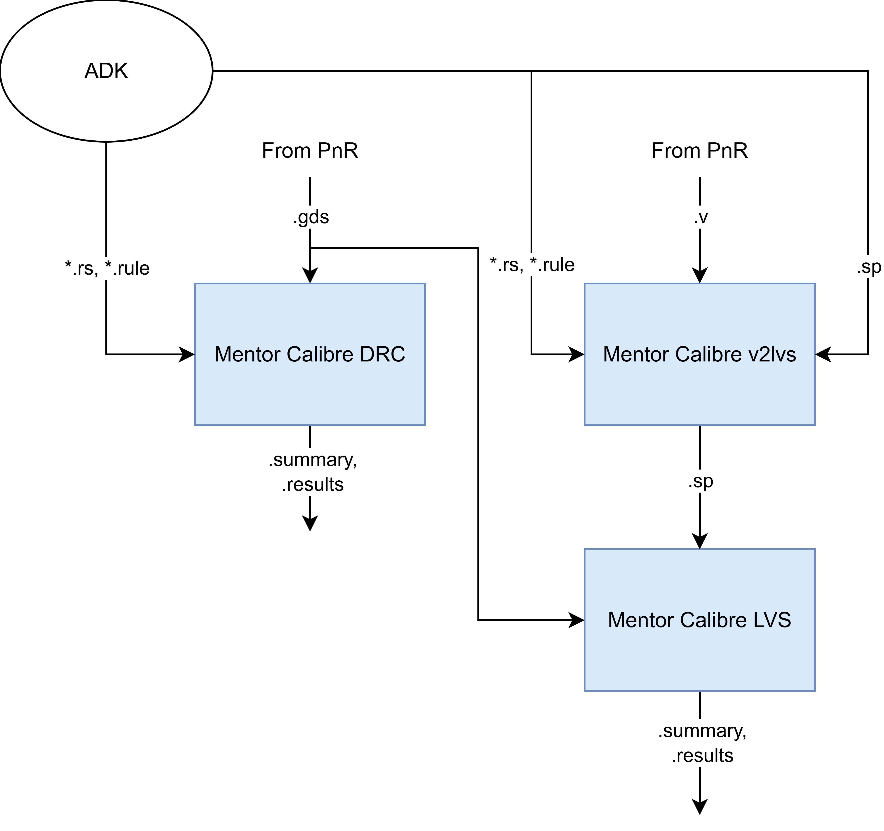
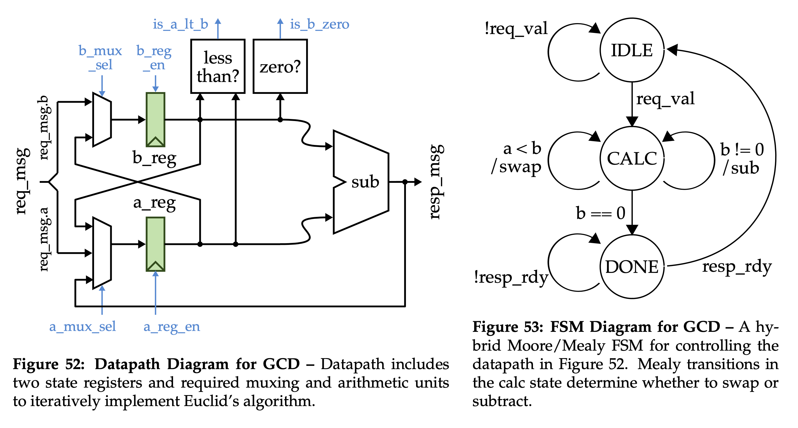

ECE 6745 Lab 7: Commercial Back-End Flow
==========================================================================

In this lab, we will be discussing the back-end of the ASIC toolflow.
More detailed tutorials will be posted on the public course website, but
this lab will at least give you a chance to take a gate-level netlist
through place-and-route, simulate the final gate-level netlist, perform
static timing and energy analysis, as well as execute DRC and LVS. The
following diagram illustrates the tool flow we will be using in ECE 6745.
Notice that the Synopsys and Cadence ASIC tools all require various views
from the standard-cell library which part of the ASIC design kit (ADK).


The "back-end" of the flow is highlighted in red and refers to the PyMTL
simulator, Synopsys DC, and Synopsys VCS:

 - We use **Cadence Innovus** to place-and-route our design, which means
   to place all of the gates in the gate-level netlist into rows on the
   chip and then to generate the metal wires that connect all of the
   gates together. We need to provide Cadence Innovus with the
   standard-cell library front- and back-end views. Cadence Innovus takes
   as input the `.lib` file which is the ASCII text version of a `.db`
   file. In addition, we need to provide Cadence Innovus with technology
   information in `.lef` and `.captable` format and abstract physical
   views of the standard-cell library in `.lef` format. Cadence Innovus
   will generate an updated Verilog gate-level netlist, a `.spef` file
   which contains parasitic resistance/capacitance information about all
   nets in the design, and a `.gds` file which contains the final layout.
   The `.gds` file can be inspected using the open-source Klayout GDS
   viewer. Cadence Innovus also generates reports which can be used to
   accurately characterize area and timing.

 - We use **Synopsys VCS** for back-annotated gate-level simulation.
   Gate-level simulation involves simulating every standard-cell gate and
   helps verify that the Verilog gate-level netlist is functionally
   correct. Fast-functional gate-level simulation does not include any
   timing information, while back-annotated gate-level simulation does
   include the estimated delay of every gate and every wire.

 - We use **Synopsys PrimeTime (PT)** to perform both static timing
   analysis and power-analysis of our design. Both of these require
   parasitic capacitance information for every net in the design (which
   comes from Cadence Innovus), and power-analysis additionally requires
   switching activity information for every net in the design (which
   comes from the back-annotated gate-level simulation). Synopsys PT puts
   the capacitance and clock frequency together to estimate setup and
   hold time on each path of the design, while also putting in switching
   activity and voltage to estimate the power consumption of every net
   and thus every module in the design.



The diagram above illustrates the DRC (design-rules check) and LVS
(layout-versus-schematic) verification flow using Mentor Calibre. These
checks are performed after place-and-route to ensure the design is ready
for manufacturing:

 - **DRC Flow**: The post-PNR GDS file is checked against the foundry's
   design rules. The rules file (`.rule`) contains geometric constraints
   such as minimum metal width, minimum spacing between wires, minimum
   area for metal shapes, and enclosure rules for vias.

 - **LVS Flow**: The post-PNR Verilog netlist is first converted to
   SPICE format using `v2lvs`. Then Calibre extracts the circuit
   connectivity from the GDS layout and compares it against the SPICE
   netlist to ensure they match.

Calibre is configured using **runset files** (`.rs`), which capture all
the options that would normally be set through the Calibre GUI. The
runset files specify:

 - **Rules file**: Path to the foundry-provided rule file
 - **Run directory**: Where to store the results
 - **Layout file**: The GDS file to check/extract
 - **Top cell**: The top-level cell name in the layout
 - **Source file** (LVS only): The SPICE netlist to compare against
 - **Rule waivers** (DRC only): Which checks to skip for block-level design

By using runset files, you can run Calibre in batch mode and easily
re-run DRC/LVS after making changes. When moving to a new design, you
only need to update the top cell name in the runset file. We consider DRC
and LVS as part of "signoff," where we essentially "sign-off" that the
block is clean and ready to be taped out or instantiated in a larger
design.

Here is a list of all of the steps we will be working with today.

```
01-pymtl-rtlsim
02-synopsys-vcs-rtlsim
03-synopsys-dc-synth
04-synopsys-vcs-ffglsim
05-cadence-innovus-pnr
06-synopsys-pt-sta
07-synopsys-vcs-baglsim
08-synopsys-pt-pwr
09-mentor-calibre-drc
10-mentor-calibre-lvs
```

Extensive documentation is provided by Synopsys and Cadence. We have
organized this documentation and made it available to you on the Canvas
course page:

 - <https://www.csl.cornell.edu/courses/ece6745/asicdocs>

1. Logging Into `ecelinux`
--------------------------------------------------------------------------

!!! warning "Students MUST work in pairs!"

    You MUST work in pairs for this lab, as having too many instances of
    Innovus open at once can cause the `ecelinux` servers to crash. So
    find a partner and work together at a workstation to complete today's
    lab.

Follow the same process as previous labs. Find a free workstation and log
into the workstation using your NetID and standard NetID password. Then
complete the following steps.

 - Start VS Code
 - Install the Remote-SSH extension, Surfer, Python, and Verilog extensions
 - Use View > Command Palette to execute Remote-SSH: Connect Current Window to Host...
 - Enter netid@ecelinux-XX.ece.cornell.edu where XX is an ecelinux server number
 - Use View > Explorer to open your home directory on ecelinux
 - Use View > Terminal to open a terminal on ecelinux
 - Start MS Remote Desktop

Now use the following commands to clone the repo we will be using for
today's lab.

```bash
% source setup-ece6745.sh
% source setup-gui.sh
% mkdir -p ${HOME}/ece6745
% cd ${HOME}/ece6745
% git clone git@github.com:cornell-ece6745/ece6745-lab7 lab7
% cd lab7
% tree
```

To make it easier to cut-and-paste commands from this handout onto the
command line, you can tell Bash to ignore the `%` character using the
following command:

```bash
% alias %=""
```

2. Ripple Carry Adder
--------------------------------------------------------------------------

In this section, we will push a four-bit ripple carry adder through both
the front- and back-end flow. We will work in
`${HOME}/ece6745/lab7/asic/playground/addrc4b` with numbered step
directories.

### 2.1. Front-End Flow

We have provided complete runscripts for the front-end flow from last lab
Simply run each step in order:

```bash
% cd ${HOME}/ece6745/lab7/asic/playground/addrc4b
% ./01-pymtl-rtlsim/run
% ./02-synopsys-vcs-rtlsim/run
% ./03-synopsys-dc-synth/run
% ./04-synopsys-vcs-ffglsim/run
```

Look at the logs for each step. Make sure all tests are passing. Make
sure there are no errors during synthesis. Take a look at the resulting
post-synthesis gate-level netlist to remind yourself what we will be
pushing through the back-end flow.

```bash
% cd ${HOME}/ece6745/lab7/asic/playground/addrc4b
% cat ./03-synopsys-dc-synth/post-synth.v
```

### 2.2. Place-and-Route

We will be working in the `05-cadence-innovus-pnr` directory.

```bash
% cd ${HOME}/ece6745/lab7/asic/playground/addrc4b/05-cadence-innovus-pnr
```

**Constraint and Timing Input Files**

Before starting Cadence Innovus, we need to create the timing setup file.
This "multi-mode multi-corner" (MMMC) analysis file specifies what
"corner" to use for our timing analysis. A corner specifies process,
temperature, and voltage conditions on which to optimize the design and
fix timing violations. The more corners that are considered for
optimization, the better the design will perform under various conditions
when taped-out on silicon. While multiple corners can be configured, we
only use the typical corner for this lab. Use VS Code to create a file
named `setup-timing.tcl`:

```bash
% cd ${HOME}/ece6745/lab7/asic/playground/addrc4b/05-cadence-innovus-pnr
% code setup-timing.tcl
```

The file should have the following content:

```
create_rc_corner -name typical \
   -cap_table "$env(TSMC_180NM)/typical.captable" \
   -T 25

create_library_set -name libs_typical \
   -timing [list "$env(TSMC_180NM)/stdcells.lib"]

create_delay_corner -name delay_default \
   -library_set libs_typical \
   -rc_corner typical

create_constraint_mode -name constraints_default \
   -sdc_files [list ../03-synopsys-dc-synth/post-synth.sdc]

create_analysis_view -name analysis_default \
   -constraint_mode constraints_default \
   -delay_corner delay_default

set_analysis_view \
   -setup analysis_default \
   -hold analysis_default
```

Here is an explanation of each command:

 - **`create_rc_corner`**: Creates an RC (resistance/capacitance) corner
   that defines the interconnect parasitic characteristics. The
   `-cap_table` option loads the `.captable` file which contains
   information about the resistance and capacitance of every metal layer.
   The `-T 25` option specifies an operating temperature of 25 degrees
   Celsius. We are using the "typical" captable which represents average
   process conditions.

 - **`create_library_set`**: Creates a library set that groups together
   timing libraries. The `-timing` option loads the `.lib` file which
   contains timing information for each standard cell including
   input/output capacitance and delay from every input to every output.

 - **`create_delay_corner`**: Creates a delay corner by combining a
   library set with an RC corner. This represents a specific PVT
   (process, voltage, temperature) operating condition. In this case, we
   combine the typical library with the typical RC corner to create a
   "typical" delay corner.

 - **`create_constraint_mode`**: Creates a constraint mode that specifies
   the timing constraints for the design. The `-sdc_files` option loads
   the SDC (Synopsys Design Constraints) file generated during synthesis,
   which contains clock definitions, input/output delays, and other
   timing constraints.

 - **`create_analysis_view`**: Creates an analysis view by combining a
   constraint mode with a delay corner. An analysis view represents a
   complete timing scenario that the tool will use for optimization and
   analysis.

 - **`set_analysis_view`**: Tells Cadence Innovus which analysis views to
   use for setup time analysis (`-setup`) and hold time analysis
   (`-hold`). In this case, we use the same analysis view for both.

**Initial Setup and Floorplanning**

Now we can start Cadence Innovus. Note that we are using the Cadence
Innovus GUI so you will need to use Microsoft Remote Desktop.

```bash
% cd ${HOME}/ece6745/lab7/asic/playground/addrc4b/05-cadence-innovus-pnr
% innovus
```

We need to set various variables before starting to work in Cadence
Innovus. These variables tell Cadence Innovus the location of the MMMC
file, the location of the Verilog gate-level netlist, the name of the
top-level module in our design, the location of the `.lef` files, and
finally the names of the power and ground nets. Note that you cannot
block-copy-and-paste these commands as we cannot make an alias for
"innovus>" in the Innovus shell, so you will need to enter each line one
at a time without the "innovus>" header. After each command runs, check
how the current view of the block changes in the Innovus GUI window.

```
innovus> set init_mmmc_file "setup-timing.tcl"
innovus> set init_verilog   "../03-synopsys-dc-synth/post-synth.v"
innovus> set init_top_cell  "AdderRippleCarry_4b"
innovus> set init_lef_file  [list "$env(TSMC_180NM)/apr-tech.tlef" "$env(TSMC_180NM)/stdcells.lef"]
innovus> set init_pwr_net   "VDD"
innovus> set init_gnd_net   "VSS"
```

We can now use the `init_design` command to read in the Verilog, set the
design name, setup the timing analysis views, read the technology `.lef`
for layer information, and read the standard cell `.lef` for physical
information about each cell used in the design.

```
innovus> init_design
```

We start by working on floorplanning. Use the `floorPlan` command to set
the dimensions for our chip. Since the ripple carry adder is a small
combinational design, we use small margins (0.5um):

```
innovus> floorPlan -r 1.0 0.70 0.5 0.5 0.5 0.5
```

In this example, we have chosen the aspect ratio to be 1.0, the target
cell utilization to be 0.7, and we have added 0.5um of margin around the
top, bottom, left, and right of the chip. This small design does not need
a power ring.

**Placement**

The standard cell library we are using does not include substrate and
well taps within each standard cell. Instead, the library includes
special tap cells which have these contacts. So we need to start by
placing tap cells at a fixed interval across the design.

```
innovus> set_well_tap_mode -cell TAPCELLBWP7T
innovus> addWellTap -cellInterval 29.68
```

You should see the placed tap cells in the GUI. Now we can place all of
the standard cells.

```
innovus> place_design
```

You should be able to see the standard cells placed in the rows along
with preliminary routing to connect all of the standard cells together.
You can toggle the visibility of metal layers by pressing the number keys
on the keyboard. Place the input/output pins so they are close to the
standard cells they are connected to:

```
innovus> assignIoPins -pin *
```

**Power Routing**

Now we need to tell Cadence Innovus that `VDD` and `VSS` in the
gate-level netlist correspond to the physical pins labeled `VDD` and
`VSS` in the `.lef` files:

```
innovus> globalNetConnect VDD -type pgpin -pin VDD -all -verbose
innovus> globalNetConnect VSS -type pgpin -pin VSS -all -verbose
```

Route the power and ground nets:

```
innovus> sroute -nets {VDD VSS}
```

**Signal Routing**

Use the `routeDesign` command to do a detailed routing pass:

```
innovus> routeDesign
```

Extract the parasitic resistance and capacitances:

```
innovus> extractRC
```

**Final Output and Reports**

Add filler cells to complete each row of standard cells:

```
innovus> setFillerMode -core {FILL1BWP7T FILL2BWP7T FILL4BWP7T FILL8BWP7T}
innovus> addFiller
```

Save the design and generate several output files that will be used in
subsequent steps of the flow:

 - **post-pnr.v**: Gate-level Verilog netlist with the final placed and
   routed cells; used for gate-level simulation
 - **post-pnr.spef**: Standard Parasitic Exchange Format file containing
   extracted resistance and capacitance values for all wires; used for
   accurate timing and power analysis
 - **post-pnr.sdf**: Standard Delay Format file containing timing delays
   for all cells and interconnects; used for back-annotated gate-level
   simulation (baglsim)
 - **post-pnr.sdc**: Synopsys Design Constraints file containing the
   timing constraints; used for static timing analysis

```
innovus> saveNetlist post-pnr.v
innovus> rcOut -rc_corner typical -spef post-pnr.spef
innovus> write_sdf post-pnr.sdf
innovus> write_sdc -strict post-pnr.sdc
```

Generate the final layout as a GDS file by merging in the GDS for the
standard cells and using a map file to assign layers in Innovus to layers
in the final GDS. GDS is the industry-standard format for IC layout data
that will be used for DRC and LVS verification, and will also be the file
that is sent to the fab that tapes out the chip.

```
innovus> streamOut post-pnr.gds -units 1000 \
  -merge "$env(TSMC_180NM)/stdcells.gds" \
  -mapFile "$env(TSMC_180NM)/gds_out.map"
```

Generate timing and area reports:

```
innovus> report_timing -late -path_type full_clock -net
innovus> report_area
```

Exit Cadence Innovus:

```
innovus> exit
```

**Viewing the Layout*

Open the final layout using Klayout:

```bash
% cd ${HOME}/ece6745/lab7/asic/playground/addrc4b
% klayout -l ${TSMC_180NM}/klayout.lyp 05-cadence-innovus-pnr/post-pnr.gds
```

**Creating a Run Script**

The `run.tcl` script for this step is located here.

```bash
% cd ${HOME}/ece6745/lab7/asic/playground/addrc4b/05-cadence-innovus-pnr
% code run.tcl
```

Go ahead and put all of the above Cadence Innovus commands (i.e., the
`innovus>` commands) in the `run.tcl` file. Make sure to end your script
with `exit`. Then you can run all of these commands as follows.

```bash
% cd ${HOME}/ece6745/lab7/asic/playground/addrc4b/05-cadence-innovus-pnr
% innovus -no_gui -files run.tcl
```

You can further automate the process by using a run script to run Cadence
Innovus. The run script for this step is located here.

```bash
% cd ${HOME}/ece6745/lab7/asic/playground/addrc4b/05-cadence-innovus-pnr
% code run
```

Go ahead and put the following into the run script for this step.

```bash
innovus -no_gui -files run.tcl | tee run.log
```

Now you can easily rerun the step like this.

```bash
% cd ${HOME}/ece6745/lab7/asic/playground/addrc4b
% ./05-cadence-innovus-pnr/run
```

### 2.3. Static Timing Analysis

Perform static timing analysis on the post-place-and-route design:

```bash
% cd ${HOME}/ece6745/lab7/asic/playground/addrc4b/06-synopsys-pt-sta
% pt_shell
```

Set up the standard cell library and increase the number of significant
digits in the timing reports.

```
pt_shell> set_app_var target_library "$env(TSMC_180NM)/stdcells.db"
pt_shell> set_app_var link_library [concat "*" $target_library]
pt_shell> set_app_var report_default_significant_digits 4
```

Read in the design, parasitics, and timing constriants.

```
pt_shell> read_verilog ../05-cadence-innovus-pnr/post-pnr.v
pt_shell> current_design AdderRippleCarry_4b
pt_shell> link_design
pt_shell> read_parasitics -format spef ../05-cadence-innovus-pnr/post-pnr.spef
pt_shell> read_sdc ../05-cadence-innovus-pnr/post-pnr.sdc
```

Perform timing analysis and generate timing reports. Verify the design
meets the timing constraints.

```
pt_shell> update_timing
pt_shell> report_global_timing -delay_type max
pt_shell> report_timing -nets -delay_type max
```

Exit Synopsys PT:

```
pt_shell> exit
```

**Create a Run Script**

The `run.tcl` script for this step is located here.

```bash
% cd ${HOME}/ece6745/lab7/asic/playground/addrc4b/05-cadence-innovus-pnr
% code run.tcl
```

Go ahead and put all of the above Synopsys PT commands (i.e., the
`pt_shell>` commands) in the `run.tcl` file. Make sure to end your script
with `exit`. Then you can run all of these commands as follows.

```bash
% cd ${HOME}/ece6745/lab7/asic/playground/addrc4b/06-synopsys-pt-sta
% pt_shell -f run.tcl
```

You can further automate the process by using a run script to run
Synospys PT. The run script for this step is located here.

```bash
% cd ${HOME}/ece6745/lab7/asic/playground/addrc4b/06-synopsys-pt-sta
% code run
```

Go ahead and put the following into the run script for this step.

```bash
pt_shell -f run.tcl | tee run.log
```

Now you can easily rerun the step like this.

```bash
% cd ${HOME}/ece6745/lab7/asic/playground/addrc4b
% ./06-synopsys-pt-sta/run
```

### 2.4. BAGL Sim

Back-annotated gate-level simulation will take into account all of the
gate and interconnect delays. This helps verify not just that the final
gate-level netlist is functionally correct, but also that it meets all
setup and hold time constraints.

Run VCS for back-annotated gate-level simulation.

```bash
% cd ${HOME}/ece6745/lab7/asic/playground/addrc4b/07-synopsys-vcs-baglsim
% vcs -sverilog -xprop=tmerge -override_timescale=1ns/1ps -top Top \
    +neg_tchk +sdfverbose \
    -sdf max:Top.DUT:../05-cadence-innovus-pnr/post-pnr.sdf \
    +define+CYCLE_TIME=1.0 \
    +define+VTB_INPUT_DELAY=0.025 \
    +define+VTB_OUTPUT_DELAY=0.025 \
    +define+VTB_DUMP_SAIF=activity.saif \
    +vcs+dumpvars+waves.vcd \
    -o simv-test \
    +incdir+../01-pymtl-rtlsim \
    ${TSMC_180NM}/stdcells.v \
    ../05-cadence-innovus-pnr/post-pnr.v \
    ../01-pymtl-rtlsim/AdderRippleCarry_4b_test_exhaustive_tb.v
```

Compared to ffglsim, baglsim adds several new arguments:

 - **+neg_tchk**: Enable negative timing checks, which detect hold time
   violations where signals change too soon after the clock edge
 - **+sdfverbose**: Print verbose messages during SDF annotation to help
   debug any timing back-annotation issues
 - **-sdf max:Top.DUT:...**: Back-annotate timing delays from the SDF
   file generated by PNR; `max` specifies worst-case (slow) delays, and
   `Top.DUT` is the hierarchical path to the design under test
 - **+define+CYCLE_TIME=1.0**: Set the clock period to 1.0ns to ensure
   the design meets timing with realistic gate and wire delays
 - **+define+VTB_INPUT_DELAY=0.025**: Input delay (25ps) for the testbench
   to model realistic input timing relative to the clock
 - **+define+VTB_OUTPUT_DELAY=0.025**: Output delay (25ps) for the
   testbench to check outputs at realistic times after the clock edge
 - **+define+VTB_DUMP_SAIF=activity.saif**: Output a new kind of file
   which records the activity factor of every net in the design.
 - Uses **post-pnr.v** instead of post-synth.v since we are simulating
   the placed-and-routed netlist

Run the compiled simulator:

```bash
% cd ${HOME}/ece6745/lab7/asic/playground/addrc4b/07-synopsys-vcs-baglsim
% ./simv
```

The simulation should pass all tests. View the waveforms:

```bash
% cd ${HOME}/ece6745/lab7/asic/playground/addrc4b
% code 07-synopsys-vcs-baglsim/waves.vcd
```

Zoom in and notice how the signals now change throughout the cycle. This
is because the delay of every gate and wire is now modeled.

**Create a Run Script**

The run script for this step is located here.

```bash
% cd ${HOME}/ece6745/lab6/asic/playground/addrc4b/07-synopsys-vcs-baglsim
% code run
```

Go ahead and put the following into the run script for the VCS
back-annotated gate-level simulation step.

```bash
vcs -sverilog -xprop=tmerge -override_timescale=1ns/1ps -top Top \
  +neg_tchk +sdfverbose \
  -sdf max:Top.DUT:../05-cadence-innovus-pnr/post-pnr.sdf \
  +define+CYCLE_TIME=1.0 \
  +define+VTB_INPUT_DELAY=0.025 \
  +define+VTB_OUTPUT_DELAY=0.025 \
  +define+VTB_DUMP_SAIF=activity.saif \
  +vcs+dumpvars+waves.vcd \
  -o simv-test \
  +incdir+../01-pymtl-rtlsim \
  ${TSMC_180NM}/stdcells.v \
  ../05-cadence-innovus-pnr/post-pnr.v \
  ../01-pymtl-rtlsim/AdderRippleCarry_4b_test_exhaustive_tb.v | tee run.log

./simv | tee -a run.log
```

Now you can easily rerun the step like this.

```bash
% cd ${HOME}/ece6745/lab6/asic/playground/addrc4b
% ./07-synopsys-vcs-baglsim/run
```

### 2.5. Power Analysis

We use Synopsys Prime Time (PT) for power analysis. Synopsys PT takes as
input the post-pnr gate-level netlist, the parasitics, and activity
factors and calculates the energy and power of the design.

```bash
% cd ${HOME}/ece6745/lab7/asic/playground/addrc4b/08-synopsys-pt-pwr
% pt_shell
```

Set up the standard cell library and enable power analysis:

```
pt_shell> set_app_var target_library "$env(TSMC_180NM)/stdcells.db"
pt_shell> set_app_var link_library   "* $env(TSMC_180NM)/stdcells.db"
pt_shell> set_app_var report_default_significant_digits 4
pt_shell> set_app_var power_enable_analysis true
```

Read in the design:

```
pt_shell> read_verilog   "../05-cadence-innovus-pnr/post-pnr.v"
pt_shell> current_design AdderRippleCarry_4b
pt_shell> link_design
```

Read in the SAIF file from BAGL simulation with activity factors, the
SPEF file with parasitic capacitances, and the timing constraints.

```
pt_shell> read_saif "../07-synopsys-vcs-baglsim/activity.saif" -strip_path "Top/DUT"
pt_shell> read_parasitics -format spef "../05-cadence-innovus-pnr/post-pnr.spef"
pt_shell> read_sdc ../05-cadence-innovus-pnr/post-pnr.sdc
```

The `-strip_path "Top/DUT"` option tells PrimeTime to strip the testbench
hierarchy prefix from the signal names in the SAIF file so they match the
design hierarchy. Perform power analysis and generate reports:

```
pt_shell> update_power
pt_shell> report_power
pt_shell> report_power -hierarchy
```

The total power broken down into:

- **Switching power**: Due to charging/discharging load capacitances
- **Internal power**: Due to short-circuit current during transitions
- **Leakage power**: Due to static leakage through transistors

Exit PrimeTime:

```
pt_shell> exit
```

**Creating a Run Script**

The `run.tcl` script for this step is located here.

```bash
% cd ${HOME}/ece6745/lab7/asic/playground/addrc4b/08-synopsys-pt-pwr
% code run.tcl
```

Go ahead and put all of the above Synopsys PT commands (i.e., the
`pt_shell>` commands) in the `run.tcl` file. Make sure to end your script
with `exit`. Then you can run all of these commands as follows.

```bash
% cd ${HOME}/ece6745/lab7/asic/playground/addrc4b/08-synopsys-pt-pwr
% pt_shell -f run.tcl
```

You can further automate the process by using a run script to run
Synospys PT. The run script for this step is located here.

```bash
% cd ${HOME}/ece6745/lab7/asic/playground/addrc4b/08-synopsys-pt-pwr
% code run
```

Go ahead and put the following into the run script for this step.

```bash
pt_shell -f run.tcl | tee run.log
```

Now you can easily rerun the step like this.

```bash
% cd ${HOME}/ece6745/lab7/asic/playground/addrc4b
% ./08-synopsys-pt-pwr/run
```

### 2.6. DRC

We use Mentor Calibre for DRC verification as described in the
introduction. Change to the working directory and take a look at the
provided "runset" file which will be used to run DRC.

```bash
% cd ${HOME}/ece6745/lab7/asic/playground/addrc4b/09-mentor-calibre-drc
% code run.rs
```

Run the main DRC check:

```bash
% cd ${HOME}/ece6745/lab7/asic/playground/addrc4b/09-mentor-calibre-drc
% calibre -gui -drc -runset run.rs -batch
```

Take a look at the generated `drc.summary` file.

```bash
% cd ${HOME}/ece6745/lab7/asic/playground/addrc4b/09-mentor-calibre-drc
% code drc.summary
```

**Create a Run Script**

The run script for this step is located here.

```bash
% cd ${HOME}/ece6745/lab6/asic/playground/addrc4b/09-mentor-calibre-drc
% code run
```

Go ahead and put the following into the run script for the VCS
back-annotated gate-level simulation step.

```bash
calibre -gui -drc -runset run.rs -batch | tee run.log
```

Now you can easily rerun the step like this.

```bash
% cd ${HOME}/ece6745/lab6/asic/playground/addrc4b
% ./09-mentor-calibre-drc/run
```

You can use the provided script to view the results interactively.

```bash
% cd ${HOME}/ece6745/lab7/asic/playground/addrc4b
% ./09-mentor-calibre-drc/run-interactive
```

This opens the Calibre DRV GUI which allows you to browse DRC violations.
You can click on any violation to highlight its location in the layout.
Explore the violations to understand what types of design rule checks are
being performed.

### 2.7. LVS

We use Mentor Calibre for LVS verification as described in the
introduction. Change to the working directory and take a look at the
provided "runset" file which will be used to run LVS.

```bash
% cd ${HOME}/ece6745/lab7/asic/playground/addrc4b/10-mentor-calibre-lvs
% code run.rs
```

First, we need to convert the Verilog gate-level netlist to SPICE format
so that Calibre can compare it against the extracted layout. We use the
`v2lvs` tool for this conversion:

```bash
% cd ${HOME}/ece6745/lab7/asic/playground/addrc4b/10-mentor-calibre-lvs
% v2lvs -v ../05-cadence-innovus-pnr/post-pnr.v -o post-pnr.sp \
    -lsr ${TSMC_180NM}/stdcells.sp -s ${TSMC_180NM}/stdcells.sp \
    -log v2lvs.log
```

Now we can run Calibre LVS:

```bash
% cd ${HOME}/ece6745/lab7/asic/playground/addrc4b/10-mentor-calibre-lvs
% calibre -gui -lvs -runset run.rs -batch
```

**Note:** The simple rippple carry adder may produce LVS mismatches due
to missing power connections. When you use the automated ASIC flow later
in the course, the provided runscripts will produce LVS-clean layouts.

**Create a Run Script**

The run script for this step is located here.

```bash
% cd ${HOME}/ece6745/lab6/asic/playground/addrc4b/10-mentor-calibre-lvs
% code run
```

Go ahead and put the following into the run script for the VCS
back-annotated gate-level simulation step.

```bash
v2lvs -v ../05-cadence-innovus-pnr/post-pnr.v -o post-pnr.sp \
  -lsr ${TSMC_180NM}/stdcells.sp -s ${TSMC_180NM}/stdcells.sp \
  -log v2lvs.log | tee run.log

calibre -gui -drc -runset run.rs -batch | tee -a run.log
```

Now you can easily rerun the step like this.

```bash
% cd ${HOME}/ece6745/lab6/asic/playground/addrc4b
% ./10-mentor-calibre-lvs/run
```

You can use the provided script to view the results interactively.

```bash
% cd ${HOME}/ece6745/lab7/asic/playground/addrc4b
% ./10-mentor-calibre-lvs/run-interactive
```

This opens the Calibre DRV GUI which shows the LVS comparison results.
Explore the results to understand how LVS compares the extracted layout
connectivity against the schematic netlist.

### 2.8. Rerun Flow

Now try cleaning the playground and rerun the entire front- and back-end
flow using your run scripts.

```bash
% cd ${HOME}/ece6745/lab7/asic/playground/addrc4b
% ./clean-flow
% ./run-flow
```

3. Registered Incrementer
--------------------------------------------------------------------------

In this section, we will modify the runscripts in the playground
directory to push a four-stage registered incrementer through the ASIC
flow. This design is sequential (it has registers), which requires
several important changes to the flow compared to the combinational
ripple carry adder.


### 3.1. Front-End Flow

We have provided complete runscripts for the front-end flow from last lab
Simply run each step in order:

```bash
% cd ${HOME}/ece6745/lab7/asic/playground/regincr
% ./01-pymtl-rtlsim/run
% ./02-synopsys-vcs-rtlsim/run
% ./03-synopsys-dc-synth/run
% ./04-synopsys-vcs-ffglsim/run
```

Look at the logs for each step. Make sure all tests are passing. Make
sure there are no errors during synthesis. Take a look at the resulting
post-synthesis gate-level netlist to remind yourself what we will be
pushing through the back-end flow.

```bash
% cd ${HOME}/ece6745/lab7/asic/playground/regincr
% cat ./03-synopsys-dc-synth/post-synth.v
```

### 3.2. Place-and-Route

Start by copying your run scripts from the previous design.

```bash
% cd ${HOME}/ece6745/lab7/asic/playground/regincr/05-cadence-innovus-pnr
% cp ../../addrc/05-cadence-innovus-pnr/setup-timing.tcl .
% cp ../../addrc/05-cadence-innovus-pnr/run.tcl .
% cp ../../addrc/05-cadence-innovus-pnr/run .
```

We will start by using the Cadence Innovus GUI and then modify our run
scripts to work with the registered incrementer. The registered
incrementer is a larger sequential design that requires a more
sophisticated place-and-route flow including clock tree synthesis and
power grid routing.

Go ahead and start Cadence Innovus.

```bash
% cd ${HOME}/ece6745/lab7/asic/playground/05-cadence-innovus-pnr
% innovus
```

Use the same commands as with the ripple carry adder with the following
changes.

**Floorplan**

Use a floorplan with more space around the perimeter for the power ring.

```
innovus> floorPlan -r 1.0 0.70 10.0 10.0 10.0 10.0
```

**Power Routing**

After you have finished placing your design, use the following commands
to create a power ring and power grid.

```
innovus> globalNetConnect VDD -type pgpin -pin VDD -all -verbose
innovus> globalNetConnect VSS -type pgpin -pin VSS -all -verbose

innovus> addRing \
  -nets {VDD VSS} -width 2.6 -spacing 2.5 \
  -layer [list top 6 bottom 6 left 5 right 5] \
  -extend_corner {tl tr bl br lt lb rt rb}

innovus> addStripe \
  -nets {VSS VDD} -layer 6 -direction horizontal \
  -width 5.52 -spacing 16.88 \
  -set_to_set_distance 44.8 -start_offset 22.4

innovus> addStripe \
  -nets {VSS VDD} -layer 5 -direction vertical \
  -width 5.52 -spacing 16.88 \
  -set_to_set_distance 44.8 -start_offset 22.4

innovus> sroute -nets {VDD VSS}
```

Once you have successfully placed-and-routed your design interactively
using the GUI go ahead and update your `run.tcl` script and make sure you
can use your run script to reproduce the placed-and-routed design.

```bash
% cd ${HOME}/ece6745/lab7/asic/playground/regincr
% ./05-cadence-innovus-pnr/run
```

Open the final layout using Klayout:

```bash
% cd ${HOME}/ece6745/lab7/asic/playground/regincr
% klayout -l ${TSMC_180NM}/klayout.lyp 05-cadence-innovus-pnr/post-pnr.gds
```

### 3.3. Static Timing Analysis

Perform static timing analysis on the post-place-and-route design. Start
by copying your run scripts from the previous design.

```bash
% cd ${HOME}/ece6745/lab7/asic/playground/regincr/06-synopsys-pt-sta
% cp ../../addrc/06-synopsys-pt-sta/run.tcl .
% cp ../../addrc/06-synopsys-pt-sta/run .
```

Edit the `run.tcl` script to use the correct design name and to analyze
both setup and hold time constraints.

```
report_global_timing -delay_type max
report_timing -nets -delay_type max

report_global_timing -delay_type min
report_timing -nets -delay_type min
```

Use your run script to perform static timing analysis.

```bash
% cd ${HOME}/ece6745/lab7/asic/playground/regincr
% ./06-synopsys-pt-sta/run
```

### 3.4. BAGL Sim

Perform back-annotated gate-level simulation on the post-place-and-route
design. Start by copying your run scripts from the previous design.

```bash
% cd ${HOME}/ece6745/lab7/asic/playground/regincr/07-synopsys-vcs-baglsim
% cp ../../addrc/07-synopsys-vcs-baglsim/run .
```

Edit the `run` script to use the correct test bench name and to use a
cycle time of 2ns. Use your run script to perform back-annotated
gate-level simulation.

```bash
% cd ${HOME}/ece6745/lab7/asic/playground/regincr
% ./07-synopsys-vcs-balgsim/run
```

### 3.5. Power Analysis

Perform power analysis on the post-place-and-route design using the SAIF
file from back-annotated gate-level simulation. Start by copying your run
scripts from the previous design.

```bash
% cd ${HOME}/ece6745/lab7/asic/playground/regincr/08-synopsys-pt-pwr
% cp ../../addrc/08-synopsys-pt-pwr/run.tcl .
% cp ../../addrc/08-synopsys-pt-pwr/run .
```

Edit the `run` script to use the correct design name. Use your run script
to perform back-annotated gate-level simulation.

```bash
% cd ${HOME}/ece6745/lab7/asic/playground/regincr
% ./08-synopsys-pt-pwr/run
```

### 3.6. DRC

Perform DRC on the post-place-and-route design. Start by copying your run
scripts from the previous design.

```bash
% cd ${HOME}/ece6745/lab7/asic/playground/regincr/09-mentor-calibre-drc
% cp ../../addrc/09-mentor-calibre-drc/run.rs .
% cp ../../addrc/09-mentor-calibre-drc/run .
```

Edit the `run.rs` script to use the correct design name. Use your run
script to perform DRC.

```bash
% cd ${HOME}/ece6745/lab7/asic/playground/regincr
% ./09-mentor-calibre-drc/run
```

### 3.6. LVS

Perform LVS on the post-place-and-route design. Start by copying your run
scripts from the previous design.

```bash
% cd ${HOME}/ece6745/lab7/asic/playground/regincr/10-mentor-calibre-lvs
% cp ../../addrc/10-mentor-calibre-lvs/run.rs .
% cp ../../addrc/10-mentor-calibre-lvs/run .
```

Edit the `run.rs` script to use the correct design name. Use your run
script to perform LVS.

```bash
% cd ${HOME}/ece6745/lab7/asic/playground/regincr
% ./10-mentor-calibre-lvs/run
```

### 2.8. Rerun Flow

Now try cleaning the playground and rerun the entire front- and back-end
flow using your run scripts.

```bash
% cd ${HOME}/ece6745/lab7/asic/playground/regincr
% ./clean-flow
% ./run-flow
```

4. GCD Accelerator
--------------------------------------------------------------------------

In this section, we will use the provided run scripts to push the GCD
accelerator through the ASIC flow. The GCD accelerator is similar to the
registered incrementer (both are sequential designs), but it is more
complex and requires a longer clock period.



Start by taking a close look at each run script to understand how it is
different from the previous designs.

```bash
% cd ${HOME}/ece6745/lab7/asic/playground/gcd-xcel
% code 01-pymtl-rtlsim/run
% code 02-synopsys-vcs-rtlsim/run
% code 03-synopsys-dc-synth/run.tcl
% code 04-synopsys-vcs-ffglsim/run
% code 05-cadence-innovus-pnr/run.tcl
% code 06-synopsys-pt-sta/run.tcl
% code 07-synopsys-vcs-baglsim/run
% code 08-synopsys-pt-pwr/run.tcl
% code 09-mentor-calibre-drc/run.rs
% code 10-mentor-calibre-lvs/run.rs
```

Pay particular attention to the changes to the run script for
place-and-route. We will discuss these changes in the lab. Now you are
ready to use each run script to incrementally push the GCD accelerator
from RTL to layout!

```bash
% cd ${HOME}/ece6745/lab7/asic/playground/gcd-xcel
% ./01-pymtl-rtlsim/run
% ./02-synopsys-vcs-rtlsim/run
% ./03-synopsys-dc-synth/run
% ./04-synopsys-vcs-ffglsim/run
% ./05-cadence-innovus-pnr/run
% ./06-synopsys-pt-sta/run
% ./07-synopsys-vcs-baglsim/run
% ./08-synopsys-pt-pwr/run
% ./09-mentor-calibre-drc/run
% ./10-mentor-calibre-lvs/run
```

Watch carefully for any errors. When are all done look at the resulting
GDS using Klayout, look at the timing reports to make sure the design
meets all setup and hold time constraints, make sure it passes all tests,
and make sure the final design is DRC and LVS clean.

