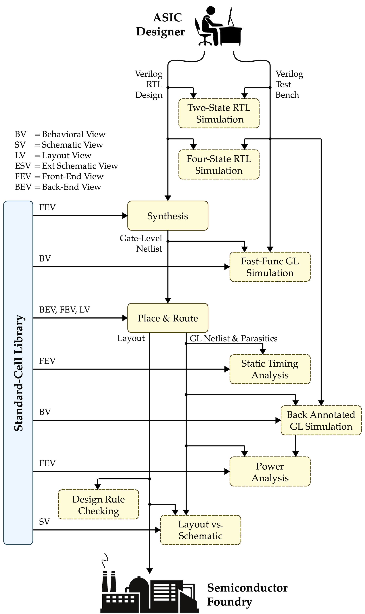
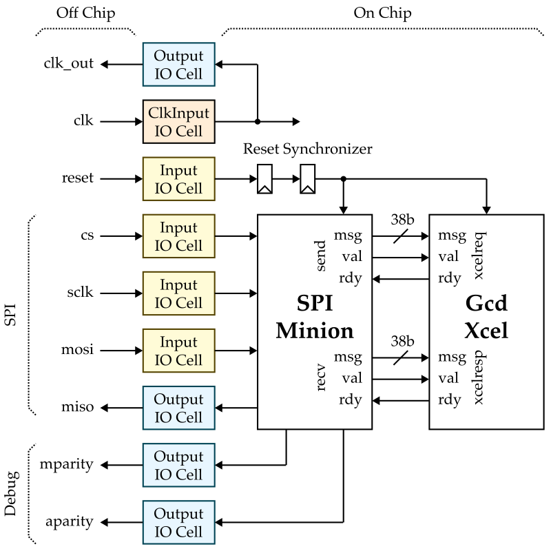

ECE 6745 Lab 9: Commercial Chip Flow
==========================================================================

In this lab, we will be learning about chip-level RTL design and the
commercial chip ASIC flow. In the previous lab, we pushed designs
through the _block-level_ ASIC flow which synthesizes, places, and
routes a design but does not include the I/O pads, seal ring, or fill
structures needed for tapeout. In this lab, we extend that block flow
into a full _chip-level_ flow.

 - **Chip-Level RTL Design:** A real chip needs I/O cells around the
    perimeter for signal buffering, ESD protection, and level shifting
    between core and I/O voltage domains. We will study how the GCD
    accelerator is wrapped with I/O pads, a two-flop reset
    synchronizer, and an SPI minion to create a chip-level design. This
    is the same pattern you will use to wrap your own accelerator for
    Project 2.

 - **Padring, Seal Ring, and Fill:** Tapeout requires physical
    structures beyond the core logic. The _padring_ places I/O cells
    and bond pads around the chip perimeter. The _seal ring_ is a guard
    structure along the die edge that prevents cracks from wafer dicing
    from propagating into the active circuit area. _Metal, poly, and
    via fill_ insert dummy patterns to maintain uniform density for CMP
    (chemical-mechanical polishing) planarity.

 - **Chip-Level Verification:** The chip flow extends DRC to include
    wirebond and metal-fuse checks, and LVS must now account for I/O
    cell SPICE models. The chip flow has 14 steps compared to the block
    flow's 11 steps.

The following diagrams illustrate the primary tools we have already seen
in the previous labs. Notice that the ASIC tools all require various
views from the standard-cell library.



We will be adding additional steps for the padring, seal ring, and fill.
Here is list of all of the steps we will be using in the chip flow.

```
00-padring-gen
01-pymtl-rtlsim
02-synopsys-vcs-rtlsim
03-synopsys-dc-synth
04-synopsys-vcs-ffglsim
05-cadence-innovus-pnr
06-synopsys-pt-sta
07-synopsys-vcs-baglsim
08-synopsys-pt-pwr
09-mentor-calibre-seal
10-mentor-calibre-fill
11-mentor-calibre-drc
12-mentor-calibre-lvs
13-summarize-results
```

Extensive documentation is provided by Synopsys, Cadence, and Siemens for
these ASIC tools. We have organized this documentation and made it
available to you on the public course webpage:

 - <https://www.csl.cornell.edu/courses/ece6745/asicdocs>

1. Logging Into `ecelinux`
--------------------------------------------------------------------------

!!! warning "Students MUST work in pairs!"

    You MUST work in pairs for this lab, as having too many instances of
    Innovus open at once can cause the `ecelinux` servers to crash. So
    find a partner and work together at a workstation to complete today's
    lab.

Follow the same process as previous labs. Find a free workstation and log
into the workstation using your NetID and standard NetID password. Then
complete the following steps.

 - Start VS Code
 - Install the Remote-SSH extension, Surfer, Python, and Verilog extensions
 - Use View > Command Palette to execute Remote-SSH: Connect Current Window to Host...
 - Enter netid@ecelinux-XX.ece.cornell.edu where XX is an ecelinux server number
 - Use View > Explorer to open your home directory on ecelinux
 - Use View > Terminal to open a terminal on ecelinux
 - Start MS Remote Desktop

Now use the following commands to clone the repo we will be using for
today's lab.

```bash
% source setup-ece6745.sh
% source setup-gui.sh
% mkdir -p ${HOME}/ece6745
% cd ${HOME}/ece6745
% git clone git@github.com:cornell-ece6745/ece6745-lab9 lab9
% cd lab9
% tree
```

To make it easier to cut-and-paste commands from this handout onto the
command line, you can tell Bash to ignore the `%` character using the
following command:

```bash
% alias %=""
```

2. GCD Accelerator Block
--------------------------------------------------------------------------

We need to make sure our GCD accelerator is functionally correct and can
go through the block flow before we attempt to use the chip flow. Let's
start by making sure our accelerator is fully functional using RTL
simulation.

```bash
% mkdir -p ${HOME}/ece6745/lab9/sim/build
% cd ${HOME}/ece6745/lab9/sim/build
% pytest ../lab5_xcel/test/GcdXcel_test.py
```

Now let's make sure our accelerator can go through the block flow.

```bash
% mkdir -p ${HOME}/ece6745/lab9/asic/build-gcd-xcel
% cd ${HOME}/ece6745/lab9/asic/build-gcd-xcel
% pyhflow ../designs/lab5-gcd-xcel.yml
% ./run-flow

 timestamp           = 2026-03-20 10:47:45
 design_name         = GcdXcel_noparam
 clock_period        = 3.0
 vcs-rtlsim          = 18/18 passed
 synth_setup_slack   = 0.3217 ns
 synth_num_stdcells  = 461
 synth_area          = 9112.275 um^2
 ffglsim             = 18/18 passed
 pnr_setup_slack     = 0.0442 ns
 pnr_hold_slack      = 0.0132 ns
 pnr_clk_ins_src_lat = 0 ns
 pnr_num_stdcells    = 527
 pnr_area            = 10146.214 um^2
 sta_setup_slack     = 0.0500 ns
 sta_hold_slack      = 0.0140 ns
 baglsim             = 18/18 passed
 main_drc_results    = no violations found
 antenna_drc_results = no violations found
 lvs                 = no violations found

 GcdXcel_noparam_gcd-xcel-sim-rtl-random
  - exec_time = 3220 cycles
  - exec_time = 9660.0000 ns
  - power     = 2.0170 mW
  - energy    = 19.4842 nJ

 GcdXcel_noparam_gcd-xcel-sim-rtl-small
  - exec_time = 458 cycles
  - exec_time = 1374.0000 ns
  - power     = 2.9820 mW
  - energy    = 4.0973 nJ

 GcdXcel_noparam_gcd-xcel-sim-rtl-zeros
  - exec_time = 157 cycles
  - exec_time = 471.0000 ns
  - power     = 3.2430 mW
  - energy    = 1.5275 nJ
```

3. Chip-Level RTL Design
--------------------------------------------------------------------------

Now we are ready to turn our accelerator into a complete chip. We need to
integrate the accelerator with I/O cells, a reset synchronizer, and an
SPI minion to create a complete chip-level design. Here is a block-level
diagram of the chip.



### 3.1. I/O Cells

Each IO cell includes some ciruitry along with a _bond pad_ which is a
large rectangle of top-level metal which will be exposed during the chip
fabrication process. Then during packaging we can use bond wires to
connect the package to the bond pad. These are the key IO cells we will
be using:

 - Signal IO Cell (PDDW0812CDG)
 - Clock IO Cell (PDDW0812SCDG)
 - IO Vdd (PVDD2CDG)
 - Core Vdd (PVDD1CDG)
 - Common Ground (PVSS3CDG)

Let's take a look at the databook for the IO cells.

```bash
% evince ${TSMC_180NM}/iocells.pdf
```

Find the entry for the signal IO cell we will be using. Notice that these
are bidirectional IO cells (i.e., the same cell is can be used as both an
input and as an output). Then take a look at the layout view for this
cell.

```bash
% klayout -l ${TSMC_180NM}/klayout.lyp ${TSMC_180NM}/iocells.gds
```

Take a look at the I/O cell behavioral models we will be using.

```bash
% cd ${HOME}/ece6745/lab9/sim/iocells
% code InputIO.v
```

Here is the `InputIO` module:

```verilog
module iocells_InputIO
(
  input  logic off_chip,
  output logic on_chip
);

  `ifndef SYNTHESIS
    assign on_chip = off_chip;
  `else
    PDDW0812CDG io
    (
      .I   (1'b0),
      .OEN (1'b1),
      .PAD (off_chip),
      .C   (on_chip),
      .IE  (1'b1),
      .PE  (1'b1),
      .DS  (1'b0)
    );
  `endif

endmodule
```

The `off_chip` port will be connected to the pad, bond wire, and package
off chip. The `on_chip` port will be connected to the logic within the
chip.

The key pattern here is `ifndef SYNTHESIS`. During simulation, the pad is
a simple wire passthrough (`assign on_chip = off_chip`). During
synthesis, it instantiates the real I/O cell for TSMC 180nm. The I/O cell
pins are:

 - `PAD`: The external bond pad connection
 - `C`: The core-side connection
 - `I`: Output data (driven by on-chip logic)
 - `OEN`: Output enable (active low); set to `1'b1` for input mode
 - `IE`: Input enable; set to `1'b1` to enable the input buffer
 - `PE`: Pull enable; set to `1'b1` to enable a pull-up/pull-down
 - `DS`: Drive strength select

The `OutputIO` module is similar but configures the cell in output mode:
`OEN` is `1'b0` (output enabled), `I` drives the on-chip signal out, and
`IE` is `1'b0` (input buffer disabled).

When floorplanning the chip we will need to place these IO cells in a
ring around the outside of the chip into what is called a _padring_.

### 3.2. Chip Top Module

You now need to implement the top-level module for the chip.

```bash
% cd ${HOME}/ece6745/lab9/sim/lab5_xcel
% code GcdXcelChip.v
```

Your implementation should have four sections:

 - IO Cells: instanatiate nine IO cells, one for each top-level port
 - Clock and Reset: connect `clk` to `clk_out` and add a reset synchronizer
 - SPI Minion: instantiate the SPI minion and connect it to `cs`, `sclk`,
   `mosi`, `miso`, and the GCD accelerator
 - GCD Accelerator: instantiate the GCD accelerator and connect it to the
   SPI minion

Be sure to use the correct IO cell for each top-level port:

 - `ClkInputIO`: use for the clock input
 - `InputIO`: use for all top-level input ports
 - `OutputIO`: use for all top-level output ports

The off-chip reset signal arrives asynchronously relative to the on-chip
clock. Sampling an asynchronous signal with a single flip-flop can cause
_metastability_ -- the flip-flop output can settle to an unpredictable
value. The two-flop synchronizer reduces the probability of metastability
to a negligible level by giving the first flop's output a full clock
cycle to resolve before the second flop samples it. All downstream logic
should use the synchronized version of the reset signal.

Configure the SPI Minion parameters as shown below.

```verilog
  spi_Minion
  #(
    .BIT_WIDTH (38),
    .N_SAMPLES (4)
  )
```

The SPI minion will produce a 38-bit message which is exactly the correct
amount for an accelerator request message (i.e., 1 bit for type, 5 bits
for the accelerator register specifier, 32 bits for data). An accelerator
response message is only 33 bits (i.e., 1 bit for type, 32 bits for data)
so you will need to zero extend the accelerator response message when
connecting it to the SPI minion.

!!! warning "Show a TA your top-level implementation!"

    Once you have finished, show a TA your top-level implementation to
    get feedback before continuing.

### 3.3. Chip Testing

Once you have finished implementing the chip top-level module, we of
course need to test it. Take a look at the PyMTL wrapper for the chip
module:

```bash
% cd ${HOME}/ece6745/lab9/sim/lab5_xcel
% code GcdXcelChip.py
```

```python
from pymtl3 import *
from pymtl3.passes.backends.verilog import *

class GcdXcelChip( VerilogPlaceholder, Component ):
  def construct( s ):
    s.cs      = InPort (1)
    s.sclk    = InPort (1)
    s.mosi    = InPort (1)
    s.miso    = OutPort(1)
    s.mparity = OutPort(1)
    s.aparity = OutPort(1)
    s.clk_out = OutPort(1)
```

Take a look at the chip-level test harness:

```bash
% cd ${HOME}/ece6745/lab9/sim/lab5_xcel/test
% code GcdXcelChip_test.py
```

The test harness structure is:

```
  StreamSourceFL    SpiMasterFL      GcdXcelChip      SpiMasterFL    StreamSinkFL
  (XcelReqMsg) --> (bit-bang SPI) --> (SPI wires) --> (SPI wires) --> (XcelRespMsg)
```

The key idea is to reuse the same tests you used to test your accelerator
in isolation to test the chip. We simply need to put the accelerator
request/response messages for each test in the source and sinks and then
the `SpiMasterFL` will take care of converting these messages into SPI
transactions.

```python
class TestHarness( Component ):

  def construct( s, ChipType ):

    s.src    = StreamSourceFL( XcelReqMsg )
    s.sink   = StreamSinkFL( XcelRespMsg )
    s.master = SpiMasterFL()
    s.chip   = ChipType

    # src -> SpiMasterFL (xcel req)
    s.src.ostream //= s.master.recv

    # SpiMasterFL -> sink (xcel resp)
    s.sink.istream //= s.master.send

    # SpiMasterFL <-> chip (SPI wires)
    s.master.cs   //= s.chip.cs
    s.master.sclk //= s.chip.sclk
    s.master.mosi //= s.chip.mosi
    s.master.miso //= s.chip.miso
```

The `SpiMasterFL` (in `sim/spi/SpiMasterFL.py`) is a functional-level
model that bit-bangs the SPI protocol: it takes xcel request messages,
serializes them into SPI transactions, and deserializes the SPI responses
back into xcel response messages. Again the exact same logical tests work
at both the functional level (direct xcel interface) and the chip level
(over SPI). The only difference is the test harness: the chip test
interposes the `SpiMasterFL` between the source/sink and the design under
test. This is an important design pattern -- you should reuse your
existing FL test cases when creating your own chip-level tests.

The chip test also supports the `--dump-xmsgs` flag, which generates
transaction log files recording each xcel message sent/received over
SPI. These transaction logs are not used in the ASIC flow itself, but
they will be essential for future chip testing -- when we have
fabricated silicon, we can replay these transaction logs through a
real SPI master to verify that the physical chip produces the correct
responses.

Let's go ahead and run all of the tests on the RTL model of the complete
chip.

```bash
% cd ${HOME}/ece6745/lab9/sim/build
% pytest ../lab5_xcel/test/GcdXcelChip_test.py
```

### 3.4. Simulator

Take a look at the simulator script:

```bash
% cd ${HOME}/ece6745/lab9/sim/lab5_xcel
% code gcd-xcel-sim
```

The simulator supports three implementations:

 - `--impl fl`: Functional-level GCD accelerator (no RTL)
 - `--impl rtl`: RTL GCD accelerator with direct xcel interface
 - `--impl rtl-chip`: RTL GCD accelerator wrapped in chip-level I/O

For the chip flow, we use `--impl rtl-chip` which instantiates
`GcdXcelChip` and uses the `ChipTestHarness` with the `SpiMasterFL`.
The key flags for the ASIC flow are:

```bash
% cd ${HOME}/ece6745/lab9/sim/lab5_xcel
% ./gcd-xcel-sim --impl rtl-chip --input random --translate --dump-vtb --dump-xmsgs
```

 - `--translate`: Converts the PyMTL RTL to pickled Verilog for synthesis
 - `--dump-vtb`: Generates Verilog test benches for VCS simulation
 - `--dump-xmsgs`: Generates SPI transaction logs for future chip testing

4. Chip Flow Overview
--------------------------------------------------------------------------

Now that we understand the chip-level RTL design, let's look at the
chip ASIC flow that will take this design all the way to layout.

### 4.1. Step Templates

The chip flow step templates are located in the `asic/steps/chip`
directory:

```bash
% cd ${HOME}/ece6745/lab9/asic/steps/chip
% tree
.
├── 00-padring-gen
├── 01-pymtl-rtlsim
├── 02-synopsys-vcs-rtlsim
├── 03-synopsys-dc-synth
├── 04-synopsys-vcs-ffglsim
├── 05-cadence-innovus-pnr
├── 06-synopsys-pt-sta
├── 07-synopsys-vcs-baglsim
├── 08-synopsys-pt-pwr
├── 09-mentor-calibre-seal
├── 10-mentor-calibre-fill
├── 11-mentor-calibre-drc
├── 12-mentor-calibre-lvs
└── 13-summarize-results
```

Compared to the block flow from the previous lab (11 steps), the chip
flow has 14 steps. The three new steps are:

 - `00-padring-gen`: Generates the I/O padring placement files
 - `09-mentor-calibre-seal`: Generates and merges the seal ring
 - `10-mentor-calibre-fill`: Generates and merges metal/poly/via fill

Several existing steps are also modified to handle I/O cells:

 - `03-synopsys-dc-synth`: Adds `iocells.db` to the target library
 - `05-cadence-innovus-pnr`: Uses a fixed padring-aware floorplan with
   I/O cell placement and separate VDD/VSS power rings
 - `11-mentor-calibre-drc`: Adds wirebond and metal-fuse DRC checks
 - `12-mentor-calibre-lvs`: Uses `iocells.sp` and `lvs-devices.sp` for
   I/O cell SPICE models

### 4.2. Design YAML

Take a look at the design YAML file for the chip-level GCD accelerator:

```bash
% cd ${HOME}/ece6745/lab9/asic/designs
% code lab9-gcd-xcel-chip.yml
```

```
steps:
 - chip/00-padring-gen
 - chip/01-pymtl-rtlsim
 - chip/02-synopsys-vcs-rtlsim
 - chip/03-synopsys-dc-synth
 - chip/04-synopsys-vcs-ffglsim
 - chip/05-cadence-innovus-pnr
 - chip/06-synopsys-pt-sta
 - chip/07-synopsys-vcs-baglsim
 - chip/08-synopsys-pt-pwr
 - chip/09-mentor-calibre-seal
 - chip/10-mentor-calibre-fill
 - chip/11-mentor-calibre-drc
 - chip/12-mentor-calibre-lvs
 - chip/13-summarize-results

design_name  : GcdXcelChip_noparam
clock_period : 4.5
dump_vcd     : true

pymtl_rtlsim: |
  pytest ../../../sim/lab5_xcel/test/GcdXcelChip_test.py \
    --test-verilog --dump-vtb | tee -a run.log
  ...

tests:
  - GcdXcelChip_noparam_test_basic
  - GcdXcelChip_noparam_test_zeros
  ...

evals:
 - GcdXcelChip_noparam_gcd-xcel-sim-rtl-chip-zeros
 - GcdXcelChip_noparam_gcd-xcel-sim-rtl-chip-small
 - GcdXcelChip_noparam_gcd-xcel-sim-rtl-chip-random
```

The design YAML specifies all 14 chip flow steps (note the `chip/`
prefix). The design name is `GcdXcelChip_noparam` and the clock period is
4.5ns. Note the clock period is slower than the 3.0ns used in the block
flow because I/O cell delays add overhead. When doing a rigorous
comparative analysis with the processor we will use the block flow and
set our clock contraint equal to what the processor can run out. However,
for the chip flow you are free to use whatever frequency you like as long
as you can close timing.

The `pymtl_rtlsim` section runs both the pytest test suite and the
simulator with three input patterns (random, small, zeros). The `tests`
list and `evals` list name all 15 tests and 3 evaluations that will be
run through subsequent simulation steps.

### 4.3. Padring Configuration

Take a look at the padring configuration file:

```bash
% cd ${HOME}/ece6745/lab9/asic/steps/chip/00-padring-gen
% code padring-config.yaml
```

```
chip:
  pitch: 60
  pad_height: 102.4
  corner_size: 130
  sealring_width: 15
  width: 950
  height: 950

cells:
  io: PDDW0812CDG
  clk: PDDW0812SCDG
  poc: PVDD2POC
  io_vdd: PVDD2CDG
  core_vdd: PVDD1CDG
  common_vss: PVSS3CDG
  corner: PCORNER
  pad: PAD60LU_SL_SM
```

The chip dimensions are 950um x 950um. The `pad_height` (102.4um) is the
height of the I/O cells, the `corner_size` (130um) is the size of the
corner cells, and `sealring_width` (15um) is the width of the seal ring.
The `pitch` (60um) is the spacing between bond pads.

The pad assignments for each side are:

```
# Left side pads (bottom to top) -- SPI bus grouped together
left:
  - CGVSS
  - IOVDD
  - cs
  - sclk
  - mosi
  - miso
  - CRVDD
  - CGVSS

# Right side pads (bottom to top) -- remaining signals
right:
  - CGVSS
  - IOVDD
  - clk
  - reset
  - clk_out
  - minion_parity
  - adapter_parity
  - UNBONDED
```

Each side has a mix of signal pads and power/ground pads. The pad types
are:

 - `CGVSS`: Common ground pad
 - `IOVDD`: I/O voltage power pad
 - `CRVDD`: Core voltage power pad
 - `POC`: Power-on-control pad (exactly one required)
 - `UNBONDED`: Unbonded I/O VDD pad (used for pad count balance)
 - Signal names (e.g., `cs`, `sclk`): Signal I/O pads

The top and bottom sides contain only power/ground pads. The SPI bus
signals are grouped on the left side for clean routing, while the clock,
reset, and parity signals are on the right side. This setup will likely not
be the final padring we use for the tapeouts, but it provides a reasonable
organization for the purposes of this lab and early trials for your own
accelerators.

5. Running the Chip Flow
--------------------------------------------------------------------------

Let's generate the chip flow scripts:

```bash
% mkdir -p ${HOME}/ece6745/lab9/asic/build-gcd-xcel-chip
% cd ${HOME}/ece6745/lab9/asic/build-gcd-xcel-chip
% pyhflow ../designs/lab9-gcd-xcel-chip.yml
```

Just like the block flow, pyhflow copies the step template directories
into the build directory and applies Jinja2 template substitution. For
example, let's see how the synthesis script was filled in:

```bash
% cd ${HOME}/ece6745/lab9/asic/build-gcd-xcel-chip
% code 03-synopsys-dc-synth/run.tcl
```

Notice how `{{ design_name }}` has been replaced with
`GcdXcelChip_noparam` and `{{ clock_period }}` has been replaced with
`4.5`:

```
analyze -format sverilog ../01-pymtl-rtlsim/GcdXcelChip_noparam__pickled.v
elaborate GcdXcelChip_noparam
...
create_clock [get_ports clk] -name ideal_clock1 -period 4.5
```

### 5.1. Padring Generation

Let's run the padring generation step:

```bash
% cd ${HOME}/ece6745/lab9/asic/build-gcd-xcel-chip
% ./00-padring-gen/run
```

The `run-padring-gen.py` script reads the `padring-config.yaml` and
generates two output files:

 - `padring_gen.io`: An I/O assignment file that tells Cadence Innovus
   where to place the I/O cells (used during `init_design`)
 - `padring_gen.tcl`: A Tcl script that places bond pads at computed
   positions and adds route blockages in the I/O cell regions

Take a look at these files.

```bash
% cd ${HOME}/ece6745/lab9/asic/build-gcd-xcel-chip
% code ./00-padring-gen/padring_gen.io
% code ./00-padring-gen/padring_gen.tcl
```

These files are consumed later during the place-and-route step.

### 5.2. Chip Front-End Flow

We are
now ready to run steps 1-4. Run each step one at a time looking for
errors.

```bash
% cd ${HOME}/ece6745/lab9/asic/build-gcd-xcel-chip
% ./01-pymtl-rtlsim/run
% ./02-synopsys-vcs-rtlsim/run
% ./03-synopsys-dc-synth/run
% ./04-synopsys-vcs-ffglsim/run
```

### 5.3. Chip Back-End Flow

For the place-and-route step we will be using the GUI to be able to see
the results.

```bash
% cd ${HOME}/ece6745/lab9/asic/build-gcd-xcel-chip/05-cadence-innovus-pnr
% innovus
innovus> set interactive 1
innovus> source run.tcl
```

When using interactive pause mode, the `run.tcl` script will run one
stage at a time and then pause. You can inspect the results and type `go`
when you are ready to move on to the next stage. Once you have finished
check the timing and area reports:

```bash
% cd ${HOME}/ece6745/lab9/asic/build-gcd-xcel-chip
% cat 05-cadence-innovus-pnr/timing-setup.rpt
% cat 05-cadence-innovus-pnr/timing-hold.rpt
% cat 05-cadence-innovus-pnr/area.rpt
```

Verify that both setup and hold slack are positive. Also check the log
output for `verifyConnectivity`, `verify_drc`, and `verify_antenna`
to make sure there are no errors.

Take a closer look at the hierarchical area report:

```bash
% cd ${HOME}/ece6745/lab9/asic/build-gcd-xcel-chip
% cat 05-cadence-innovus-pnr/area.rpt
```

The area report shows a breakdown by module. Here is a simplified view
of the key modules:

```
 Hinst Name              Module Name                                      Total Area
 ---------------------------------------------------------------------------------------
 GcdXcelChip_noparam                                                      77282.579
   v/clk_io              InputIO_is_clk1                                   5113.171
   v/reset_io            InputIO_3                                         5113.171
   v/cs_io               InputIO_2                                         5113.171
   v/sclk_io             InputIO_1                                         5113.171
   v/mosi_io             InputIO_0                                         5113.171
   v/miso_io             OutputIO_2                                        5121.952
   v/minion_parity_io    OutputIO_1                                        5135.123
   v/adapter_parity_io   OutputIO_0                                        5106.586
   v/clk_out_io          OutputIO_is_clk1                                  5124.147
   v/minion              spi_Minion_BIT_WIDTH38_N_SAMPLES4                 21627.110
     v/minion/adapter1   spi_helpers_Minion_Adapter_...                    15563.968
     v/minion/minion     spi_helpers_Minion_PushPull_...                    6063.142
   v/xcel                lab5_xcel_GcdXcel                                  9349.357
     v/xcel/gcd          tut3_verilog_gcd_GcdUnit                          4432.109
     v/xcel/mngr         lab5_xcel_GcdXcelMngr                             4910.662
```

Notice how the area breaks down across the chip:

 - **I/O pads:** ~46,000 um^2 (9 pads at ~5,100 um^2 each) -- this
   dominates the total area at about 60%
 - **SPI minion:** ~21,600 um^2 (~28% of total area) -- the SPI
   interface is surprisingly large, with the adapter queues
   (`adapter1`) consuming ~15,600 um^2 and the push/pull shift
   registers (`minion`) consuming ~6,100 um^2
 - **GCD accelerator:** ~9,300 um^2 (~12% of total area) -- the actual
   compute logic is a small fraction of the total chip

This is a common pattern in chip design: the I/O infrastructure and
communication interfaces often dominate the area, while the actual
compute logic is relatively small. When you push your own accelerator
through the chip flow, you should look at this area breakdown to
understand how much area your accelerator adds compared to the I/O and
SPI overhead.

We can now complete the remaining steps of the chip flow using the run
scripts.

```bash
% cd ${HOME}/ece6745/lab9/asic/build-gcd-xcel-chip
% ./06-synopsys-pt-sta/run
% ./07-synopsys-vcs-baglsim/run
% ./08-synopsys-pt-pwr/run
% ./09-mentor-calibre-seal/run
% ./10-mentor-calibre-fill/run
% ./11-mentor-calibre-drc/run
% ./12-mentor-calibre-lvs/run
% ./13-summarize-results/run
```

Take a close look at the results summary. For a chip to be eligible for
tapeout, the following must all be true:

 - All PyMTL 2-state RTL simulations pass
 - All four-state RTL simulations pass
 - All fast-functional gate-level simulations pass
 - All back-annotated gate-level simulations pass
 - Place-and-route setup slack is positive
 - Place-and-route hold slack is positive
 - PrimeTime setup slack is positive
 - PrimeTime hold slack is positive
 - All four DRC types pass (zero violations)
 - LVS passes (CORRECT)

If your design does not meet timing after synthesis but _does_ meet
timing after place-and-route then these are still valid results. If
PrimeTime STA passes timing but Innovus fails timing, **this is not
valid -- you must go back and modify your design to fix this.**

### 5.4. Viewing the Chip Layout

You can load the design in Cadence Innovus for interactive debugging:

```bash
% cd ${HOME}/ece6745/lab9/asic/build-gcd-xcel-chip/05-cadence-innovus-pnr
% innovus
innovus> source post-pnr.enc
```

Use _Windows > Workspaces > Design Browser + Physical_ to browse the
design hierarchy. Right click on a module and choose _Highlight_ to
color different modules. You can use _Timing > Debug Timing_ to
visualize the critical path on the layout.

You can use Klayout to view the chip layout at various stages:

```bash
% cd ${HOME}/ece6745/lab9/asic/build-gcd-xcel-chip/05-cadence-innovus-pnr
% klayout -l ${TSMC_180NM}/klayout.lyp post-pnr.gds
```

You should see the core logic in the center surrounded by I/O cells
around the perimeter. You can use _Display > Full Hierarchy_ to show all
layout detail including standard cell internals.

To see the final layout with seal ring and fill:

```bash
% cd ${HOME}/ece6745/lab9/asic/build-gcd-xcel-chip/10-mentor-calibre-fill
% klayout -l ${TSMC_180NM}/klayout.lyp post-filled.gds
```

6. Todo On Your Own
--------------------------------------------------------------------------

We have pushed the chip flow files to your project 2 repos. Go ahead and
implement the chip top-level module for project 2 in the same way you did
for the GCD accelerator. Then try pushing project 2 through the chip flow
as you start pushing towards tapeout!

