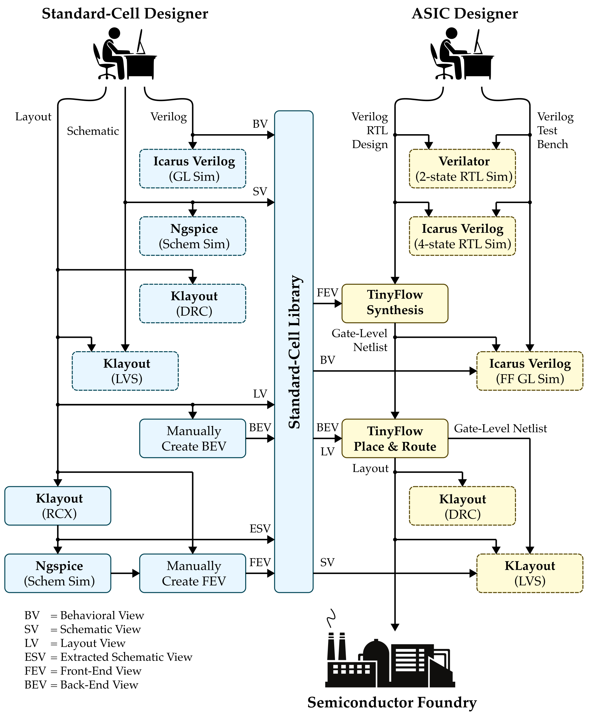

ECE 6745 Project 1: TinyFlow Tape-Out<br>TinyFlow Front-End
==========================================================================

In this project, students will build their own TinyFlow, a very simple
standard-cell-based flow. They will develop seven standard cells in TSMC
180nm and the corresponding standard cell behavioral, schematic, layout,
extracted schematic, front-end, and back-end views. They will then
implement simple algorithms for synthesis (technology mapping via tree
covering, static timing analysis) and place-and-route (simulated
annealing, 3D maze routing). Finally they will combine this work with
open-source Verilog RTL and gate-level simulators and an open-source
LVS/DRC tool to create the complete TinyFlow. Even though their TinyFlow
will only support a very small combinational subset of Verilog, this
project still gives students a unique hands-on opportunity to appreciate
every step required in more sophisticated commercial tools. Each group
will create a tiny block using their TinyFlow and these blocks will be
aggregated into a single unified tape-out on the TSMC 180nm technology
node.

The project includes three parts:

 - Part A: TinyFlow Standard Cells
 - Part B: TinyFlow Front End
 - Part C: TinyFlow Back End

Continue working with your group from Part A. You can confirm your
group on Canvas (Click on People, then Groups, then search for your name
to find your project group).

!!! warning "All students must contribute to all parts!"

    It is not acceptable for one student to do all of Part A and a
    different student to do all of part B. It is not acceptable for one
    student to exclusively work on one algorithm while the other student
    exclusively works on a different algorithm. All students must
    contribute to all parts. The instructors will also survey the Git
    commit log on GitHub to confirm that all students are contributing
    equally. If you are using a "pair programming" style, then both
    students must take turns using their own account so both students
    have representative Git commits. Students should create commits after
    finishing each step of the project, so their contribution is clear in
    the Git commit log. **A student's whose contribution is limited as
    represented by the Git commit log will receive a significant
    deduction to their project score.**

This handout assumes that you have read and understand the course
tutorials and that you have attended the lab sections. To get started,
use VS Code to log into a specific `ecelinux` server, use MS Remote
Desktop to log into the same `ecelinux` server, source the setup scripts,
and clone your remote repository from GitHub:

```bash
% source setup-ece6745.sh
% source setup-gui.sh
% xclock &
% mkdir -p ${HOME}/ece6745
% cd ${HOME}/ece6745
% git clone git@github.com:cornell-ece6745/project1-groupXX
% cd project1-groupXX
% tree
```

where `XX` should be replaced with your group number. You can both pull
and push to your remote repository. If you have already cloned your
remote repository, then use git pull to ensure you have any recent
updates before working on your lab assignment.

```bash
% cd ${HOME}/ece6745/project1-groupXX
% git pull
% tree
```

where `XX` should be replaced with your group number. Your repo contains
the following files.

```
.
├── asic
│   ├── build-fa
│   │   ├── 01-verilator-rtlsim
│   │   ├── 02-iverilog-rtlsim
│   │   ├── 03-tinyflow-synth
│   │   │   └── run.py
│   │   └── 04-iverilog-ffglsim
│   ├── ...
│   └── stdcells-fe.yml
├── stdcells
│   ├── stdcells.v
│   ├── stdcells-fe.yml
│   └── ...
└── tinyflow
    ├── conftest.py
    ├── pytest.ini
    ├── synth
    │   ├── tinyv.lark
    │   ├── verilog_parser.py
    │   ├── StdCellFrontEndView.py
    │   ├── TinyFrontEndDB.py
    │   ├── TinyFrontEndGUI.py
    │   ├── substitute.py
    │   ├── techmap_unopt.py
    │   ├── techmap.py
    │   ├── sta.py
    │   └── tests
    │       └── ...
    └── tinyflow-synth
```

Go ahead and create a build directory where you will run the synthesis
tools and tests:

```bash
% cd ${HOME}/ece6745/project1-groupXX
% mkdir -p tinyflow/build
% cd tinyflow/build
```

1. Background on TinyFlow
--------------------------------------------------------------------------

The complete TinyFlow standard-cell and ASIC design flow is shown below
with the front end highlighted in red.



The front end includes two-state RTL simulation, four-state RTL
simulation, synthesis, and fast-functional gate-level simulation. In
lecture, we discussed an approach to synthesis based on technology
mapping with dynamic programming to optimize the area of the final
gate-level netlist.

Synthesis itself consists of four key algorithms.

{ width=60% }

 - **Verilog Reader:** Parses Verilog RTL design into forest of trees of
   generic logic gates

 - **Technology Mapping:** Maps trees of generic gates to trees of
   standard cells; we will be implementing both an unoptimized and
   optimized version

 - **Static Timing Analysis:** Statically analyze all paths to find
   critical path

 - **Gate-Level Netlist Writer:** Outputs a standard-cell gate-level
   netlist in a Verilog file

We provide you the Verilog reader and gate-level netlist writer. In this
project you are reponsible for implementing technology mapping and static
timing analysis.

TinyFlow represents logic using expression trees stored in a front end
database. This section describes the key data structures you will work
with when implementing the synthesis algorithms.

A design is represented as a **forest** of expression trees. Each primary
output has one tree that computes its logic function. Intermediate signals
(wires) can also have trees. The `TinyFrontEndDB` class is the container
that holds the forest:

```
TinyFrontEndDB
├── _inputs:  { "a", "b", "c" }           # primary input names
├── _outputs: { "out1": <tree>, ... }     # output name -> tree
└── _wires:   { "tmp": <tree>, ... }      # wire name -> tree
```

You can access trees using `db.get_tree(name)` and modify them using
`db.set_tree(name, tree)`. The `db.trees` property returns a dict of all
trees (both outputs and wires).

### 2.2. Nodes

Each node in a tree represents a logic gate. The `Node` base class has
these key attributes:

 - `type`: Name of the gate (e.g., `"AND2"`, `"INVX1"`)
 - `children`: List of inputs, which can be other Nodes or strings
   (primary inputs / wire references)

And the following useful methods to determine the type of node.

- `is_generic_gate()`
- `is_standard_cell()`
- `is_signal()`
- `is_wildcard()`

Trees are recursive structures.

```
        NAND2                Node: type="NAND2", children=[INV, INV]
        /   \
      INV   INV              Node: type="INV", children=[Signal]
       |     |
       a     b               Node: type="Signal"
```

The `repr()` of a tree shows its structure: `NAND2(INV(a), INV(b))`.

### 2.3. Generic Gates

Generic gates represent logic operations parsed from Verilog RTL. They
have no physical implementation. TinyFlow supports these generic gates:

 - **Two-input gates:** AND2, OR2, NAND2, NOR2, XOR2, XNOR2
 - **Single-input gates:** NOT, INV, BUF

The NOT and INV gates both compute logical inversion but serve different
purposes: NOT comes from Verilog (`~` operator), while INV is the
canonical inverter used after canonicalization.

```
Node (base class)
 ├── AND2      (a1 AND a2)
 ├── OR2       (a1 OR a2)
 ├── NAND2     (NOT (a1 AND a2))
 ├── NOR2      (NOT (a1 OR a2))
 ├── XOR2      (a1 XOR a2)
 ├── XNOR2     (a1 XNOR a2)
 ├── NOT       (NOT a)  <- from Verilog
 ├── INV       (NOT a)  <- canonical form
 └── BUF       (a)      <- buffer/passthrough
```

### 2.4. Wildcards and Constants

Wildcards and constants are special nodes used to write substitution
patterns. They are not part of actual designs but are used to match
and transform trees.

**Wildcards** match any subtree and capture it by name:

```python
_0 = Wildcard('_0') # matches any subtree, captures as '_0'
_1 = Wildcard('_1') # matches any subtree, captures as '_1'
```

These are used in substitution rules. For example, to replace AND with
NAND-INV:

```python
Substitute(find=AND2(_0, _1), replace=INV(NAND2(_0, _1)))
```

The wildcards `_0`, `_1`, `_2`, `_3` and constants `_0`, `_1` are
predefined in `TinyFrontEndDB` for convenience.

### 2.5. Standard Cells

Standard cells represent physical standard cells from your cell library
and include physical information:

 - **area_cost:** Area of the cell (in lambda^2)
 - **patterns:** List of generic gate patterns the cell can implement

For example, `NOR2X1` can implement multiple patterns:

```
NOR2X1
├── area_cost: 2048
└── patterns:
    ├── INV(NAND2(INV(_0), INV(_1)))         # NOR via De Morgan's
    └── INV(INV(INV(NAND2(INV(_0), INV(_1))) # double inverter at output
```

The patterns tell techmap which generic gate combinations can be
"covered" by a single standard cell. Technology mapping uses these
patterns to find the minimum-area implementation.

Standard cell classes (INVX1, NAND2X1, NOR2X1, AOI21X1, etc.) are
dynamically created when you load the standard cell view.

### 2.6. Standard Cell View

The `StdCellFrontEndView` provides information about your standard cell
library. It is loaded from `stdcells-fe.yml` and passed to
`TinyFrontEndDB`:

```python
view = StdCellFrontEndView("../stdcells/stdcells-fe.yml")
db = TinyFrontEndDB(view)
```

The view provides information needed by synthesis algorithms:

 - **For techmap:** Cell area and patterns (which generic gate
   combinations each cell implements)

 - **For STA:** Timing model parameters:
   - `Cgate`: Input capacitance (in fF)
   - `tau_d`: Intrinsic delay (in ps)
   - `tau_t`: Load-dependent delay factor (in ps/fF)

The delay through a gate is computed as: `delay = tau_d + tau_t * load`
where `load` is the total capacitance driven by the gate's output

### 2.7. Verilog Reader

We provide you the verilog reader. Feel free to take a look at the
associated grammar located in `tinyflow/synth/tinyv.lark`. You can use
the following command to read a Verilog file into the TinyFlow front-end
database.

```python
tinyflow-synth> db.read_verilog("path/to/design.v")
```

### 2.8. Gate-Level Netlist Writer

We provide you the gate-level netlist writer. You can use the following
command to write the TinyFlow front-end database to a Verilog file.

```python
tinyflow-synth> db.write_verilog("post-synth.v")
```

3. Algorithm: Unoptimized Technology Mapping
--------------------------------------------------------------------------

Students should implement a substitution rule framework before
implementing technology mapping.

### 3.1. Substitution

Substitution is a core operation used throughout our synthesis framework
in TinyFlow. It matches a **find pattern** against a node and, if
successful, produces a new node based on a **replace template**. Wildcards
in the pattern capture subtrees, which are then substituted into the
template. For example, to transform an AND gate into NAND-INV form:

```python
tinyflow-synth> a, b, c = Signal("a"), Signal("b"), Signal("c")
tinyflow-synth> sub = Substitute(find=AND2(_0, _1), replace=INV(NAND2(_0, _1)))
tinyflow-synth> result = sub.apply(AND2(OR2(a, b), c))
tinyflow-synth> print(result)
```

The wildcards `_0` and `_1` in the pattern capture the inputs `x` and
`y`, then those captured values are substituted into the replace template
to produce `INV(NAND2(x, y))`.

We require students to implement the following functions in
`tinyflow/synth/substitute.py` to complete the substitution framework:

 - `match`: Recursively compare the find pattern tree against the input
    node. Wildcards match any subtree and capture it by name. If types or
    structure don't match, return `None`.

 - `capture`: Capture whatever the wildcards in the pattern tree match
   to. Returns a dictionary mapping the wildcard name to the subtree it
   matched.

 - `replace`: Build a new tree using the template and the captured
   subtrees.

### 3.2. Unoptimized Technology Mapping

Once you have your substitution framework working, you can use the
substitution framework to implement a naive unoptimized technology
mapping algorithm in `tinyflow/synth/techmap_unopt.py`. Simply create one
rule for every generic gate and include a corresponding replacement which
implements this generic gate using standard cells. Then apply these rules
to every node in every tree. This unoptimized technology mapping
algorithm makes no attempt to minimize area and will serve as a nice
baseline for your optimized technology mapping algorithm.

4. Algorithm: Optimized Technology Mapping
--------------------------------------------------------------------------

The optimized technology mapping algorithm has three steps:

  - **Canonicalize:** Replace every generic gate with equivalent tree of
     just NAND2 and INV generic gates; determine equivalent trees of
     NAND2 and INV generic gates for each standard cell

  - **Cover:** Use _dynamic programming_ to determine optimal way to
     cover each node in a canonicalized tree of generic gates with
     equivalent standard cells; goal is to minmize total area

  - **Traceback:** Determine final optimal cover of all trees in the
     forest

### 4.1. Canonicalize

With the ability to substitute patterns with a template, we can now build
the first step of the technology mapping phase: canonicalization. In order
to map between generic gates and a given standard cell library, we need to
lower both sides to a common representation and match against each other.
Canonicalization is that step. The input is a tree with generic gates
(AND2, OR2, NOR2, XOR2, XNOR2, NOT, BUF) and the output is a logically
equivalent tree using only NAND2 and INV gates.

Go ahead and implement the `canonicalize` function in
`tinyflow/synth/techmap.py`. You will need to define a substitution rule
for each generic gate type (one rule per gate), apply the rules to the
nodes in a tree, and apply it to all trees in the database. The
recommended approach is to write a recursive function to apply the rules
to a tree, but you can implement this however you want.

### 4.2. Cover

Technology mapping replaces the canonical NAND2/INV tree with library
cells from your standard cell library. The goal is to find the
minimum-area implementation.

This is where the **patterns** field from your standard-cell front-end
view comes into play. Each library cell has patterns describing which
NAND2/INV combinations it can implement. For example, NOR2X1 has a
pattern that matches `INV(NAND2(INV(_0), INV(_1)))`. When techmap finds
this pattern in the canonical tree, it can replace all four gates with a
single NOR2X1 cell.

**Input:** Canonicalized tree (NAND2/INV gates only)

**Output:** Tree with library cells (INVX1, NAND2X1, NOR2X1, AOI21X1,
etc.) with minimum area (optimal for trees)

The DP recurrence is:

```
opt_cost(node) = min over patterns p { p.area_cost + sum(opt_cost(child)) }
```

Go ahead and implement the `cover` function in
`tinyflow/synth/techmap.py`.

**Hints:**

 - Use `repr(node)` as the key into `opt_cost` and `opt_pattern` dicts
 - Iterate over `view.patterns` to try all possible pattern matches
 - Process children before the current node (bottom-up)
 - Signals have zero cost and pass through unchanged

### 4.3. Traceback

Finally, use a top-down approach to reconstruct the optimal technology
mapping. Start from the root and recursively apply the optimal patterns.
When you are done return the final tree which should exclusively contain
standard-cell nodes.

### 4.4. Optimized Technology Mapping

Now put all three steps together in the `techmap` function located in
'tinyflow/synth/techmap.py`. Call canonicalize first. Then call cover on
every tree in the front-end database. Finally call traceback on every
tree in the front-end database and set each tree to the newly technology
mapped tree.

5. Algorithm: Static Timing Analysis
--------------------------------------------------------------------------

Static timing analysis (STA) computes the delay through the mapped
netlist and finds the critical path. This is where the **timing model**
from your Part A front-end view is used.

Recall the first-order delay model from Part A:

```
gate_delay = tau_d + tau_t * load
```

where `tau_d` is the intrinsic (parasitic) delay, `tau_t` is the
load-dependent delay factor, and `load` is the capacitance the gate
drives. The load includes the input capacitance (`Cgate`) of all gates
connected to the output.

**Input:** Mapped tree with library cells

**Output:** Critical path delay and the path itself

The algorithm has three phases:

 - **Phase 1 (compute loads):** Traverse the trees and accumulate the
   load capacitance on each gate. A gate's load is the sum of `Cgate`
   for all gates it drives. Primary outputs have a fixed output load.

 - **Phase 2 (compute arrivals):** Propagate arrival times from inputs
   to outputs. Primary inputs have arrival time 0. For each gate:
   `arrival = max(children arrivals) + gate_delay`.

 - **Phase 3 (find critical path):** Find the output with maximum
   arrival time, then backtrace through the tree following the critical
   pin at each node.

**Your task:** Implement `compute_loads`, `compute_arrivals`, and
`find_critical_path` in `tinyflow/synth/sta.py`.

**Hints:**

 - Use `view.get_cgate(gate_type, pin_idx)` to get input capacitance
 - Use `view.get_parasitic_delay()` and `view.get_load_delay_factor()`
   for timing parameters
 - Store results on nodes: `node.load_cap` for load, `node.timing` for
   arrival time and critical pin (use `Timing` namedtuple)
 - Primary inputs have arrival time 0
 - For arrivals, use memoization via `node.timing` to avoid recomputation

After techmap, you can run STA and view timing results:

```python
tinyflow-synth> sta(db, view)
tinyflow-synth> db.report_timing()
tinyflow-synth> db.report_summary()
```

The timing report shows the critical path delay and the gates on the
critical path.

6. Testing
--------------------------------------------------------------------------

You can run the tests from your build directory like this.

```bash
% cd ${HOME}/ece6745/project1-groupXX/tinyflow/build
% pytest ../synth/tests/substitute_test.py -v
% pytest ../synth/tests/techmap_test.py -v
% pytest ../synth/tests/sta_test.py -v
% pytest ../synth/tests/synth_test.py -v
```

You can also run all the tests at once.

```bash
% cd ${HOME}/ece6745/project1-groupXX/tinyflow/build
% pytest ../synth/tests
```

All tests should pass when your implementation is correct.

7. TinyFlow Front-End
--------------------------------------------------------------------------

As discussed in lecture, the front end is more than just synthesis. The
front-end flow consists of four stages: two-state simulation, four-state
simulation, synthesis, and fast-functional gate-level simulation. As
paranoid ASIC engineers, we verify our design at each step. We simulate
the RTL before synthesis to catch design bugs early, then simulate the
gate-level netlist after synthesis to ensure the transformation preserved
functionality.

### 7.1 Two-State RTL Simulation

To ensure functionality, the first step is to verify our design quickly
using two-state simulation. Two-state simulation tests only logic values
1 and 0 to ensure basic logic correctness. In this part we will use
Verilator to perform two-state simulation.

In this project, we will verify a Full Adder design. We provide the
Verilog RTL in `rtl/FullAdder.v` and a basic testbench in
`rtl/test/FullAdder-test.v`. You can run the two-state simulation with
Verilator as follows.

```bash
% cd $HOME/ece6745/lab3/asic/build-fa/01-verilator-rtlsim
% verilator --top Top --timing --binary -o FullAdder-test \
    ../../../rtl/FullAdder.v \
    ../../../rtl/test/FullAdder-test.v
% ./obj_dir/FullAdder-test
```

We have put the above command in a shell script to simplify running
two-state RTL simulation.

```bash
% cd $HOME/ece6745/lab3/asic/build-fa
% ./01-verilator-rtlsim/run
```

### 7.2 Four-State RTL Simulation

Four-state simulation uses four logic values: 0, 1, X (unknown), and Z
(high impedance). You get X when a signal is uninitialized, when multiple
drivers are fighting (contention), or through propagation of uncertainty
(X propagates through logic). You get Z when a wire is floating (nothing
is driving it) or from a tri-stated output.

We use four-state simulation to capture these bugs. It is slower than
two-state simulation, but it narrows down our issue search space. If your
design passes two-state but fails four-state, the problem is usually
related to X propagation or uninitialized signals.

Go ahead and run the four-state simulation with Icarus Verilog:

```bash
% cd $HOME/ece6745/lab3/asic/build-fa/02-iverilog-rtlsim
% iverilog -g2012 -o FullAdder-test \
    ../../../rtl/FullAdder.v \
    ../../../rtl/test/FullAdder-test.v
% ./FullAdder-test
```

We have put the above command in a shell script to simplify running
two-state RTL simulation.

```bash
% cd $HOME/ece6745/lab3/asic/build-fa
% ./02-iverilog-rtlsim/run
```

### 7.3 Synthesis

Now that we have rigorously tested our Verilog design, we are ready to
synthesize it into a gate-level netlist. For this step, we will use the
batch processing mode of `tinyflow-synth` instead of the REPL mode we
have previous used. The batch mode takes a run script that describes the
synthesis steps. Populate the 'asic/build-fa/03-tinyflow-synth/run.py'
script with the commands to perform synthesis and STA.

```python
# Load the standard-cell front-end view and create front-end database

view = StdCellFrontEndView.parse_lib("../../../stdcells/stdcells-fe.yml")
db = TinyFrontEndDB(view)

# Read Verilog file into the database

db.read_verilog("../../../rtl/FullAdder.v")

# Optimized technology mapping

techmap(db, view)

# Static timing analysis with output load of 10fF

output_load = 10
sta(db, view, output_load)

# Check design for issues

db.check_design()

# Output reports

db.report_area()
db.report_timing()
db.report_summary()

# Write front-end database to a Verilog gate-level netlist

db.write_verilog("post-synth.v")
```

Now run the synthesis:

```bash
% cd $HOME/ece6745/lab3/asic/build-fa/03-tinyflow-synth
% ../../../tinyflow/tinyflow-synth -f run.py
```

This outputs the `post-synth.v` file. We have put the above command in a
shell script to simplify running synthesis.

```bash
% cd $HOME/ece6745/lab3/asic/build-fa
% ./03-tinyflow-synth/run
```

### 7.4 Fast-Functional Gate-Level Simulation

Now that we have our synthesized design, as paranoid ASIC engineers we
want to double check that the synthesized design still does what we
intended. Synthesis tools may not always be correct! To verify this, we
perform fast-functional gate-level simulation (FFGL), which is four-state
simulation using the same testbench but with the synthesized design and
the behavioral view of the standard cells.

```bash
% cd $HOME/ece6745/lab3/asic/build-fa/04-iverilog-ffglsim
% iverilog -g2012 -o FullAdder-test \
    ../../../stdcells/stdcells.v ../03-tinyflow-synth/post-synth.v \
    ../../../rtl/test/FullAdder-test.v
% ./FullAdder-test
```

If the simulation passes, your synthesized design is functionally
correct. We have put the above command in a shell script to simplify
running synthesis.

```bash
% cd $HOME/ece6745/lab3/asic/build-fa
% ./04-iverilog-ffglsim/run
```

9. Project Submission
--------------------------------------------------------------------------

To submit your code you simply push your code to GitHub. You can push
your code as many times as you like before the deadline. Students are
responsible for going to the GitHub website for your repository, browsing
the source code, and confirming that the code they want to submit is on
GitHub. Be sure to verify your code is passing all of
your simulations on `ecelinux`.

Here is how we will be testing your final code submission for Part B.
First, we will create a build directory.

```bash
% mkdir -p ${HOME}/ece6745
% cd ${HOME}/ece6745
% git clone git@github.com:cornell-ece6745/project1-groupXX
```

Then we will run all of the tests for the synthesis flow.

```bash
% mkdir -p ${HOME}/ece6745/project1-groupXX/tinyflow/build
% cd ${HOME}/ece6745/project1-groupXX/tinyflow/build
% pytest ../synth
```

Then we will verify that we can succesfully push the full adder through
your TinyFlow.

```bash
% cd $HOME/ece6745/lab3/asic/build-fa
% ./01-verilator-rtlsim/run
% ./02-iverilog-rtlsim/run
% ./03-tinyflow-synth/run
% ./04-iverilog-ffglsim/run
```

