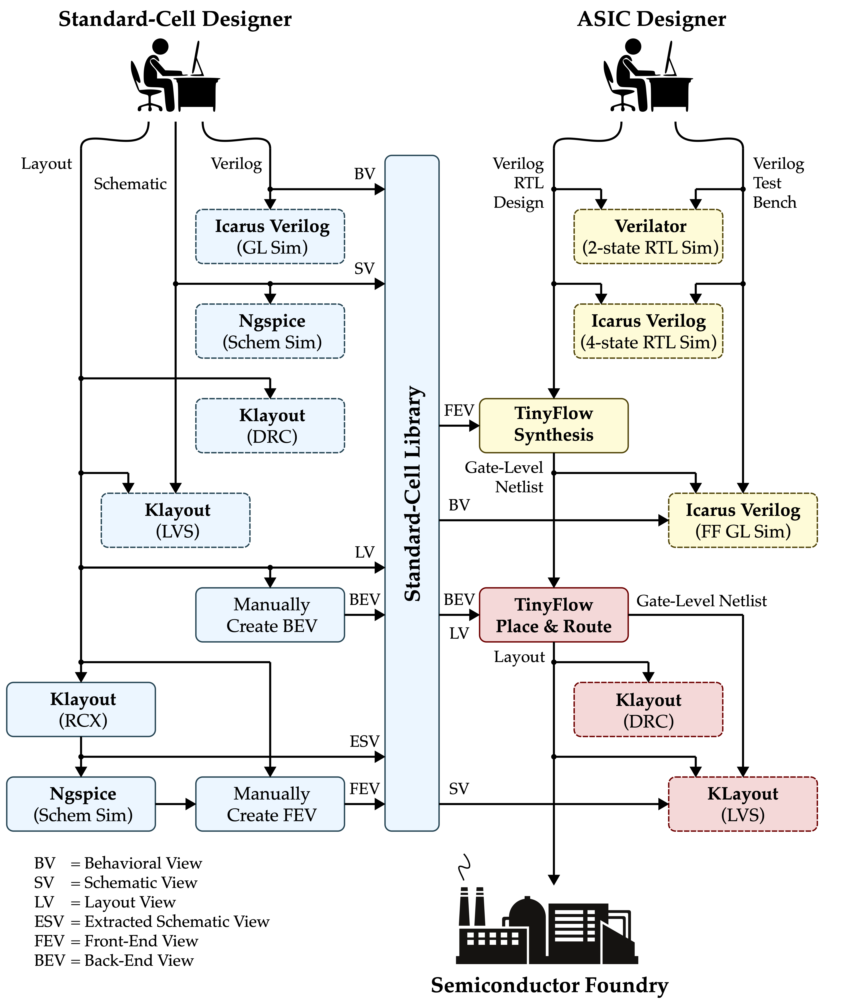
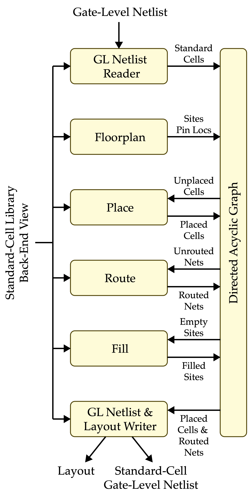

ECE 6745 Project 1: TinyFlow Tape-Out<br>TinyFlow Back-End
==========================================================================

In this project, students will build their own TinyFlow, a very simple
standard-cell-based flow. They will develop seven standard cells in TSMC
180nm and the corresponding standard cell behavioral, schematic, layout,
extracted schematic, front-end, and back-end views. They will then
implement simple algorithms for synthesis (technology mapping via tree
covering, static timing analysis) and place-and-route (simulated
annealing, 3D maze routing). Finally they will combine this work with
open-source Verilog RTL and gate-level simulators and an open-source
LVS/DRC tool to create the complete TinyFlow. Even though their TinyFlow
will only support a very small combinational subset of Verilog, this
project still gives students a unique hands-on opportunity to appreciate
every step required in more sophisticated commercial tools. Each group
will create a tiny block using their TinyFlow and these blocks will be
aggregated into a single unified tape-out on the TSMC 180nm technology
node.

The project includes three parts:

 - Part A: TinyFlow Standard Cells
 - Part B: TinyFlow Front End
 - Part C: TinyFlow Back End

Continue working with your group from Part A and B. You can confirm your
group on Canvas (Click on People, then Groups, then search for your name
to find your project group).

!!! warning "All students must contribute to all parts!"

    It is not acceptable for one student to do all of Part A+B and a
    different student to do all of part C. It is not acceptable for one
    student to exclusively work on one algorithm while the other student
    exclusively works on a different algorithm. All students must
    contribute to all parts. The instructors will also survey the Git
    commit log on GitHub to confirm that all students are contributing
    equally. If you are using a "pair programming" style, then both
    students must take turns using their own account so both students
    have representative Git commits. Students should create commits after
    finishing each step of the project, so their contribution is clear in
    the Git commit log. **A student's whose contribution is limited as
    represented by the Git commit log will receive a significant
    deduction to their project score.**

This handout assumes that you have read and understand the course
tutorials and that you have attended the lab sections. To get started,
use VS Code to log into a specific `ecelinux` server, use MS Remote
Desktop to log into the same `ecelinux` server, source the setup scripts,
and clone your remote repository from GitHub:

```bash
% source setup-ece6745.sh
% source setup-gui.sh
% xclock &
% mkdir -p ${HOME}/ece6745
% cd ${HOME}/ece6745
% git clone git@github.com:cornell-ece6745/project1-groupXX
% cd project1-groupXX
% tree
```

where `XX` should be replaced with your group number. You can both pull
and push to your remote repository. If you have already cloned your
remote repository, then use git pull to ensure you have any recent
updates before working on your lab assignment.

```bash
% cd ${HOME}/ece6745/project1-groupXX
% git pull
% tree
```

where `XX` should be replaced with your group number. Your repo currently
contains the following files (more files will be released soon!).

```
.
├── asic
│   └── build-fa
│       ├── 01-verilator-rtlsim
│       ├── 02-iverilog-rtlsim
│       ├── 03-tinyflow-synth
│       │   └── run.py
│       └── 04-iverilog-ffglsim
├── rtl
│   ├── FullAdder.v
│   └── test
│       └── FullAdder-test.v
├── stdcells
│   ├── stdcells.v
│   ├── stdcells.sp
│   ├── stdcells.gds
│   ├── stdcells-rcx.sp
│   ├── stdcells-fe.yml
│   ├── stdcells-be.yml
│   └── verilog-test
│       └── ...
└── tinyflow
    ├── conftest.py
    ├── pytest.ini
    ├── pnr
    │   ├── tinyv.lark
    │   ├── verilog_parser.py
    │   ├── StdCellBackEndView.py
    │   ├── TinyBackEndDB.py
    │   ├── TinyBackEndGUI.py
    │   ├── floorplan.py
    │   ├── place.py
    │   ├── place_unopt.py
    │   └── tests
    │       └── ...
    ├── synth
    │   ├── tinyv.lark
    │   ├── verilog_parser.py
    │   ├── StdCellFrontEndView.py
    │   ├── TinyFrontEndDB.py
    │   ├── TinyFrontEndGUI.py
    │   ├── substitute.py
    │   ├── techmap_unopt.py
    │   ├── techmap.py
    │   ├── sta.py
    │   └── tests
    │       └── ...
    ├── tinyflow-pnr
    └── tinyflow-synth
```

Go ahead and create a build directory where you will run the synthesis
tools and tests:

```bash
% cd ${HOME}/ece6745/project1-groupXX
% mkdir -p tinyflow/build
% cd tinyflow/build
```

1. Background on TinyFlow
--------------------------------------------------------------------------

The complete TinyFlow standard-cell and ASIC design flow is shown below
with the back end highlighted in red.



The back end includes place-and-route, design rule checking (DRC), and
layout-vs-schematic (LVS). Place-and-route itself consists of six key
algorithms.

{ width=60% }

 - **Gate-Level Netlist Reader:** Parses Verilog gate-level netlist into
   directed acyclic graph of standard cells

 - **Floorplan:** Creates grid of sites and positions input/output pins

 - **Place:** Places each standard cell on the grid of sites

 - **Route:** Routes each net on the routing grid

 - **Fill:** Fills in empty space using FILL standard cells

 - **Layout & Gate-Level Netlist Writer:** Outputs the final layout along
     with an updated standard-cell gate-level netlist

We provide you the readers and writers. In this project you are
reponsible for implementing the floorplan, place, route, and fill
algorithms.

2. Algorithm: Floorplan
--------------------------------------------------------------------------

Implement both fixed floorplan and automatic floorplan algorithms in the
`tinyflow/pnr/floorplan.py` file.

### 2.1. Fixed Floorplan

The fixed floorplan is useful if we know ahead of time the size of the
final block and the position of the input and output pins. This kind of
floorplanning will be used for the actual tapeout.

!!! note "Function: `floorplan_fixed(db, view, width_um, height_um, io_locs)`"

    **Goal:** Initialize floorplan with fixed dimensions and IO locations.

    **Args:**

    - `db`: TinyBackEndDB containing cells to place
    - `view`: StdCellBackEndView containing site dimensions
    - `width_um`: Chip width in micrometers
    - `height_um`: Chip height in micrometers
    - `io_locs`: Dict mapping port names to (x_um, y_um) locations

    **Returns:** None (modifies db in place)

    **Hint:** You will need to use `db.floorplan(width,height)` which
    takes as input a width and height in units of sites. You will need to
    use `db.get_ioport(name).place(i,j)` which takes as input the
    location of the ioport in units of the routing grid. Carefully
    consider how to convert the provided width, height, and locations in
    um to the appropriate units when calling `db.floorplan(width,height)`
    and `db.get_ioport(name).place(i,j)`

To test your floorplan interactively with the REPL and GUI, you will
need a gate-level netlist as input. Run `FullAdder.v` through Part B's
synthesis first to generate `asic/playground/03-tinyflow-synth/post-synth.v`.
Then try your fixed floorplan:

```bash
% cd ${HOME}/ece6745/project1-groupXX/tinyflow/build
% ../tinyflow-pnr
```

```python
tinyflow-pnr> view = StdCellBackEndView(be='../../stdcells/stdcells-be.yml', gds='../../stdcells/stdcells.gds')
tinyflow-pnr> db = TinyBackEndDB(view)
tinyflow-pnr> db.read_verilog('../../asic/playground/03-tinyflow-synth/post-synth.v')
tinyflow-pnr> db.enable_gui()
tinyflow-pnr> io_locs = { '<port_name>': (<x_um>, <y_um>), ... }
tinyflow-pnr> floorplan_fixed(db, view, <width_um>, <height_um>, io_locs)
```

You should see the site grid and IO ports appear in the GUI.

### 2.2. Automatic Floorplan

The automatic floorplan is useful for design-space exploration where we
want to rapidly place-and-route a design without knowing ahead of time
how large it might be. The actual width and height of the floorplan is
calculated from the target utilization. If the target utilization is 0.5
then this means we want the sum of the area of all the standard cells
divided by the area of the final floorplan to be about 0.5. The actual
input pin locations are evenly distributed along the left edge of the
block, and the actual output pin locations are evenly distributed along
the right edge of the block.

!!! note "Function: `floorplan_auto(db, view, target_utilization, aspect_ratio)`"

    **Goal:** Determine chip dimensions based on cell area and
    utilization. Also places IO pins along the chip edges.

    **Args:**

    - `db`: TinyBackEndDB containing cells to place
    - `view`: StdCellBackEndView containing site dimensions
    - `target_utilization`: Fraction of area used (0.0 to 1.0)
    - `aspect_ratio`: Physical width / height (1.0 = square chip)

    **Returns:** None (modifies db in place)

    **Hint:** Sum the area of all of the standard cells. Keep in mind
    `get_width()` for a standard cell returns the width of the standard
    cell in sites. Divide this total area by the target utilization to
    get the actual block are. Use the aspect ratio to determine the
    height and width of the block, and then use these values with
    `db.floorplan(width,height)`. Use `db.get_ioport(name).place(i,j)` to
    place the input/output pins. Carefully consider the units when
    specifying all widths, heights, and locations.

Try your automatic floorplan interactively using the REPL with the GUI:

```bash
% cd ${HOME}/ece6745/project1-groupXX/tinyflow/build
% ../tinyflow-pnr
```

```python
tinyflow-pnr> view = StdCellBackEndView(be='../../stdcells/stdcells-be.yml', gds='../../stdcells/stdcells.gds')
tinyflow-pnr> db = TinyBackEndDB(view)
tinyflow-pnr> db.read_verilog('../../asic/playground/03-tinyflow-synth/post-synth.v')
tinyflow-pnr> db.enable_gui()
tinyflow-pnr> floorplan_auto(db, view, 0.3, 1.0)
```

You should see the floorplan grid and IO ports appear in the GUI. Try
different utilization and aspect ratio values to see how they affect the
floorplan.

Once you have implemented both floorplan algorithms, run all of the
floorplan tests:

```bash
% cd ${HOME}/ece6745/project1-groupXX/tinyflow/build
% pytest ../pnr/tests/floorplan_test.py -v
```

3. Algorithm: Optimized Placement
--------------------------------------------------------------------------

Implement a simulated annealing placement algorithm that attempts to
optimize overall wirelength in the `tinyflow/pnr/place.py` file. Use the
total half-perimeter wire length (HPWL) as the cost estimate for a
placement.

Instead of placing cells on the site grid, your algorithm should place
cells on the coarser _placement grid_. To determine the placement grid,
first find the max width across all standard cells in the design. Then
use this max width to set the size of each location in the placement
grid. Although this is less area efficient, it significantly simplifies
placement since we are guaranteed placed cells will not overlap.

### 3.1. Half-Perimeter Wire Length (HPWL)

We will be using the total half-perimeter wire length (HPWL) as our cost
metric for any given placement. The HPWL is computed over all placed
cells and IO ports. For each net:

 - Collect all placed pins (skip pins whose cell is not yet placed)
 - Find the minimal bounding box around these pins
 - The HPWL for that net is the height plus width of the bounding box

Nets with fewer than two placed pins contribute zero (no wires!). To
find the total HPWL simply add together the HPWL for every net.
Implement the `hpwl` function in `tinyflow/pnr/place.py`.

!!! note "Function: `hpwl(db)`"

    **Goal:** Compute total HPWL (half-perimeter wirelength) using
    bounding box per net. Use pin locations in routing grid units
    (from `pin.get_node()`).

    **Args:**

    - `db`: TinyBackEndDB with placement

    **Returns:** HPWL (`int`)

    **Hint:** `pin.get_node()` returns `(None, None, None)` if the
    pin's cell is not placed. Use this to skip unplaced pins.

Try computing HPWL interactively using the REPL with the GUI:

```bash
% cd ${HOME}/ece6745/project1-groupXX/tinyflow/build
% ../tinyflow-pnr
```

```python
tinyflow-pnr> view = StdCellBackEndView(be='../../stdcells/stdcells-be.yml', gds='../../stdcells/stdcells.gds')
tinyflow-pnr> db = TinyBackEndDB(view)
tinyflow-pnr> db.read_verilog('../../asic/playground/03-tinyflow-synth/post-synth.v')
tinyflow-pnr> db.enable_gui()
tinyflow-pnr> floorplan_auto(db, view, 0.3, 1.0)
tinyflow-pnr> hpwl(db)
```

The IO ports are already placed by `floorplan_auto`. Try manually
placing cells using `cell.set_place(row, col)` and calling
`hpwl(db)` to see how your HPWL changes. You can also call `cell.set_unplace()` and `cell.set_place()` to move cells around and re-evaluate the HPWL. 

### 3.2. Initial Placement

For simulated annealing we want to start with a random initial placement.
Remember we are placing cells on the coarser _placement grid_. The seed
can be used to create different random initial placements which might be
useful if we are unable to route a specific placement. Ensure that two
cells are never overlap. Implement the `place_initial` function in
`tinyflow/pnr/place.py`.

!!! note "Function: `place_initial(db, seed)`"

    **Goal:** Random initial cell placement.

    **Args:**

    - `db`: TinyBackEndDB with floorplan initialized
    - `seed`: Random seed for reproducibility (None = don't reseed)

    **Returns:** None (modifies db in place)

Try your initial placement in the REPL:

```python
tinyflow-pnr> view = StdCellBackEndView(be='../../stdcells/stdcells-be.yml', gds='../../stdcells/stdcells.gds')
tinyflow-pnr> db = TinyBackEndDB(view)
tinyflow-pnr> db.read_verilog('../../asic/playground/03-tinyflow-synth/post-synth.v')
tinyflow-pnr> db.enable_gui()
tinyflow-pnr> floorplan_auto(db, view, 0.3, 1.0)
tinyflow-pnr> place_initial(db, seed=0)
```

You should see the cells randomly placed in the GUI.

### 3.3. Simulated Annealing Placement

This function should assume we have already done the initial placement.
The function should iterate for a given number of iterations. Each
iteration should:

 - Initialize the temperature with the given initial temperature
 - Randomly select a cell
 - Randomly select a location in the coarser placement grid
 - If the selected location is empty, perform the move by calling
   `cell.set_unplace()` then `cell.set_place()` at the new location
 - If the selected location is not empty, perform the swap by first
   calling `set_unplace()` on both cells to free their sites, then
   calling `set_place()` on both cells at their new locations
 - Compute the new total HPWL cost after the move or swap
 - If the change in cost is negative, accept the move or swap
 - If the change in cost is positive, only accept the move or swap with
   probability $e^{-\Delta c/T}$
 - If the move or swap is not accepted, revert by calling
   `set_unplace()` and `set_place()` to restore the original positions
 - Decrease the temperature by the cooling rate
 - If the temperature is less than the given final temperature stop

Note that students can experiment with different cost functions. They may
want to penalize a net with a very small HPWL to try and avoid cells from
being bunched too close together causing significant routing congestion.
Implement the `place_anneal` function in `tinyflow/pnr/place.py`.

!!! note "Function: `place_anneal(db, seed, initial_temp, cooling_rate, final_temp, max_iter)`"

    **Goal:** Simulated annealing optimization to minimize wirelength.

    **Args:**

    - `db`: TinyBackEndDB with initial placement
    - `seed`: Random seed for reproducibility (None = don't reseed)
    - `initial_temp`: Starting temperature
    - `cooling_rate`: T *= cooling_rate each iteration
    - `final_temp`: Stop when T < final_temp
    - `max_iter`: Maximum iterations

    **Returns:** None (modifies db in place)

Try simulated annealing in the REPL:

```python
tinyflow-pnr> view = StdCellBackEndView(be='../../stdcells/stdcells-be.yml', gds='../../stdcells/stdcells.gds')
tinyflow-pnr> db = TinyBackEndDB(view)
tinyflow-pnr> db.read_verilog('../../asic/playground/03-tinyflow-synth/post-synth.v')
tinyflow-pnr> db.enable_gui()
tinyflow-pnr> floorplan_auto(db, view, 0.3, 1.0)
tinyflow-pnr> place_initial(db, seed=0)
tinyflow-pnr> place_anneal(db, seed=0)
```

You should see the cells move in the GUI as simulated annealing
optimizes the placement. The HPWL should decrease compared to the
initial placement.

### 3.4. Placement

Now that we have an initial placement algorithm and the simulated
annealing we can put them together in the placement function which should
just call `place_init` and then `place_anneal`. Implement the `place`
function in `tinyflow/pnr/place.py`.

!!! note "Function: `place(db, seed)`"

    **Goal:**   Run complete placement: initial placement, SA optimization.

    **Args:**

    - `db`: TinyBackEndDB with initial placement
    - `seed`: Random seed for reproducibility (None = don't reseed)

    **Returns:** None (modifies db in place)

Once you have implemented all placement functions, try running the
complete placement in a fresh REPL session:

```bash
% cd ${HOME}/ece6745/project1-groupXX/tinyflow/build
% ../tinyflow-pnr
```

```python
tinyflow-pnr> view = StdCellBackEndView(be='../../stdcells/stdcells-be.yml', gds='../../stdcells/stdcells.gds')
tinyflow-pnr> db = TinyBackEndDB(view)
tinyflow-pnr> db.read_verilog('../../asic/playground/03-tinyflow-synth/post-synth.v')
tinyflow-pnr> db.enable_gui()
tinyflow-pnr> floorplan_auto(db, view, 0.3, 1.0)
tinyflow-pnr> place(db)
```

You should see the cells being placed and then optimized in the GUI. Then run all of the placement tests to verify your implementation:

```bash
% cd ${HOME}/ece6745/project1-groupXX/tinyflow/build
% pytest ../pnr/tests/place_test.py -v
```

4. Testing
--------------------------------------------------------------------------

Once you have implemented all algorithms, run all of the back-end tests
at once to verify everything works together.

```bash
% cd ${HOME}/ece6745/project1-groupXX/tinyflow/build
% pytest ../pnr/tests -v
```

Just because all of the tests pass does not mean your implementation is
correct. You are encouraged to add more tests.

5. API Reference
--------------------------------------------------------------------------

This section provides a quick reference for the classes and methods you
will use when implementing the floorplan and placement algorithms.

!!! info "Coordinate Systems"

    There are two coordinate systems used in the back end:

    - **Site grid** uses `(row, col)` coordinates. Each cell occupies
      one or more sites in a row. Cell placement uses site grid
      coordinates (e.g., `cell.set_place(row, col)`).

    - **Routing grid** uses `(i, j, k)` coordinates. `i` corresponds
      to the row direction (vertical), `j` corresponds to the column
      direction (horizontal), and `k` is the metal layer (1=M1, 2=M2,
      etc.). The routing grid is finer than the site grid — there are
      multiple routing tracks per site row in the `i` direction. Pin
      locations and I/O port placement use routing grid coordinates
      (e.g., `pin.get_node()` returns `(i, j, k)`).

### 5.1. StdCellBackEndView (`view`)

The library view provides technology information (site dimensions, layer
info, cell definitions).

| Method/Attribute | Returns | Description |
|--------|---------|-------------|
| `view.get_site()` | `Site` | Get the site definition |
| `view.get_site().get_width()` | `int` | Site width in lambda |
| `view.get_site().get_height()` | `int` | Site height in lambda |
| `view.get_cell(ref)` | `Cell` | Get library cell by reference name |
| `view.get_cell(ref).get_width()` | `int` | Cell width in lambda |
| `view.get_layer('metal1')` | `Layer` | Get a metal layer |
| `view.get_layer(name).get_track_pitch()` | `int` | Track pitch in lambda |
| `view.get_lambda_um()` | `float` | Lambda unit in micrometers (0.09) |

### 5.2. TinyBackEndDB (`db`)

The backend database manages cells, nets, I/O ports, and the site
and routing grids.

**Floorplan and grid:**

| Method/Attribute | Returns | Description |
|--------|---------|-------------|
| `db.floorplan(num_rows, num_cols)` | None | Initialize site grid (units: sites) |
| `db.get_num_rows()` | `int` | Number of rows in site grid |
| `db.get_num_cols()` | `int` | Number of sites per row |
| `db.get_grid_size_i()` | `int` | Routing grid size in i (vertical tracks) |
| `db.get_grid_size_j()` | `int` | Routing grid size in j (horizontal tracks) |
| `db.get_core()` | `list[list[Site]]` | 2D site grid |

**Cells:**

| Method/Attribute | Returns | Description |
|--------|---------|-------------|
| `db.get_cells()` | `tuple[Cell]` | Get all cell instances |
| `db.get_cell(name)` | `Cell` | Get a cell by instance name |

**Nets:**

| Method/Attribute | Returns | Description |
|--------|---------|-------------|
| `db.get_nets()` | `tuple[Net]` | Get all nets |
| `db.get_net(name)` | `Net` | Get a net by name |

**I/O ports:**

| Method/Attribute | Returns | Description |
|--------|---------|-------------|
| `db.get_ioport(name)` | `IOPort` | Get an I/O port by name |
| `db.get_in_ports()` | `tuple[IOPort]` | Get all input ports |
| `db.get_out_ports()` | `tuple[IOPort]` | Get all output ports |

**Placement helpers:**

| Method/Attribute | Returns | Description |
|--------|---------|-------------|
| `db.get_placement()` | `dict` | Get current placement as `{name: (row, col)}` |
| `db.apply_placement(dict)` | None | Apply a saved placement (unplaces all first) |

### 5.3. Cell

| Method/Attribute | Returns | Description |
|--------|---------|-------------|
| `cell.get_name()` | `str` | Instance name |
| `cell.get_width()` | `int` | Width in sites |
| `cell.get_place()` | `list` | Current placement `[row, col]` (site coords) |
| `cell.is_placed()` | `bool` | Whether the cell is placed |
| `cell.set_place(row, col)` | None | Place cell at site coordinates |
| `cell.set_unplace()` | None | Remove cell from placement |
| `cell.pins` | `list[Pin]` | List of pins on this cell |

### 5.4. Pin

| Method/Attribute | Returns | Description |
|--------|---------|-------------|
| `pin.get_name()` | `str` | Pin name |
| `pin.get_node()` | `(i, j, k)` | Routing grid coordinates (None if unplaced) |
| `pin.net` | `Net` | The net this pin belongs to |

### 5.5. IOPort

IOPort is a subclass of Pin. It represents an I/O port at the chip
boundary.

| Method/Attribute | Returns | Description |
|--------|---------|-------------|
| `ioport.place(i, j)` | None | Place at routing grid edge coordinates |
| `ioport.get_node()` | `(i, j, k)` | Routing grid coordinates (k = 2, i.e., M2) |
| `ioport.name` | `str` | Port name |

### 5.6. Net

| Method/Attribute | Returns | Description |
|--------|---------|-------------|
| `net.net_name` | `str` | Net name |
| `net.pins` | `list[Pin]` | List of connected pins (includes IOPorts) |

