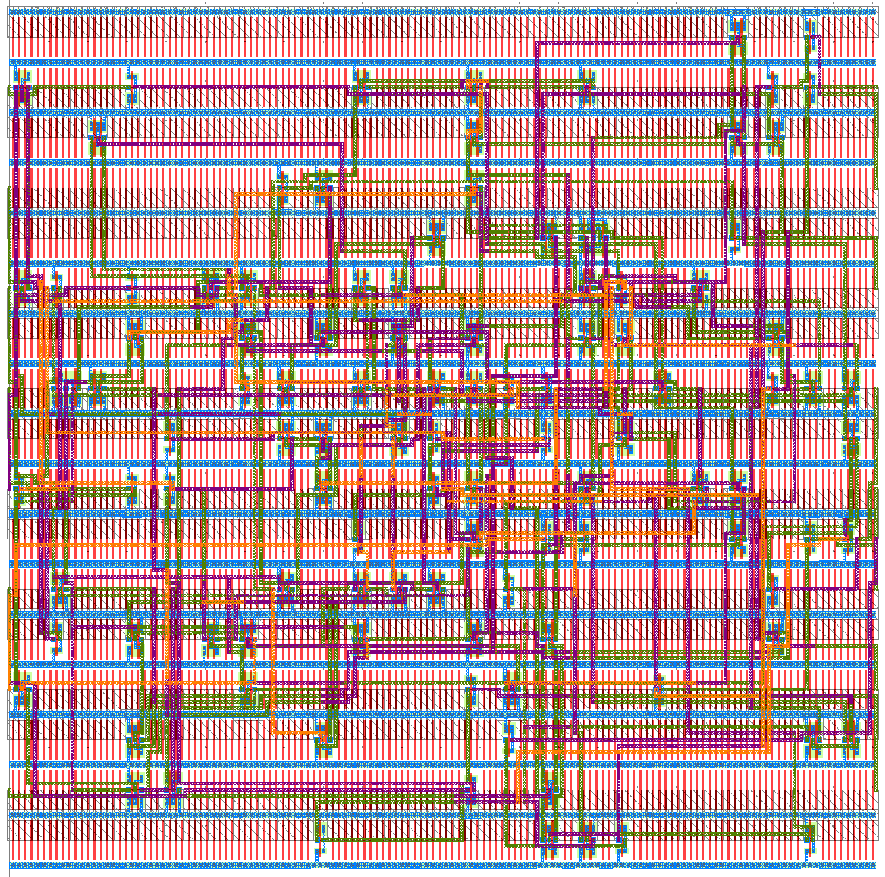

ECE 6745 Project 1: TinyFlow Tape-Out<br>TinyFlow Back-End
==========================================================================

In this project, students will build their own TinyFlow, a very simple
standard-cell-based flow. They will develop seven standard cells in TSMC
180nm and the corresponding standard cell behavioral, schematic, layout,
extracted schematic, front-end, and back-end views. They will then
implement simple algorithms for synthesis (technology mapping via tree
covering, static timing analysis) and place-and-route (simulated
annealing, 3D maze routing). Finally they will combine this work with
open-source Verilog RTL and gate-level simulators and an open-source
LVS/DRC tool to create the complete TinyFlow. Even though their TinyFlow
will only support a very small combinational subset of Verilog, this
project still gives students a unique hands-on opportunity to appreciate
every step required in more sophisticated commercial tools. Each group
will create a tiny block using their TinyFlow and these blocks will be
aggregated into a single unified tape-out on the TSMC 180nm technology
node.

The project includes three parts:

 - Part A: TinyFlow Standard Cells
 - Part B: TinyFlow Front End
 - Part C: TinyFlow Back End

Continue working with your group from Part A and B. You can confirm your
group on Canvas (Click on People, then Groups, then search for your name
to find your project group).

!!! warning "All students must contribute to all parts!"

    It is not acceptable for one student to do all of Part A+B and a
    different student to do all of part C. It is not acceptable for one
    student to exclusively work on one algorithm while the other student
    exclusively works on a different algorithm. All students must
    contribute to all parts. The instructors will also survey the Git
    commit log on GitHub to confirm that all students are contributing
    equally. If you are using a "pair programming" style, then both
    students must take turns using their own account so both students
    have representative Git commits. Students should create commits after
    finishing each step of the project, so their contribution is clear in
    the Git commit log. **A student's whose contribution is limited as
    represented by the Git commit log will receive a significant
    deduction to their project score.**

This handout assumes that you have read and understand the course
tutorials and that you have attended the lab sections. To get started,
use VS Code to log into a specific `ecelinux` server, use MS Remote
Desktop to log into the same `ecelinux` server, source the setup scripts,
and clone your remote repository from GitHub:

```bash
% source setup-ece6745.sh
% source setup-gui.sh
% xclock &
% mkdir -p ${HOME}/ece6745
% cd ${HOME}/ece6745
% git clone git@github.com:cornell-ece6745/project1-groupXX
% cd project1-groupXX
% tree
```

where `XX` should be replaced with your group number. You can both pull
and push to your remote repository. If you have already cloned your
remote repository, then use git pull to ensure you have any recent
updates before working on your lab assignment.

```bash
% cd ${HOME}/ece6745/project1-groupXX
% git pull
% tree
```

where `XX` should be replaced with your group number. Your repo currently
contains the following files (more files will be released soon!).

```
.
├── asic
│   └── build-fa
│       ├── 01-verilator-rtlsim
│       ├── 02-iverilog-rtlsim
│       ├── 03-tinyflow-synth
│       │   └── run.py
│       └── 04-iverilog-ffglsim
├── rtl
│   ├── FullAdder.v
│   └── test
│       └── FullAdder-test.v
├── stdcells
│   ├── stdcells.v
│   ├── stdcells.sp
│   ├── stdcells.gds
│   ├── stdcells-rcx.sp
│   ├── stdcells-fe.yml
│   ├── stdcells-be.yml
│   └── verilog-test
│       └── ...
└── tinyflow
    ├── conftest.py
    ├── pytest.ini
    ├── pnr
    │   ├── tinyv.lark
    │   ├── verilog_parser.py
    │   ├── StdCellBackEndView.py
    │   ├── TinyBackEndDB.py
    │   ├── TinyBackEndGUI.py
    │   ├── floorplan.py
    │   ├── place.py
    │   ├── place_unopt.py
    │   └── tests
    │       └── ...
    ├── synth
    │   ├── tinyv.lark
    │   ├── verilog_parser.py
    │   ├── StdCellFrontEndView.py
    │   ├── TinyFrontEndDB.py
    │   ├── TinyFrontEndGUI.py
    │   ├── substitute.py
    │   ├── techmap_unopt.py
    │   ├── techmap.py
    │   ├── sta.py
    │   └── tests
    │       └── ...
    ├── tinyflow-pnr
    └── tinyflow-synth
```

Go ahead and create a build directory where you will run the synthesis
tools and tests:

```bash
% cd ${HOME}/ece6745/project1-groupXX
% mkdir -p tinyflow/build
% cd tinyflow/build
```

1. Background on TinyFlow
--------------------------------------------------------------------------

The complete TinyFlow standard-cell and ASIC design flow is shown below
with the back end highlighted in red.


The back end includes place-and-route, design rule checking (DRC), and
layout-vs-schematic (LVS). Place-and-route itself consists of six key
algorithms.

{ width=60% }

 - **Gate-Level Netlist Reader:** Parses Verilog gate-level netlist into
   directed acyclic graph of standard cells

 - **Floorplan:** Creates grid of sites and positions input/output pins

 - **Place:** Places each standard cell on the grid of sites

 - **Route:** Routes each net on the routing grid

 - **Fill:** Fills in empty space using FILL standard cells

 - **Layout & Gate-Level Netlist Writer:** Outputs the final layout along
     with an updated standard-cell gate-level netlist

We provide you the readers and writers. In this project you are
reponsible for implementing the floorplan, place, route, and fill
algorithms.

2. Algorithm: Floorplan
--------------------------------------------------------------------------

Implement both fixed floorplan and automatic floorplan algorithms in the
`tinyflow/pnr/floorplan.py` file.

### 2.1. Fixed Floorplan

The fixed floorplan is useful if we know ahead of time the size of the
final block and the position of the input and output pins. This kind of
floorplanning will be used for the actual tapeout.

!!! note "Function: `floorplan_fixed(db, view, width_um, height_um, io_locs)`"

    **Goal:** Initialize floorplan with fixed dimensions and IO locations.

    **Args:**

    - `db`: TinyBackEndDB containing cells to place
    - `view`: StdCellBackEndView containing site dimensions
    - `width_um`: Chip width in micrometers
    - `height_um`: Chip height in micrometers
    - `io_locs`: Dict mapping port names to (x_um, y_um) locations

    **Returns:** None (modifies db in place)

    **Hint:** You will need to use `db.floorplan(width,height)` which
    takes as input a width and height in units of sites. You will need to
    use `db.get_ioport(name).place(i,j)` which takes as input the
    location of the ioport in units of the routing grid. Carefully
    consider how to convert the provided width, height, and locations in
    um to the appropriate units when calling `db.floorplan(width,height)`
    and `db.get_ioport(name).place(i,j)`

To test your floorplan interactively with the REPL and GUI, you will
need a gate-level netlist as input. Run `FullAdder.v` through Part B's
synthesis first to generate `asic/playground/03-tinyflow-synth/post-synth.v`.
Then try your fixed floorplan:

```bash
% cd ${HOME}/ece6745/project1-groupXX/tinyflow/build
% ../tinyflow-pnr
```

```python
tinyflow-pnr> view = StdCellBackEndView(be='../../stdcells/stdcells-be.yml', gds='../../stdcells/stdcells.gds')
tinyflow-pnr> db = TinyBackEndDB(view)
tinyflow-pnr> db.read_verilog('../../asic/playground/03-tinyflow-synth/post-synth.v')
tinyflow-pnr> db.enable_gui()
tinyflow-pnr> io_locs = { '<port_name>': (<x_um>, <y_um>), ... }
tinyflow-pnr> floorplan_fixed(db, view, <width_um>, <height_um>, io_locs)
```

You should see the site grid and IO ports appear in the GUI.

### 2.2. Automatic Floorplan

The automatic floorplan is useful for design-space exploration where we
want to rapidly place-and-route a design without knowing ahead of time
how large it might be. The actual width and height of the floorplan is
calculated from the target utilization. If the target utilization is 0.5
then this means we want the sum of the area of all the standard cells
divided by the area of the final floorplan to be about 0.5. The actual
input pin locations are evenly distributed along the left edge of the
block, and the actual output pin locations are evenly distributed along
the right edge of the block.

!!! note "Function: `floorplan_auto(db, view, target_utilization, aspect_ratio)`"

    **Goal:** Determine chip dimensions based on cell area and
    utilization. Also places IO pins along the chip edges.

    **Args:**

    - `db`: TinyBackEndDB containing cells to place
    - `view`: StdCellBackEndView containing site dimensions
    - `target_utilization`: Fraction of area used (0.0 to 1.0)
    - `aspect_ratio`: Physical width / height (1.0 = square chip)

    **Returns:** None (modifies db in place)

    **Hint:** Sum the area of all of the standard cells. Keep in mind
    `get_width()` for a standard cell returns the width of the standard
    cell in sites. Divide this total area by the target utilization to
    get the actual block are. Use the aspect ratio to determine the
    height and width of the block, and then use these values with
    `db.floorplan(width,height)`. Use `db.get_ioport(name).place(i,j)` to
    place the input/output pins. Carefully consider the units when
    specifying all widths, heights, and locations.

Try your automatic floorplan interactively using the REPL with the GUI:

```bash
% cd ${HOME}/ece6745/project1-groupXX/tinyflow/build
% ../tinyflow-pnr
```

```python
tinyflow-pnr> view = StdCellBackEndView(be='../../stdcells/stdcells-be.yml', gds='../../stdcells/stdcells.gds')
tinyflow-pnr> db = TinyBackEndDB(view)
tinyflow-pnr> db.read_verilog('../../asic/playground/03-tinyflow-synth/post-synth.v')
tinyflow-pnr> db.enable_gui()
tinyflow-pnr> floorplan_auto(db, view, 0.3, 1.0)
```

You should see the floorplan grid and IO ports appear in the GUI. Try
different utilization and aspect ratio values to see how they affect the
floorplan.

Once you have implemented both floorplan algorithms, run all of the
floorplan tests:

```bash
% cd ${HOME}/ece6745/project1-groupXX/tinyflow/build
% pytest ../pnr/tests/floorplan_test.py -v
```

3. Algorithm: Optimized Placement
--------------------------------------------------------------------------

Implement a simulated annealing placement algorithm that attempts to
optimize overall wirelength in the `tinyflow/pnr/place.py` file. Use the
total half-perimeter wire length (HPWL) as the cost estimate for a
placement.

Instead of placing cells on the site grid, your algorithm should place
cells on the coarser _placement grid_. To determine the placement grid,
first find the max width across all standard cells in the design. Then
use this max width to set the size of each location in the placement
grid. Although this is less area efficient, it significantly simplifies
placement since we are guaranteed placed cells will not overlap.

### 3.1. Half-Perimeter Wire Length (HPWL)

We will be using the total half-perimeter wire length (HPWL) as our cost
metric for any given placement. The HPWL is computed over all placed
cells and IO ports. For each net:

 - Collect all placed pins (skip pins whose cell is not yet placed)
 - Find the minimal bounding box around these pins
 - The HPWL for that net is the height plus width of the bounding box

Nets with fewer than two placed pins contribute zero (no wires!). To
find the total HPWL simply add together the HPWL for every net.
Implement the `hpwl` function in `tinyflow/pnr/place.py`.

!!! note "Function: `hpwl(db)`"

    **Goal:** Compute total HPWL (half-perimeter wirelength) using
    bounding box per net. Use pin locations in routing grid units
    (from `pin.get_node()`).

    **Args:**

    - `db`: TinyBackEndDB with placement

    **Returns:** HPWL (`int`)

    **Hint:** `pin.get_node()` returns `(None, None, None)` if the
    pin's cell is not placed. Use this to skip unplaced pins.

Try computing HPWL interactively using the REPL with the GUI:

```bash
% cd ${HOME}/ece6745/project1-groupXX/tinyflow/build
% ../tinyflow-pnr
```

```python
tinyflow-pnr> view = StdCellBackEndView(be='../../stdcells/stdcells-be.yml', gds='../../stdcells/stdcells.gds')
tinyflow-pnr> db = TinyBackEndDB(view)
tinyflow-pnr> db.read_verilog('../../asic/playground/03-tinyflow-synth/post-synth.v')
tinyflow-pnr> db.enable_gui()
tinyflow-pnr> floorplan_auto(db, view, 0.3, 1.0)
tinyflow-pnr> hpwl(db)
```

The IO ports are already placed by `floorplan_auto`. Try manually
placing cells using `cell.set_place(row, col)` and calling
`hpwl(db)` to see how your HPWL changes. You can also call `cell.set_unplace()` and `cell.set_place()` to move cells around and re-evaluate the HPWL. 

### 3.2. Initial Placement

For simulated annealing we want to start with a random initial placement.
Remember we are placing cells on the coarser _placement grid_. The seed
can be used to create different random initial placements which might be
useful if we are unable to route a specific placement. Ensure that two
cells are never overlap. Implement the `place_initial` function in
`tinyflow/pnr/place.py`.

!!! note "Function: `place_initial(db, seed)`"

    **Goal:** Random initial cell placement.

    **Args:**

    - `db`: TinyBackEndDB with floorplan initialized
    - `seed`: Random seed for reproducibility (None = don't reseed)

    **Returns:** None (modifies db in place)

Try your initial placement in the REPL:

```python
tinyflow-pnr> view = StdCellBackEndView(be='../../stdcells/stdcells-be.yml', gds='../../stdcells/stdcells.gds')
tinyflow-pnr> db = TinyBackEndDB(view)
tinyflow-pnr> db.read_verilog('../../asic/playground/03-tinyflow-synth/post-synth.v')
tinyflow-pnr> db.enable_gui()
tinyflow-pnr> floorplan_auto(db, view, 0.3, 1.0)
tinyflow-pnr> place_initial(db, seed=0)
```

You should see the cells randomly placed in the GUI.

### 3.3. Simulated Annealing Placement

This function should assume we have already done the initial placement.
The function should iterate for a given number of iterations. Each
iteration should:

 - Initialize the temperature with the given initial temperature
 - Randomly select a cell
 - Randomly select a location in the coarser placement grid
 - If the selected location is empty, perform the move by calling
   `cell.set_unplace()` then `cell.set_place()` at the new location
 - If the selected location is not empty, perform the swap by first
   calling `set_unplace()` on both cells to free their sites, then
   calling `set_place()` on both cells at their new locations
 - Compute the new total HPWL cost after the move or swap
 - If the change in cost is negative, accept the move or swap
 - If the change in cost is positive, only accept the move or swap with
   probability $e^{-\Delta c/T}$
 - If the move or swap is not accepted, revert by calling
   `set_unplace()` and `set_place()` to restore the original positions
 - Decrease the temperature by the cooling rate
 - If the temperature is less than the given final temperature stop

Note that students can experiment with different cost functions. They may
want to penalize a net with a very small HPWL to try and avoid cells from
being bunched too close together causing significant routing congestion.
Implement the `place_anneal` function in `tinyflow/pnr/place.py`.

!!! note "Function: `place_anneal(db, seed, initial_temp, cooling_rate, final_temp, max_iter)`"

    **Goal:** Simulated annealing optimization to minimize wirelength.

    **Args:**

    - `db`: TinyBackEndDB with initial placement
    - `seed`: Random seed for reproducibility (None = don't reseed)
    - `initial_temp`: Starting temperature
    - `cooling_rate`: T *= cooling_rate each iteration
    - `final_temp`: Stop when T < final_temp
    - `max_iter`: Maximum iterations

    **Returns:** None (modifies db in place)

Try simulated annealing in the REPL:

```python
tinyflow-pnr> view = StdCellBackEndView(be='../../stdcells/stdcells-be.yml', gds='../../stdcells/stdcells.gds')
tinyflow-pnr> db = TinyBackEndDB(view)
tinyflow-pnr> db.read_verilog('../../asic/playground/03-tinyflow-synth/post-synth.v')
tinyflow-pnr> db.enable_gui()
tinyflow-pnr> floorplan_auto(db, view, 0.3, 1.0)
tinyflow-pnr> place_initial(db, seed=0)
tinyflow-pnr> place_anneal(db, seed=0)
```

You should see the cells move in the GUI as simulated annealing
optimizes the placement. The HPWL should decrease compared to the
initial placement.

### 3.4. Placement

Now that we have an initial placement algorithm and the simulated
annealing we can put them together in the placement function which should
just call `place_init` and then `place_anneal`. Implement the `place`
function in `tinyflow/pnr/place.py`.

!!! note "Function: `place(db, seed)`"

    **Goal:**   Run complete placement: initial placement, SA optimization.

    **Args:**

    - `db`: TinyBackEndDB with initial placement
    - `seed`: Random seed for reproducibility (None = don't reseed)

    **Returns:** None (modifies db in place)

Once you have implemented all placement functions, try running the
complete placement in a fresh REPL session:

```bash
% cd ${HOME}/ece6745/project1-groupXX/tinyflow/build
% ../tinyflow-pnr
```

```python
tinyflow-pnr> view = StdCellBackEndView(be='../../stdcells/stdcells-be.yml', gds='../../stdcells/stdcells.gds')
tinyflow-pnr> db = TinyBackEndDB(view)
tinyflow-pnr> db.read_verilog('../../asic/playground/03-tinyflow-synth/post-synth.v')
tinyflow-pnr> db.enable_gui()
tinyflow-pnr> floorplan_auto(db, view, 0.3, 1.0)
tinyflow-pnr> place(db)
```

You should see the cells being placed and then optimized in the GUI. Then run all of the placement tests to verify your implementation:

```bash
% cd ${HOME}/ece6745/project1-groupXX/tinyflow/build
% pytest ../pnr/tests/place_test.py -v
```

4. Algorithm: Routing
--------------------------------------------------------------------------

After placement, we need to connect the pins of each net using metal
wires. Routing operates on a 3D routing grid where `(i, j)` are the
spatial coordinates and `k` is the metal layer. Each layer serves a
different purpose:

 - **M1 (k=1):** Intra-cell routing only (pins live here) — do not
   route on M1
 - **M2–M4 (k=2–4):** Inter-cell routing layers — route here
 - **M5–M6 (k=5-6):** Power grid — do not use

A wire segment on the same layer is a _planar_ move. Changing layers
at the same `(i, j)` location is a _via_. Each node `(i, j, k)` in
the routing grid can only be occupied by one net at a time. Use
`db.get_occupancy(i, j, k)` to check if a node is available; it
returns `None` if free, or the occupying `Net` if taken.

Routing is decomposed into three functions that build on each other:

 - **`bfs_to_tree`** finds a path on M2–M4 from a starting node to
   an existing routing tree using BFS and commits the path to the
   routing grid. This is the core pathfinding building block.

 - **`single_route`** routes all pins of a single net. It is
   responsible for adding M1-to-M2 via segments at each cell pin
   (since pins live on M1 but BFS operates on M2-M4). It connects
   pins incrementally by growing a routing tree; each unconnected
   pin is BFS-routed to the nearest tree node.

 - **`multi_route`** routes all nets in the design by calling
   `single_route` for each net. If a net fails to route, it rips up
   all routing and retries with a different net ordering.

Implement these functions in `tinyflow/pnr/single_route.py` and
`tinyflow/pnr/multi_route.py` as described below.

!!! info "Pin Occupancy Reservation"

    Cell pins live on M1 and IO port pins live on M2. When a cell is
    placed, the backend database automatically reserves M1 through M4
    at each pin location in the occupancy grid. When an IO port is
    placed, it reserves M2 through M4. This creates a pillar of
    occupied nodes so that other nets will route around the pin rather
    than across it. Without this reservation, a net could route across
    a pin's M2 node without knowing a pin is directly below on M1, and
    when we later try to route that pin upward, there would be no
    escape path. Nodes belonging to the pin's own net can still pass
    through.

    You do not need to do anything to handle this reservation. It is
    already reflected in `db.get_occupancy(i, j, k)`, so your BFS will
    naturally route around these pillars. Your routing code only needs
    to add the M1-to-M2 via segments to connect each cell pin up to
    the routing layers.

### 4.1. BFS to Tree

The core building block for routing is a BFS (breadth-first search)
that finds a path from a starting node to any node in an existing
routing tree. The BFS explores the 3D routing grid on layers M2–M4,
making planar moves (same layer, adjacent `i` or `j`) and via moves
(same `i,j`, adjacent `k`). A node is blocked if it is occupied by a
different net. Nodes occupied by the current net (i.e., already part
of the routing tree) are valid targets; reaching any of them means
we have connected to the tree.

Implement the `bfs_to_tree` function in `tinyflow/pnr/single_route.py`.

!!! note "Function: `bfs_to_tree(db, net, start, tree)`"

    **Goal:** BFS from `start` to any node in `tree`, avoiding
    nodes occupied by other nets.

    **Args:**

    - `db`: TinyBackEndDB for occupancy checks
    - `net`: Current net (allowed to pass through own routes)
    - `start`: Starting `(i, j, k)` tuple
    - `tree`: Set of `(i, j, k)` tuples representing the current
      routing tree

    **Returns:** Path as list of `(i, j, k)` tuples from `start`
    to tree, or `None` if no path exists. On success, the path is
    also committed as `Line` segments to the net.

    **Hint:** Use a standard BFS with a queue and parent dictionary.
    Each node has up to six neighbors and should stay within layers
    2-4. Use `db.get_occupancy(i, j, k)` to
    check if a neighbor is blocked by another net. Backtrace through
    the parent dictionary to obtain the path. Convert the path to
    `Line` segments with `Line(path[n], path[n+1])` and commit with
    `net.add_route_segments(lines)`.

Try your BFS interactively using the REPL with the GUI:

```bash
% cd ${HOME}/ece6745/project1-groupXX/tinyflow/build
% ../tinyflow-pnr
```

```python
tinyflow-pnr> view = StdCellBackEndView(be='../../stdcells/stdcells-be.yml', gds='../../stdcells/stdcells.gds')
tinyflow-pnr> db = TinyBackEndDB(view)
tinyflow-pnr> db.read_verilog('../../asic/playground/03-tinyflow-synth/post-synth.v')
tinyflow-pnr> db.enable_gui()
tinyflow-pnr> floorplan_auto(db, view, 0.3, 1.0)
tinyflow-pnr> place(db, seed=0)
tinyflow-pnr> net = db.get_net('<net_name>')
tinyflow-pnr> start = (<i>, <j>, 2)
tinyflow-pnr> tree = {(<i_t>, <j_t>, 2)}
tinyflow-pnr> path = bfs_to_tree(db, net, start, tree)
```

Pick a net and two of its pin locations (elevated to M2) as the start
and tree. You should see the BFS path appear in the GUI. You can use
`db.clear_all_routing()` to clear and try again easily.

### 4.2. Single-Net Routing

Given a net, `single_route` connects all of its pins by growing a
routing tree. Cell pins live on M1, but BFS operates on M2-M4, so
you need to work with the M2 "elevated" pin locations for BFS and
add the M1-to-M2 via segments separately.

The algorithm works as follows:

 - Collect the pin locations for the net. For cell pins on M1, add
   the M1-to-M2 via `Line` segment and use the M2 location
   `(i, j, 2)` as the BFS routing point
 - Initialize the routing tree with the first pin
 - For each remaining unconnected pin, use `bfs_to_tree` to find
   a path from the pin to the tree (this also commits the path)
 - Grow the tree with the returned path so subsequent pins can
   connect to any node routed so far

Implement the `single_route` function in
`tinyflow/pnr/single_route.py`.

!!! note "Function: `single_route(db, net_name)`"

    **Goal:** Route a single net by connecting all pins using
    tree-growing BFS.

    **Args:**

    - `db`: TinyBackEndDB with placed design
    - `net_name`: Name of the net to route

    **Returns:** `True` if routing succeeded, `False` otherwise.

    **Hint:** Use a `set` for the tree and `tree.update(path)` to
    grow it after each successful BFS. `bfs_to_tree` handles
    committing the path to the routing grid. You still need to
    commit the M1-to-M2 via segments separately using
    `net.add_route_segments()`.

Try routing a single net in the REPL:

```python
tinyflow-pnr> db.clear_all_routing()
tinyflow-pnr> single_route(db, '<net_name>')
```

You should see the full route for that net appear in the GUI, including
the M1-to-M2 vias at each pin. Use `db.clear_all_routing()` to clear
and try different nets.

!!! tip "Heuristic: Connect Closest Pin First"

    Instead of connecting pins in arbitrary order, you can improve
    route quality by always connecting the closest unconnected pin
    to the tree next (using Manhattan distance). This tends to
    produce shorter routes and reduce congestion.

### 4.3. Multi-Net Routing

The goal of `multi_route` is to route all nets in the design using
`single_route`. The order in which nets are routed matters: nets
routed first have more available routing resources, while nets routed
later may be blocked by earlier routes.

The algorithm works as follows:

 - Sort nets by HPWL (shortest first) using `net_hpwl` as the sort
   key, since shorter nets are easier to route and less likely to
   block others
 - Route each net using `single_route`
 - If a net fails to route, rip up all routing using
   `db.clear_all_routing()`, move the failed net to the front of the
   list, and retry
 - If all retries are exhausted, return `False`

Implement the `multi_route` function and the `net_hpwl` helper
function in `tinyflow/pnr/multi_route.py`.

!!! note "Function: `net_hpwl(net)`"

    **Goal:** Compute HPWL for a single net (used for sorting).

    **Args:**

    - `net`: A single `Net` object

    **Returns:** HPWL for this net (`int`)

!!! note "Function: `multi_route(db, max_retries)`"

    **Goal:** Route all nets in the design.

    **Args:**

    - `db`: TinyBackEndDB with placed design
    - `max_retries`: Maximum rip-up and retry attempts

    **Returns:** `True` if all nets routed, `False` otherwise.

    **Hint:** Use `db.clear_all_routing()` to rip up all routes
    before each retry attempt. Only route nets with two or more
    pins. Use `list.remove()` and `list.insert(0, ...)` to move
    the failed net to the front.

Try routing all nets in the REPL:

```python
tinyflow-pnr> db.clear_all_routing()
tinyflow-pnr> multi_route(db)
```

You should see all nets get routed in the GUI.

Once you have implemented the routing algorithms, run all of the
routing tests:

```bash
% cd ${HOME}/ece6745/project1-groupXX/tinyflow/build
% pytest ../pnr/tests/single_route_test.py -v
% pytest ../pnr/tests/multi_route_test.py -v
```

5. Algorithm: Fill
--------------------------------------------------------------------------

After placement and routing, any sites in the core that are not occupied
by a standard cell need to be filled with FILL cells. Filler cells
ensure there are no gaps in the layout. They maintain continuous
n-well and power rail connections across the chip.

The algorithm is straightforward: iterate through every site in the
core grid and mark any empty site as filler. Implement the `add_filler`
function in `tinyflow/pnr/add_filler.py`.

!!! note "Function: `add_filler(db)`"

    **Goal:** Insert filler cells into all empty sites.

    **Args:**

    - `db`: TinyBackEndDB with placed and routed design

    **Returns:** None (modifies db in place)

    **Hint:** Use `db.get_core()` to get the 2D site grid. See
    the Site API reference (Section 7.8) for methods to check and
    mark sites. After filling, count the filler sites and call
    `db.set_filler_count(count)`.

Try adding filler interactively using the REPL with the GUI:

```bash
% cd ${HOME}/ece6745/project1-groupXX/tinyflow/build
% ../tinyflow-pnr
```

```python
tinyflow-pnr> view = StdCellBackEndView(be='../../stdcells/stdcells-be.yml', gds='../../stdcells/stdcells.gds')
tinyflow-pnr> db = TinyBackEndDB(view)
tinyflow-pnr> db.read_verilog('../../asic/playground/03-tinyflow-synth/post-synth.v')
tinyflow-pnr> db.enable_gui()
tinyflow-pnr> floorplan_auto(db, view, 0.3, 1.0)
tinyflow-pnr> place(db, seed=0)
tinyflow-pnr> multi_route(db)
tinyflow-pnr> add_filler(db)
```

You should see filler cells appear in all empty sites in the GUI. Every
site should now be either occupied by a standard cell or marked as
filler.

Once you have implemented the fill algorithm, run the filler tests:

```bash
% cd ${HOME}/ece6745/project1-groupXX/tinyflow/build
% pytest ../pnr/tests/add_filler_test.py -v
```

6. Testing
--------------------------------------------------------------------------

Once you have implemented all algorithms, run all of the back-end tests
at once to verify everything works together.

```bash
% cd ${HOME}/ece6745/project1-groupXX/tinyflow/build
% pytest ../pnr/tests -v
```

Just because all of the tests pass does not mean your implementation is
correct. You are encouraged to add more tests.

7. TinyFlow Front and Back End
--------------------------------------------------------------------------

The complete TinyFlow includes both the front-end and back-end. The
front-end flow consists of four steps: two-state simulation, four-state
simulation, synthesis, and fast-functional gate-level simulation. The
back-end flow consists of three steps: place-and-route, design rule
checking, and layout-vs-schematic. In this final part, we push the full
adder design through all steps of the flow to illustrate going from
Verilog RTL to a gate-level netlist to layout. We first manually run each
step before showing how we can automate running the flow.

### 7.1. Front-End Manual Flow

We need to first run the front-end flow as in project 1B to generate the
gate-level netlist. We provide the Verilog RTL in `rtl/FullAdder.v` and a
basic testbench in `rtl/test/FullAdder-test.v`. These are the same as in
the project 1B. Run the two-state simulation with Verilator.

```bash
% cd $HOME/ece6745/project1-groupXX/asic/playground/01-verilator-rtlsim
% verilator --top Top --timing --binary -o FullAdder-test \
    ../../../rtl/FullAdder.v \
    ../../../rtl/test/FullAdder-test.v
% ./obj_dir/FullAdder-test
```

Now run four-state simulation with Icarus Verilog.

```bash
% cd $HOME/ece6745/project1-groupXX/asic/playground/02-iverilog-rtlsim
% iverilog -g2012 -o FullAdder-test \
    ../../../rtl/FullAdder.v \
    ../../../rtl/test/FullAdder-test.v
% ./FullAdder-test
```

Create a `run.py` script for synthesis.

```bash
% cd $HOME/ece6745/project1-groupXX/asic/playground/03-tinyflow-synth
% code run.py
```

Populate the script with the commands to perform optimized technology
mapping and static timing analysis using your work Project 1B.

```python
# Load the standard-cell front-end view and create front-end database

view = StdCellFrontEndView.parse_lib("../../../stdcells/stdcells-fe.yml")
db = TinyFrontEndDB(view)

# Read Verilog file into the database

db.read_verilog("../../../rtl/FullAdder.v")

# Optimized technology mapping

techmap(db, view)

# Static timing analysis with output load of 10fF

output_load = 10
sta(db, view, output_load)

# Check design for issues

db.check_design()

# Output reports

db.report_area()
db.report_timing()
db.report_summary()

# Write front-end database to a Verilog gate-level netlist

db.write_verilog("post-synth.v")
```

Now go ahead and run synthesis.

```bash
% cd $HOME/ece6745/project1-groupXX/asic/playground/03-tinyflow-synth
% ../../../tinyflow/tinyflow-synth -f run.py
```

Finally run fast-functional gate-level simulation to ensure the
gate-level netlist is correct.

```bash
% cd $HOME/ece6745/project1-groupXX/asic/playground/04-iverilog-ffglsim
% iverilog -g2012 -o FullAdder-test \
    ../../../stdcells/stdcells.v ../03-tinyflow-synth/post-synth.v \
    ../../../rtl/test/FullAdder-test.v
% ./FullAdder-test
```

### 7.2. Place and Route

Let's first run the back-end flow interactively, and then we will create
a corresponding `run.py` script. Start the place-and-route REPL.

```bash
% cd $HOME/ece6745/project1-groupXX/asic/playground/05-tinyflow-pnr
% ../../../tinyflow/tinyflow-pnr
```

Now load the standard view, create the tiny back-end database, and start
the GUI.

```python
tinyflow-pnr> view = StdCellBackEndView(
                be  = '../../../stdcells/stdcells-be.yml',
                gds = '../../../stdcells/stdcells.gds',
              )
tinyflow-pnr> db = TinyBackEndDB(view)
tinyflow-pnr> db.enable_gui()
```

Read the gate-level netlist Verilog file into the database.

```python
tinyflow-pnr> db.read_verilog('../03-tinyflow-synth/post-synth.v')
```

Create an automated floorplan.

```python
tinyflow-pnr> floorplan_auto(db, view, 0.5, 1.0)
```

Place and route the design and insert filler cells.

```python
tinyflow-pnr> place(db)
tinyflow-pnr> multi_route(db)
tinyflow-pnr> add_filler(db)
```

Check the design for issues and output a summary report.

```python
tinyflow-pnr> db.check_design()
tinyflow-pnr> db.report_summary()
```

If the design is not able to route then you might need to try replacing
the design with a different seed and/or decreasing the density during
automated floorplanning. Write the tiny back-end database to a SPICE
netlist and GDS layout file and exit the REPL.

```python
tinyflow-pnr> db.write_spice('post-pnr-rcx.sp')
tinyflow-pnr> db.write_gds('post-pnr.gds')
tinyflow-pnr> exit()
```

You can now view the final layout using Klayout.

```bash
% cd $HOME/ece6745/project1-groupXX/asic/playground/05-tinyflow-pnr
% klayout post-pnr.gds
```

Choose _Display > Top Level Only_ to hide the internals of each standard
cell and show just the placement and routing of the standard cells. Try
hiding and showing different metal layers to better visualize the
routing. Spend some time appreciating all your hard work!

Create a `run.py` script to make it easier to run place-and-route.

```bash
% cd $HOME/ece6745/project1-groupXX/asic/playground/05-tinyflow-pnr
% code run.py
```

Populate the script with the above commands. Note that we do not enable
the GUI when using a `run.py` script. Now rerun place-and-route using
this `run.py` script.

```bash
% cd $HOME/ece6745/project1-groupXX/asic/playground/05-tinyflow-pnr
% ../../../tinyflow/tinyflow-pnr -f run.py
```

### 7.3. Design Rule Checking

Although we have already ensured our standard cells are DRC clean, we
also need to check to ensure the final layout for entire full adder is
DRC clean. We can do that interactively using Klayout or using the
command line like this:

```bash
% cd $HOME/ece6745/project1-groupXX/asic/playground/06-tinyflow-drc
% tinyflow-batch-drc ../05-tinyflow-pnr/post-pnr.gds
```

### 7.4. Layout vs. Schematic

Similarly, although we have already ensured our standard cells are LVS
clean, we also need to check to ensure the final layout for entire full
adder is LVS clean. We can do that interactively using Klayout or using
the command line like this:

```bash
% cd $HOME/ece6745/project1-groupXX/asic/playground/07-tinyflow-lvs
% tinyflow-batch-lvs ../05-tinyflow-pnr/post-pnr.gds ../05-tinyflow-pnr/post-pnr-rcx.sp
```

### 7.5. Tiny Automated Flow

In the previous sections, we manually commands entering commands for each
tool to take a design from RTL to layout. Using `run.py` scripts can
help, and we could even create `run` Bash scripts to further automate the
flow. However, truly agile hardware design demands more sophisticated
automation to simplify rapidly exploring the design space of one or more
designs. In this section, we will introduce a tool called pyhflow which
takes as input step templates and a design YAML and generates appropriate
flow scripts.

pyflow is based on the idea of step templates which are located in the
asic/steps directory.

```bash
% cd $HOME/ece6745/project1-groupXX/asic/steps
% tree
```

The directory layout should look as follows.

```
.
├── 01-verilator-rtlsim
│   └── run
├── 02-iverilog-rtlsim
│   └── run
├── 03-tinyflow-synth
│   ├── run
│   └── run.py
├── 04-iverilog-ffglsim
│   └── run
├── 05-tinyflow-pnr
│   ├── run
│   └── run.py
├── 06-klayout-drc
│   └── run
├── 07-klayout-lvs
│   └── run
└── 08-summarize-results
    └── run
```

Each step is a directory with a run script and possibly other scripts.
The key difference from the `run.py` and `run` scripts we used
previously, is that these scripts are templated using the Jinja2
templating system:

 - <https://jinja.palletsprojects.com>

Open the `run.py` script in the `03-tinyflow-synth` step template.

```bash
% cd $HOME/ece6745/project1-groupXX/asic/steps/03-tinyflow-synth
% code run.py
```

Notice how the `run.py` script is templated based on the design name.

```python
db.read_verilog("{{top_dir}}/rtl/{{design_name}}.v")
```

The `{{ }}` directive is the standard syntax for template variable
substitution using Jinja2. The pyhflow program takes as input a design
YAML file which specifies how to fill in these template variables. Take a
look at the provided design YAML for the full ader.

```bash
% cd $HOME/ece6745/project1-groupXX/asic/designs
% code fa.yml
```

The contents should look as follows.

```
steps:
 - 01-verilator-rtlsim
 - 02-iverilog-rtlsim
 - 03-tinyflow-synth
 - 04-iverilog-ffglsim
 - 05-tinyflow-pnr
 - 06-klayout-drc
 - 07-klayout-lvs
 - 08-summarize-results

top_dir     : ../../..
design_name : FullAdder
test        : FullAdder-test

techmap     : optimized
place       : optimized

floorplan              : auto
floorplan_density      : 0.5
floorplan_aspect_ratio : 1.0
```

This design YAML file specifies the generated flow should use eight steps
and also includes the design name, test name, and floorplan information.
You can choose to use your unoptimized technology mapping algorithm and
simply random placement as a baseline. All pyhflow does is use the YAML
file to figure out what to substitute into the templated steps and then
copy the run scripts into the current working directory. You can also
override parameters on pyhflow command line.

Let's now use pyhflow to easily automate the entire process of pushing a
full adder through the tiny flow.

```bash
% cd $HOME/ece6745/project1-groupXX/asic
% mkdir -p build-fa
% cd build-fa
% pyhflow ../designs/fa.yml
% ./01-verilator-rtlsim/run
% ./02-iverilog-rtlsim/run
% ./03-tinyflow-synth/run
% ./04-iverilog-ffglsim/run
% ./05-tinyflow-pnr/run
% ./06-klayout-drc/run
% ./07-klayout-lvs/run
% ./08-summarize-results/run
```

pyhflow also creates a `run-flow` script which will run all the steps
further simplifying the process.

```bash
% cd $HOME/ece6745/project1-groupXX/asic
% mkdir -p build-fa
% cd build-fa
% pyhflow ../designs/fa.yml
% ./run-flow

 timestamp            = 2026-02-18 16:27:36
 design_name          = FullAdder
 techmap              = optimized
 place                = optimized
 rtlsim_2state        = passed
 rtlsim_4state        = passed
 synth_num_stdcells   = 20
 synth_area           = 38912 lambda^2
 synth_critical_path  = 319.604 ps
 ffglsim              = passed
 pnr_area             = 1069.978 um^2
 pnr_num_placed_cells = 20/20
 pnr_num_routed_nets  = 23/23
 pnr_check_design     = passed
 drc_check_design     = passed
 lvs_check_design     = passed
```

Now try taking the four-bit ripple-carry adder from RTL to a gate-level
netlist to layout using the tiny automated flow.

```bash
% cd $HOME/ece6745/project1-groupXX/asic
% mkdir -p build-addrc-4b
% cd build-addrc-4b
% pyhflow ../designs/addrc-4b.yml
% ./run-flow

 timestamp            = 2026-02-18 16:28:09
 design_name          = AdderRippleCarry_4b
 techmap              = optimized
 place                = optimized
 rtlsim_2state        = passed
 rtlsim_4state        = passed
 synth_num_stdcells   = 77
 synth_area           = 158208 lambda^2
 synth_critical_path  = 814.604 ps
 ffglsim              = passed
 pnr_area             = 2575.411 um^2
 pnr_num_placed_cells = 77/77
 pnr_num_routed_nets  = 85/85
 pnr_check_design     = passed
 drc_check_design     = passed
 lvs_check_design     = passed
```

8. TinyFlow Tapeout
--------------------------------------------------------------------------

Once your entire Tiny Flow is working, you can now implement a project of
your choice as a Tiny Flow block. Each Tiny Flow block is limited to
100x100um with exactly eight inputs pins and exactly eight output pins in
a fixed floorplan. The course staff will the compose all of the Tiny Flow
blocks into a single chip for a shared tapeout on TSMC 180nm. Each group
will have a chance to test their Tiny Flow block on the shared tapeout in
the fall. Here are some project ideas:

 - 3-bit ALU (add, sub, lt, gt)
 - 8-bit comparator (outputs indicate lt, gt, eq)
 - 8-bit popcount (output is number of ones in the input)
 - 3-bit multiplier (output is 6-bit product, 4-bit multiplier is probably too big)
 - 4-bit variable shifter (1-bit indicates left/right, 2-bits indicate amount to shift)
 - 4-bit variable rotator (1-bit indicates left/right, 2-bits indicate amount to shift)
 - 8-bit parity generator
 - 4-bit binary to seven-segment display
 - 8-bit absolute value
 - 4-bit min-max unit (top 4-bits of output is max, bottom 4-bits of output is min)
 - 3-bit median of three
 - [hamming(7,4) encoder](https://en.wikipedia.org/wiki/Hamming(7,4))
 - [8-bit S-box](https://en.wikipedia.org/wiki/Rijndael_S-box)

Students can implement any project they want as long as it meets the
following requirements:

 - no unused inputs, no undriven outputs
 - exhaustive Verilog test bench
 - passes all tests for 2-state RTL simulation
 - passes all tests for 4-state RTL simulation
 - passes generic gates are technology mapped
 - passes synthesis check design
 - passes all tests for fast-function gate-level simulation
 - uses standard 100x100um fixed floorplan
 - all cells are successfully placed
 - all nets are successfully placed
 - passes pnr check design
 - passes DRC check design
 - passes LVS check design

We have included an example of what a Tiny Flow block might look like in
your repo. Take a look at the code in `TapeoutExample.v`. **Notice that
all inputs must be used and all outputs must be driven!** Let's say you
do use in0 but you do not use in7. Then you could do something like this:

```
  assign in7_ = ~(in7 & in7);
  assign in0_ = in7_ | in0;
```

This way in7 will be used but will not impact the output. If you do not
use an output then simply assign one of the outputs you do use to the
unused output to ensure all outputs are always driven. **If your Tiny
Flow block has unused inputs and/or undriven outputs it will not be
included on the shared tapeout.**

You can try pushing this example through your Tiny Flow as follows.

```bash
% cd $HOME/ece6745/project1-groupXX/asic
% mkdir -p build-tapeout-example
% cd build-tapeout-example
% pyhflow ../designs/tapeout-example.yml
% ./run-flow

 timestamp            = 2026-02-18 20:43:29
 design_name          = TapeoutExample
 techmap              = optimized
 place                = optimized
 rtlsim_2state        = passed
 rtlsim_4state        = passed
 synth_num_stdcells   = 109
 synth_area           = 207360 lambda^2
 synth_critical_path  = 971.452 ps
 ffglsim              = passed
 pnr_area             = 9729.331 um^2
 pnr_num_placed_cells = 109/109
 pnr_num_routed_nets  = 117/117
 pnr_check_design     = passed
 drc_check_design     = passed
 lvs_check_design     = passed
```



Notice that the block is 100x100um. The eight input pins are in fixed
locations along the left edge and the eight output pins are in fixed
locations on the right edge.

You must implement your Tiny Flow project in `TapeoutGroupXX` where `XX`
is your group number. To include your Tiny Flow project on the TinyFlow
tapeout you must copy the final post-pnr layout and extracted schematic
into this subdirectory, add them to your repository, and push them to
GitHub like this.

```bash
% cd $HOME/ece6745/project1-groupXX/asic
% mkdir build-tapeout-groupXX
% cd build-tapeout-groupXX
% pyhflow ../designs/tapeout-groupXX.yml
% cp 05-tinyflow-pnr/post-pnr.gds ../tapeout
% cp 05-tinyflow-pnr/post-pnr-rcx.sp ../tapeout
% git add ../tapeout
% git commit -m "tapeout ready"
% git push
```

Where `XX` is your group number.

9. API Reference
--------------------------------------------------------------------------

This section provides a quick reference for the classes and methods you
will use when implementing the back-end algorithms.

!!! info "Coordinate Systems"

    There are two coordinate systems used in the back end:

    - **Site grid** uses `(row, col)` coordinates. Each cell occupies
      one or more sites in a row. Cell placement uses site grid
      coordinates (e.g., `cell.set_place(row, col)`).

    - **Routing grid** uses `(i, j, k)` coordinates. `i` corresponds
      to the row direction (vertical), `j` corresponds to the column
      direction (horizontal), and `k` is the metal layer (1=M1, 2=M2,
      etc.). The routing grid is finer than the site grid — there are
      multiple routing tracks per site row in the `i` direction. Pin
      locations and I/O port placement use routing grid coordinates
      (e.g., `pin.get_node()` returns `(i, j, k)`).

### 7.1. StdCellBackEndView (`view`)

The library view provides technology information (site dimensions, layer
info, cell definitions).

| Method/Attribute | Returns | Description |
|--------|---------|-------------|
| `view.get_site()` | `Site` | Get the site definition |
| `view.get_site().get_width()` | `int` | Site width in lambda |
| `view.get_site().get_height()` | `int` | Site height in lambda |
| `view.get_cell(ref)` | `Cell` | Get library cell by reference name |
| `view.get_cell(ref).get_width()` | `int` | Cell width in lambda |
| `view.get_layer('metal1')` | `Layer` | Get a metal layer |
| `view.get_layer(name).get_track_pitch()` | `int` | Track pitch in lambda |
| `view.get_lambda_um()` | `float` | Lambda unit in micrometers (0.09) |

### 7.2. TinyBackEndDB (`db`)

The backend database manages cells, nets, I/O ports, and the site
and routing grids.

**Floorplan and grid:**

| Method/Attribute | Returns | Description |
|--------|---------|-------------|
| `db.floorplan(num_rows, num_cols)` | None | Initialize site grid (units: sites) |
| `db.get_num_rows()` | `int` | Number of rows in site grid |
| `db.get_num_cols()` | `int` | Number of sites per row |
| `db.get_grid_size_i()` | `int` | Routing grid size in i (vertical tracks) |
| `db.get_grid_size_j()` | `int` | Routing grid size in j (horizontal tracks) |
| `db.get_core()` | `list[list[Site]]` | 2D site grid |

**Cells:**

| Method/Attribute | Returns | Description |
|--------|---------|-------------|
| `db.get_cells()` | `tuple[Cell]` | Get all cell instances |
| `db.get_cell(name)` | `Cell` | Get a cell by instance name |

**Nets:**

| Method/Attribute | Returns | Description |
|--------|---------|-------------|
| `db.get_nets()` | `tuple[Net]` | Get all nets |
| `db.get_net(name)` | `Net` | Get a net by name |

**I/O ports:**

| Method/Attribute | Returns | Description |
|--------|---------|-------------|
| `db.get_ioport(name)` | `IOPort` | Get an I/O port by name |
| `db.get_in_ports()` | `tuple[IOPort]` | Get all input ports |
| `db.get_out_ports()` | `tuple[IOPort]` | Get all output ports |

**Placement helpers:**

| Method/Attribute | Returns | Description |
|--------|---------|-------------|
| `db.get_placement()` | `dict` | Get current placement as `{name: (row, col)}` |
| `db.apply_placement(dict)` | None | Apply a saved placement (unplaces all first) |

**Routing:**

| Method/Attribute | Returns | Description |
|--------|---------|-------------|
| `db.get_occupancy(i, j, k)` | `Net` or `None` | Get the net occupying a routing node, or `None` if free |
| `db.clear_all_routing()` | None | Clear all routing and restore pin/IO occupancy |
| `db.set_filler_count(count)` | None | Set filler cell count |

### 7.3. Cell

| Method/Attribute | Returns | Description |
|--------|---------|-------------|
| `cell.get_name()` | `str` | Instance name |
| `cell.get_width()` | `int` | Width in sites |
| `cell.get_place()` | `list` | Current placement `[row, col]` (site coords) |
| `cell.is_placed()` | `bool` | Whether the cell is placed |
| `cell.set_place(row, col)` | None | Place cell at site coordinates |
| `cell.set_unplace()` | None | Remove cell from placement |
| `cell.pins` | `list[Pin]` | List of pins on this cell |

### 7.4. Pin

| Method/Attribute | Returns | Description |
|--------|---------|-------------|
| `pin.get_name()` | `str` | Pin name |
| `pin.get_node()` | `(i, j, k)` | Routing grid coordinates (None if unplaced) |
| `pin.net` | `Net` | The net this pin belongs to |

### 7.5. IOPort

IOPort is a subclass of Pin. It represents an I/O port at the chip
boundary.

| Method/Attribute | Returns | Description |
|--------|---------|-------------|
| `ioport.place(i, j)` | None | Place at routing grid edge coordinates |
| `ioport.get_node()` | `(i, j, k)` | Routing grid coordinates (k = 2, i.e., M2) |
| `ioport.name` | `str` | Port name |

### 7.6. Net

| Method/Attribute | Returns | Description |
|--------|---------|-------------|
| `net.net_name` | `str` | Net name |
| `net.pins` | `list[Pin]` | List of connected pins (includes IOPorts) |
| `net.add_route_segments(lines)` | None | Commit a list of `Line` segments to the routing grid |

### 7.7. Line

A `Line` represents a wire segment between two adjacent nodes in the
routing grid.

| Method/Attribute | Returns | Description |
|--------|---------|-------------|
| `Line(start, end)` | `Line` | Create a segment from `(i,j,k)` to `(i,j,k)` |
| `line.start` | `(i,j,k)` | Start node |
| `line.end` | `(i,j,k)` | End node |

### 7.8. Site

Sites are accessed from `db.get_core()` which returns a 2D list
indexed as `core[row][col]`.

| Method/Attribute | Returns | Description |
|--------|---------|-------------|
| `site._get_occupancy()` | `Cell` or `None` | Get the cell occupying this site, or `None` if empty |
| `site.is_fill()` | `bool` | Whether this site is marked as filler |
| `site.add_filler()` | None | Mark this site as filler |

