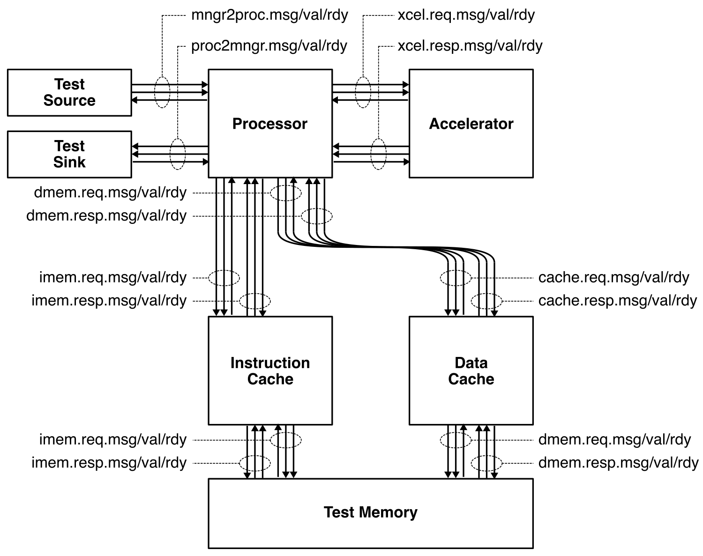

ECE 6745 Project 2: Accelerator Tape-Out<br>Software & Testing
==========================================================================

In this project, students will leverage what they learned in the first
project to transition to using a commercial standard-cell library and
commercial electronic design automation tools for simulation, synthesis,
place-and-route, static-timing analysis, power analysis, design rule
checking (DRC), and layout-vs-schematic checking (LVS). Students will
develop a simple accelerator in Verilog RTL and evaluate the potential
benefit of using this accelerator in the context of a RISC-V processor.
Students will then combine just their accelerator with an SPI interface
and use the commercial library and tools to turn this accelerator+SPI
into complete chip layout in TSMC 180nm. We have some project ideas here:

 - <https://cornell-ece6745.github.io/ece6745-mkdocs/ece6745-project2-ideas>

The project includes three parts:

 - Part A: Software & Testing
 - Part B: Accelerator
 - Part C: Evaluation
 - Part D: Tape-out

All parts must be done in a group of 2-3 students. You can confirm your
group on Canvas (Click on People, then Groups, then search for your name
to find your project group).

!!! warning "All students must contribute to and understand all submitted work!"

    It is not acceptable for one student to do all of part A and a
    different student to do all of part B. It is not acceptable for one
    student to only focus on the software baseline of part A and not
    understand anything about the FL model. All students must contribute
    and understand all aspects of all parts. The instructors will also
    survey the Git commit log on GitHub to confirm that all students are
    contributing equally. If you are using a "pair programming" style,
    then both students must take turns using their own account so both
    students have representative Git commits. Students should create
    commits after finishing each step of the project, so their
    contribution is clear in the Git commit log. It is fine for the Git
    commit log to indicate that a student took the lead on just the
    baseline implementation, just the testing, or just the FL model, but
    the student is still responsible for reviewing and understanding all
    aspects included as part of the submission. **A student whose
    contribution is limited as represented by the Git commit log will
    receive a significant deduction to their project score.**

This handout assumes that you have read and understand the course
tutorials and that you have attended the lab sections. To get started,
use VS Code to log into a specific `ecelinux` server, use MS Remote
Desktop to log into the same `ecelinux` server, source the setup scripts,
and clone your remote repository from GitHub:

```bash
% source setup-ece6745.sh
% source setup-gui.sh
% xclock &
% mkdir -p ${HOME}/ece6745
% cd ${HOME}/ece6745
% git clone git@github.com:cornell-ece6745/project2-groupXX
% cd project2-groupXX
% tree
```

where `XX` should be replaced with your group number. You can both pull
and push to your remote repository. If you have already cloned your
remote repository, then use git pull to ensure you have any recent
updates before working on your lab assignment.

```bash
% cd ${HOME}/ece6745/project1-groupXX
% git pull
% tree
```

where `XX` should be replaced with your group number. Your repo contains
the following directories.

```
.
├── sim
│   ├── vc
│   ├── tut3_verilog
│   ├── lab5_xcel
│   ├── proc
│   ├── sram
│   ├── cache
│   ├── pmx
│   └── proj2
├── app
│   ├── scripts
│   ├── ece6745
│   ├── simple
│   ├── ubmark
│   └── proj2
└── asic
    └── playground
        ├── 01-pymtl-rtlsim
        ├── 02-synopsys-vcs-rtlsim
        ├── 03-synopsys-dc-synth
        └── 04-synopsys-vcs-ffglsim
```

1. TinyRV2 Accelerators
--------------------------------------------------------------------------

In this project, we will be implementing a simple medium-grain
accelerator. Fine-grain accelerators are tightly integrated within the
processor pipeline (e.g., a specialized functional unit for bit-reversed
addressing useful in implementing an FFT), while coarse-grain
accelerators are loosely integrated with a processor through the memory
hierarchy (e.g., a graphics rendering accelerator sharing the last-level
cache with a general-purpose processor). Medium-grain accelerators are
often integrated as co-processors: the processor can directly
send/receive messages to/from the accelerator with special instructions,
but the co-processor is relatively decoupled from the main processor
pipeline and can also potentially independently interact with memory.

The following figure illustrates the overall system we will be using in
project 2.



The processor includes eight latency insensitive val/rdy interfaces. The
mngr2proc/proc2mngr interfaces are used for the test harness to send data
to the processor and for the processor to send data back to the test
harness. The imem master/minion interface is used for instruction fetch,
and the dmem master/minion interface is used for implementing load/store
instructions. The system includes both instruction and data caches. The
xcel master/minion interface is used for the processor to send messages
to the accelerator. The mngr2proc/proc2mngr and memreq/memresp interfaces
were all introduced in ECE 4750.

Notice that in project 2 the accelerator _cannot_ independently interact
with memory; the processor is responsible for moving data between memory
and the accelerator. While project 3 can explore accelerators with their
own memory interface, project 2 will only explore accelerators without an
independent memory interface.

All accelerators have an xcel minion interface. The messages sent over
the xcel minion interface allows the test harness or processor to read
and write _accelerator registers_. These accelerator registers can be
real registers that hold configuration information and/or results, or
these accelerator registers can just be used to trigger certain actions.
The messages sent over the xcelreq interface from the test harness or
processor to the accelerator have the following format:

```
   1b     5b      32b
 +------+-------+-----------+
 | type | raddr | data      |
 +------+-------+-----------+
```

The 1-bit `type` field indicates if this messages if for reading (0) or
writing (1) an accelerator register, the 5-bit `raddr` field specifies
which accelerator register to read or write, and the 32-bit `data` field
is the data to be written. For every accelerator request, the accelerator
must send back a corresponding accelerator response over the xcelresp
interface. These response messages have the following format:

```
   1b     32b
 +------+-----------+
 | type | data      |
 +------+-----------+
```

The 1-bit `type` field gain indicates if this response is from if for
reading (0) or writing (1) an accelerator register, and the 32-bit `data`
field is the data read from the corresponding accelerator register. Every
accelerator is free to design its own _accelerator protocol_ by defining
the meaning of reading/writing the 32 accelerator registers.

The key way the processor interacts with an accelerator is by sending
messages that read and write these 32 special accelerator registers using
standard CSRW and CSRR instructions. These 32 special CSRs are as
follows:

```
  0x7e0 : accelerator register  0 (xr0)
  0x7e1 : accelerator register  1 (xr1)
  0x7e2 : accelerator register  2 (xr2)
  ...
  0x7ff : accelerator register 31 (xr31)
```

When the processor uses a CSRW instruction to write an accelerator
register, it first reads the general-purpose register file to get the
source value, creates a new accelerator request message, then sends this
message to the accelerator through the xcelreq interface in the X stage.
The processor waits for the response message to be returned through the
xcelresp interface in the M stage. The processor uses a CSRR instruction
to read an accelerator register in a similar way, except that when the
response message is returned in the M stage, the data from the
accelerator is sent down the pipeline and written into the
general-purpose register file in the W stage.

Here is a simple assembly sequence which will write the value `1` to the
null accelerator's only accelerator register, read that value back from
the accelerator register, and write the value to general-purpose register
`x2`.

```
  addi x1, x0, 1
  csrw 0x7e0, x1
  csrr x2, 0x7e0
```

In this part, you will develop and test the baseline software which runs
on the processor+mem+xcel system. Then you will develop and test an
accelerator FL model. Finally you will develop the software which drives
the accelerator and ensure that your accelerator FL model passes all of
the tests you developed for your baseline software.

!!! warning "You do not need to finalize your software and testing!"

    Students must submit an initial version of their baseline software,
    accelerator FL model, accelerator software, and associated tests but
    they will almost certainly continue to improve these parts of the
    project as they push towards tape-out. The key is to get a _very
    simple initial version_ of their project ready for submission. It is
    ok if this _very simple initial version_ of the baseline software is
    not optimized, or if the _very simple initial version_ of the
    accelerator FL model does not support all of the desired
    functionality, or if you have robust intitial testing but know you
    want to add more testing in the future. Start small; start simple;
    then you can continue to incrementally add complexity as you push
    towards tape-out.

2. Baseline Software & Testing
--------------------------------------------------------------------------

Your baseline software must be written in C (not C++) and should have a
single top-level function. You should be able to call this function with
input data (either scalar values or arrays of values) and it should
return the results (either as a scalar value or using arguments passed by
pointer). Obviously it is fine for your single top-level function to call
other functions.

Keep in mind you have all of the same restrictions that you had in the
last lab of ECE 4750. You can only use `int`. You cannot use `char` or
`short` because the TinyRV2 instruction set does not include the LBU,
LHU, SB, SH instructions. You cannot use the standard C library. There is
no standard C library for the TinyRV2 processor. You must write
everything from scratch. You cannot use anything that requires an
operating system. We do not run an operating system on our TinyRV2
processor.

You can develop your baseline software in `app/proj2`. Declare the
function for your top-level function in `proj2-baseline.h` and implement
the function in `proj2-baseline.c`.

### 2.1. Developing Tests

You will need to develop a robust initial set of tests for your baseline
software. All of these tests can be reused to test your accelerator.
Every project will have a different testing strategy. Consider developing
a pure-Python reference implementation. Then you can use your pure-python
reference implementation to dump test inputs and reference outputs data
which can then be used in your baseline software tests. Be sure to check
these Python scripts into your repo!

Consider having both a Python high- and low-level reference
implementation. The Python high-level reference implementation might use
external libraries, while the Python low-level reference is implemented
from scratch and is meant to more closely match the actual algorithm that
will be used in your C baseline software. If you reference implementation
produces data which is not intended to be bit accurate with your baseline
software, then you will definitely need a high- and low-level reference
implementation. For example, assume your reference implementation uses
floating-point arithmetic but you are planning to use fixed-point
arithmetic in both your baseline software and eventually your
accelerator. You could use the following approach:

 - **Python High-Level Reference:** Develop a Python reference
   implementation that uses floating-point arithmetic or potentially even
   some external libraries to implement a reference. This implementation
   might use a very different algorithm from what you plan to use in your
   baseline software and/or accelerator. This implementation will serve
   as your "golden source of truth". This implementation defines what it
   means for your baseline software and accelerator to be correct.

 - **Python Low-Level Reference:** Develop a Python reference
   implementation that uses fixed-point arithmetic; this implementation
   might use a very similar algorithm from what you plan to use in your
   baseline software and/or accelerator. This implementation will not
   produce results that exactly match the high-level reference. Write
   tests which compare the results between the high- and low-level
   reference to ensure they are "close enough". What "close enough" means
   depends on the project. It might mean that the actual fixed-point
   values are within a small epsilon of the floating-point values. It
   might mean that the low-level reference has similar end-to-end
   "accuracy" as the high-level reference. Use the low-level reference to
   dump test inputs and reference outputs that can be used to test your C
   baseline software.

 - **C Baseline Software:** Develop a C baseline implementation that uses
   fixed-point arithmetic. Use the test inputs and reference outputs from
   the Python low-level reference to ensure that your C baseline
   implementation is bit accurate with the Python low-level reference.

The "high-level reference" and "low-level reference" could be written in
C instead. A C high-level reference may or may not use the provided C
build system. A C low-level reference would ideally use the provided C
build system. Or the "high-level reference" could be written in Python
and the "low-level reference" could be written in C. Every project will
have a unique testing strategy.

Your tests should be written in `app/proj2/proj2-baseline-test.c`. You
must use the provided unit testing framework. One test case is not
sufficient. You must have several test cases with different test cases
focused on testing different aspects of your baseline software.

If you are building an application specific accelerator (e.g., dense
matrix multiplication accelerator), then you will likely have a single
baseline software implementation with lots of tests. However, if you are
building a more programmable accelerator (e.g., vector engine,
coarse-grain reconfigurable array) then you will likely have multiple
"benchmarks". So you might have:

 - `proj2-bmark1.h`
 - `proj2-bmark1.c`
 - `proj2-bmark1-test.c`
 - `proj2-bmark1-eval.c`
 - `proj2-bmark2.h`
 - `proj2-bmark2.c`
 - `proj2-bmark2-test.c`
 - `proj2-bmark2-eval.c`

You can look in `ubmark` to see example benchmarks for:

 - greatest common divisor
 - accumulate
 - vector-vector add
 - binary search
 - complex multiply
 - masked filter
 - sort

Each benchmark has it's own `.h`, `.c`, `-test.c`, and `-eval.c`.

### 2.2. Running Tests

You can compile and run your baseline software tests natively as follows.

```bash
% mkdir -p $HOME/ece6745/project2-groupXX/app/build-native
% cd $HOME/ece6745/project2-groupXX/app/build-native
% ../configure
% make proj2-baseline-test
% ./proj2-baseline-test
```

You can cross-compile and run your baseline software tests on the TinyRV1
ISA simulator as follows.

```bash
% mkdir -p $HOME/ece6745/project2-groupXX/app/build
% cd $HOME/ece6745/project2-groupXX/app/build
% ../configure --host=riscv64-unknown-elf
% make proj2-baseline-test
% ../../sim/pmx/pmx-sim ./proj2-baseline-test
```

3. Accelerator FL Model & Testing
--------------------------------------------------------------------------

We should always build a functional-level (FL) model of our accelerator
before actually implementing the accelerator in hardware. The FL model
will enable us to develop a compelling testing strategy and to also
develop the software which interacts with the accelerator. In this
course, we will write our FL models in Python using PyMTL3. Your
accelerator FL model must correctly implement the "hardware side" of
accelerator protocol (i.e., accelerator request messages which read/write
specific accelerator registers). We provide you a FL model template in
`sim/proj2/Proj2XcelFL.py`. Although you are free to implemennt the FL
model however you want, it must have the exact same interface as the
provided template. We recommend implementing your FL model using a single
`@update_once` block. You can use external libraries to implement your FL
model. It is fine to update GitHub actions to pip install additional
libraries.

### 3.2. Developing Tests

You will need to develop a robust initial set of tests for your baseline
software. All of these tests can be reused to test your accelerator RTL.
You will be testing your accelerator FL model by developing lists of
accelerator request messages and the corresponding correct accelerator
response messages. The request messages will be put into a test source
and the response messages will be put into a test sink. You may be able
to "port" the test inputs and reference outputs from your baseline
software to test your accelerator FL model.

Your tests should be written in `sim/proj2/test/Proj2XcelFL_test.py`. You
simply need to create lists of accelerator request/response messages and
then add these lists to the test case table. One list of messages is not
sufficient. You must have several lists of messages to create several
test cases each focused on testing different aspects of your baseline
software. Make sure that some rows in your test case table use different
source/sink delays to stress test the latency insensitive
xcelreq/xcelresp interfaces.

### 3.1. Running Tests

You can run your accelerator FL tests as follows.

```bash
% mkdir -p $HOME/ece6745/project2-groupXX/sim/build
% cd $HOME/ece6745/project2-groupXX/sim/build
% pytest ../proj2/test/Proc2XcelFL_test.py
```

4. Accelerator Software & Testing
--------------------------------------------------------------------------

We can use the accelerator FL model to develop and test the software
which will drive the accelerator. This software will need to implement
the "software side" of the accelerator protocol (i.e., reading/writing
CSRs which correspond to accelerator registers). You will need to use GCC
inline assembly to insert the CSR instructions into the program. You can
find out more about inline assembly syntax here:

 - <https://gcc.gnu.org/onlinedocs/gcc/Extended-Asm.html>

As a quick example, the following inline assembly writes a value to
accelerator register 0 (i.e., CSR 0x7e0).

```C
inline
void write_xr0( int value )
{
  __asm__ ( "csrw 0x7e0, %0" :: "r"(value) );
}
```

The following inline assembly reads a value from accelerator register 0
(i.e., CSR 0x7e0).

```C
inline
int read_xr0()
{
  int result;
  __asm__ ( "csrr %0, 0x7e0" : "=r"(result) : );
  return result;
}
```

Note that also want to make sure all of our software can be compiled
natively, so you will actually need two different implementations. The
first implementation will use the accelerator and only works when
cross-compiled for TinyRV2. The second implementation should just call
the baseline software and should be used when compiling natively. You can
use the C preprocessor, `ifdef`, and the `RISCV_` preprocessor define to
conditionally compile the correct version.

### 4.1. Developing Tests

You should be able to just copy your tests from
`app/proj2/proj2-baseline-test.c` to `app/proj2/proj2-xcel-test.c`.
Consider refactoring your tests into a seperate file and then just
including them in both C files.

### 4.2. Running Tests

You can compile and run your accelerator software tests natively as
follows.

```bash
% mkdir -p $HOME/ece6745/project2-groupXX/app/build-native
% cd $HOME/ece6745/project2-groupXX/app/build-native
% ../configure
% make proj2-xcel-test
% ./proj2-xcel-test
```

You can cross-compile and run your accelerator software tests on the
TinyRV1 ISA simulator as follows.

```bash
% mkdir -p $HOME/ece6745/project2-groupXX/app/build
% cd $HOME/ece6745/project2-groupXX/app/build
% ../configure --host=riscv64-unknown-elf
% make proj2-xcel-test
% ../../sim/pmx/pmx-sim --xcel-impl proj2-fl ./proj2-xcel-test
```

5. Project Submission
--------------------------------------------------------------------------

To submit your code you simply push your code to GitHub. You can push
your code as many times as you like before the deadline. Students are
responsible for going to the GitHub website for your repository, browsing
the source code, and confirming that the code they want to submit is on
GitHub. Be sure to verify your code is passing all of your simulations on
`ecelinux`.

Your submission will be assessed both for code functionalty but also
verification quality (i.e., the quality of your tests for your baseline
software, accelerator FL, and accelerator software). You do not need to
have all of your tests finished but you must demonstrate a robust intial
testing strategy.

Here is how we will be testing your final code submission for part A.
First, we will clone your repo and create an environment variable for the
top of your repo.

```bash
% mkdir -p ${HOME}/ece6745
% cd ${HOME}/ece6745
% git clone git@github.com:cornell-ece6745/project2-groupXX
% cd project2-groupXX
% TOPDIR=$PWD
```

Then, we will run your tests for your baseline software both natively and
cross-compiled running on the ISA simulator.

```
% mkdir -p $TOPDIR/app/build-native
% cd $TOPDIR/app/build-native
% ../configure
% make proj2-baseline-test
% ./proj2-baseline-test

% mkdir -p $TOPDIR/app/build
% cd $TOPDIR/app/build
% ../configure --host=riscv64-unknown-elf
% make proj2-baseline-test
% ../../sim/pmx/pmx-sim ./proj2-baseline-test
```

Then, we will run your tests for your accelerator FL model.

```
% mkdir -p $TOPDIR/sim/build
% cd $TOPDIR/sim/build
% pytest ../proj2/test/Proj2XcelFL_test.py
```

Finally, we will run your tests for your accelerator software both
natively and cross-compiled running on the ISA simulator.

```
% mkdir -p $TOPDIR/app/build-native
% cd $TOPDIR/app/build-native
% ../configure
% make proj2-xcel-test
% ./proj2-xcel-test

% mkdir -p $TOPDIR/app/build
% cd $TOPDIR/app/build
% ../configure --host=riscv64-unknown-elf
% make proj2-xcel-test
% ../../sim/pmx/pmx-sim --xcel-impl proj2-fl ./proj2-xcel-test
```

