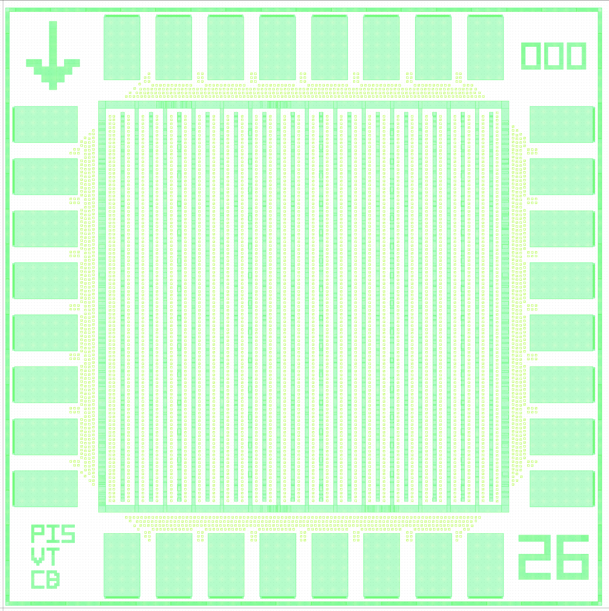

ECE 6745 Project 2: Accelerator Tape-Out<br>Tape-Out and Report
==========================================================================

In this project, students will leverage what they learned in the first
project to transition to using a commercial standard-cell library and
commercial electronic design automation tools for simulation, synthesis,
place-and-route, static-timing analysis, power analysis, design rule
checking (DRC), and layout-vs-schematic checking (LVS). Students will
develop a simple accelerator in Verilog RTL and evaluate the potential
benefit of using this accelerator in the context of a RISC-V processor.
Students will then combine just their accelerator with an SPI interface
and use the commercial library and tools to turn this accelerator+SPI
into complete chip layout in TSMC 180nm. We have some project ideas here:

 - <https://cornell-ece6745.github.io/ece6745-mkdocs/ece6745-project2-ideas>

The project includes three parts:

 - Part A: Software & Testing
 - Part B: Accelerator RTL Milestone
 - Part C: Accelerator RTL Design
 - Part D: ASIC Evaluation
 - Part E: Tape-out and Report

All parts must be done in a group of 2-3 students. You can confirm your
group on Canvas (Click on People, then Groups, then search for your name
to find your project group).

!!! warning "All students must contribute to and understand all submitted work!"

    It is not acceptable for one student to do all of part A and a
    different student to do all of part B/C. It is not acceptable for one
    student to only focus on one module of part B/C and not understand
    anything about the other modules. All students must contribute and
    understand all aspects of all parts. The instructors will also survey
    the Git commit log on GitHub to confirm that all students are
    contributing equally. If you are using a "pair programming" style,
    then both students must take turns using their own account so both
    students have representative Git commits. Students should create
    commits after finishing each step of the project, so their
    contribution is clear in the Git commit log. It is fine for the Git
    commit log to indicate that a student took the lead on just one part,
    but the student is still responsible for reviewing and understanding
    all aspects included as part of the submission. **A student whose
    contribution is limited as represented by the Git commit log will
    receive a significant deduction to their project score.**

This handout assumes that you have read and understand the course
tutorials and that you have attended the lab sections. To get started,
use VS Code to log into a specific `ecelinux` server, use MS Remote
Desktop to log into the same `ecelinux` server, source the setup scripts,
and clone your remote repository from GitHub:

```bash
% source setup-ece6745.sh
% source setup-gui.sh
% xclock &
% mkdir -p ${HOME}/ece6745
% cd ${HOME}/ece6745
% git clone git@github.com:cornell-ece6745/project2-groupXX
% cd project2-groupXX
% tree
```

where `XX` should be replaced with your group number. You can both pull
and push to your remote repository. If you have already cloned your
remote repository, then use git pull to ensure you have any recent
updates before working on your lab assignment.

```bash
% cd ${HOME}/ece6745/project1-groupXX
% git pull
% tree
```

where `XX` should be replaced with your group number. Your repo contains
the following directories.

```
.
├── sim
│   ├── vc
│   ├── tut3_verilog
│   ├── lab5_xcel
│   ├── proc
│   ├── sram
│   ├── cache
│   ├── pmx
│   └── proj2
├── app
│   ├── scripts
│   ├── ece6745
│   ├── simple
│   ├── ubmark
│   └── proj2
└── asic
    ├── designs
    ├── steps
    │   ├── block
    │   │   ├── 01-pymtl-rtlsim
    │   │   ├── 02-synopsys-vcs-rtlsim
    │   │   ├── 03-synopsys-dc-synth
    │   │   ├── 04-synopsys-vcs-fflgsim
    │   │   ├── 05-cadence-innovus-pnr
    │   │   ├── 06-synopsys-pt-sta
    │   │   ├── 07-synopsys-vcs-baglsim
    │   │   ├── 08-synopsys-pt-pwr
    │   │   ├── 09-mentor-calibre-drc
    │   │   ├── 10-mentor-calibre-lvs
    │   │   └── 11-summarize-results
    │   └── chip
    │       ├── 00-padring-gen
    │       ├── 01-pymtl-rtlsim
    │       ├── 02-synopsys-vcs-rtlsim
    │       ├── 03-synopsys-dc-synth
    │       ├── 04-synopsys-vcs-ffglsim
    │       ├── 05-cadence-innovus-pnr
    │       ├── 06-synopsys-pt-sta
    │       ├── 07-synopsys-vcs-baglsim
    │       ├── 08-synopsys-pt-pwr
    │       ├── 09-mentor-calibre-seal
    │       ├── 10-mentor-calibre-fill
    │       ├── 11-mentor-calibre-label
    │       ├── 12-mentor-calibre-drc
    │       ├── 13-mentor-calibre-lvs
    │       └── 14-summarize-results
    └── playground
        └── proj2
            ├── 01-pymtl-rtlsim
            ├── 02-synopsys-vcs-rtlsim
            ├── 03-synopsys-dc-synth
            ├── 04-synopsys-vcs-ffglsim
            ├── 05-cadence-innovus-pnr
            ├── 06-synopsys-pt-sta
            ├── 07-synopsys-vcs-baglsim
            ├── 08-synopsys-pt-pwr
            ├── 09-mentor-calibre-drc
            └── 10-mentor-calibre-lvs
```

1. Chip Flow
--------------------------------------------------------------------------

As discussed in Lab 9, the chip flow includes several additional steps
compared to the block flow including:

 - Pad ring generation to create the IO cells that enable us to wirebond
   the chip to the package
 - Seal ring insertion around the edge of the chip to protect the chip
   during dicing
 - Metal, poly, and diffusion fill to meet DRC density requirements
 - Adding labels to indicate pad 1, the year, the chip ID number, and
   student initials
 - Full chip DRC including additional wire-bond DRC checks
 - Full chip LVS

You should start by creating your own chip top just like in Lab 9.


We have provided you design YAML file for your final tapeout. You will
see a `group_number`. This is NOT your group number, but is instead a
special ID number we must use to label your tapeout from other MUSE
tapeouts. DO NOT CHANGE THIS - WE HAVE ALREADY POPULATED IT FOR YOU!

You can also put in your initials (remove an item from the initials list
if you have less than 3 members in your group), or simply remove the
initials list from the yaml altogether if you do not wish to put your
initials on the chip (but you totally should!). **Initials bust be 1-3
letters each (not NetID's).** You just need edit this field:

```
initials :
  - aaa
  - bbb
  - ccc
```

{ width=50% }

The chip flow uses process, voltage, and temperature (PVT) corners. So
the Cadence Innovus PNR and Synopsys PrimeTime STA steps now consider:

 - typical case PVT
 - worst case PVT with low voltage, high temperature to stress setup time
 - best case PVT with high voltage, low temperature to stress hold time

You can use the automated ASIC chip flow like this:

```bash
% mkdir -p $TOPDIR/asic/build-proj2-tapeout
% cd $TOPDIR/app/build-proj2-tapeout
% pyhflow ../designs/proj2-tapeout.yml
% ./00-padring-gen
% ./01-pymtl-rtlsim
% ./02-synopsys-vcs-rtlsim
% ./03-synopsys-dc-synth
% ./04-synopsys-vcs-ffglsim
% ./05-cadence-innovus-pnr
% ./06-synopsys-pt-sta
% ./07-synopsys-vcs-baglsim
% ./08-synopsys-pt-pwr
% ./09-mentor-calibre-seal
% ./10-mentor-calibre-fill
% ./11-mentor-calibre-label
% ./12-mentor-calibre-drc
% ./13-mentor-calibre-lvs
% ./14-summarize-results
```

Make sure each step works without errors before moving on to the next
step. **Your final summarize results must be error free!**

If you do not meet the setup time constraint then you can either increase
the clock period constraint to be greater than 10ns or potentially change
your design to reduce the critical path. If you do not meet the hold time
constraint consider increasing the target hold time slack, or also try
increasing the clock period constraint. If your design is too big then
this will likely cause DRC and LVS errors so you need to reduce the area.
If your design fits but has high routing congestion then you might also
see DRC errors. You will need to reduce the routing in your design.

2. Tapeout Submission
--------------------------------------------------------------------------

Once you have finalized your tapeout you need to copy the final GDS, DRC
reports, LVS reports, and checksums to the global tapeout directory. You
can find this final tapeout collatoral in the final summarize results
step.

```bash
% cd $HOME/ece6745/project2-groupXX/asic/build-proj2-tapeout/14-summarize-results
% cp final.gds                  /classes/ece6745/secure/tapeouts/groupXX
% cp final-main-drc.summary     /classes/ece6745/secure/tapeouts/groupXX
% cp final-antenna-drc.summary  /classes/ece6745/secure/tapeouts/groupXX
% cp final-wirebond-drc.summary /classes/ece6745/secure/tapeouts/groupXX
% cp final-lvs.report           /classes/ece6745/secure/tapeouts/groupXX
% cp checksums.txt              /classes/ece6745/secure/tapeouts/groupXX
% cp run.log                    /classes/ece6745/secure/tapeouts/groupXX
```

where `groupXX` is your group number.

!!! warning "Your Tapeout Must be Reproducible!"

    We must be able to exactly reproduce all of the tapeout collateral
    from a clean clone of your group repo using the main branch. If we
    cannot reproduce your tapeout collateral then unfortunately we will
    not be able to tapeout your chip.

3. Project 2 Report
--------------------------------------------------------------------------

Prepare a report that describes your project 2. Use 10-point times or
palantino font, single-spaced, with 1" margins. Include your project
title, group number, and group members at the top of the first page.

**Section 1: Introduction**

Include a one paragraph introduction that provides a high-level overview
of your project.

**Section 2: Baseline Design**

Include 1-2 pages that describes your baseline software. If your baseline
software is very simple (i.e., triple nested for loop for matrix
multiplication) then this might just be one paragraph. Including
pseudo-code is fine. Do not include more than 5-10 lines of C code.
Include figures inline if it makes sense.

**Section 3: Alternative Design**

Include 1-2 pages that describes your accelerator. Definitely include a
block diagram or two. Describe your accelerator register protocol.

**Section 4: Evaluation**

Start with a discussion of your accelerator block-level results. Do not
just mention the total area, cycle time, and power. Be sure to dive into
the results to discuss the detailed area break-down, where the critical
path goes, and the detailed power break-down.

Then do a comparative analysis of your processor baseline design vs
processor+accelerator alternative design. Be sure to discuss area and
cycle time before discussing the total execution time in ns and the
energy for your evaluation program. Do not just discuss the results but
dive into what these results mean and why each design achieves those
results. Why does one design have more area? Why does one design have
better performance?

Include an energy efficiency vs performance plot using the provided
online visualization tool.

 - <https://web.csl.cornell.edu/courses/ece6745/viz/proj2-eeperf-plot.html>

**Section 5: Detailed Results**

  - Accelerator in Isolation

    + Include screenshot of chip plot from Innovus for youra accelerator
      in isolation. You must hide the routing. You must highlight
      different parts of your accelerator in different colors as
      discussed in lab.

    + Include screenshot of final layout using Klayout. It must show the
      power ring. This should show all layers. You use the standard layer
      property file. Hide the text.

    + Include the summarize results. You need some kind of actual
      evaluation so you will need to modify proj2-xcel-sim to run an
      evaluation of your accelerator in isolation.

  - Processor Baseline Design Results

    + Include screenshot of chip plot from Innovus. You must hide the
      routing. You must highlight the register file in red and the rest
      of the processor in yellow.

    + Include screenshot of final layout using Klayout. It must show the
      power ring. This should show all layers. You use the standard layer
      property file. Hide the text.

    + Include the summarize results. You must include the results for
      your evaluation microbenchmark.

  - Processor+Accelerator Alternative Design Results

    + Include screenshot of chip plot from Innovus. You must hide the
      routing. You must highlight the register file in red and the rest
      of the processor in yellow. You must highlight the accelerator in
      other colors ... at least highlight the entire processor in cyan
      but you can use more colors if you want to show different parts.
      Obviously do not reuse yellow or red.

    + Include screenshot of final layout using Klayout. It must show the
      power ring. This should show all layers. You use the standard layer
      property file. Hide the text.

    + Include the summarize results. You must include the results for your
      evaluation microbenchmark.

  - Tapeout Results

    + Include screenshot of chip plot from Innovus for youra accelerator
      in isolation. You must hide the routing. You must highlight
      different parts of your accelerator in different colors as
      discussed in lab.

    + Include screenshot of final layout using Klayout. It must show the
      pad ring. This should show all layers. You use the standard layer
      property file. Hide the text.

    + Include the summarize results. You do not need an evaluation for
      the tapeout, just your tests.

4. Project Code Submission
--------------------------------------------------------------------------

To submit your code you simply push your code to GitHub. You can push
your code as many times as you like before the deadline. Students are
responsible for going to the GitHub website for your repository, browsing
the source code, and confirming that the code they want to submit is on
GitHub. Be sure to verify your code is passing all of your simulations on
`ecelinux`. Your submission will be assessed for code quality and
functionalty.

Here is how we will be testing your final code submission for part C.
First, we will clone your repo and create an environment variable for the
top of your repo.

```bash
% mkdir -p ${HOME}/ece6745
% cd ${HOME}/ece6745
% git clone git@github.com:cornell-ece6745/project2-groupXX
% cd project2-groupXX
% TOPDIR=$PWD
```

Then, we will run your tests for your baseline software both natively,
cross-compiled running on the ISA simulator, and cross-compiled running
on the processor+cache RTL model.

```
% mkdir -p $TOPDIR/app/build-native
% cd $TOPDIR/app/build-native
% ../configure
% make proj2-baseline-test
% ./proj2-baseline-test

% mkdir -p $TOPDIR/app/build
% cd $TOPDIR/app/build
% ../configure --host=riscv64-unknown-elf
% make proj2-baseline-test
% ../../sim/pmx/pmx-sim ./proj2-baseline-test

% mkdir -p $TOPDIR/app/build
% cd $TOPDIR/app/build
% ../configure --host=riscv64-unknown-elf
% make proj2-baseline-test
% ../../sim/pmx/pmx-sim --proc-impl rtl --cache-impl rtl ./proj2-baseline-test
```

Then, we will run your tests for your accelerator FL and RTL models.

```
% mkdir -p $TOPDIR/sim/build
% cd $TOPDIR/sim/build
% pytest ../proj2/test/Proj2XcelFL_test.py
% pytest ../proj2/test/Proj2Xcel_test.py
```

Then, we will run your tests for your accelerator software both natively,
cross-compiled running on the ISA simulator, and cross-compiled running
on the processor+cache+xcel RTL model.

```
% mkdir -p $TOPDIR/app/build-native
% cd $TOPDIR/app/build-native
% ../configure
% make proj2-xcel-test
% ./proj2-xcel-test

% mkdir -p $TOPDIR/app/build
% cd $TOPDIR/app/build
% ../configure --host=riscv64-unknown-elf
% make proj2-xcel-test
% ../../sim/pmx/pmx-sim --xcel-impl proj2-fl ./proj2-xcel-test

% mkdir -p $TOPDIR/app/build
% cd $TOPDIR/app/build
% ../configure --host=riscv64-unknown-elf
% make proj2-xcel-test
% ../../sim/pmx/pmx-sim --proc-impl rtl --cache-impl rtl \
    --xcel-impl proj2-rtl ./proj2-xcel-test
```

We will push your accelerator through the flow in isolation.

```bash
% mkdir -p $TOPDIR/asic/build-proj2-px-null
% cd $TOPDIR/app/build-proj2-px-null
% pyhflow ../designs/proj2-px-null
% ./run-flow
```

We will push your processor running the baseline software through the
flow.

```bash
% mkdir -p $TOPDIR/asic/build-proj2-px-null
% cd $TOPDIR/app/build-proj2-px-null
% pyhflow ../designs/proj2-px-null
% ./run-flow
```

We will push your processor with accelerator through the flow running the
accelerator software.

```bash
% mkdir -p $TOPDIR/asic/build-proj2-px-xcel
% cd $TOPDIR/app/build-proj2-px-xcel
% pyhflow ../designs/proj2-px-xcel
% ./run-flow
```

Finally, we will push your accelerator tapeout through the chip flow.

```bash
% mkdir -p $TOPDIR/asic/build-proj2-tapeout
% cd $TOPDIR/app/build-proj2-tapeout
% pyhflow ../designs/proj2-tapeout
% ./run-flow
```

!!! warning "Your Tapeout Must be Reproducible!"

    We must be able to exactly reproduce all of the tapeout collateral
    from a clean clone of your group repo using the main branch. If we
    cannot reproduce your tapeout collateral then unfortunately we will
    not be able to tapeout your chip.

