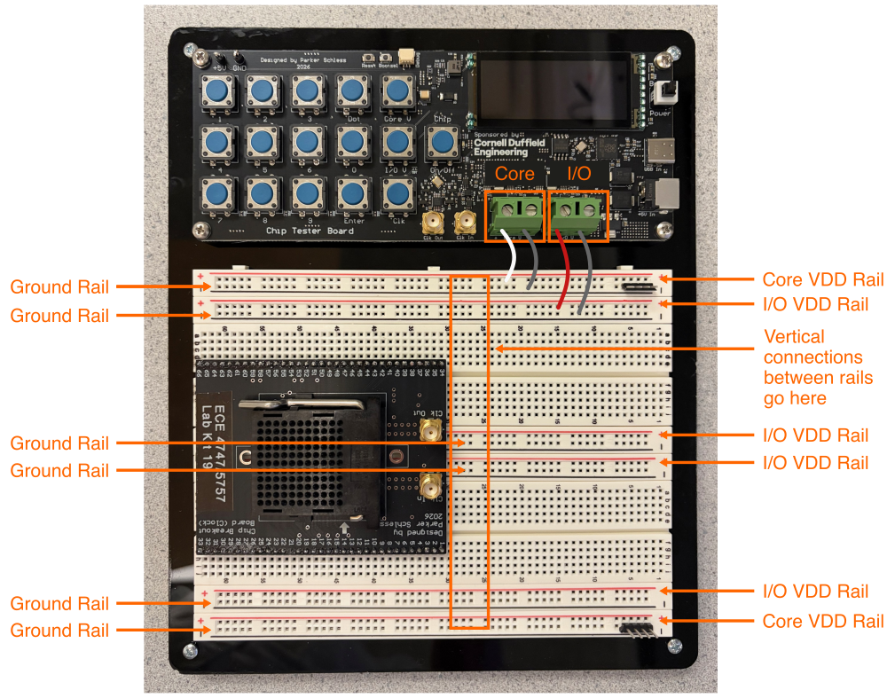
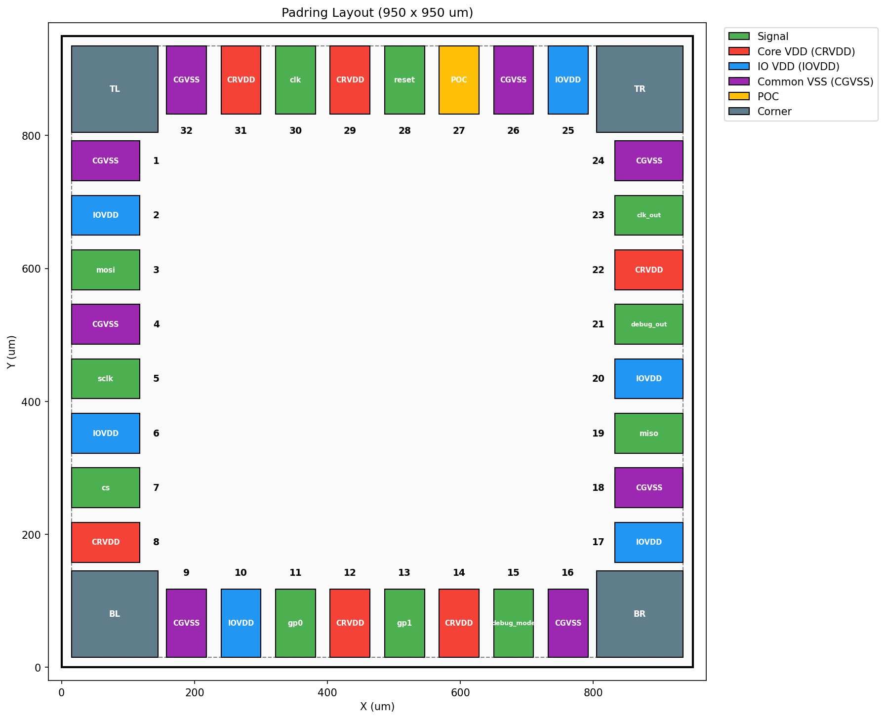
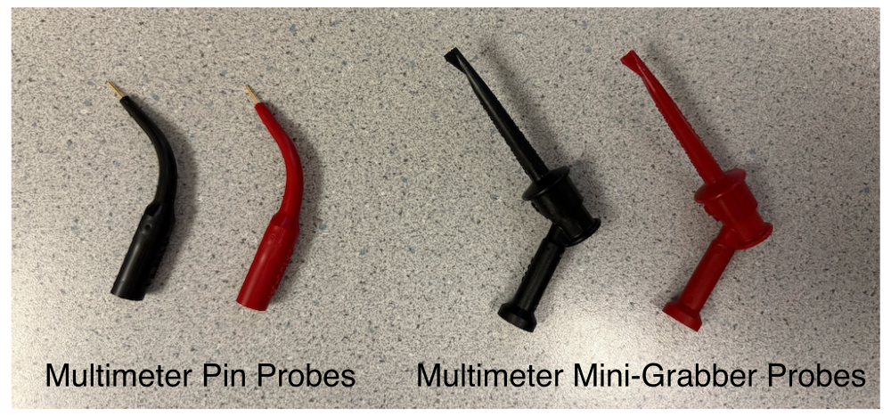
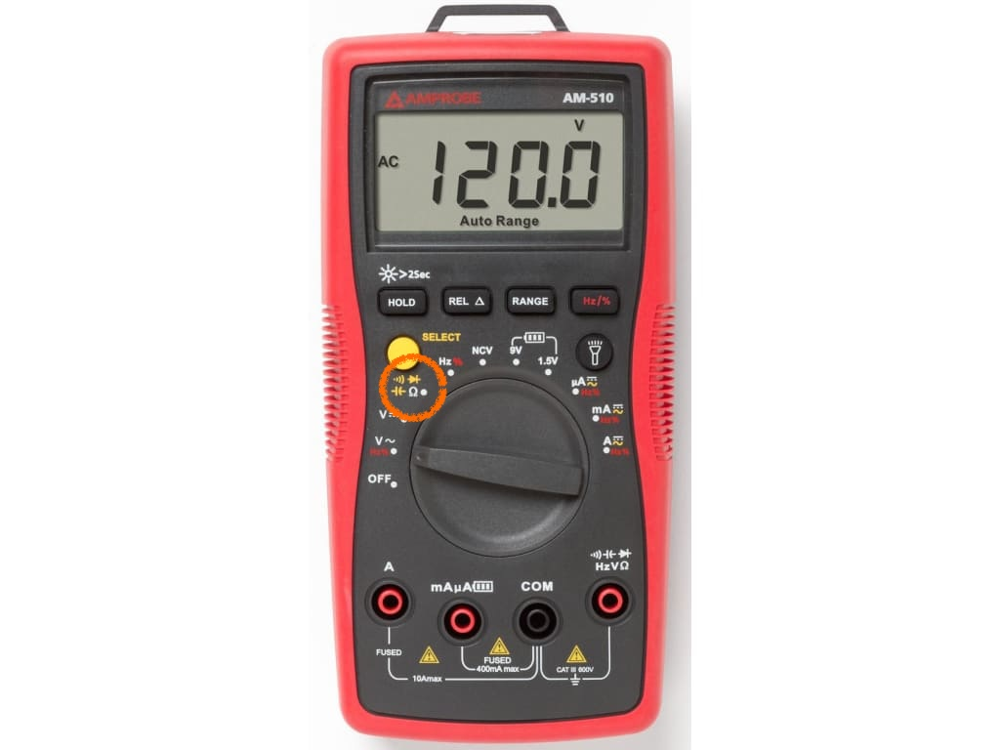
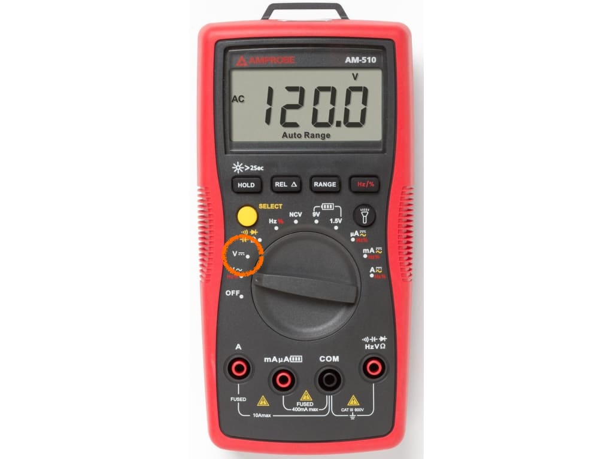

Lab 2: Power Routing
==========================================================================

In this lab, you will be routing the I/O VDD, core VDD, and ground nets
on your breadboard. Recall that I/O VDD is the power supply for the
input/output pads and is nominally 3.3V, and core VDD is the power supply
for the core logic within your chip and is nominally 1.8V. Both the I/O
VDD and core VDD share a common ground.

To get started find a free workstation and log in with your NetID and
NetID password.

!!! warning "Do not connect the USB-C cable to your breadboard chip tester yet!"

    For now, do not even connect the USB-C cable to your breadboard chip
    tester yet. We want to be sure the board is not powered while you are
    doing your power routing.

!!! warning "Make your breadboard chip tester neat and tidy!!"

    You will be incrementally developing your breadboard chip tester over
    the next nine weeks. **Please spend time making your breadboard chip
    tester neat and tidy!** This is not just cosmetic. A neat and tidy
    breadboard makes it easier to correctly wire up your board and easier
    to debug any issues. You will be cutting, stripping, and bending your
    own jumper wires. This will make your breadboard tidy and easier to
    debug. Watch this video to learn how to create these custom jumper
    wires:

     - <https://vod.video.cornell.edu/media/t/1_iqeoungq>

!!! warning "You must double and triple check your power routing!"

    You must be very careful in how you do your power routing. If you
    accidently connect I/O VDD to core VDD you can damage your chip. So
    please carefully double and triple check your power routing.

1. Power Routing
--------------------------------------------------------------------------

You will first route the I/O VDD, core VDD, and ground rails before
connecting these rails to the correct pins on the chip breakout board.
You will also add a simple power LED.

### 1.1. Power Rails

We will be using the horizontal rails for the I/O VDD, core VDD, and
ground nets. The following picture shows which rails should be used for
which net.

You should use the following color scheme:

 - I/O VDD: red
 - Core VDD: white
 - Ground: black

Start by wiring from the green screw terminals on the chip tester board
to the breadboard. You need to strip just enough wire to fit into the
scre terminal, then use the small screwdriver included in your kit. Do
not overtighten but also make sure there is a good connection.

Then add some vertical power routing in the middle of your breadboard to
connect together all of rails for the same net. So you will need to add
vertical red wires to connect together the four I/O VDD rails, add a long
vertical white wire to connect together the two core VDD rails, and
finally add vertical black wires to connect together the six ground
rails. **Be sure your jumper wires are neat and tidy!**

### 1.2. Chip Power

Recall that the Project 2 tape-outs used the following pin out.

The pin numbers are shown on the pin out. Our chip has the following
pins:

 - 5 I/O VDD
 - 6 core VDD
 - 8 ground
 - poc (power on control)
 - clk, clk_out
 - reset
 - cs, sclk, mosi, miso
 - debug_mode, debug_out
 - gp0, gp1

The following spreadsheet maps the chip pin out to the pin numbers on the
breadboard:

 - <https://docs.google.com/spreadsheets/d/1irGwTmz_Gov8T04UIn0MePlh0Gbsh5WtniO7Nd8ia5Y>

You now need to carefully route the pins corresponding to I/O VDD (use
red wire), core VDD (use white wire), and ground (use black wire) to the
appropriate rail. **You also need to connect the POC pin to the I/O VDD
rail!** The POC pin connects to the "power-on-control" I/O cell in the
pad ring of your chip. This cell handles the situation when I/O VDD is
greater than zero, but core VDD is not yet valid. It will safely prevent
short circuit current.

### 1.3. Power LED

Finally, go ahead and add a red power LED. You should connect the LED to
the I/O VDD rail and then place a 1KOhm resistor in series to ground.
Trim the leads of your LED and resistor so they sit closer to the
breadboard to ensure a neat and tidy breadboard chip tester.

!!! warning "You must double and triple check your power routing!"

    Now is a good time to double and triple check your power routing with
    your partner. Double and triple check that you have correctly routed
    the rails together. Double and triple check that you are connecting
    I/O VDD, core VDD, and ground to the correct pins. If you accidently
    connect I/O VDD to core VDD you can damage your chip. So please
    carefully double and triple check your power routing.

2. Testing
--------------------------------------------------------------------------

Now that we have finished our power routing, it is time to test it out.
We will first use a multimeter for continuity testing to make sure all of
the rails are connected together correctly, before using the multimeter
to measure the voltage drop at the breakout board. Finally, we will
experiment with adjusting both the I/O and core voltage using the chip
tester board.

We will be using a handheld multimeter with banana cables and two kinds
of multimeter probes.

The multimeter pin probes can be used to probe different points on the
breadboard, while multimeter mini-grabber probes are good when you want
to clip a probe to a test point on the breadboard.

### 2.1. Continuity

Continuity testing checks if two points on the breadboard are
electrically connected. Turn on your handheld multimeter and set it to
measure continuity as shown below.

{ width="85%" }

You will need to press the yellow select button until you see the symbol
for continuity testing (i.e., the curved lines indicating sound waves) on
the display. When measuring continuity, the handheld multimeter will beep
when there is a short circuit between the two probe points. You should
use the multimeter pin probes for continuity testing. Insert the black
probe into the COM port and the red probe into the right most port with
the continuity symbol.

Insert the red multimeter pin probe into one of the I/O VDD rails. Then
insert the black probe into all of the other rails and ensure the
multimeter only beeps when inserted into an I/O VDD rail. Also insert the
black probe into the breadboard column for every I/O VDD pin to ensure
the I/O VDD net is routed correctly. **Be sure to verify the POC pin is
connected to the I/O VDD net!**

Insert the red multimeter pin probe into one of the core VDD rails. Then
insert the black probe into all of the other rails and ensure the
multimeter only beeps when inserted into an core VDD rail. Also insert
the black probe into the breadboard column for every core VDD pin to
ensure the core VDD net is routed correctly.

Insert the red multimeter pin probe into one of the ground rails. Then
insert the black probe into all of the other rails and ensure the
multimeter only beeps when inserted into a ground rail. Also insert the
black probe into the breadboard column for every ground pin to ensure the
ground net is routed correctly.

### 2.2. Voltage Drop

You can now go ahead and use the UCB-C cable to power the chip tester
board. The chip tester includes two adjustable voltage sources, an
adjustable clock generator, and a frequency counter. The _Chip_ button is
used to control whether or not the voltage sources and clock are actually
connected to the breadboard. By default they are disconnected. Go ahead
and press the _Chip_ button and you should see your red power LED turn
on. If the LED does not turn on, try flipping it around since an LED only
works in one specific orientation.

Set your handheld multimeter to measure DC voltage as shown below.

{ width="85%" }

We want to measure the I/O and core voltage close to the pins of the
breakout board to ensure the voltage drop from the chip tester board to
the breakout board is reasonable. We will continue to use the multimeter
pin probes for testing the voltage drop.

Go ahead and insert the probes into the breadboard as close as possible
to the breakout board pins for I/O VDD and ground. Probe all I/O VDD pins
and verify they are close to 3.3V.

Go ahead and insert the probes into the breadboard as close as possible
to the breakout board pins for core VDD and ground. Probe all I/O VDD
pins and verify they are close to 1.8V.

### 2.3. Adjustable Voltage

Now let's use the chip tester board to adjust the voltage sources. Insert
the probes into the breadboard to measure I/O VDD at the breakout board.
Then change the I/O voltage using the following steps:

 - Press the _I/O V_ button
 - Use the numbers and _Dot_ button to enter 3.1
 - Press the _Enter_ button

Confirm that the chip tester board displays 3.1V and that the multimeter
is measuring roughly 3.1V. Now repeat this test with a voltage of 3.5V.

Insert the probes into the breadboard to measure core VDD at the breakout
board. Then change the core voltage using the following steps:

 - Press the _Core V_ button
 - Use the numbers and _Dot_ button to enter 1.6
 - Press the _Enter_ button

Confirm that the chip tester board displays 1.6V and that the multimeter
is measuring roughly 1.6V. Now repeat this test with a voltage of 2.0V.

